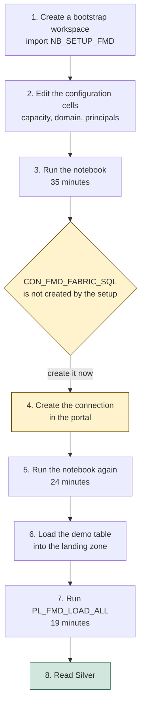
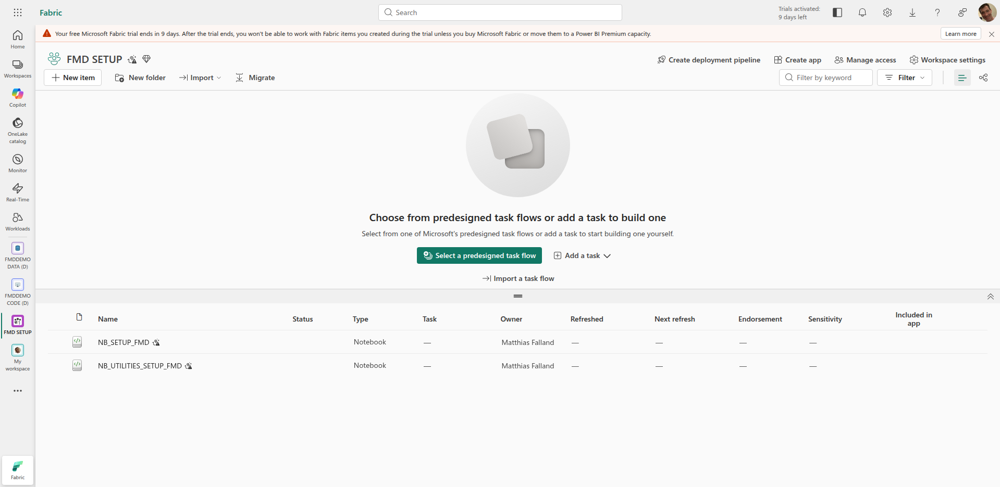
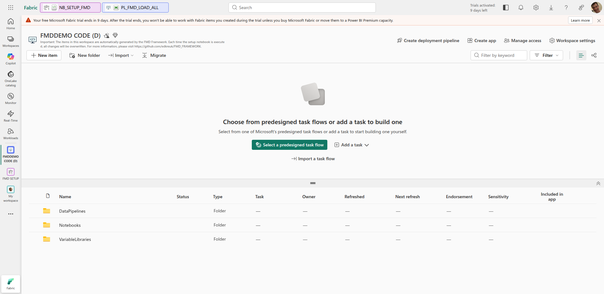
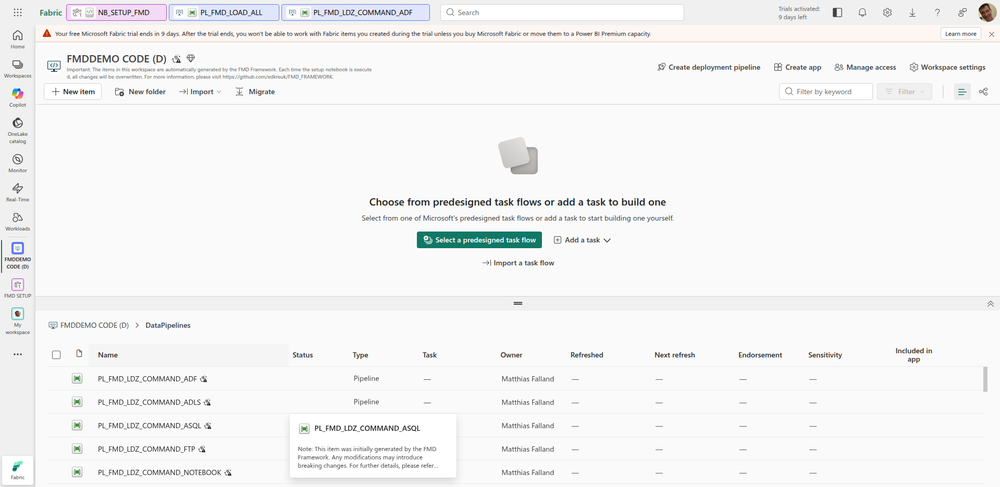
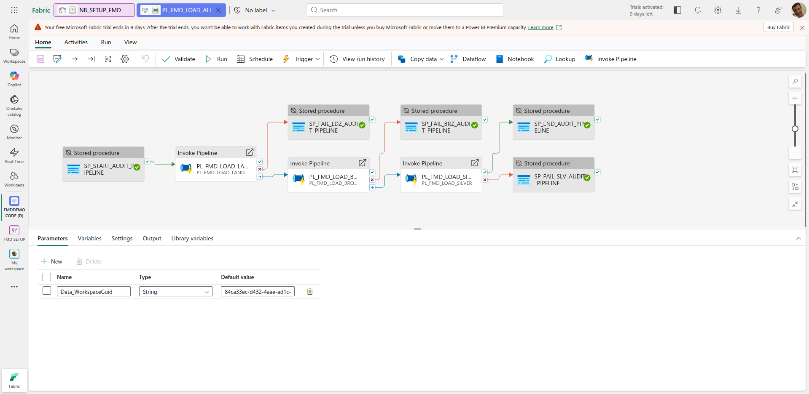
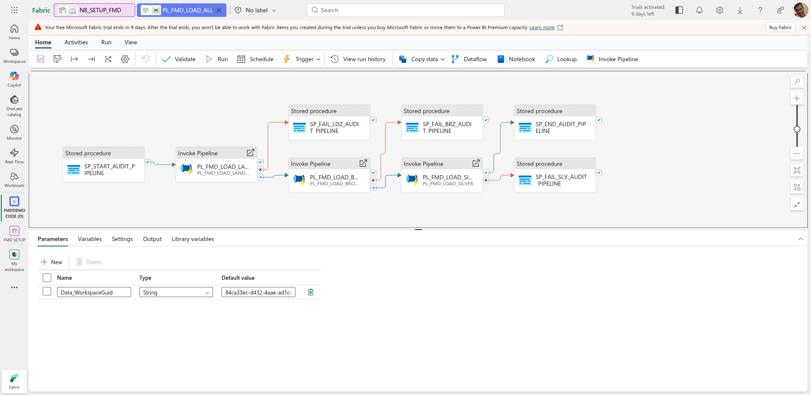
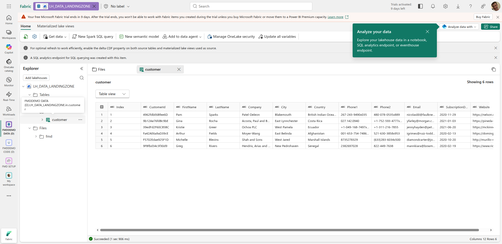
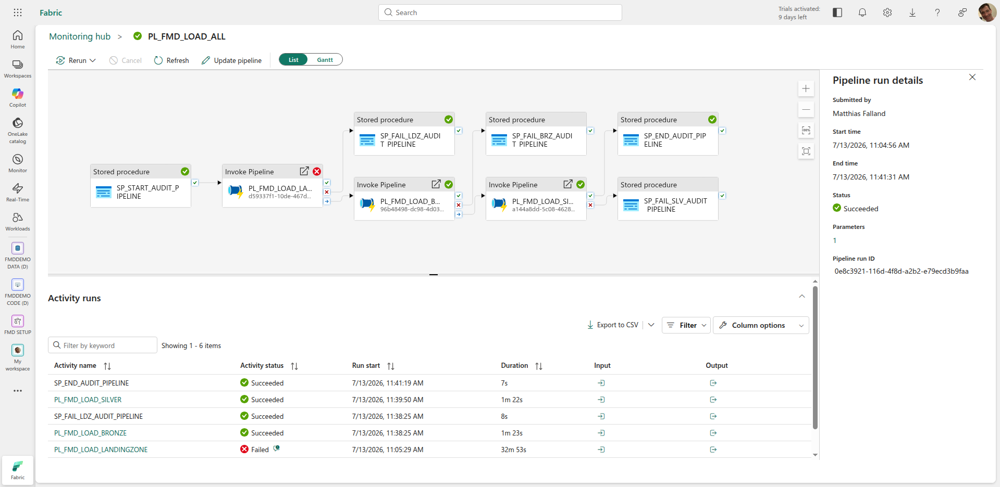
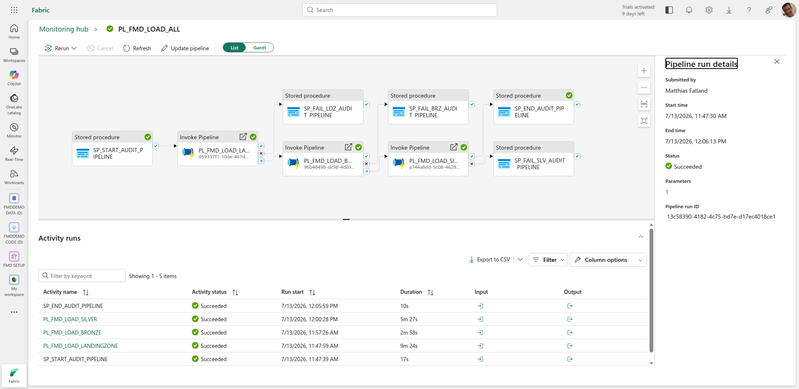
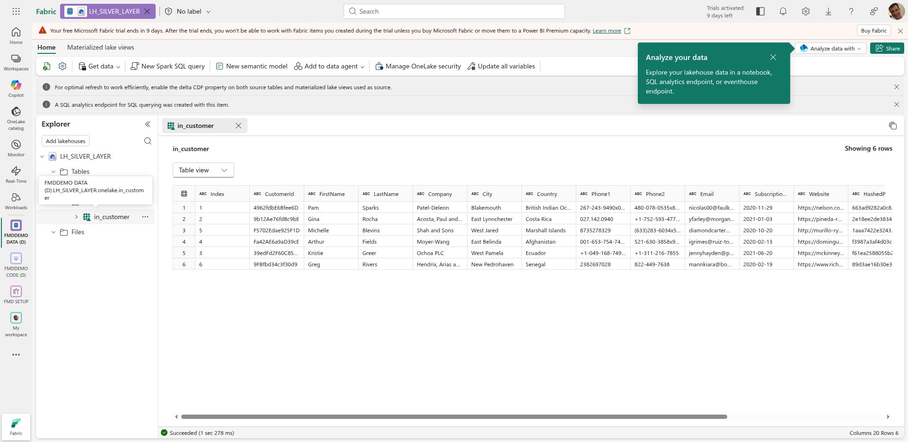

# From an empty capacity to a loaded Silver table

This page was executed, not written. Every timing and every value below comes from a real deployment into a real Fabric tenant on 2026-07-13, against the framework at commit `1ba7974`.

By the end you will have five workspaces, a configuration database, 50 pipelines, 16 notebooks, six lakehouses, and six rows of `customer` data historised in Silver with a full SCD Type 2 record.

Budget **about 90 minutes**, most of it waiting.

This walkthrough was run on `2026.07` (`1ba7974`), where a first deployment needs a
few steps the deployment guide does not yet describe: a second setup pass, a
connection created by hand, and the demo table loaded yourself. Each is in the
walkthrough below, at the point where you need it, and the step callouts flag what
differs on `main`.

**On `main` most of these steps are already gone.** Every finding this run surfaced
was merged upstream after it (the connection creates itself, the demo table is
created, a failed layer now fails the run), so on `main` the deployment is a single
pass and the walkthrough is shorter. The full before-and-after is in
[version differences](../03-reference/08-version-differences.md); the findings and
their pull requests are in [what this run established](#what-this-run-established).
Follow the steps and you will arrive on either version.

> The screenshots below are from this `2026.07` run. A fresh re-shoot against a
> current `main` deployment is a separate task; until then, read the step callouts
> for what a `main` reader sees differently.

## What you need before you start

| | |
|---|---|
| A Fabric capacity | An F-SKU or a Trial. It must be **running, not paused**. The run below used a Trial (FTL64). |
| Fabric Administrator | Only if you want the setup notebook to create a domain. Without it, set `create_domains = False`. |
| A SQL database slot | A **Trial capacity is limited to three Fabric SQL databases**. FMD creates one. ([Learn](https://learn.microsoft.com/fabric/database/sql/limitations#database-level-limitations)) |
| `NB_SETUP_FMD.ipynb` | From the framework's `setup/` folder. |

> **Before you begin, understand one thing that cannot be undone.** Fabric does not let a deleted SQL database's name be reused in the workspace: "If a database is deleted, another cannot be re-created with the same name." ([Learn](https://learn.microsoft.com/fabric/database/sql/limitations#database-level-limitations)) The setup notebook names the database `SQL_<domain_name>_FRAMEWORK`. If the deployment goes wrong, **do not delete the database and retry**. Change `domain_name` instead, or you will have burned that name permanently.

## The shape of the thing



**The deployment is a two-pass process with a manual step in the middle.** The connection cannot exist before the first pass, because it points at a database the first pass creates. Steps 4 and 5 are what bind the pipelines to it, and both are needed.

---

## Step 1: A bootstrap workspace

Create a workspace, assign it to your capacity, and import `setup/NB_SETUP_FMD.ipynb` into it. This workspace is scaffolding: the notebook creates all the real workspaces itself, and you can delete this one afterwards.



**What you should see:** one workspace, one notebook, nothing else.

> Pick **Fabric Trial** (or your F-SKU) as the workspace type, not the default. The framework's Spark environment is Fabric's Medium pool, and an F2 will not carry it.

## Step 2: Edit the configuration cells

Three cells carry values from the tenant the framework was developed in. Change all
three before you run anything. ([Placeholders offered upstream: #247](https://github.com/edkreuk/FMD_FRAMEWORK/pull/247))

**Cell 7, the capacity.** It ships as `capacity_name_dvlm = "Trial-Erwin"`. That capacity does not exist in your tenant. Set all three to yours:

```python
capacity_name_dvlm   = "<your capacity display name>"
capacity_name_prod   = "<your capacity display name>"
capacity_name_config = "<your capacity display name>"
```

**Cell 9, the domain and the principal.** `domain_name` becomes the prefix of every workspace and of the database, so pick something you can find and remove later. `domain_contributor_role` and `connection_role` both carry an Entra object ID that resolves only in the framework's home tenant. Replace it with your own (`az ad signed-in-user show --query id -o tsv`) and change `"type": "Group"` to `"type": "User"`, unless you really are pointing at a group.

**Cell 14, the workspace roles.** Three more principals from the same tenant: two groups and a service principal. The cell's own comment gives the way out, and for a first deployment it is the right one:

```python
workspace_roles_code = []
workspace_roles_data = []
```

Empty lists mean only your own account gets access, which is what you want the first time.

Do not go looking for a third list. The deployment guide names `workspace_roles_configuration` and even shows an example for it, but **the notebook has no such variable**: the configuration workspace reuses `workspace_roles_data` (cell 18). Filling it in changes nothing.

> **Check all three cells before you run.** They are the most common reason a first deployment stops early, and an unedited value fails against your tenant rather than falling back to a default.

## Step 3: Run the notebook, and wait

**It took 35 minutes.** It downloads the framework from GitHub, creates five workspaces, six lakehouses, a SQL database, deploys 16 notebooks, 4 variable libraries and **50 data pipelines** (25 per environment), then builds and executes a SQL deployment manifest over `pyodbc`.

The pipelines deploy one at a time, and that is where the time goes. If you watch the CODE workspace you will see the pipeline count climb slowly. It is not stuck.



The workspace description says it plainly: run the setup notebook again and anything changed here is overwritten. These workspaces belong to the framework, not to you.



**What you should see afterwards:**

| Workspace | Contents |
|---|---|
| `<DOMAIN> CONFIG` | 1 SQL database, 1 SQL endpoint, **1 Environment (`ENV_FMD`)** |
| `<DOMAIN> CODE (D)` and `(P)` | 8 notebooks, 2 variable libraries, 25 data pipelines each |
| `<DOMAIN> DATA (D)` and `(P)` | `LH_DATA_LANDINGZONE`, `LH_BRONZE_LAYER`, `LH_SILVER_LAYER` each |

Note where `ENV_FMD` landed on this run: in **CONFIG**, not in CODE. On the `2026.07` pin this walkthrough uses, that is the only copy, shared by development and production, so re-sizing it for development re-sizes production too. On `main` the setup also deploys an `ENV_FMD` into each CODE workspace and sets it as that workspace's default Spark environment, so the two environments no longer share one ([#278](https://github.com/edkreuk/FMD_FRAMEWORK/pull/278); see [version differences](../03-reference/08-version-differences.md)).

The job status will say **Completed**. One connection is still missing, and step 4 creates it.

## Step 4: Create `CON_FMD_FABRIC_SQL`

The setup creates three of the four connections it needs. `create_or_get_fmd_connection` in `NB_UTILITIES_SETUP_FMD` branches on the connection type: for `FabricDataPipelines` and `Notebooks` it creates the connection, and for `FabricSql` and `AzureDataFactory` it prints `can't created automated yet to CLI limitations` and moves on.

**This connection cannot exist before the first pass**, because it points at the database the first pass creates. That is why the deployment is two passes, and why the guide's order cannot be followed as written. ([Order corrected upstream: #254](https://github.com/edkreuk/FMD_FRAMEWORK/pull/254))

It matters more than a missing connection usually would, because every audit activity in every pipeline references it. Deployed without one, Fabric marks those activities inactive and treats a skipped activity as a success:

```json
"state": "Inactive",
"onInactiveMarkAs": "Succeeded"
```

In the framework's source the same activities are `Active`. So until the connection exists and the pipelines are redeployed against it, the `logging` schema receives no rows, and the framework reports success on every run. This is the state after the first pass, and it is expected:



Each stored-procedure activity carries the deactivated marker and, beside it, a green check.

**Create the connection.** Fabric portal, gear icon, **Manage connections and gateways**, **New**, **Cloud**:

| Field | Value |
|---|---|
| Connection name | `CON_FMD_FABRIC_SQL` |
| Connection type | SQL database (Fabric SQL) |
| Server | the `serverFqdn` of your database |
| Database | the database's **full name including its item GUID**, for example `SQL_FMDDEMO_FRAMEWORK-afc43683-...` |
| Authentication | OAuth2 / Organizational account |

> **The database name is not the display name.** In the portal the database is called `SQL_<DOMAIN>_FRAMEWORK`. The catalog it actually presents is `SQL_<DOMAIN>_FRAMEWORK-<item-guid>`. Connect with the display name and you get nothing.

> **This step can be automated, contrary to what the framework says.** We proved it: a `ServicePrincipal` credential is accepted by the Create Connection API for a `FabricSql` connection, provided the service principal has access to the workspace and the request uses `"creationMethod": "FabricSql.Contents"`. The framework's `fab`-CLI path cannot do it, which is presumably why it reports the limitation. See [the questions for the maintainer](#what-we-would-tell-the-maintainer).

## Step 5: Run the notebook again

**It took 24 minutes.** This time cell 36 *finds* the connection instead of failing to create it, cell 61 registers it into `integration.Connection`, and every pipeline is redeployed with a real connection GUID.

**The second run is the whole point of the manual step.** Creating the connection changes nothing by itself: the pipelines were already deployed with a dead reference, and only a redeployment rewires them.

**Verify before you go on.** The audit activities must now be active:

```
SP_START_AUDIT_PIPELINE      state=Active
SP_FAIL_LDZ_AUDIT_PIPELINE   state=Active
SP_FAIL_BRZ_AUDIT_PIPELINE   state=Active
SP_FAIL_SLV_AUDIT_PIPELINE   state=Active
SP_END_AUDIT_PIPELINE        state=Active
```

The same graph, alive. The deactivated markers and the green checks are gone:



And `integration.Connection` must now hold five rows, including `CON_FMD_FABRIC_SQL`:

```sql
SELECT Name, Type FROM integration.[Connection];
```

## Step 6: Load the demo data

The setup notebook **registers** the demo entity but does not **load** it. `integration.LandingzoneEntity` now has one row, `customer`, and `execution.vw_LoadSourceToLandingzone` resolves it to:

```sql
SourceDataRetrieval: SELECT * FROM [in].[customer]
DataSourceType:      ONELAKE_TABLES_01
```

It expects a **Delta table** `in.customer` inside `LH_DATA_LANDINGZONE`, and nothing has created it. `load_demo_data = True` runs exactly three statements, and all three are `sp_Upsert*` procedures that write **metadata**:

```
sp_UpsertLandingzoneEntity   registers [in].[customer]
sp_UpsertBronzeLayerEntity   registers the Bronze entity
sp_UpsertSilverLayerEntity   registers the Silver entity
```

`demodata/customer.csv` ships in the repository, and nothing references it:

```
$ grep -rn "demodata" setup/ src/
(no matches)
```

So the demo dataset and the demo entity are not yet connected: loading the table is the one step the setup leaves to you. Run the pipeline before you do it and it takes 36 minutes, loads nothing, and reports `Completed`. ([Reported upstream: #256](https://github.com/edkreuk/FMD_FRAMEWORK/issues/256))

**Load the table yourself.** Put `demodata/customer.csv` (6 rows) into `LH_DATA_LANDINGZONE` as a Delta table in schema `in`, named `customer`.

*In the portal:* upload `customer.csv` to the lakehouse's **Files** section, then right-click it and choose **Load to Tables → New table**. With `lakehouse_schema_enabled = True` the dialog asks for a schema as well as a name: enter `in` and `customer`.

*From a notebook:* upload the file to **Files** first, then attach a notebook to `LH_DATA_LANDINGZONE` (the lakehouse must be the notebook's default, or `/lakehouse/default/` does not exist) and run:

```python
import pandas as pd

df = spark.createDataFrame(pd.read_csv("/lakehouse/default/Files/customer.csv"))
df.write.format("delta").mode("overwrite").saveAsTable("in.customer")
```

`saveAsTable` works because the notebook has a default lakehouse; without one, you need the full `abfss://` path and the two GUIDs that go in it, which is why attaching the lakehouse is the shorter road.

> **Do not trust the SQL analytics endpoint here.** It syncs asynchronously. Right after the write, `INFORMATION_SCHEMA.TABLES` still showed nothing while the Delta log was already in OneLake. Check OneLake, not SQL, if you want to know whether the table exists.

When it is there, the landing zone holds the six rows the framework will now pick up. Twelve columns, all of them from the source:



## Step 7: Run `PL_FMD_LOAD_ALL`

**It took 19 minutes.** Most of that is Spark session startup for the two loading notebooks.

**The job status is not the outcome.** `PL_FMD_LOAD_ALL` contains no `Fail` activity: every failure path is an *Upon Failure* branch to a stored procedure that logs and then succeeds. Microsoft documents the consequence: an approach that defines only an *Upon Failure* path renders the pipeline **Success** even when the activity fails ([Learn](https://learn.microsoft.com/azure/data-factory/tutorial-pipeline-failure-error-handling#error-handling)).

We saw exactly that. On the attempt with no source table, the landing zone failed after 33 minutes, Bronze and Silver ran on empty queues, nothing was loaded, and **the Fabric job reported `Completed`** after 36 minutes:

```
11:05:25  PL_FMD_LOAD_ALL      StartPipeline    { "Action" : "Start" }
11:38:30  PL_FMD_LOAD_ALL      FailedPipeline   { "Action" : "Error", "Message" : "BRZ failed" }
11:38:46  PL_FMD_LOAD_BRONZE   StartPipeline    { "Action" : "Start" }
11:39:06  PL_FMD_LOAD_BRONZE   EndPipeline      (20 seconds, empty queue)
11:40:11  PL_FMD_LOAD_SILVER   StartPipeline
11:40:43  PL_FMD_LOAD_SILVER   EndPipeline      (32 seconds, empty queue)
11:41:23  PL_FMD_LOAD_ALL      EndPipeline      { "Action" : "End" }
```

Here is that run in Fabric's own monitor. Read the two panels against each other:



**`PL_FMD_LOAD_LANDINGZONE` is `Failed`. The run is `Succeeded`.** Fabric puts a green check next to the pipeline name. `SP_FAIL_LDZ_AUDIT_PIPELINE` ran, recorded the failure, and succeeded, which is precisely what makes the run green: the catch branch is a leaf, and leaves that succeed make a Try-Catch pipeline report success.

So an alert built on this run status will not fire. Build it on `logging` instead, and see [enterprise integration](../04-explanation/02-enterprise-integration.md#so-alert-on-the-database-not-on-the-run) for the query. Terminating each catch branch in a `Fail` activity, as `PL_FMD_LOAD_BRONZE` already does, makes the run status usable again. ([Offered upstream: #250](https://github.com/edkreuk/FMD_FRAMEWORK/pull/250), [#253](https://github.com/edkreuk/FMD_FRAMEWORK/pull/253))

> **The label on that log line points at the wrong layer.** It reads `BRZ failed`, and Bronze started sixteen seconds afterwards. What failed was the landing zone: `SP_FAIL_LDZ_AUDIT_PIPELINE` fires on `PL_FMD_LOAD_LANDINGZONE: Failed` and carries the Bronze message, while its two siblings are labelled correctly. Read the timestamps rather than the message until this is fixed. ([Offered upstream: #255](https://github.com/edkreuk/FMD_FRAMEWORK/pull/255))

**Judge the run by the database.** That is what `logging` is for:

```sql
SELECT EntityLayer, PipelineName, LogType, LogData, LogDateTime
FROM   logging.PipelineExecution
WHERE  LogDateTime >= DATEADD(hour, -1, GETDATE())
ORDER  BY LogDateTime;
```

A healthy run looks like this, and every line of it is real:

```
11:47:54  PL_FMD_LOAD_ALL                          StartPipeline
11:48:21  PL_FMD_LOAD_LANDINGZONE                  StartPipeline
11:49:06  PL_FMD_LDZ_COMMAND_ONELAKE               StartPipeline
11:49:42  PL_FMD_LDZ_COPY_FROM_ONELAKE_TABLES_01   StartPipeline
11:50:56  PL_FMD_LDZ_COPY_FROM_ONELAKE_TABLES_01   EndPipeline
11:52:23  PL_FMD_LDZ_COMMAND_ONELAKE               EndPipeline
11:54:24  PL_FMD_LOAD_LANDINGZONE                  EndPipeline
11:57:43  PL_FMD_LOAD_BRONZE                       StartPipeline
11:59:11  PL_FMD_LOAD_BRONZE                       EndPipeline
12:00:48  PL_FMD_LOAD_SILVER                       StartPipeline
12:03:08  PL_FMD_LOAD_SILVER                       EndPipeline
12:06:05  PL_FMD_LOAD_ALL                          EndPipeline
```

Note what is *absent* from the failed run above and present here: the two `PL_FMD_LDZ_*` lines. If the copy pipelines never announce themselves, nothing was copied, whatever the job status says. And the two other audit tables must have filled:

```sql
SELECT COUNT(*) FROM logging.CopyActivityExecution;   -- 2
SELECT COUNT(*) FROM logging.NotebookExecution;       -- 5
```

The monitor for a run that really worked looks like this. Same green status as the failed one, which is the whole problem, but now every child is green too:



And the queues must be drained:

```sql
SELECT COUNT(*) AS n, SUM(CAST(IsProcessed AS INT)) AS processed
FROM   execution.PipelineLandingzoneEntity;    -- expect 1, 1
```

## Step 8: Read Silver

The Silver table is **not** where you might guess. Bronze and Silver name their tables `<DataSourceNamespace lowercased>` as the schema and `<SourceSchema>_<SourceName>` as the table:

```
LH_SILVER_LAYER / Tables / onelake / in_customer
```

Six rows, twenty columns, and the SCD Type 2 record is complete:



| CustomerId | FirstName | LastName | IsCurrent | RecordStartDate | RecordEndDate | IsDeleted |
|---|---|---|---|---|---|---|
| `4962fdbE6Bfee6D` | Pam | Sparks | `True` | 2026-07-13 12:02:03 | 9999-12-31 00:00:00 | `False` |
| `39edFd2F60C85BC` | Kristie | Greer | `True` | 2026-07-13 12:02:03 | 9999-12-31 00:00:00 | `False` |

Silver carries **eight technical columns** on top of the source's twelve: `HashedPKColumn`, `HashedNonKeyColumns`, `RecordLoadDate`, `IsCurrent`, `RecordStartDate`, `RecordModifiedDate`, `RecordEndDate`, `IsDeleted`. Bronze carries only the first three, which is the difference between a landing copy and a historised dimension.

One detail worth noticing, because it explains how change detection works: **`HashedNonKeyColumns` differs between Bronze and Silver for the same row.** Silver recomputes it over its own column set. It is not carried across.

You have a loaded, historised Silver table. That is the whole framework, working.

## What this run established

This run was executed against `1ba7974`, which is what release `2026.07` ships. It surfaced seven things the code alone does not show. **On 2026-07-14 the maintainer merged a fix for every one of them**, so the table below is a record of what was, and of how a tutorial full of workarounds becomes a tutorial that needs none.

The fixes are in `main` and **not yet in a release**. So if you follow this tutorial against `2026.07`, the workarounds in the steps above are still what you need; against `main`, most are not. These seven are the ones this run surfaced; [version differences](../03-reference/08-version-differences.md) is the full matrix of everything that changed between `2026.07` and `main`.

| # | Finding | Fixed upstream |
|---|---|---|
| 1 | The deployment guide's order cannot work | [#254](https://github.com/edkreuk/FMD_FRAMEWORK/pull/254) **merged** |
| 2 | Without `CON_FMD_FABRIC_SQL`, the audit activities deploy inactive | [#248](https://github.com/edkreuk/FMD_FRAMEWORK/pull/248) **merged** |
| 3 | The connection *can* be created programmatically | [#248](https://github.com/edkreuk/FMD_FRAMEWORK/pull/248) **merged** |
| 4 | A failing source is invisible from the run status | [#250](https://github.com/edkreuk/FMD_FRAMEWORK/pull/250), [#253](https://github.com/edkreuk/FMD_FRAMEWORK/pull/253) **merged** |
| 5 | `HashedPKColumn` is not stable against a source column reorder | [#252](https://github.com/edkreuk/FMD_FRAMEWORK/pull/252) **merged** |
| 6 | The demo cannot load out of the box | [#268](https://github.com/edkreuk/FMD_FRAMEWORK/pull/268) **merged**, closing [#256](https://github.com/edkreuk/FMD_FRAMEWORK/issues/256) |
| 7 | The audit trail names the wrong layer | [#255](https://github.com/edkreuk/FMD_FRAMEWORK/pull/255) **merged** |

Findings 1 and 2 are the two-pass deployment, and it is worth knowing what closed them: [#248](https://github.com/edkreuk/FMD_FRAMEWORK/pull/248) makes the setup create `CON_FMD_FABRIC_SQL` itself, from a service principal, so on `main` the deployment is a single pass. On `2026.07` you still deploy twice, with the connection created between the passes.

Each finding is stated below with the evidence from the run.

1. **The deployment guide's order cannot be followed as written.** It asks for the connections in step 2, before the workspace exists, and `CON_FMD_FABRIC_SQL` has to name a database that step 5 creates. The working sequence is two passes with the connection created between them.
2. **Without `CON_FMD_FABRIC_SQL`, the audit activities deploy inactive.** Fabric marks an activity with an unresolvable connection `"state": "Inactive"` with `"onInactiveMarkAs": "Succeeded"`, so `logging` receives no rows and every run reports success. In the framework's source the same five activities are `Active`; the second pass restores them.
3. **The connection can be created programmatically.** `POST /v1/connections` accepts a `ServicePrincipal` credential for a `FabricSql` connection with `"creationMethod": "FabricSql.Contents"`, provided the principal has workspace access. We created one and deleted it again. The deployment guide already requires a service principal and the tenant setting "Service principals can create workspaces, **connections**, and deployment pipelines", so the pieces are already in place.
4. **A failing source is invisible from the run status, at every level.** The copy that failed in this run was caught inside its own `ForEach` by `SP_FAIL_AUDIT_PIPELINE_CP`, so the loop succeeded and nothing above it was told. Above that, `PL_FMD_LOAD_ALL` is a Try-Catch graph with no `Fail` activity, so it would have reported success even if a layer had gone red. `PL_FMD_LOAD_BRONZE` and `PL_FMD_LOAD_SILVER` are the two pipelines that do surface a failure, because each ends its catch branch in `FA_THROW_ERROR`. See [How a failure travels](../03-reference/03-pipelines.md#how-a-failure-travels-and-where-it-stops).
5. **`HashedPKColumn` is not stable against a reordering of the source columns.** `NB_FMD_LOAD_LANDING_BRONZE` builds the list it hashes by walking `dfDataChanged.columns` rather than the `PrimaryKeys` metadata, and `concat_ws` is order-sensitive. A composite key hashed in a different order is a different row identity, and Silver then closes every SCD-2 record and re-inserts.

   **What to do until it is fixed.** Single-key entities are unaffected: one column has one ordering. For a **composite** key, either pin the column order of the source (a view with an explicit `SELECT` column list, rather than `SELECT *`), or accept that a schema change upstream can silently re-key your dimension. If you already have such an entity, `SELECT DISTINCT HashedPKColumn` before and after a source change tells you whether it moved.
6. **The demo cannot load out of the box.** `load_demo_data = True` runs three `sp_Upsert*` procedures that register the entity `[in].[customer]`, and nothing ever creates that table. `demodata/customer.csv` ships in the repository and `grep -rn "demodata" setup/ src/` returns nothing. A first deployment therefore ends with an hour of setup, a 36-minute pipeline run, a green status, and three empty lakehouses.
7. **The audit trail names the wrong layer when the landing zone fails.** `SP_FAIL_LDZ_AUDIT_PIPELINE` fires on `PL_FMD_LOAD_LANDINGZONE: Failed` and logs `"Message": "BRZ failed"`. Its two siblings are labelled correctly. Since `logging` is the only reliable failure signal the framework has, this sends whoever reads it into the wrong layer. It sent us there.

---

Source: executed against Microsoft Fabric on 2026-07-13, framework at `1ba7974`, on an FTL64 Trial capacity.
Source: `setup/NB_SETUP_FMD.ipynb` cells 7, 9, 14, 18, 36, 47, 61 @ `1ba7974`
Source: `src/NB_UTILITIES_SETUP_FMD.Notebook/notebook-content.py` lines 712 to 721 @ `1ba7974`
Source: [Limitations in SQL database in Microsoft Fabric](https://learn.microsoft.com/fabric/database/sql/limitations#database-level-limitations)
Source: [Errors and conditional execution](https://learn.microsoft.com/azure/data-factory/tutorial-pipeline-failure-error-handling#error-handling)
Source: [Connections - Create Connection](https://learn.microsoft.com/rest/api/fabric/core/connections/create-connection)
