# Deploy FMD from nothing

This page takes you from an empty Fabric tenant to a running FMD Framework: three (or five) workspaces, three lakehouses per environment, a configuration SQL database, and every notebook and pipeline the framework needs.

Everything is done by one notebook, `setup/NB_SETUP_FMD.ipynb`. You import it into a workspace you create by hand, edit its configuration cells, and run it top to bottom. The notebook downloads the framework source directly from GitHub (`edkreuk/FMD_FRAMEWORK`, branch `main`) and provisions every artefact through the Fabric CLI (`ms-fabric-cli`) and the Fabric REST API.

Where the upstream deployment guide and the notebook cells disagree, this page follows the notebook and says so explicitly.

---

## What you end up with

| Workspace | Default name | Contents |
|---|---|---|
| Code (development) | `INTEGRATION CODE (D)` | Notebooks, data pipelines, variable libraries |
| Data (development) | `INTEGRATION DATA (D)` | `LH_DATA_LANDINGZONE`, `LH_BRONZE_LAYER`, `LH_SILVER_LAYER` |
| Code (production) | `INTEGRATION CODE (P)` | Same as development code |
| Data (production) | `INTEGRATION DATA (P)` | Same as development data |
| Configuration | `INTEGRATION CONFIG` | The `SQL_INTEGRATION_FRAMEWORK` SQL database, the `ENV_FMD` environment |

The names are computed, not literal: `domain_name + ' CODE (D)' + framework_post_fix`, and so on. Change `domain_name` and every workspace name changes with it. The configuration workspace is `domain_name + ' CONFIG'` and the database is `'SQL_' + domain_name + '_FRAMEWORK'`.

The effect of that layout: code workspaces are redeployable without touching data, and the single configuration database is shared by both environments, so one metadata store drives development and production alike.

---

## Prerequisites

### Roles and permissions

| Requirement | Where | Why |
|---|---|---|
| **Contributor on the capacity** | Fabric Admin portal, Capacity settings | Without it, the notebook cannot create workspaces on the capacity |
| **Fabric Administrator** | Entra ID / Fabric admin | Only needed to create the domain. If you do not have it, set `create_domains = False` |
| **Workspace Contributor** for the identity that executes the pipelines | Each workspace | The workspace identity is assigned automatically during deployment. A service principal must be added manually |
| Permission to create Fabric items and workspaces | Tenant settings | The notebook creates workspaces, lakehouses, pipelines, notebooks and a SQL database |

### Tenant settings (Fabric Admin portal)

Enable, per the deployment guide:

- **Microsoft Fabric settings:** users can create Fabric items.
- **Workspace settings:** create workspaces.
- **Developer settings:** service principals can create workspaces, connections and deployment pipelines; service principals can call Fabric public APIs.
- **Admin API settings:** service principals can access read-only admin APIs; service principals can access admin APIs used for update.

If a tenant setting is scoped to a security group rather than the whole organisation, add the executing identity (workspace identity after deployment, or your service principal) to that group.

### Capacity

An F-SKU or Trial capacity that is **running, not paused**. The notebook's own comment after the SQL database step is blunt about the failure mode: it tells you to check whether you are on a trial capacity, or whether the capacity you assigned is paused (cell 44).

A Fabric **Trial** capacity is limited to three SQL databases. Other capacities have no such limit; the ceiling there is 150 databases per workspace. Deployment creates one, so if the trial capacity already holds three, the database step fails. The upstream wiki describes this limit as tenant-scoped; Microsoft Learn scopes it to the trial capacity. Source: [Limitations in SQL database in Microsoft Fabric](https://learn.microsoft.com/fabric/database/sql/limitations#database-level-limitations).

### Workspace settings for the host workspace

Set the Spark session timeout to **at least one hour** (Workspace settings → Data Engineering/Science → Jobs). The default session expiry is 20 minutes. The full deployment runs well beyond that, and a timeout mid-run leaves the framework half-provisioned. Source: [Data Engineering workspace administration settings](https://learn.microsoft.com/fabric/data-engineering/workspace-admin-settings).

---

## The deployment sequence

```mermaid
flowchart TD
    A["Create a host workspace (for example FMD_SETUP)"] --> B["Import setup/NB_SETUP_FMD.ipynb"]
    B --> C["Edit the configuration cells (capacity, domain, roles)"]
    C --> D["Run: pip install ms-fabric-cli, pillow, cairosvg"]
    D --> E["Download src/ and config/ from GitHub as a zip"]
    E --> F["Acquire the Fabric CLI token (notebookutils)"]
    F --> G{"create_domains?"}
    G -- "yes" --> H["Create the domain"]
    G -- "no" --> I["Create or reuse the CON_FMD_* connections"]
    H --> I
    I --> J["Create the CODE and DATA workspaces (D and P)"]
    J --> K["Create the CONFIG workspace, grant the code identity access"]
    K --> L["Create the three lakehouses per data workspace"]
    L --> M["Create the SQL database SQL_domain_FRAMEWORK"]
    M --> N["Deploy the environment, notebooks, variable libraries, pipelines"]
    N --> O["Assign workspace icons (assign_icons)"]
    O --> P["Build the SQL manifest: connections, datasources, workspaces, pipelines, lakehouses"]
    P --> Q{"load_demo_data?"}
    Q -- "yes" --> R["Add the customer demo entity to the manifest"]
    Q -- "no" --> S["Execute the manifest over pyodbc with an AAD token"]
    R --> S
    S --> T["Pass 1 ends. Reports success.<br/>CON_FMD_FABRIC_SQL does not exist,<br/>so every audit activity is Inactive"]
    T --> U["Create CON_FMD_FABRIC_SQL by hand,<br/>against the database pass 1 just made"]
    U --> V["Run the notebook AGAIN.<br/>The pipelines are redeployed against the connection"]
    V --> W["Load the demo table yourself.<br/>load_demo_data registers it and never creates it"]

    style T fill:#f8d7da,stroke:#842029
    style U fill:#fff3cd,stroke:#664d03
    style V fill:#fff3cd,stroke:#664d03
```



One thing in that diagram depends on how you configure the setup, and it changed on 2026-07-14. **On `main`, fill the three `fabric_sql_sp_*` settings (cell 9) and the deployment is a single pass**: the setup creates `CON_FMD_FABRIC_SQL` itself from that service principal ([#248](https://github.com/edkreuk/FMD_FRAMEWORK/pull/248)). Leave them empty, or deploy `2026.07` or earlier, and it is **two passes**, because the connection has to name a database the first pass creates. Both are described below.

> On `main`, `load_demo_data = True` also creates the demo table, through `NB_FMD_LOAD_DEMO_DATA` ([#268](https://github.com/edkreuk/FMD_FRAMEWORK/pull/268)). Up to and including `2026.07` it registered the demo entity without creating the table it points at, so the demo loaded nothing and the last step was yours ([#256](https://github.com/edkreuk/FMD_FRAMEWORK/issues/256)).

---

## Steps

### 1. Create the connections you can create

Create them in the Fabric portal under **Settings → Manage connections and gateways → New → Cloud**.

| Connection name | Connection type | Authentication | When |
|---|---|---|---|
| `CON_FMD_FABRIC_PIPELINES` | Fabric Data Pipelines | OAuth2, service principal, or workspace identity | now, or let the notebook create it |
| `CON_FMD_FABRIC_NOTEBOOKS` | Fabric Notebooks | OAuth2, service principal, or workspace identity (reserved for future use) | now, or let the notebook create it |
| `CON_FMD_FABRIC_SQL` | Fabric SQL database | OAuth2 | **not now.** It has to name a database that does not exist yet. See below. |

The authentication column is what the portal offers you when you create the connection by hand. It is not what the notebook does: where the notebook creates a connection itself, it hard-codes `credentialDetails.type=WorkspaceIdentity`, which is why the limitation below matters at all.

Microsoft Learn today limits workspace-identity authentication to connections used by OneLake shortcuts, pipelines, semantic models and Dataflows Gen2, which does not include a Fabric Notebooks connection. That connection is reserved for future use and is unused by the framework, so this has no effect on a current deployment. Source: [Authenticate with workspace identity](https://learn.microsoft.com/fabric/security/workspace-identity-authenticate#considerations-and-limitations).

**You never paste these connection IDs anywhere.** The upstream guide asks you to note them for later configuration; the notebook does not need them, because it resolves connections **by name** (cell 36) and registers them by filtering on the `CON_FMD` prefix (cell 61).

Add `CON_FMD_ADF_PIPELINES` (Azure Data Factory) only if you orchestrate through ADF. If you do, the service principal that ADF uses must be a member of the code workspace, so put it in `workspace_roles_code`.

**How many of these four the notebook creates depends on the version and on your settings.** Cell 36 calls `create_or_get_fmd_connection(...)` for all four names, and the function branches on the connection type. It always creates `CON_FMD_FABRIC_PIPELINES` (`FabricDataPipelines`) and `CON_FMD_FABRIC_NOTEBOOKS` (`Notebooks`), both hard-coded to `credentialDetails.type=WorkspaceIdentity`. `CON_FMD_ADF_PIPELINES` (`AzureDataFactory`) is always yours to create by hand.

`CON_FMD_FABRIC_SQL` (`FabricSql`) is the one that changed:

- **On `main`, with the three `fabric_sql_sp_*` settings filled**, the setup creates it from that service principal, through `POST /v1/connections` with `creationMethod=FabricSql.Contents`. A `FabricSql` connection accepts a service-principal (OAuth2-family) credential even though the portal UI does not offer it. So the deployment is a single pass. ([#248](https://github.com/edkreuk/FMD_FRAMEWORK/pull/248))
- **Leave those settings empty, or deploy `2026.07` or earlier**, and the setup prints a message and creates nothing. Then it is two passes.

> **When `CON_FMD_FABRIC_SQL` cannot be created automatically, the deployment is two passes.** A Fabric SQL database connection has to name an existing database, and `SQL_<DOMAIN>_FRAMEWORK` is created by the setup itself. So the order is: run the setup, create the connection against the database it just made, **run the setup again** so the pipelines are redeployed against it. This is step 4 and step 5 of the [tutorial](../01-tutorial/01-getting-started.md#step-4-create-con_fmd_fabric_sql), executed and timed. On `2026.07` the deployment guide's order also cannot be followed as written, which [#254](https://github.com/edkreuk/FMD_FRAMEWORK/pull/254) corrects.

When the SQL connection is missing, the notebook does not stop: it resolves the connection id with `silently_continue=True`, gets an empty id, writes that into `mapping_table`, and carries on. The pass therefore reports success while every audit activity is deployed `Inactive` and `logging` receives no rows. The second pass is what repairs that. This is why, on any version, **you confirm the audit activities are `Active` before trusting a load** (the [tutorial](../01-tutorial/01-getting-started.md) shows the check).

**What you should see:** four (or three) connections whose names start with `CON_FMD`. The notebook later enumerates exactly those with `fab api -X get connections` and filters on the `CON_FMD` prefix, so a connection named anything else will not be registered in the configuration database.

### 2. Create a host workspace and import the notebook

Create a workspace to run the setup from, for example `FMD_FRAMEWORK_CONFIGURATION`. This workspace is only the place where the setup notebook lives; the notebook creates its own `<DOMAIN> CONFIG` workspace for the SQL database.

Import `setup/NB_SETUP_FMD.ipynb`. Make sure you are in the **Fabric experience**, not the Power BI experience, or the import option for notebooks is not offered.

**What you should see:** the notebook opens with a lakehouse-free Spark session available, and the workspace's Spark session timeout is set to at least one hour.

### 3. Configure the notebook

Every value below is a real cell in `NB_SETUP_FMD.ipynb`. Edit these, and nothing else. Fabric shows you the notebook's markdown headings, not cell indices, so both are given.

#### Framework settings (cell 3, under the heading *Configuration and Parameters*)

```python
assign_icons = True                        # assign the FMD default workspace icons
load_demo_data = True                      # register the customer demo entity in the metadata database
lakehouse_schema_enabled = True            # use schema-enabled lakehouses (in.customer instead of in_customer)
driver = '{ODBC Driver 18 for SQL Server}' # the ODBC driver used by every pyodbc connection
overwrite_variable_library = True          # set to False to keep your own edits to VAR_CONFIG_FMD / VAR_FMD
```

`lakehouse_schema_enabled` is the one with lasting consequences: it decides whether the lakehouses are created schema-enabled, which in turn decides whether your landing-zone table is `in.customer` or `in_customer`. Changing it later means re-creating the lakehouses.

#### Key Vault and Purview settings (cell 5, under the heading *KeyVault settings*)

```python
key_vault_uri_name = 'val_key_vault_uri_name'
purview_account_name = 'val_purview_account_name'
```

These are placeholders for future use. The deployment guide lists four Key Vault variables (`key_vault_uri_name`, `key_vault_tenant_id`, `key_vault_client_id`, `key_vault_client_secret`); the notebook has only `key_vault_uri_name` and, instead of the other three, `purview_account_name`. Follow the notebook.

#### Capacity settings (cell 7, under the heading *Capacity configuration*)

```python
reassign_capacity = True                       # False leaves the capacity of an existing workspace untouched
capacity_name_dvlm   = '<your capacity name>'  # capacity for the development workspaces
capacity_name_prod   = '<your capacity name>'  # capacity for the production workspaces
capacity_name_config = '<your capacity name>'  # capacity for the configuration workspace
```

Fill all three with your capacity name. The deployment guide shows only `capacity_name_dvlm` and `reassign_capacity`, yet its own workspace block references `capacity_name_prod`; the notebook defines all three, including `capacity_name_config`, which the guide never mentions.

> Up to and including `2026.07`, these three shipped as `"Trial-Erwin"`, the author's own capacity name, and you had to replace them. They are placeholders from `main` on ([#247](https://github.com/edkreuk/FMD_FRAMEWORK/pull/247), merged 2026-07-14).

#### Domain, post-fix and connections (cell 9, under the heading *Domain and Framework settings*)

```python
framework_post_fix = ''      # appended to every workspace name, for example 'FMD'
if framework_post_fix != '':
   framework_post_fix = ' ' + framework_post_fix   # the separating space is added for you
create_domains = True        # False if the executing identity is not a Fabric Administrator
domain_name = 'INTEGRATION'  # drives every workspace name and the database name

domain_contributor_role = {"type": "Contributors",
                           "principals": [{"id": "00000000-0000-0000-0000-000000000000", "type": "Group"}]}

connection_fabric_datapipelines_name = 'CON_FMD_FABRIC_PIPELINES'
connection_fabric_notebooks_name     = 'CON_FMD_FABRIC_NOTEBOOKS'
connection_fabric_database_name      = 'CON_FMD_FABRIC_SQL'
connection_fabric_adf_name           = 'CON_FMD_ADF_PIPELINES'

connection_role = {"role": "owner",
                   "principals": [{"id": "00000000-0000-0000-0000-000000000000", "type": "Group"}]}
```

Set `framework_post_fix` to `'FMD'`, not `' FMD'`: the cell prepends the separating space itself, so `INTEGRATION CODE (D)` becomes `INTEGRATION CODE (D) FMD`. The post-fix goes into every computed workspace name, so changing it after a deployment provisions a second set of workspaces rather than renaming the first.

The `id` values shipped in the notebook are real object IDs from the upstream author's tenant. They are meaningless in yours and must be replaced with object IDs from your own Microsoft Entra ID.

#### Workspace roles (cell 14, under the heading *Workspace Roles Configuration*)

```python
workspace_roles_code = [
    {"principal": {"id": "00000000-0000-0000-0000-000000000000", "type": "Group"},
     "role": "admin"},          # choose from 'admin', 'member', 'contributor', 'viewer'
    {"principal": {"id": "00000000-0000-0000-0000-000000000000", "type": "ServicePrincipal"},
     "role": "contributor"},
]

workspace_roles_data = [
    {"principal": {"id": "00000000-0000-0000-0000-000000000000", "type": "Group"},
     "role": "admin"},
    {"principal": {"id": "00000000-0000-0000-0000-000000000000", "type": "ServicePrincipal"},
     "role": "contributor"},
]
```

Two things to get right:

- **The role strings are lower case in the notebook** (`admin`, `member`, `contributor`, `viewer`). The deployment guide's example shows them capitalised (`Member`, `Contributor`, `Admin`). Use the notebook's spelling.
- **For a service principal, use the object ID from Enterprise Applications**, not the object ID of the app registration. They are different GUIDs and only one of them works.

The guide mentions a third list, `workspace_roles_configuration`. The notebook has no such variable: the configuration workspace reuses `workspace_roles_data` (cell 18). An empty list `[]` is legal and means "assign only my own account".

#### Environments and the configuration workspace (cells 16 and 18, under the headings *Workspace configuration* and *Fabric Database Configuration*)

These two cells are marked "do not change unless specified otherwise". They compose the names from `domain_name`, `framework_post_fix` and the role lists above, and they are the reason the workspace names come out as `INTEGRATION CODE (D)`, `INTEGRATION DATA (P)` and `INTEGRATION CONFIG`. Touch them only to add an environment (say, acceptance) beyond development and production.

#### Repository settings (cell 12, under the heading *Repo Configuration*)

```python
repo_owner = "edkreuk"
repo_name  = "FMD_FRAMEWORK"
branch     = "main"
folder_prefix = ""
```

The notebook downloads the framework's `src/` and `config/` folders straight from the GitHub zipball API. Change these only if you deploy from a fork. Note the consequence: **the deployment fetches whatever is on that branch at the moment you run it**, so two runs a month apart can deploy different code. Pin your fork if you need reproducibility.

### 4. Run the notebook

Run every cell top to bottom. In order, the notebook:

1. installs `ms-fabric-cli`, `pillow` and `cairosvg` into the session,
2. downloads `src/` and `config/` from GitHub as a zip and unpacks them into `./builtin/`,
3. gets a Fabric token via `notebookutils.credentials.getToken('pbi')` and exports it as `FAB_TOKEN`, so every `fab` CLI call runs as **you**, the notebook's executor,
4. runs `NB_UTILITIES_SETUP_FMD` (`%run`), which defines the deployment helper functions,
5. creates the domain, if `create_domains`,
6. creates or reuses the four `CON_FMD_*` connections,
7. creates the code and data workspaces for each environment, then grants each code workspace's identity access to the matching data workspace,
8. creates the configuration workspace and grants the code workspace identities access to it,
9. creates the three lakehouses in each data workspace,
10. creates the SQL database in the configuration workspace,
11. deploys `ENV_FMD` into the **configuration** workspace (cell 48), and the notebooks, variable libraries and data pipelines into the **code** workspaces (cells 50 and 53). On `main` the code-workspace deployment includes `ENV_FMD` as well, and a further cell sets it as that workspace's default Spark environment ([#278](https://github.com/edkreuk/FMD_FRAMEWORK/pull/278)); up to and including `2026.07` the code workspaces received no Environment,
12. assigns the workspace icons, if `assign_icons`,
13. builds a list of `EXEC [integration].[sp_Upsert...]` statements for the connections, data sources, workspaces, pipelines and lakehouses it just created, and, if `load_demo_data`, for the `customer` demo entity,
14. connects to the new SQL database with `pyodbc` and an AAD access token (no password anywhere) and executes that list,
15. displays the `tasks` table, its record of what it did.

**What you should see:** the `display(tasks)` output at the end lists every created item, the workspaces exist with FMD icons, `SQL_<DOMAIN>_FRAMEWORK` exists in the CONFIG workspace, and `integration.Connection`, `integration.Workspace`, `integration.Lakehouse` and `integration.Pipeline` are populated.

### 5. Load the demo data and prove the framework runs

Setting `load_demo_data = True` registers the **metadata** for a `customer` entity. It does not put any data in the landing zone. You still do that by hand.

**First find out which workspace the demo entity was registered against.** Cell 71 resolves its lakehouse with `SELECT top 1 LakehouseId FROM integration.Lakehouse WHERE Name = 'LH_DATA_LANDINGZONE'`. There is no workspace filter and no `ORDER BY`, and by that point `integration.Lakehouse` holds two rows of that name, one for `INTEGRATION DATA (D)` and one for `INTEGRATION DATA (P)`, because cell 69 registers the lakehouses of every environment and `sp_UpsertLakehouse` keys on the lakehouse GUID. Which of the two the query returns is not determined by the code. Read it out of the database instead of assuming:

```sql
SELECT SourceSchema, SourceName, WorkspaceGuid
FROM   execution.vw_LoadSourceToLandingzone
WHERE  SourceName = 'customer';
```

The view derives `WorkspaceGuid` from that lakehouse, so the GUID it returns is the workspace the demo entity belongs to. Use **that** workspace in the two steps below, and pass **that** GUID to `PL_FMD_LOAD_ALL`.

1. Upload `demodata/customer.csv` to the **Files** section of `LH_DATA_LANDINGZONE` in that data workspace.
2. Create a table from that file. In the lakehouse explorer, right-click `customer.csv` under **Files** and choose **Load to Tables → New table**. With `lakehouse_schema_enabled = True` the dialog asks for a schema as well as a table name: enter the schema `in` and the table name `customer`, which gives you `in.customer`. Without schemas enabled, the table is `in_customer`.
3. Run `PL_FMD_LOAD_ALL` in `INTEGRATION CODE (D)`. It takes one parameter, `Data_WorkspaceGuid`, and the setup has already rewritten its default to this environment's data workspace: the `40e27fdc-…` GUID in the repository is a placeholder registered in `config/item_config.yaml`, and deployment substitutes it. **Check it against the `WorkspaceGuid` the query above returned** before you run. The layer pipelines resolve their work list from `execution.vw_LoadSourceToLandingzone` filtered on this GUID, so a value matching no workspace gives you a pipeline run that succeeds and loads nothing.

**What you should see:** the six demo rows landing in `LH_DATA_LANDINGZONE` as `in.customer`, then rows for `customer` in `LH_BRONZE_LAYER` and `LH_SILVER_LAYER`, and audit rows in the `logging` schema of the configuration database. The [tutorial](../01-tutorial/01-getting-started.md#step-6-load-the-demo-data) shows each of those states from a real run.

---

## Known pitfalls

| Symptom | Cause | What to do |
|---|---|---|
| Domain creation fails | Domain creation requires the Fabric Administrator role | Set `create_domains = False` and let a Fabric admin create the domain, or run without one |
| `PL_FMD_LOAD_ALL` succeeds and loads nothing, and the `customer` file is definitely in the landing zone | The demo entity may be registered against the other environment's lakehouse: cell 71 resolves it with `SELECT top 1 ... WHERE Name = 'LH_DATA_LANDINGZONE'`, which filters on neither workspace nor order | Read `WorkspaceGuid` from `execution.vw_LoadSourceToLandingzone` for `SourceName = 'customer'`, upload the file into that workspace's lakehouse, and pass that GUID |
| `CON_FMD_FABRIC_SQL` was never created and the deployment still reported success | The notebook cannot create a `FabricSql` connection; it prints a message, resolves an empty connection id with `silently_continue=True`, and continues | Create `CON_FMD_FABRIC_SQL` in the portal by hand and re-run the notebook |
| The SQL database is not created | A trial capacity allows only three Fabric SQL databases. Other capacities have no such limit | Free a slot on the trial capacity, or deploy onto an F-SKU capacity. **Do not delete `SQL_<DOMAIN>_FRAMEWORK` itself**, see below |
| Anything fails right after the database step | The capacity is paused, or is a trial capacity | Resume the capacity; the notebook itself flags this exact case |
| A service principal has no access despite being listed in the roles | The object ID of the **app registration** was used | Use the object ID from **Enterprise applications** in the Azure portal |
| The run dies halfway through | The Spark session timed out | Set the session timeout to at least one hour and re-run; the deployment is designed to be re-runnable |
| Custom edits to `VAR_CONFIG_FMD` or `VAR_FMD` disappear after a re-deploy | `overwrite_variable_library = True` | Set it to `False` |
| `VAR_CONFIG_FMD` is empty | The setup notebook has not run, or did not reach the variable-library step | Re-run the notebook; it is what populates the GUIDs and the connection string |
| A connection exists but is never registered in the database | Its display name does not start with `CON_FMD` | Rename it: the manifest builder filters on that prefix |
| An ODBC error on the `pyodbc` step | A different ODBC driver is installed on the Spark image | Change `driver` in cell 3 |
| The database step keeps failing after you deleted the database and re-ran | Fabric forbids reusing the name of a deleted SQL database | Change `domain_name`, or deploy into a fresh workspace. See below |
| `PL_FMD_LOAD_ALL` succeeds but nothing is loaded | It ran with the shipped default `Data_WorkspaceGuid`, which is the upstream author's workspace | Pass the GUID of your own `INTEGRATION DATA (D)` workspace |

### Never delete the SQL database

**Fabric does not let a deleted SQL database's name be reused in the workspace.** Microsoft Learn: "Each database in the workspace must have a unique name. If a database is deleted, another cannot be re-created with the same name." Source: [Limitations in SQL database in Microsoft Fabric](https://learn.microsoft.com/fabric/database/sql/limitations#database-level-limitations).

The database name is computed, `'SQL_' + domain_name + '_FRAMEWORK'`, and the notebook has no way to sidestep the rule. So if you delete `SQL_INTEGRATION_FRAMEWORK` and re-run the setup, the database step can never succeed again in that workspace under that name, however many times you re-run it. The deployment is unrecoverable by the means the page otherwise recommends.

If the database step fails, fix the cause and re-run **without deleting anything**: resume the capacity, free a slot on a trial capacity, or move to an F-SKU. If you have already deleted it, you have two ways out: change `domain_name` (which renames every workspace with it) or deploy into a fresh workspace.

The upstream wiki's Troubleshooting page is seven lines long and covers only the first two rows of the table above. Its remedy for a failed database creation is to re-run the notebook or create the database by hand to see the real error:

### Re-running the notebook

Re-running is safe for workspaces, lakehouses, items and metadata: every provisioning step there is an upsert, created if missing and reused if present, and every metadata statement is an `sp_Upsert...` call. The SQL database is the one exception, for the reason above.

One image in the upstream repository, `FMD_add_deployment_file.png`, shows a `deployment/FMD_deployment.json` file inside an `LH_CONFIGURATION` lakehouse. Neither that file nor that lakehouse exists in the framework at this commit, and `NB_SETUP_FMD.ipynb` never asks you to create either: it builds its deployment manifest in memory (the `custom_sql_deployment` dictionary) and executes it directly over `pyodbc`. Ignore the image on this point.

---

## Next

- [Register a new source entity](./02-add-an-entity.md), so FMD loads something other than the demo customer.

---

## Sources

- `FMD_FRAMEWORK_DEPLOYMENT.md`, upstream deployment guide (`edkreuk/FMD_FRAMEWORK`, commit `1ba7974`).
- `setup/NB_SETUP_FMD.ipynb`, cells 1 to 75, the authority for what deployment actually does.
- `.github/copilot-instructions.md`, "Common pitfalls & workarounds".
- `src/PL_FMD_LOAD_ALL.DataPipeline/pipeline-content.json`, the `Data_WorkspaceGuid` parameter and its default.
- Upstream wiki: `Troubleshooting.md`, `Workspace-architecture.md`, `Data-Processing.md` ("Load Demo data csv file").
- Images: `Images/` in the framework repository.

Platform claims, Microsoft Learn:

- [Limitations in SQL database in Microsoft Fabric](https://learn.microsoft.com/fabric/database/sql/limitations#database-level-limitations), the trial-capacity limit and the no-name-reuse rule.
- [Authenticate with workspace identity](https://learn.microsoft.com/fabric/security/workspace-identity-authenticate#considerations-and-limitations), which items may use a workspace-identity connection.
- [Data Engineering workspace administration settings](https://learn.microsoft.com/fabric/data-engineering/workspace-admin-settings), the Spark session timeout and its 20-minute default.
- [Manage your Fabric capacity](https://learn.microsoft.com/fabric/admin/capacity-settings), the capacity contributor role.
- [Fabric domains](https://learn.microsoft.com/fabric/governance/domains#create-a-domain), who may create a domain.
