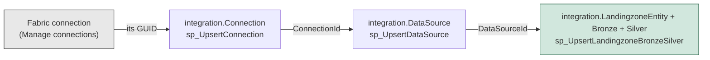
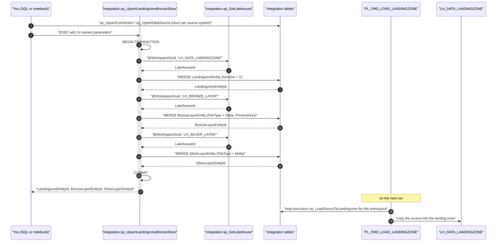

# Register a new source entity

FMD loads what its metadata tells it to load. To make the framework pick up a new table or file, you do not edit a pipeline: you insert metadata into the configuration database, and the pipelines find it on their next run.

One stored procedure does the whole registration in a single transaction:

```
[integration].[sp_UpsertLandingzoneBronzeSilver]
```

It writes three rows – one landing-zone entity, one bronze entity, one silver entity – and resolves the three lakehouse IDs for you from the workspace GUID you pass in.

This page assumes the framework is already deployed. If it is not, start with [Deploy FMD from nothing](./01-deploy.md).

---

## Before you call the procedure

The entity you register must point at a **data source** that already exists in `integration.DataSource`, and that data source must point at a **connection** in `integration.Connection`.

Deployment creates the OneLake connection and the OneLake data sources for you, which is why the demo works out of the box. **Your first real source is not OneLake**, so you register it yourself first. That is the next section. If your data source already exists, find its id and skip ahead:

```sql
SELECT DataSourceId, Name, Namespace, Type, IsActive
FROM   integration.DataSource
ORDER  BY DataSourceId;
```

You also need the **GUID of the data workspace** – the one holding `LH_DATA_LANDINGZONE`, `LH_BRONZE_LAYER` and `LH_SILVER_LAYER`, for example `INTEGRATION DATA (D)`. The procedure uses it to look up all three lakehouse IDs.

---

## Register the source system first

Two rows, in this order, and one of them you can only get from the Fabric portal.



### 1. The connection

FMD does not create the Fabric connection. It **records the GUID of one that already exists**: you create the connection in the Fabric portal under *Manage connections and gateways*, with its own credentials, and FMD stores nothing but its identity. That separation is deliberate, and it is the reason no source password is ever in the configuration database.

```sql
-- @ConnectionGuid is the GUID of a connection that already exists in Fabric
EXECUTE [integration].[sp_UpsertConnection]
     @ConnectionGuid = 'a1b2c3d4-0000-0000-0000-000000000000'
    ,@Name           = N'AdventureWorks Azure SQL'
    ,@Type           = N'SQL'
    ,@IsActive       = 1;
```

**`@Type` must be one of nine literals**, because `PL_FMD_LOAD_LANDINGZONE` switches on it to choose a copy pipeline. A tenth value is caught: the `Switch` carries a default branch, `FA_UNKNOWN_DATASOURCENAME`, which fails the pipeline with `Unkown Datasource Type: <yours>` and error code `50000`. You get a typo back as an error rather than as a missing table, which is the outcome you want.

| `@Type` | Copies with |
|---|---|
| `SQL` | Azure SQL Database, SQL Server |
| `AZURESQLMI` | Azure SQL Managed Instance |
| `ORACLE` | Oracle |
| `ADLS` | ADLS Gen2 |
| `ONELAKE` | OneLake (what the demo uses) |
| `SFTP` | SFTP |
| `FTP` | FTP |
| `ADF` | an Azure Data Factory pipeline |
| `NOTEBOOK` | your own notebook, named in `@CustomNotebookName` |

The pipeline compares `@toUpper(item().ConnectionType)`, so the casing you store does not matter. The spelling does. Each of the nine reaches one `PL_FMD_LDZ_COMMAND_*` pipeline, which in turn reaches one of the ten `PL_FMD_LDZ_COPY_FROM_*` pipelines: ten, not nine, because `ONELAKE` splits into `_ONELAKE_FILES_01` and `_ONELAKE_TABLES_01`. The full mapping is in [supported sources](../03-reference/07-supported-sources.md).

**`sp_UpsertConnection` returns nothing.** It has no `OUTPUT` clause, so unlike the other two procedures it hands you back no id. Read it yourself:

```sql
SELECT ConnectionId FROM integration.Connection
WHERE  ConnectionGuid = 'a1b2c3d4-0000-0000-0000-000000000000';
```

It matches on `ConnectionGuid`, so calling it twice with the same GUID updates rather than duplicates.

### 2. The data source

A connection is a *system*; a data source is a *database or container inside it* that you want to load from. One connection can carry several.

```sql
EXECUTE [integration].[sp_UpsertDataSource]
     @ConnectionId  = 4            -- from the SELECT above
    ,@Name          = N'AdventureWorks'
    ,@Namespace     = 'aw'         -- see the warning below
    ,@Type          = 'ASQL_01'    -- NOT 'SQL'. See below: this is a different vocabulary.
    ,@Description   = N'Sales system, read replica'
    ,@IsActive      = 1;
-- returns: DataSourceId
```

> **`@Type` here is not the connection type.** This is the single easiest way to register an entity that never loads, and we made the mistake ourselves before a live run caught it.
>
> The two columns look alike and mean different things. `Connection.Type` is one of the nine literals above, and `PL_FMD_LOAD_LANDINGZONE` switches on it to choose a **command** pipeline. `DataSource.Type` is the **routing key of the copy pipeline itself**, and each copy pipeline looks for its own literal:
>
> ```sql
> -- inside PL_FMD_LDZ_COPY_FROM_ASQL_01, activity LK_GET_ENTITIES
> SELECT * FROM [execution].[vw_LoadSourceToLandingzone]
> WHERE  DataSourceType = 'ASQL_01'      -- a literal, hard-coded in the pipeline
>   AND  WorkspaceGuid  = '...'          -- the Data_WorkspaceGuid parameter
> ```
>
> Register a `SQL` connection and then give the data source `@Type = 'SQL'`, and the `Switch` routes correctly to `PL_FMD_LDZ_COMMAND_ASQL`, which invokes `PL_FMD_LDZ_COPY_FROM_ASQL_01`, whose lookup then matches **nothing**. The `ForEach` iterates over an empty list, no copy runs, no row is written to `logging.CopyActivityExecution`, and **the pipeline reports success**. On our own run it took 26 seconds and produced no file and no error.
>
> Erwin's own setup gets this right, and it is the place to read the convention from: it registers the demo landing zone as `@Type = 'ONELAKE_TABLES_01'`, not `'ONELAKE'`.

**The eleven values `DataSource.Type` can take**, one per copy-pipeline branch:

| `DataSource.@Type` | `Connection.@Type` | Reached by |
|---|---|---|
| `ASQL_01`, `ASQL_02` | `SQL` | `PL_FMD_LDZ_COPY_FROM_ASQL_01` (it carries two independent branches) |
| `SQLMI_01` | `AZURESQLMI` | `PL_FMD_LDZ_COPY_FROM_SQLMI_01` |
| `ORACLE_01` | `ORACLE` | `PL_FMD_LDZ_COPY_FROM_ORACLE_01` |
| `ADLS_01` | `ADLS` | `PL_FMD_LDZ_COPY_FROM_ADLS_01` |
| `ONELAKE_TABLES_01`, `ONELAKE_FILES_01` | `ONELAKE` | the two OneLake copy pipelines |
| `SFTP_01` | `SFTP` | `PL_FMD_LDZ_COPY_FROM_SFTP_01` |
| `FTP_01` | `FTP` | `PL_FMD_LDZ_COPY_FROM_FTP_01` |
| `ADF` | `ADF` | `PL_FMD_LDZ_COPY_FROM_ADF` |
| `NOTEBOOK` | `NOTEBOOK` | `PL_FMD_LDZ_COPY_FROM_CUSTOM_NB` |

**Verify the join before you run anything**, because this is the failure the framework cannot report:

```sql
SELECT EntityId, ConnectionType, DataSourceType, SourceSchema, SourceName
FROM   execution.vw_LoadSourceToLandingzone
WHERE  SourceName = 'Orders';
```

`ConnectionType` must be one of the nine, `DataSourceType` one of the eleven, and they must be the pair on the same row of the table above. If the entity is absent from the view entirely, a join is failing instead. [Supported sources](../03-reference/07-supported-sources.md#the-_01-suffix) is the reference for both vocabularies, and it explains why `ASQL_01` and `ASQL_02` exist.

Two more things about this procedure are not what its name suggests.

> **`@Namespace` is declared `VARCHAR(10)`, but the column behind it is `VARCHAR(100)`.** A longer value is silently truncated at the parameter, before it reaches the column, and no error is raised. This matters more than a cosmetic truncation would, because the namespace is not a label: it is a **path segment**. The landing-zone view builds the file path as `FilePath / Namespace / FileName / yyyy / MM / dd`, and both load notebooks put it in the Delta path: `Tables/{DataSourceNamespace}/{TargetSchema}_{TargetName}` on a schema-enabled lakehouse, which is what `NB_SETUP_FMD` deploys by default (`lakehouse_schema_enabled = True`), and `Tables/{DataSourceNamespace}_{TargetSchema}_{TargetName}` when it is not. Either way the namespace decides **where your Bronze and Silver tables land**. Pass `warehouse_prod` and you get `warehouse_`. **Keep it to ten characters and you never meet this.** Widening the parameter to match its column is [#260](https://github.com/edkreuk/FMD_FRAMEWORK/pull/260).

> **`sp_UpsertDataSource` inserts unless you tell it which row to update.** It decides on `@DataSourceId`, which defaults to `0`, and `DataSourceId` is an `IDENTITY(1,1)`, so the default can never match an existing row. To *update* a data source, pass its real id. What saves you from a silent duplicate is the table's own guard: `UNIQUE (ConnectionId, Name, Type)` rejects the second insert with a key violation. It fails loudly, which is the outcome you want.

Now you have a `DataSourceId`, and the rest of this page applies unchanged.

---

## The parameter list

Fourteen parameters, in this order. Types and order are taken from `sp_UpsertLandingzoneBronzeSilver.sql`.

| # | Parameter | Type | Meaning |
|---|---|---|---|
| 1 | `@DataSourceId` | `INT` | The `integration.DataSource` row this entity is read from |
| 2 | `@WorkspaceGuid` | `UNIQUEIDENTIFIER` | GUID of the **data** workspace; used to resolve the three lakehouses |
| 3 | `@SourceSchema` | `NVARCHAR(100)` | Schema at the source, or the source folder for file sources |
| 4 | `@SourceName` | `NVARCHAR(200)` | Table name at the source, or the file name for file sources |
| 5 | `@TargetSchema` | `NVARCHAR(100)` | Schema of the bronze and silver Delta tables |
| 6 | `@TargetName` | `NVARCHAR(200)` | Name of the bronze and silver Delta tables |
| 7 | `@SourceCustomSelect` | `NVARCHAR(4000)` | **Pass `''`.** It is stored and never read: the extract is always `SELECT * FROM <schema>.<table>`. Passing a projection here does not restrict what is extracted. To do that, point `@SourceName` at a view on the source system instead. |
| 8 | `@FileName` | `NVARCHAR(200)` | Base name of the file written into the landing zone (a timestamp is appended at run time) |
| 9 | `@FilePath` | `NVARCHAR(100)` | Root folder in the landing zone that file is written under |
| 10 | `@FileType` | `NVARCHAR(20)` | Format of the landing-zone file: `parquet`, `csv`, `xlsx`, and so on |
| 11 | `@IsIncremental` | `BIT` | `1` for a watermark-based incremental load, `0` for a full load |
| 12 | `@IsIncrementalColumn` | `NVARCHAR(50)` | The watermark column. Optional: it defaults to `NULL`. Ignored when `@IsIncremental = 0` |
| 13 | `@CustomNotebookName` | `VARCHAR(200)` | Name of a custom extraction notebook, or an empty string for the standard copy path |
| 14 | `@PrimaryKeys` | `NVARCHAR(200)` | Comma-separated business key of the entity. Drives the bronze change detection and the silver SCD-2 merge |

Two of these are worth pausing on.

**`@SourceSchema` and `@SourceName` are the identity of the landing-zone entity.** The `MERGE` matches on `SourceSchema`, `SourceName`, `DataSourceId` and the landing-zone `LakehouseId` together. Change any of the four and you get a *new* entity rather than an update to the old one.

**`@PrimaryKeys` is not optional in practice.** It is the only thing telling the bronze and silver notebooks how to identify a row across loads. Get it wrong and the silver SCD-2 merge cannot match history.

Three parameters are *not* in the list, because the procedure decides them itself: the bronze and silver file types are hard-coded to `Delta`, and all three entities are created with `IsActive = 1`.

---

## A worked example

Register the `Sales.Orders` table from an Azure SQL data source (`DataSourceId = 13`), landing it as parquet and materialising it as `sales.orders` in bronze and silver, incrementally on `LastEditedWhen`, keyed on `OrderID`.

The `@WorkspaceGuid` below is the upstream example's. Unlike the pipeline parameter of the same purpose, **nothing substitutes this one for you**: you are typing the SQL, so you supply the GUID. Take it from `integration.Workspace`, or the entity is registered against a workspace that is not yours and no pipeline will ever pick it up.

```sql
DECLARE @DataSourceId        INT              = 13;
DECLARE @WorkspaceGuid       UNIQUEIDENTIFIER = '40e27fdc-775a-4ee2-84d5-48893c92d7cc';
DECLARE @SourceSchema        NVARCHAR(100)    = N'Sales';
DECLARE @SourceName          NVARCHAR(200)    = N'Orders';
DECLARE @TargetSchema        NVARCHAR(100)    = N'sales';
DECLARE @TargetName          NVARCHAR(200)    = N'orders';
DECLARE @SourceCustomSelect  NVARCHAR(4000)   = N'';
DECLARE @FileName            NVARCHAR(200)    = N'orders';
DECLARE @FilePath            NVARCHAR(100)    = N'fmd';
DECLARE @FileType            NVARCHAR(20)     = N'parquet';
DECLARE @IsIncremental       BIT              = 1;
DECLARE @IsIncrementalColumn NVARCHAR(50)     = N'LastEditedWhen';
DECLARE @CustomNotebookName  VARCHAR(200)     = '';
DECLARE @PrimaryKeys         NVARCHAR(200)    = N'OrderID';

EXECUTE [integration].[sp_UpsertLandingzoneBronzeSilver]
     @DataSourceId        = @DataSourceId
    ,@WorkspaceGuid       = @WorkspaceGuid
    ,@SourceSchema        = @SourceSchema
    ,@SourceName          = @SourceName
    ,@TargetSchema        = @TargetSchema
    ,@TargetName          = @TargetName
    ,@SourceCustomSelect  = @SourceCustomSelect
    ,@FileName            = @FileName
    ,@FilePath            = @FilePath
    ,@FileType            = @FileType
    ,@IsIncremental       = @IsIncremental
    ,@IsIncrementalColumn = @IsIncrementalColumn
    ,@CustomNotebookName  = @CustomNotebookName
    ,@PrimaryKeys         = @PrimaryKeys;
GO
```

Named parameters, not positional ones. With fourteen parameters, of which six are strings that all look alike, a positional call is a silent data-corruption waiting to happen: swap `@FileName` and `@FilePath` and nothing errors, the file simply lands in the wrong place.

The procedure returns one row:

| LandingzoneEntityId | BronzeLayerEntityId | SilverLayerEntityId |
|---|---|---|
| 42 | 37 | 31 |

For a file source, the same parameters mean slightly different things: `@SourceSchema` is the folder the file arrives in and `@SourceName` is the file, for example `@SourceSchema = N'demo'`, `@SourceName = N'SalesOrders.xlsx'`, `@FileType = N'xlsx'`.

The upstream wiki page `Adding-a-new-entity` shows the same procedure with a positional call; its declaration block and its parameter comments do not fully line up with the procedure's signature, so take the signature from the SQL file.

---

## Calling it from a notebook

The framework's own convention (see `NB_FMD_UTILITY_FUNCTIONS`) is `pyodbc` with an AAD access token and **parameterised** statements. Never build the SQL by string interpolation.

Note what `fmd_fabric_db_connection` actually is: **the server name, not a connection string.** The framework assigns it to a variable called `connstring` and then interpolates it into `SERVER=`. Passing it straight to `pyodbc.connect()` gives you no driver and no database, and it will not connect. Build the full string the way the framework does.

```python
import struct
import pyodbc
import notebookutils

config_settings = notebookutils.variableLibrary.getLibrary("VAR_CONFIG_FMD")

server   = config_settings.fmd_fabric_db_connection      # the SERVER, not a full connstring
database = config_settings.fmd_fabric_db_name
driver   = "{ODBC Driver 18 for SQL Server}"

token = notebookutils.credentials.getToken(
    "https://analysis.windows.net/powerbi/api"
).encode("UTF-16-LE")
token_struct = struct.pack(f"<I{len(token)}s", len(token), token)

connection = pyodbc.connect(
    f"DRIVER={driver};SERVER={server};PORT=1433;DATABASE={database};",
    attrs_before={1256: token_struct},
    timeout=12,
)

sql = """
EXECUTE [integration].[sp_UpsertLandingzoneBronzeSilver]
     @DataSourceId        = ?
    ,@WorkspaceGuid       = ?
    ,@SourceSchema        = ?
    ,@SourceName          = ?
    ,@TargetSchema        = ?
    ,@TargetName          = ?
    ,@SourceCustomSelect  = ?
    ,@FileName            = ?
    ,@FilePath            = ?
    ,@FileType            = ?
    ,@IsIncremental       = ?
    ,@IsIncrementalColumn = ?
    ,@CustomNotebookName  = ?
    ,@PrimaryKeys         = ?
"""

params = (
    13,                                       # @DataSourceId
    "40e27fdc-775a-4ee2-84d5-48893c92d7cc",   # @WorkspaceGuid
    "Sales",                                  # @SourceSchema
    "Orders",                                 # @SourceName
    "sales",                                  # @TargetSchema
    "orders",                                 # @TargetName
    "",                                       # @SourceCustomSelect
    "orders",                                 # @FileName
    "fmd",                                    # @FilePath
    "parquet",                                # @FileType
    1,                                        # @IsIncremental
    "LastEditedWhen",                         # @IsIncrementalColumn
    "",                                       # @CustomNotebookName
    "OrderID",                                # @PrimaryKeys
)

with connection.cursor() as cursor:
    cursor.execute(sql, params)
    landingzone_id, bronze_id, silver_id = cursor.fetchone()
    cursor.commit()

print(landingzone_id, bronze_id, silver_id)
```

---

## What happens in the database

The procedure runs inside one transaction, with a `TRY`/`CATCH` that rolls back and re-raises the original error, so a registration either lands completely or not at all.



### The three rows

**`integration.LandingzoneEntity`** – matched on `SourceSchema` + `SourceName` + `DataSourceId` + the landing-zone `LakehouseId`. Carries `SourceCustomSelect`, `FileName`, `FilePath`, `FileType`, `IsIncremental`, `IsIncrementalColumn`, `CustomNotebookName`, and `IsActive = 1`.

**`integration.BronzeLayerEntity`** – matched on `Schema` + `Name` + the bronze `LakehouseId`. Points back at the landing-zone entity, stores `PrimaryKeys`, and is always `FileType = 'Delta'`.

**`integration.SilverLayerEntity`** – matched on `BronzeLayerEntityId`, so a bronze entity has exactly one silver entity. Also always `FileType = 'Delta'`.

Because all three are `MERGE` statements, calling the procedure again updates the existing rows instead of duplicating them. **That idempotence holds only as long as the source identity and the target names both stay the same**, because the three merges match on three different keys.

Change `@TargetSchema` or `@TargetName` and the bronze `MERGE` finds no row with those names, so it does not rename the bronze table: it **inserts a second bronze entity** against the same landing-zone entity, and the silver `MERGE`, which matches on `BronzeLayerEntityId`, inserts a second silver entity behind it. Nothing deactivates the old pair. `execution.vw_LoadToBronzeLayer` filters only on `LZE.IsActive = 1 AND BLE.IsActive = 1`, so both bronze tables now load from the same landing-zone file on every run, and both silver tables historise it. Two Delta tables, twice the compute, no error.

To rename a target, register the new one and then set `IsActive = 0` on the old `BronzeLayerEntity` and `SilverLayerEntity` rows.

The reverse case is worth the same care. Re-using a `@TargetSchema`/`@TargetName` pair that another entity already holds makes the bronze `MERGE` **match that entity's row** and re-point its `LandingzoneEntityId` at your landing-zone entity. The other entity is left with no bronze entity, silently stops loading, and its silver table freezes.

---

## How the pipeline picks the entity up

There is nothing to deploy and no pipeline to edit. `PL_FMD_LOAD_LANDINGZONE` reads `execution.vw_LoadSourceToLandingzone`, filtered on the workspace GUID it is running for. That view joins `LandingzoneEntity` to `Lakehouse`, `Workspace`, `DataSource` and `Connection`, and ends with:

```sql
WHERE 1 = 1
  AND LZE.[IsActive] = 1
```

So an entity is picked up on the next run if, and only if:

- it is `IsActive = 1` (which `sp_UpsertLandingzoneBronzeSilver` guarantees),
- its data source and connection rows exist and join cleanly, and
- its lakehouse belongs to the workspace the pipeline was started for.

The view also composes the target path and file name at read time, roughly `FilePath / Namespace / FileName / yyyy / MM / dd` and `FileName_yyyyMMddHHmm.FileType`, and it derives the incremental `SELECT` from `IsIncremental` and `IsIncrementalColumn`. That is why those columns are metadata rather than pipeline parameters.

To retire an entity, set `IsActive = 0` on its `LandingzoneEntity` row: the view stops returning it and the pipeline stops loading it, while the history in bronze and silver stays where it is.

---

## Verifying the registration

```sql
SELECT EntityId, DataSourceName, SourceSchema, SourceName,
       TargetFilePath, TargetFileName, IsIncremental, IsIncrementalColumn
FROM   execution.vw_LoadSourceToLandingzone
WHERE  SourceName = 'Orders';
```

If the entity is missing from this view but the `LandingzoneEntity` row exists, one of the joins is failing: usually the data source, the connection, or a lakehouse registered against a different workspace.

---

## Sources

- `src/Config_Database/integration/StoredProcedures/sp_UpsertLandingzoneBronzeSilver.sql` (`edkreuk/FMD_FRAMEWORK`, commit `1ba7974`), the authority for the parameter list and the three merges.
- `src/Config_Database/integration/StoredProcedures/sp_UpsertConnection.sql` (no `OUTPUT` clause), `sp_UpsertDataSource.sql` (`@Namespace VARCHAR(10)`, `@DataSourceId = 0`), `sp_GetLakehouse.sql`.
- `src/Config_Database/integration/Tables/DataSource.sql` (`Namespace VARCHAR(100)`, `UNIQUE (ConnectionId, Name, Type)`).
- `src/NB_FMD_LOAD_LANDING_BRONZE.Notebook/notebook-content.py` and `NB_FMD_LOAD_BRONZE_SILVER`, which build `Tables/{DataSourceNamespace}/{TargetSchema}_{TargetName}`.
- `src/PL_FMD_LOAD_LANDINGZONE.DataPipeline/pipeline-content.json`, the nine-case `Switch` on `@toUpper(item().ConnectionType)`.
- `src/Config_Database/execution/Views/vw_LoadSourceToLandingzone.sql`, the pickup rule.
- `src/PL_FMD_LOAD_LANDINGZONE.DataPipeline/pipeline-content.json`, which reads that view.
- `src/NB_FMD_UTILITY_FUNCTIONS.Notebook/`, the parameterised `pyodbc` and AAD-token pattern.
- Upstream wiki: `Adding-a-new-entity.md`, `Supported-data-sources.md`, `Data-Integration.md`.
