# Schedule the load

**FMD ships no schedule and no trigger.** Not one of the 25 pipelines carries a trigger definition, and there is no schedule artefact in the repository. Until you create one, `PL_FMD_LOAD_ALL` runs when somebody presses Run.

That is the right call by the framework: cadence belongs to your data, not to the code that moves it. But it means choosing the cadence is the first thing you do once a deployment loads, and this page is how.

Alerting is a separate job and lives in the [production checklist](./04-run-fmd-in-production.md#2-alert-on-the-database-not-on-the-run-status). Schedule first, then alert, because a schedule without an alert is a load nobody is watching.

---

## 1. Create the schedule, and set the one parameter

Open `PL_FMD_LOAD_ALL`, and on the **Home** tab choose **Schedule → Add Schedule**. Fabric asks for a frequency, a time zone, a start date and an end date. It also takes the pipeline's parameter values, either as a direct value or from a variable library, and the parameter names must match the pipeline's exactly: a mismatched name is ignored at run time rather than rejected.

`PL_FMD_LOAD_ALL` takes exactly one parameter, `Data_WorkspaceGuid`, and every layer pipeline resolves its work list from `execution.vw_LoadSourceToLandingzone` filtered on it.

**The deployed default is already yours.** In the repository the parameter carries `40e27fdc-775a-4ee2-84d5-48893c92d7cc`, which is a placeholder: `config/item_config.yaml` registers it as `workspaces.workspace_data`, and the setup rewrites every occurrence to the data workspace of the environment it is deploying into. We read the definition back out of a live deployment to confirm it, and the default was our own `DATA (D)` workspace.

What you still have to decide is **which** data workspace, because you have two:

```sql
SELECT WorkspaceGuid, Name FROM integration.Workspace;
```

A schedule created on the pipeline in `CODE (P)` inherits production's data workspace, which is what you want. Set the value explicitly on the schedule anyway: a schedule carries its own parameter values, and stating it makes the schedule readable to whoever inherits it. **A value matching no row in `integration.Workspace` gives you a run that succeeds and loads nothing.**

**Verify once, by hand, before you automate it.** Run the pipeline, then check that `logging.CopyActivityExecution` has rows. If it is empty, the work list came back empty and the run went green anyway.

> **Fabric forces you to pick an end date. There is no open-ended schedule.** Set it far into the future, for example `01/01/2099 12:00 AM`, or the load stops on a date you chose months ago and forgot. An expired schedule looks exactly like a disabled account: no run, no row in `logging`, no failure, and Silver quietly stops advancing. It is the first thing to check when the absence alert in section 3 fires. ([Learn](https://learn.microsoft.com/fabric/data-factory/pipeline-runs#scheduled-pipeline-runs))

You can attach up to 20 schedules to one pipeline, which is how you give a nightly full load and an hourly incremental load different `Data_WorkspaceGuid` values or different frequencies.

---

## 2. The interval has a floor, and it is not a preference

**Your interval must exceed your worst-case run duration.** This is a hard constraint, and it comes from a property of the audit trail rather than from capacity.

A run is reconstructable **only by timestamp**: `PipelineParentRunGuid` is `NULL` on every pipeline row and each pipeline carries its own `TriggerGuid`, so no column ties one pipeline row to the pipeline that invoked it (see [logging and auditing](../03-reference/02-logging-and-auditing.md#how-a-run-holds-together-and-where-the-chain-is-broken)). A notebook row does correlate to its layer pipeline, on `PipelineRunGuid` since [#251](https://github.com/edkreuk/FMD_FRAMEWORK/pull/251); it is the pipeline-to-pipeline correlation that is missing, and that is what forces the layers to be reconstructed by time. If a schedule fires while the previous run is still going, the two interleave in `LogDateTime` order and neither run can be read apart from the other afterwards. Your alert queries stop being trustworthy, and so does the runbook.

```mermaid
gantt
    title "A 30-minute interval against a 40-minute run"
    dateFormat HH:mm
    axisFormat %H:%M

    section "Interval 30 min"
    "Run 1  (40 min)"        :a1, 00:00, 40m
    "Run 2  starts anyway"   :crit, a2, 00:30, 40m
    "Run 3  starts anyway"   :crit, a3, 01:00, 40m

    section "Interval 60 min"
    "Run 1  (40 min)"        :done, b1, 00:00, 40m
    "Run 2  (40 min)"        :done, b2, 01:00, 40m
```



The overlap is not a performance problem. It is a legibility problem: from `01:00`, three runs are writing into the same three log tables with nothing but a timestamp to separate them.

So measure before you choose:

```sql
-- how long has a full run actually taken, over the last month
SELECT CONVERT(date, s.LogDateTime) AS day,
       DATEDIFF(minute, s.LogDateTime, e.LogDateTime) AS minutes
FROM   logging.PipelineExecution s
JOIN   logging.PipelineExecution e
       ON  e.PipelineRunGuid = s.PipelineRunGuid
       AND e.LogType LIKE 'End%'
WHERE  s.PipelineName = 'PL_FMD_LOAD_ALL'
  AND  s.LogType LIKE 'Start%'
ORDER  BY day DESC;
```

Take the worst value, not the average, and leave headroom. Two numbers worth having while you have none of your own:

- **A load of any size pays two Spark session startups**, one for Bronze and one for Silver. Our six-row demo run took **19 minutes end to end**, and almost all of it was session startup rather than work.
- The notebook batch timeout is **7200 seconds**. A run can legitimately take two hours before anything gives up.

**No gate in FMD prevents a second run from starting while the first is going.** Fabric offers one: an **interval-based schedule (preview)** runs fixed, non-overlapping intervals, which is exactly the guard the framework does not have. Two caveats before you rely on it. It is in preview, and an interval-based schedule cannot be enabled, disabled or edited after the fact: to change it you delete it and make a new one. A fixed schedule you can toggle off, which matters at 3am. ([Learn](https://learn.microsoft.com/fabric/data-factory/pipeline-runs#interval-based-schedule-preview))

**Before you re-run anything by hand during an incident, turn the schedule off.** Diagnosing an overlapping run while the schedule keeps firing is how a bad morning becomes a bad day.

---

## 3. Who the schedule runs as, and the alert that fires on nothing

**A scheduled pipeline runs as the identity that created the schedule**, and the notebooks it invokes run as that identity too unless you configure otherwise.

Design around that before it bites: if the person who set up the schedule leaves and their account is disabled, the nightly load stops. No row is written to `logging`, the run status shows nothing because no run exists, and Silver stops advancing. Create the schedule under an identity that outlives a person: a service principal, or the workspace identity.

Then add the one alert that catches a run that never happened:

```sql
-- did we load at all last night?
SELECT MAX(LogDateTime) AS last_run
FROM   logging.PipelineExecution
WHERE  PipelineName = 'PL_FMD_LOAD_ALL'
  AND  LogType LIKE 'Start%';
```

Alert when `last_run` is older than your interval plus its worst case. **Every other alert in this documentation fires on a failure. This is the only one that fires on an absence**, and absence is what an expired schedule and an offboarded account both produce.

### The failure notifications in the schedule pane cover one layer in three

Fabric's schedule pane offers **Failure notifications**: list some addresses and Fabric emails them when a scheduled run fails. It is the obvious thing to tick, and it is worth knowing what it does and does not reach.

It fires on the **run status**. `PL_FMD_LOAD_ALL` chains its three layers with Try-Catch for the landing zone and Bronze, so a failure in either is caught and the run still reports Succeeded ([why](./04-run-fmd-in-production.md#2-alert-on-the-database-not-on-the-run-status), and [#250](https://github.com/edkreuk/FMD_FRAMEWORK/pull/250) upstream). Silver is wired as a Do-If-Else and does surface. So the box catches Silver, and the box misses the two layers before it.

Tick it anyway, since it costs nothing and Silver failures are real. But the alert you actually depend on is the three-table query against `logging`, and it is in the [production checklist](./04-run-fmd-in-production.md#the-alert-has-to-read-all-three-tables). ([Learn](https://learn.microsoft.com/fabric/data-factory/pipeline-runs#configure-failure-notifications))

---

## 4. Cadence is the biggest cost lever you have

Parallelism shortens the load window. It does not shrink the bill: the same work runs, on the same session, in less wall-clock time. **What shrinks the bill is loading less**, and cadence is the crudest and most effective form of that.

| Lever | Effect |
|---|---|
| **Match the interval to how often the source actually changes.** A reference table that updates monthly does not need a nightly full reload. | Direct. A load you do not run costs nothing. |
| **`IsIncremental = 1`** on the relational sources that support it. | The watermark limits which *rows* the source query returns, so less data crosses the wire and less lands in the landing zone. It does not stop the extraction from running. |
| **`IsActive = 0`** on entities nobody reads. | An active entity is extracted on **every** run. This is the only switch that stops the extraction itself. |

That last row is worth reading twice. `vw_LoadSourceToLandingzone` filters on `IsActive = 1` and nothing else, so **the landing zone's cost scales with the number of active entities, not with how much changed**. Deactivating an entity is the only way to stop paying for it.

---

## 5. The first morning

Two checks belong to the schedule and to nothing else:

1. **Did the run happen at all?** The absence query in section 3.
2. **How long did it take?** The duration query in section 2, compared against your interval. Compare it again as the entity count grows, because the floor moves with it.

Anything else you find that morning belongs to the [runbook](./05-diagnose-a-failed-load.md), which starts from the same three log tables and takes it from there.

---

## Before you upgrade

Re-running the setup notebook overwrites the pipeline items, including `PL_FMD_LOAD_ALL`. Turn the schedule off before an [upgrade](./08-upgrade-the-framework.md) so a nightly run cannot fire into a pipeline that is being replaced underneath it, and check afterwards that the schedule is still attached and still enabled.

---

Source: `src/*.DataPipeline/pipeline-content.json` @ `1ba7974` (no trigger or schedule definition in any of the 25)
Source: `src/PL_FMD_LOAD_ALL.DataPipeline/pipeline-content.json` @ `1ba7974` (`Data_WorkspaceGuid` default; the Try-Catch on the landing zone and Bronze, the Do-If-Else on Silver)
Source: `src/Config_Database/execution/Views/vw_LoadSourceToLandingzone.sql` @ `1ba7974` (`IsActive = 1`, the only predicate)
Source: `src/NB_FMD_PROCESSING_PARALLEL_MAIN.Notebook/notebook-content.py` @ `1ba7974` (`timeoutInSeconds: 7200`)
Source: executed against Microsoft Fabric on 2026-07-13, framework at `1ba7974` (the 19-minute six-row run)
Source: [Run, schedule, or use events to trigger a pipeline](https://learn.microsoft.com/fabric/data-factory/pipeline-runs) (the schedule pane, the forced end date, parameter values, the 20-schedule limit, interval-based schedules, failure notifications)
