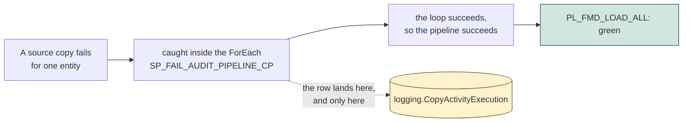

# Run FMD in production

The checklist before FMD carries a real load. What to configure, what to alert on, and the places where you have to watch because the framework cannot watch for itself.

Everything here is a step you take, a query you schedule, or a thing you check. Where a fix has been offered upstream it is named, because most of this page is designed to get shorter.

Read the [tutorial](../01-tutorial/01-getting-started.md) first if you have not deployed it, and the [runbook](./05-diagnose-a-failed-load.md) before your first bad night.

---

## 1. Get the deployment right

| | What to do | Why |
|---|---|---|
| **Pin a version** | Set `branch = "2026.07"` in `NB_SETUP_FMD.ipynb` instead of the default `"main"`. | The setup downloads `src/` and `config/` from `zipball/{branch}` **at the moment you run it**. With `"main"`, re-running the setup is an uncontrolled upgrade to whatever `HEAD` says today. The framework ships tagged releases, and the variable takes a tag. |
| **Deploy twice, unless you supply a service principal** | On `2026.07`: run the setup, create `CON_FMD_FABRIC_SQL` against the database it creates, run the setup again. On `main`: fill the three `fabric_sql_sp_*` settings and it is a single pass. | The connection has to name a database the first pass creates, so on `2026.07` it cannot exist beforehand, and without it the audit activities deploy `Inactive` and `logging` never receives a row. On `main`, [#248](https://github.com/edkreuk/FMD_FRAMEWORK/pull/248) creates it from a service principal ([#254](https://github.com/edkreuk/FMD_FRAMEWORK/pull/254) also corrects the guide's order). |
| **Verify the audit trail before you trust it** | `SELECT COUNT(*) FROM logging.PipelineExecution` after the first run. | Zero means the deployment is broken, not that the night was quiet. This check matters on every version, because a missing SQL connection fails the same silent way. |
| **Set the configuration cells** | On `2026.07`, cells 7, 9 and 14 ship with the framework author's tenant in them and must be replaced. On `main` they are placeholders. | On `2026.07` an unedited value fails against your tenant rather than falling back to a default. Placeholders since [#247](https://github.com/edkreuk/FMD_FRAMEWORK/pull/247). |

**Choose `domain_name` once.** Fabric does not allow a deleted SQL database's name to be reused in a workspace, so `SQL_<domain_name>_FRAMEWORK` is a one-shot name. If a deployment goes wrong, change `domain_name`; do not delete the database and retry. ([Learn](https://learn.microsoft.com/fabric/database/sql/limitations#database-level-limitations))

---

## 2. Alert on the database, not on the run status

**A failed layer now fails the run.** `PL_FMD_LOAD_ALL` carries `FA_THROW_ERROR_LDZ`, `_BRZ` and `_SLV`, each on its layer's failure branch, and every command and copy pipeline ends its catch in an `FA_THROW_ERROR`. If a layer breaks, Fabric goes red and you can trust it.

> **In every release up to and including `2026.07`, it did not.** `PL_FMD_LOAD_ALL` was a Try-Catch graph with no `Fail` activity, so the run was **green when the landing zone failed and green when Bronze failed**, and only a Silver failure surfaced. If you are pinned to that, the run status catches one layer in three and you must not build on it. ([#250](https://github.com/edkreuk/FMD_FRAMEWORK/pull/250), [#253](https://github.com/edkreuk/FMD_FRAMEWORK/pull/253), [#257](https://github.com/edkreuk/FMD_FRAMEWORK/pull/257), merged 2026-07-14.)

**But the run status still says nothing about any individual entity**, and that is by design, not a defect. A copy that fails for one entity is caught inside the `ForEach` so that one unreachable source cannot stop the other two hundred. The loop succeeds, the pipeline succeeds, the run is green, and the only record is a row in `logging.CopyActivityExecution`. **We watched it happen**: an entity whose connection carried an expired OAuth token failed, `FailedCopyActivity` was written, and `PL_FMD_LOAD_ALL` reported Succeeded.

So: **red means a layer broke. Green means nothing about your entities.** Alert on the database.



### The alert has to read all three tables

A failure lands in a different table depending on what failed, and **a query against `logging.PipelineExecution` alone will miss the most common failure there is**: a source copy that failed for one entity is caught inside the `ForEach` and written to `logging.CopyActivityExecution`. It never reaches the pipeline log.

```sql
DECLARE @since DATETIME2 = DATEADD(day, -1, GETDATE());

SELECT 'pipeline' AS src, PipelineName AS name, EntityLayer, EntityId,
       LogDateTime, CAST(LogData AS varchar(400)) AS LogData
FROM   logging.PipelineExecution
WHERE  LogDateTime >= @since AND LogType LIKE 'Fail%'

UNION ALL
SELECT 'copy', CopyActivityName, EntityLayer, EntityId,
       LogDateTime, CAST(LogData AS varchar(400))
FROM   logging.CopyActivityExecution
WHERE  LogDateTime >= @since AND LogType LIKE 'Fail%'

UNION ALL
SELECT 'notebook', NotebookName, EntityLayer, EntityId,
       LogDateTime, CAST(LogData AS varchar(400))
FROM   logging.NotebookExecution
WHERE  LogDateTime >= @since AND LogData LIKE '%"Action":%"Error"%'

ORDER BY LogDateTime;
```

Three things in that query are deliberate.

**`LIKE 'Fail%'`, and now it is a convenience rather than a necessity.** The framework writes two failure `LogType` values:

| `LogType` | Written by |
|---|---|
| `FailedPipeline` | every pipeline, into `PipelineExecution` (23 call sites) |
| `FailedCopyActivity` | every copy activity, into `CopyActivityExecution` (15 call sites) |

> **In releases up to and including `2026.07` there were four**, and equality was a trap: `PL_FMD_LOAD_BRONZE` wrote `FailPipeline` and `PL_FMD_LOAD_SILVER` wrote `FailPipelineActivity`, so an alert on `LogType = 'FailedPipeline'` was blind to a Bronze or a Silver failure. Those two spellings are gone from `main`. On a pinned `2026.07`, keep the `LIKE`.

`LIKE 'Fail%'` costs nothing and survives both, so leave it in the query.

**The notebook branch filters on `LogData`, not on `LogType`.** A notebook writes `EndNotebookActivity` whether it succeeded or failed; the outcome is inside the payload. `LIKE 'Fail%'` matches nothing here, which is where a missing primary key, a duplicate key and a Delta schema conflict all land.

**And even that is not complete**, because two failure modes write no row at all:

- **A failed landing zone writes no row from within itself.** `PL_FMD_LOAD_LANDINGZONE` has a start and an end activity and no failure activity ([#257](https://github.com/edkreuk/FMD_FRAMEWORK/pull/257)). Its failure is recorded only by the orchestrator's `SP_FAIL_LDZ_AUDIT_PIPELINE`, which labels it `"BRZ failed"` ([#255](https://github.com/edkreuk/FMD_FRAMEWORK/pull/255)). Read the timestamps, not the message.
- **A notebook that dies on a primary-key error writes no error row.** The primary-key check `raise`s in a cell that runs before the `try`/`except` that writes the error audit, so the exception propagates uncaught and the notebook stops after its `Start` row, leaving no `Error` row. The framework's own message is `PK: <column> doesn't exist in the source.` (An in-`try` Bronze or Silver write failure does write its `Error` row on `main`, restored by [#277](https://github.com/edkreuk/FMD_FRAMEWORK/pull/277); a deployment pinned between [#191](https://github.com/edkreuk/FMD_FRAMEWORK/pull/191) and #277 raised `NameError` there instead and wrote none. The unclosed-`Start` alert below catches both.)

So add a second alert on **unclosed starts**, in all three tables:

```sql
SELECT s.PipelineName, s.EntityLayer, s.LogDateTime AS started
FROM   logging.PipelineExecution s
LEFT   JOIN logging.PipelineExecution e
       ON  e.PipelineRunGuid = s.PipelineRunGuid
       AND e.LogType LIKE 'End%'
WHERE  s.LogType LIKE 'Start%'
  AND  s.LogDateTime >= DATEADD(day, -1, GETDATE())
  AND  e.PipelineRunGuid IS NULL;
```

Run the same shape against `NotebookExecution` and `CopyActivityExecution`. The `logging` tables are mirrored into OneLake as Delta automatically, so a Data Activator rule or a scheduled query needs no ingestion pipeline of its own.

---

## 3. Where you have to watch, because the framework cannot

Four places you have to watch. Two of them, 3.2 and 3.4, have **no fix offered upstream**, which is exactly why they are yours. 3.1 and 3.3 are both fixed on `main`, so their workarounds hold only for a deployment pinned to `2026.07` or earlier.

### 3.1 An incremental delta could be lost, and a re-run did not recover it (fixed on `main`)

On `main` the queue insert and the watermark advance are serialized: the watermark can only move after the file is queued.

```
SP_UPDATE_PROCESS        dependsOn  CP_source_datalandingzone : Succeeded   (retry: 2)
SP_UPDATE_LASTLOADVALIE  dependsOn  SP_UPDATE_PROCESS         : Succeeded   (retry: 2)
```

`SP_UPDATE_LASTLOADVALIE` now hangs off `SP_UPDATE_PROCESS`, not off the copy, so the watermark advances only once the file is on the Bronze work queue. If the queue insert fails, the watermark does not move, and the next incremental run re-fetches the same delta: duplicate work, no loss. The loss direction is removed ([#271](https://github.com/edkreuk/FMD_FRAMEWORK/pull/271), merged, fixes [#258](https://github.com/edkreuk/FMD_FRAMEWORK/issues/258)), for the canonical group and, since [#276](https://github.com/edkreuk/FMD_FRAMEWORK/pull/276), for the `ASQL_02` volume-split group too.

**The volume-split group is serialized too, since [#276](https://github.com/edkreuk/FMD_FRAMEWORK/pull/276).** `PL_FMD_LDZ_COPY_FROM_ASQL_01` carries a second, volume-split source group (`FE_ENTITY_ASQL_02`, the `ASQL_01`/`ASQL_02` split described in [supported sources](../03-reference/07-supported-sources.md#the-_01-suffix)), and #271 did not touch it: up to and including `d4c7245`, `SP_UPDATE_PROCESS_ASQL_02` and `SP_UPDATE_LASTLOADVALIE_ASQL_02` both hung off the copy in parallel, the pre-#271 shape, so an entity on the `ASQL_02` slot kept the lost-delta exposure. #276 applies the same ordering to the `_02` group (`SP_UPDATE_LASTLOADVALIE_ASQL_02` `dependsOn` `SP_UPDATE_PROCESS_ASQL_02`), so on current `main` no copy group is left exposed.

> **Up to and including `2026.07`, and at any deployment pinned to `6ec410d` or earlier, the two hung off the same copy, in parallel:**
>
> ```
> SP_UPDATE_PROCESS        dependsOn  CP_source_datalandingzone : Succeeded   (retry: 2)
> SP_UPDATE_LASTLOADVALIE  dependsOn  CP_source_datalandingzone : Succeeded   (retry: 2)
> ```
>
> Both carried `retry: 2` at 30-second intervals, so a brief throttle on the configuration database was already absorbed. What the retries did not remove was the **split**: the two activities retried independently, with no shared transaction and no ordering between them, so under sustained pressure (for example a run of HTTP 430 throttling) one could exhaust its retries while the other succeeded. If the **watermark advanced and the queue insert did not**, the landed file was never queued, Bronze never read it, the watermark had moved past those rows, and a re-run did not recover them. The reverse order was harmless. On a pinned deployment, the check below still applies.

An `SP_UPDATE_PROCESS` failure fails the iteration, so the section-2 query will see a `FailedPipeline` row for the copy pipeline. But **the entity is not named on it**, so pair it with the unclosed copy-activity check:

```sql
SELECT s.EntityId, s.CopyActivityName, s.LogDateTime AS started
FROM   logging.CopyActivityExecution s
LEFT   JOIN logging.CopyActivityExecution e
       ON  e.PipelineRunGuid = s.PipelineRunGuid
       AND e.EntityId        = s.EntityId
       AND e.LogType         = 'EndCopyActivity'
WHERE  s.LogType LIKE 'StartCopyA%'          -- NOT equality: see below
  AND  s.LogDateTime >= DATEADD(day, -1, GETDATE())
  AND  e.EntityId IS NULL;
```

> **`LIKE 'StartCopyA%'` is now belt and braces.** In releases up to and including `2026.07`, `PL_FMD_LDZ_COPY_FROM_ADLS_01` and `PL_FMD_LDZ_COPY_FROM_ADF` wrote `StartCopyAcitvity`, with the `t` and `v` transposed, and an equality filter was blind to every ADLS and every ADF copy. The typo is gone from `main`: all eleven call sites now write `StartCopyActivity` ([#259](https://github.com/edkreuk/FMD_FRAMEWORK/pull/259), merged 2026-07-14). Keep the `LIKE` anyway, because it costs nothing and it still saves a pinned deployment.

Any row this returns for an `IsIncremental = 1` entity needs its watermark checked by hand against what is actually in Bronze before anything is re-run. On `main` the loss direction is closed for every copy group ([#258](https://github.com/edkreuk/FMD_FRAMEWORK/issues/258), fixed by [#271](https://github.com/edkreuk/FMD_FRAMEWORK/pull/271) and, for the `ASQL_02` group, [#276](https://github.com/edkreuk/FMD_FRAMEWORK/pull/276)), so run this check only for a deployment pinned to `2026.07` or earlier.

### 3.2 A missing file is marked as done

If the file Bronze expects is not there, `NB_FMD_LOAD_LANDING_BRONZE` marks the landing-zone queue row **processed** and exits cleanly (lines 310 to 312). It writes no Delta table, never enqueues Bronze for Silver, and logs no error. The entity is dropped silently and never retried.

The signature: the landing-zone queue fully processed, no Bronze queue row for the entity, Silver stale, and nothing in `logging` that looks wrong. Check for it whenever Silver is stale and every query says the run was fine.

### 3.3 A composite primary key could be re-keyed by a source column reorder (fixed on `main`)

`HashedPKColumn` now builds from the `PrimaryKeys` order, not the dataframe's: the notebook computes `read_key_columns = list(dict.fromkeys(key_columns))` and hashes that ([#252](https://github.com/edkreuk/FMD_FRAMEWORK/pull/252), merged 2026-07-14). A composite key is stable against a source column reorder.

> **Up to and including `2026.07`, it was not.** `HashedPKColumn` walked the *dataframe's* column order (`concat_ws` is order-sensitive), so a source that handed its columns over differently hashed a composite key differently, Silver matched nothing, and **every SCD-2 record was closed and re-inserted**. On a pinned `2026.07`, pin the source column order with an explicit `SELECT` list in a view rather than relying on `SELECT *`. Single-key entities were never affected.

### 3.4 A cleansing rule on a key column does nothing

Cleansing runs **after** the primary-key hash (hash at line 421, cleansing at 494). A `normalize_text` rule that upper-cases an identifier will not merge `abc` and `ABC`: they hash differently and remain two dimension members, with no error. Normalise keys in the source, not in FMD.

---

## 4. Traps that look like features

| Looks like | What to do |
|---|---|
| `SourceCustomSelect` restricts what is extracted | **Pass `''`.** It is stored and never read; the column list is always `SELECT *`. To restrict the extract, point the entity at a view on the source system. |
| `IsActive` on `Connection`, `DataSource`, `Lakehouse` and `Pipeline` disables them | **Do not rely on it.** Only `IsActive` on the three *entity* tables is read by the views. Deactivate at the entity. |
| Re-running `PL_FMD_LOAD_ALL` retries only what failed | **Run the narrowest layer pipeline instead.** Only Bronze and Silver are queue-gated; the landing zone re-extracts every active entity from every source, at full volume. |
| A run is traceable by GUID | **Reconstruct it from timestamps.** `PipelineParentRunGuid` is `NULL` on every pipeline row, and every pipeline carries its own `TriggerGuid`. ([#251](https://github.com/edkreuk/FMD_FRAMEWORK/pull/251)) |

---

## 5. Operating rules

**Schedule it deliberately.** The interval has a floor, the schedule needs an identity that outlives a person, and Fabric makes you pick an end date. All three are in [Schedule the load](./03-schedule-the-load.md).

**Know what a restore actually costs you.** Fabric SQL database takes backups automatically, every few minutes, with seven days of point-in-time restore, and you cannot turn that off. What you cannot do is overwrite: **a restore creates a new database.** Since the deleted database's name can never be reused, recovering the configuration database means re-pointing `fmd_fabric_db_name`, `fmd_fabric_db_connection` and `fmd_config_database_guid` in `VAR_CONFIG_FMD`, and recreating `CON_FMD_FABRIC_SQL` against the new database. Rehearse that once before you need it. ([Learn](https://learn.microsoft.com/fabric/database/sql/backup))

**The watermarks are the irreplaceable part.** `execution.LandingzoneEntityLastLoadValue` cannot be re-derived from anywhere. A stale one permanently skips rows; a missing one re-extracts everything at full volume.

**Prune the `logging` tables.** Nothing upstream does. They are append-only heaps with no retention job, and every activity of every run writes to them.

**Regression-test an upgrade yourself.** There is no test suite upstream and no CI, so pin a release, upgrade in development, and compare Silver before and after.

---

## 6. Most of this page has already been fixed. None of it has been released.

**On 2026-07-14 the maintainer merged the fixes for almost every finding on this page.** That is the good news and it is worth stating first. The rest of this section is about the gap it leaves.

| Finding on this page | Fix | State |
|---|---|---|
| The run status is green when the landing zone or Bronze fails | [#250](https://github.com/edkreuk/FMD_FRAMEWORK/pull/250), [#253](https://github.com/edkreuk/FMD_FRAMEWORK/pull/253) | **merged** |
| The landing zone has no failure audit activity at all | [#257](https://github.com/edkreuk/FMD_FRAMEWORK/pull/257) | **merged** |
| The audit trail names the wrong layer (`BRZ failed`) | [#255](https://github.com/edkreuk/FMD_FRAMEWORK/pull/255) | **merged** |
| `HashedPKColumn` moves with the source column order | [#252](https://github.com/edkreuk/FMD_FRAMEWORK/pull/252) | **merged** |
| `StartCopyAcitvity` hides ADLS and ADF from an equality filter | [#259](https://github.com/edkreuk/FMD_FRAMEWORK/pull/259) | **merged** |
| The setup ships the author's tenant identifiers | [#247](https://github.com/edkreuk/FMD_FRAMEWORK/pull/247) | **merged** |
| The deployment needs two passes | [#248](https://github.com/edkreuk/FMD_FRAMEWORK/pull/248), [#254](https://github.com/edkreuk/FMD_FRAMEWORK/pull/254) | **merged** |
| `@Namespace` truncates at ten characters | [#260](https://github.com/edkreuk/FMD_FRAMEWORK/pull/260) | open |
| **3.1, the lost incremental delta** | [#271](https://github.com/edkreuk/FMD_FRAMEWORK/pull/271), [#276](https://github.com/edkreuk/FMD_FRAMEWORK/pull/276) | **merged** |

**The merges are in `main`. They are not in a release.** The newest tag is `2026.07`, published on 2026-07-08, and it predates all of them. So if you pin a version, which is what [upgrading](./08-upgrade-the-framework.md) tells you to do and what you should do, **everything on this page still describes your deployment**. The workarounds stand until the next release carries the fixes, and then you re-read this page and delete most of it.

Sections 3.2 and 3.4 are the ones with no fix offered upstream. They stay yours to watch.

---

Source: executed against Microsoft Fabric on 2026-07-13, framework at `1ba7974`, on an FTL64 Trial capacity.
Source: `src/PL_FMD_LOAD_ALL.DataPipeline/pipeline-content.json` @ `1ba7974` (the three dependency shapes)
Source: `src/PL_FMD_LDZ_COPY_FROM_ASQL_01.DataPipeline/pipeline-content.json` @ `b5fb08e` (`SP_UPDATE_LASTLOADVALIE` dependsOn `SP_UPDATE_PROCESS` on `main`, `retry: 2`; parallel-sibling shape verified at `6ec410d`)
Source: `src/NB_FMD_LOAD_LANDING_BRONZE.Notebook/notebook-content.py` @ `1ba7974` (lines 310-312, 417, 421, 494)
Source: `src/Config_Database/execution/Views/vw_LoadSourceToLandingzone.sql` @ `1ba7974` (`IsActive = 1`, no queue gate)
Source: `setup/NB_SETUP_FMD.ipynb` @ `1ba7974` (`branch` variable, `zipball/{branch}`)
Source: [Errors and conditional execution](https://learn.microsoft.com/azure/data-factory/tutorial-pipeline-failure-error-handling#error-handling)
Source: [Limitations in SQL database in Microsoft Fabric](https://learn.microsoft.com/fabric/database/sql/limitations#database-level-limitations)
Source: [Automatic backups in SQL database in Microsoft Fabric](https://learn.microsoft.com/fabric/database/sql/backup)
