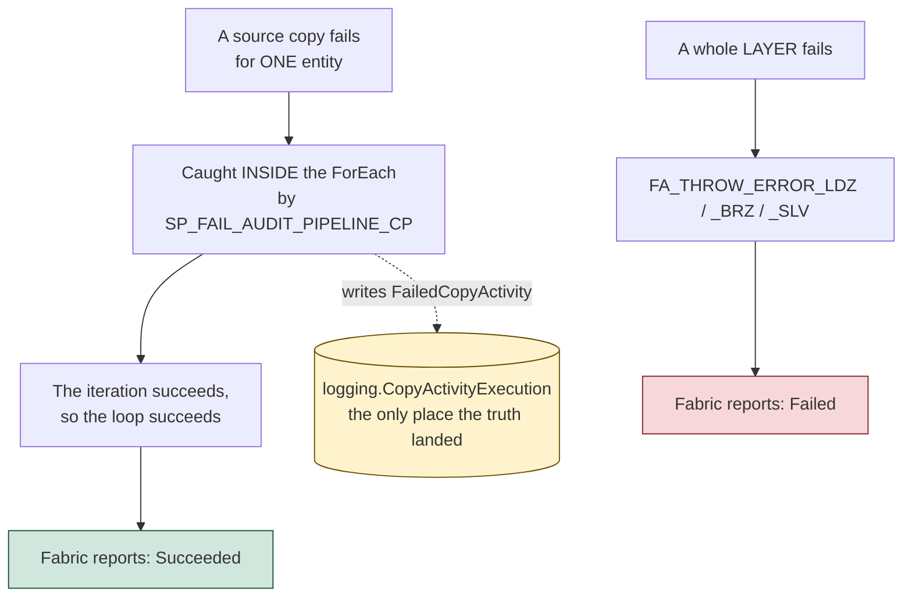

# Diagnose a failed load

Silver is empty, or stale, and nobody was paged. This page gets you from that to a named entity and a reason.

**You need SQL access to `SQL_FMD_FRAMEWORK`.** Not the Fabric monitoring pane, not the workspace: the configuration database. Everything below is a query against it. If you do not have that, stop and get it, because there is no other instrument.

Everything here is true of the framework at `6ec410d`, which is `main` at the time of writing. The live observations were made on 2026-07-13 and 2026-07-14, against a deployment of `1ba7974`.

## First: what the run status does and does not catch

**A failed layer now fails the run.** `PL_FMD_LOAD_ALL` carries three `Fail` activities, `FA_THROW_ERROR_LDZ`, `_BRZ` and `_SLV`, each hanging off its layer's failure branch, so a landing zone, Bronze or Silver that dies takes the run down with it. The same shape reaches all the way down: every command and copy pipeline ends its catch branch in an `FA_THROW_ERROR`. If a layer is broken, Fabric will tell you, and you can trust the red.

> **This is new.** In every release up to and including `2026.07`, `PL_FMD_LOAD_ALL` was a Try-Catch graph with no `Fail` activity, so a landing-zone or Bronze failure produced a **green run**, and `PL_FMD_LOAD_LANDINGZONE` had no `SP_FAIL_*` audit activity at all, so it wrote no failure row of its own. If you are pinned to `2026.07` or earlier, that is your deployment, the run status is not an instrument, and every query on this page is the only thing you have. ([#250](https://github.com/edkreuk/FMD_FRAMEWORK/pull/250), [#253](https://github.com/edkreuk/FMD_FRAMEWORK/pull/253) and [#257](https://github.com/edkreuk/FMD_FRAMEWORK/pull/257), merged 2026-07-14.)

**One failure still does not reach the run status, and it is the most common one.** A copy that fails **for a single entity** is caught inside the `ForEach` by `SP_FAIL_AUDIT_PIPELINE_CP`, which logs the error and then succeeds. The iteration succeeds, so the loop succeeds, so the copy pipeline succeeds, so the run is green. The `FA_THROW_ERROR` activities hang off the pipelines' *outer* catch branches and never see it.

That is deliberate, and it is the right call: one unreachable source must not stop the other two hundred entities. But it means **a green run does not mean every entity loaded**, and `logging.CopyActivityExecution` is the only place that knows.



**We measured the green half.** An Azure SQL entity whose Fabric connection carried an expired OAuth refresh token failed in `LK_GET_LASTLOADDATE` with `DMTS_OAuthTokenRefreshFailedError`. `logging.CopyActivityExecution` recorded a `FailedCopyActivity` row for that entity, with the full driver message. `PL_FMD_LOAD_ALL` reported **Succeeded**, and the Fabric run history showed a green run. The row in the database was the only place the failure existed.

So the rule to carry into everything below: **red means a layer broke; green means nothing about any individual entity.**

## Step 1: Did this run load anything at all?

One query. Not durations, not statuses: **row counts**. A layer that wrote nothing wrote no audit rows either.

```sql
DECLARE @since DATETIME2 = DATEADD(hour, -12, GETDATE());

SELECT 'PipelineExecution'     AS tbl, COUNT(*) AS n FROM logging.PipelineExecution     WHERE LogDateTime >= @since
UNION ALL
SELECT 'CopyActivityExecution',       COUNT(*)      FROM logging.CopyActivityExecution WHERE LogDateTime >= @since
UNION ALL
SELECT 'NotebookExecution',           COUNT(*)      FROM logging.NotebookExecution     WHERE LogDateTime >= @since;
```

Read it like this:

| What you see | What it means |
|---|---|
| **All three zero** | Nothing was written. **Ask first whether the run even started**: a paused capacity, a schedule that did not fire, or an active value set on `VAR_CONFIG_FMD` pointing at a different environment's database all produce this. Check the Fabric run history for `PL_FMD_LOAD_ALL`, which is the one thing it is reliable for: whether a run exists at all. If a run exists and `logging` is empty, then it is a **deployment fault**: `CON_FMD_FABRIC_SQL` is missing and every audit activity deployed `Inactive`. Go to [the tutorial's step 4](../01-tutorial/01-getting-started.md#step-4-create-con_fmd_fabric_sql). |
| **`CopyActivityExecution` = 0** | Nothing was copied. The landing zone did not run, or it failed before the first copy, **or the run was started with a `Data_WorkspaceGuid` that matches no row in `integration.Workspace`**. That last one returns an empty work list, copies nothing, and reports Succeeded. It is the most common first-schedule mistake: see [Schedule the load](./03-schedule-the-load.md#1-create-the-schedule-and-set-the-one-parameter). |
| **`NotebookExecution` = 0** | Bronze and Silver did no work. Usually because their queues were empty, which usually means the landing zone copied nothing. |
| **All three non-zero** | Something ran. Go to step 2. |

## Step 2: Read the run, in time order

**Half the chain is now a key, and half is still a timestamp.**

A **notebook** row can be joined to the layer pipeline that ran it on `PipelineRunGuid`: both layer pipelines pass `@pipeline().RunId` to the notebook as the `PipelineRunGuid` parameter, so a notebook row's `PipelineRunGuid` equals its own layer pipeline's `RunId` ([#251](https://github.com/edkreuk/FMD_FRAMEWORK/pull/251), merged 2026-07-14). This is correct for both Bronze and Silver notebook rows (measured 2026-07-15 on a `6ec410d` deployment).

```sql
SELECT n.* FROM logging.NotebookExecution n
JOIN   logging.PipelineExecution  p ON p.PipelineRunGuid = n.PipelineRunGuid
WHERE  p.PipelineName = 'PL_FMD_LOAD_BRONZE';   -- or 'PL_FMD_LOAD_SILVER'
```

Do **not** join on `PipelineParentRunGuid`: it just repeats the layer pipeline's own `RunId` and adds nothing over `PipelineRunGuid`. Since [#270](https://github.com/edkreuk/FMD_FRAMEWORK/pull/270) (merged) both `PL_FMD_LOAD_BRONZE` and `PL_FMD_LOAD_SILVER` pass `PipelineParentRunGuid` via the same `@if(empty(string(pipeline()?.TriggeredByPipelineRunId)), pipeline().RunId, ...)` expression, so a notebook row on either layer carries a real GUID equal to its own `PipelineRunGuid` (it does not capture the invoking `PL_FMD_LOAD_ALL`, because `TriggeredByPipelineRunId` is `NULL` under `InvokePipeline`). `PipelineRunGuid` is the join that works for both layers.

**Pipeline to pipeline still does not chain.** `PipelineParentRunGuid` on a *pipeline* row is `@pipeline()?.TriggeredByPipelineRunId`, and Microsoft documents that property for **ExecutePipeline**. FMD invokes with **InvokePipeline**, where it is `NULL`. So `PL_FMD_LOAD_BRONZE` cannot be tied to the `PL_FMD_LOAD_ALL` that started it by any column, and the layers are still reconstructed from **timestamps**. The [logging reference](../03-reference/02-logging-and-auditing.md#how-a-run-holds-together-and-where-the-chain-is-broken) explains why.

> In every release up to and including `2026.07`, the notebook rows had no key either: `PipelineParentRunGuid` was `NULL` on all three tables and a notebook joined to its layer pipeline only on `TriggerGuid`.

```sql
SELECT CONVERT(varchar(8), LogDateTime, 108) AS t,
       PipelineName, EntityLayer, LogType,
       TriggerGuid,                            -- keep this: step 3 needs it
       PipelineRunGuid,                        -- and this
       CAST(LogData AS varchar(80))          AS LogData
FROM   logging.PipelineExecution
WHERE  LogDateTime >= DATEADD(hour, -12, GETDATE())
ORDER  BY LogDateTime;
```

**Keep the `TriggerGuid` of the layer pipeline you are interested in.** Step 3 needs it, and there is no way to derive it later.

A **healthy** run looks like this. Note the two `PL_FMD_LDZ_*` lines: they are the proof that a copy actually happened.

```
11:47:54  PL_FMD_LOAD_ALL                          StartPipeline
11:48:21  PL_FMD_LOAD_LANDINGZONE                  StartPipeline
11:49:06  PL_FMD_LDZ_COMMAND_ONELAKE               StartPipeline
11:49:42  PL_FMD_LDZ_COPY_FROM_ONELAKE_TABLES_01   StartPipeline
11:50:56  PL_FMD_LDZ_COPY_FROM_ONELAKE_TABLES_01   EndPipeline
11:52:23  PL_FMD_LDZ_COMMAND_ONELAKE               EndPipeline
11:54:24  PL_FMD_LOAD_LANDINGZONE                  EndPipeline      <- it closed
11:57:43  PL_FMD_LOAD_BRONZE                       StartPipeline
11:59:11  PL_FMD_LOAD_BRONZE                       EndPipeline
12:00:48  PL_FMD_LOAD_SILVER                       StartPipeline
12:03:08  PL_FMD_LOAD_SILVER                       EndPipeline
12:06:05  PL_FMD_LOAD_ALL                          EndPipeline
```

A **failed** run, from the same deployment, forty minutes earlier:

```
11:05:25  PL_FMD_LOAD_ALL      StartPipeline
11:38:30  PL_FMD_LOAD_ALL      FailedPipeline   { "Action": "Error", "Message": "BRZ failed" }
11:38:46  PL_FMD_LOAD_BRONZE   StartPipeline
11:39:06  PL_FMD_LOAD_BRONZE   EndPipeline
11:40:11  PL_FMD_LOAD_SILVER   StartPipeline
11:40:43  PL_FMD_LOAD_SILVER   EndPipeline
11:41:23  PL_FMD_LOAD_ALL      EndPipeline      { "Action": "End" }
```

Fabric reported that run as **`Completed`**. Three things in it are worth learning to see:

**The `PL_FMD_LDZ_*` lines are gone.** No command pipeline, no copy pipeline. Nothing was copied.

**`PL_FMD_LOAD_LANDINGZONE` is not there at all.** No start, no end, no failure. The layer that failed is the layer missing from its own audit trail. The `FailedPipeline` row above it, attributed to `PL_FMD_LOAD_ALL`, is the only trace of it.

**The `Message` now names the layer that failed.** `SP_FAIL_LDZ_AUDIT_PIPELINE` writes `"LDZ failed"`, `SP_FAIL_BRZ_AUDIT_PIPELINE` writes `"BRZ failed"`, `SP_FAIL_SLV_AUDIT_PIPELINE` writes `"SLV failed"`. Read it and believe it ([#255](https://github.com/edkreuk/FMD_FRAMEWORK/pull/255), merged 2026-07-14).

> **In releases up to and including `2026.07`, it lied.** `SP_FAIL_LDZ_AUDIT_PIPELINE` wrote `"BRZ failed"` when the *landing zone* failed, and the two procedures produced otherwise identical rows: same `LogType`, same `EntityLayer` (`Control`), same `PipelineName`. No column distinguished them. In the transcript above, Bronze started sixteen seconds *after* that line was written, which is how you could tell. On a pinned `2026.07`, use the timestamps and ignore the label.

## Step 3: Which entity, and why

The copy log is where a per-entity failure lands, and it is the only place it lands.

```sql
SELECT CONVERT(varchar(19), LogDateTime, 120) AS t,
       CopyActivityName, EntityId, EntityLayer, LogType,
       LogData                                -- do NOT truncate: the driver's error is deep inside it
FROM   logging.CopyActivityExecution
WHERE  LogDateTime >= DATEADD(hour, -12, GETDATE())
  AND  LogType LIKE 'Fail%'
ORDER  BY LogDateTime;
```

`EntityId` is the `LandingzoneEntityId`. Name it:

```sql
SELECT lz.LandingzoneEntityId, ds.Name AS DataSource, ds.Type AS DataSourceType,
       lz.SourceSchema, lz.SourceName, lz.IsIncremental, lz.IsActive
FROM   integration.LandingzoneEntity lz
JOIN   integration.DataSource        ds ON ds.DataSourceId = lz.DataSourceId
WHERE  lz.LandingzoneEntityId = @EntityId;
```

### The cause that reaches you months later: the connection's token expired

The most likely reason a copy that worked yesterday fails today, on a source nobody touched, is the **Fabric connection**, not the framework. A connection created with an organisational account holds an OAuth refresh token, and Entra expires it after 90 days of inactivity. We hit exactly this: a connection last used in February failed in July with

```
DMTS_OAuthTokenRefreshFailedError
AADSTS700082: The refresh token has expired due to inactivity.
The token was issued on 2026-02-22 and was inactive for 90.00:00:00
```

Nothing in FMD can prevent it and nothing in FMD reports it above the loop: the run goes green and the entity stops loading. `logging.CopyActivityExecution` is where it is written, which is another reason the alert reads all three tables.

The fix is to re-authenticate the connection in *Manage connections and gateways*. The fix that does not come back is to **not use an interactive account for a scheduled load**: a service principal or the workspace identity holds no refresh token to expire. That is the same argument as the one about [who the schedule runs as](./03-schedule-the-load.md#3-who-the-schedule-runs-as-and-the-alert-that-fires-on-nothing), and it has the same answer.

For a Bronze or Silver failure, the notebook is the place to look. A notebook joins to **the layer pipeline that ran it** on `PipelineRunGuid` since [#251](https://github.com/edkreuk/FMD_FRAMEWORK/pull/251), and on `TriggerGuid` too. Up to and including `2026.07` its `PipelineRunGuid` was a synthetic `uuid4()`, so `TriggerGuid` was then the only usable join; the query below uses it and is correct on both releases:

```sql
SELECT n.NotebookName, n.EntityLayer, n.LogType,
       CAST(n.LogData AS varchar(400)) AS LogData
FROM   logging.NotebookExecution n
WHERE  n.TriggerGuid = @TriggerGuidOfTheLayerPipeline
  AND  n.EntityLayer = 'Bronze';        -- or 'Silver'
```

> Take the `TriggerGuid` from the `PL_FMD_LOAD_BRONZE` row, not from `PL_FMD_LOAD_ALL`. Each pipeline has its own, and the orchestrator's does not match the notebook's.

A notebook logs only `Start` and `End`. **Failure is encoded in the `LogData` payload of the end row**, not in `LogType`. And if the notebook died before it could write anything, there is a `Start` row with no `End` row, which is the same absence pattern as the landing zone.

## Step 4: Read the queues, and know who writes them

There are **two** queue tables, not three. Silver drains the same `execution.PipelineBronzeLayerEntity` that Bronze fills (`vw_LoadToSilverLayer` selects on `PBLE.IsProcessed = 0`). There is no `PipelineSilverLayerEntity`.

**Who sets `IsProcessed` matters more than the flag itself**, because the flag names the layer that *consumed* the row, not the layer that produced it.

```sql
SELECT 'Landingzone (consumed by Bronze)' AS queue,
       COUNT(*) AS total,
       SUM(CASE WHEN IsProcessed = 1 THEN 1 ELSE 0 END) AS consumed
FROM   execution.PipelineLandingzoneEntity
WHERE  1 = 1   -- add a date predicate on a busy system; this is a lifetime count
UNION ALL
SELECT 'Bronze (consumed by Silver)', COUNT(*),
       SUM(CASE WHEN IsProcessed = 1 THEN 1 ELSE 0 END)
FROM   execution.PipelineBronzeLayerEntity;
```

| Reading | Meaning |
|---|---|
| Landing zone rows exist, `consumed = 0` | Bronze did not run, or did not reach them. |
| Bronze rows exist, `consumed = 0` | **Bronze did its work and Silver did not.** Bronze *inserts* these rows with `IsProcessed = False`; `NB_FMD_LOAD_BRONZE_SILVER` is what sets them to `1`. |
| Landing zone fully consumed, **no Bronze row for the entity** | See [the trap](#the-trap-a-missing-file-is-marked-as-done). This is the silent one. |

The watermark lives in its own table, not on the entity:

```sql
SELECT LandingzoneEntityId, LoadValue, LastLoadDatetime
FROM   execution.LandingzoneEntityLastLoadValue;
```

`LK_GET_LASTLOADDATE` reads the source's `MAX(...)` **before** the copy, so `LoadValue` is the pre-copy maximum. That is the safe direction: it can only ever be behind the data, never ahead of it. With one exception, which is the next section.

### The one that could lose data, serialized on `main`

On `main`, the queue insert and the watermark advance are serialized inside the canonical `FE_ENTITY` group of every copy pipeline:

```
SP_UPDATE_PROCESS        dependsOn  CP_source_datalandingzone : Succeeded
SP_UPDATE_LASTLOADVALIE  dependsOn  SP_UPDATE_PROCESS         : Succeeded
```

`SP_UPDATE_LASTLOADVALIE` now hangs off `SP_UPDATE_PROCESS`, so the watermark advances only after the file is on the Bronze work queue. If the queue insert fails, the watermark does not move and the next incremental run re-fetches the same delta: duplicate work, no loss ([#271](https://github.com/edkreuk/FMD_FRAMEWORK/pull/271), merged, fixes [#258](https://github.com/edkreuk/FMD_FRAMEWORK/issues/258)).

`PL_FMD_LDZ_COPY_FROM_ASQL_01` has a second, volume-split group (`FE_ENTITY_ASQL_02`) that #271 did not serialize: up to and including `d4c7245` its `SP_UPDATE_PROCESS_ASQL_02` and `SP_UPDATE_LASTLOADVALIE_ASQL_02` hung off the copy in parallel, so an entity on the `ASQL_02` slot kept the same exposure. [#276](https://github.com/edkreuk/FMD_FRAMEWORK/pull/276) applies the same ordering to that group, so on current `main` no branch is left parallel.

> **Read this before you re-run an incremental entity on a deployment pinned to `2026.07` or earlier.** There the two hung off the copy as **independent siblings, not a transaction:**
>
> ```
> SP_UPDATE_PROCESS        dependsOn  CP_source_datalandingzone : Succeeded
> SP_UPDATE_LASTLOADVALIE  dependsOn  CP_source_datalandingzone : Succeeded
> ```
>
> One queued the landed file for Bronze; the other advanced the watermark. If the copy succeeded and then the configuration database throttled for a moment (`HTTP 430` is a real condition on a busy capacity), one of the two could succeed while the other failed. If the watermark advanced and the queue insert did not, the landed file was never queued, Bronze never read it, the watermark had already moved past those rows, and a re-run did not recover them: absent from Bronze and Silver, permanently.

And on a pinned deployment the copy **succeeded**, so step 3's `LogType LIKE 'Fail%'` finds nothing. The only signature is a `StartCopyActivity` row with no matching `EndCopyActivity`:

```sql
SELECT s.EntityId, s.CopyActivityName, s.LogDateTime AS started
FROM   logging.CopyActivityExecution s
LEFT   JOIN logging.CopyActivityExecution e
       ON  e.PipelineRunGuid = s.PipelineRunGuid
       AND e.EntityId        = s.EntityId
       AND e.LogType         = 'EndCopyActivity'
WHERE  s.LogType LIKE 'StartCopyA%'          -- NOT equality: ADLS and ADF write 'StartCopyAcitvity'
  AND  s.LogDateTime >= DATEADD(hour, -12, GETDATE())
  AND  e.EntityId IS NULL;
```

Any row this returns for an `IsIncremental = 1` entity needs the watermark checked by hand against what is actually in Bronze, before anything is re-run.

*(On `main` this loss direction is closed for every copy group by [#271](https://github.com/edkreuk/FMD_FRAMEWORK/pull/271) and [#276](https://github.com/edkreuk/FMD_FRAMEWORK/pull/276); run this check only for a deployment pinned to `2026.07` or earlier.)*

## Step 5: Re-run, and what to check first

**A re-run is safe.** The framework ships no retry procedure and no reset procedure, so this is reasoned from the code rather than prescribed. The reasoning is here in full, because you are the one carrying the risk:

- **The Delta write happens before the queue is marked.** In `NB_FMD_LOAD_LANDING_BRONZE`, `.save()` is line 541 and `.merge()` is lines 585 and 593; `sp_UpsertPipelineLandingzoneEntity` runs at 561 and 653. A crash in between leaves the data in Bronze and the queue row unprocessed, so the entity is retried.
- **The Bronze write is idempotent.** It is a `merge` on `HashedPKColumn`. (The `overwrite` on line 541 is not the full-load path, as one might assume: it fires only when the target Delta table does **not yet exist**, on the first load of an entity. `IsIncremental` chooses between two *merge* variants, and the full-load variant adds `whenNotMatchedBySourceDelete()`, which is how a row that vanished from the source gets removed.) Applying the same landed file twice changes nothing.
- **Silver's SCD-2 merge compares `HashedNonKeyColumns`,** and re-applying unchanged Bronze rows detects no change and opens no new version.

One subtlety holds that last point up, and it is worth knowing because it is fragile. Silver hashes **every** Bronze column except the two hash columns, including `RecordLoadDate`. If `RecordLoadDate` moved on every Bronze write, Silver would see a change every time and historise a new version of every row on every run. It does not move, because Bronze adds `RecordLoadDate` (line 515) *after* it computes the hash (line 512), and `whenMatchedUpdateAll` only fires when the hash differs. Silver's stability rests on Bronze's timestamp standing still.

So the failure mode of a re-run is wasted compute, not duplicated history.

### Do not re-run `PL_FMD_LOAD_ALL`

This is the single most expensive mistake available on this page, so it gets its own heading.

**The landing zone has no queue gate.** `vw_LoadSourceToLandingzone`, the view every copy pipeline reads, filters on one thing:

```sql
WHERE 1 = 1
    AND LZE.[IsActive] = 1
```

There is no `IsProcessed` in it. `IsProcessed` gates `vw_LoadToBronzeLayer` and `vw_LoadToSilverLayer`, and only those. So re-running `PL_FMD_LOAD_ALL` **re-extracts every active entity from every source**, at full volume for every entity with `IsIncremental = 0`, including the source that just failed on you.

Run the narrowest pipeline that can fix what is broken:

| What failed | What to run |
|---|---|
| One source's copy, and the source is fixed | `PL_FMD_LOAD_LANDINGZONE` – still re-extracts everything, but skips Bronze and Silver. If only one source is broken, consider setting `IsActive = 0` on the others first, and remember to set them back. |
| Bronze, and the landed file is fine | `PL_FMD_LOAD_BRONZE`. Gated on `IsProcessed = 0`: only the unconsumed entities move. Cheap. |
| Silver only | `PL_FMD_LOAD_SILVER`. Same gate, same table. Cheap. |
| Nothing loaded and you do not yet know why | Nothing. Go back to step 1. |

**Bronze and Silver are the layers a re-run is cheap for.** The landing zone is not, and the framework offers no way to re-run a single entity's copy short of deactivating the others.

Before you re-run anything, check three things:

1. **Is the entity still active?** `SELECT IsActive FROM integration.LandingzoneEntity WHERE LandingzoneEntityId = @EntityId`. A `0` means the load skipped it deliberately.
2. **Did the source actually get fixed?** The landing zone will land another empty or malformed file and mark it processed.
3. **Is this an incremental entity with a moved watermark?** See [the one that can lose data](#the-one-that-can-lose-data). Re-running does not recover that case, and running it again can hide it.

### The trap: a missing file is marked as done

This is the quietest failure in the framework, and it is the one you are most likely to be looking at.

```python
if not notebookutils.fs.exists(source_changes_data_path):
    print("❌ Source file not found. Exiting Notebook")
    execute_with_outputs(UpsertPipelineLandingzoneEntity, driver, connstring, database)
```
*`NB_FMD_LOAD_LANDING_BRONZE`, lines 310 to 312*

When the file Bronze expects is not there, the notebook marks the landing-zone queue row **processed** and exits. It writes no Delta table, and it never calls `sp_UpsertPipelineBronzeLayerEntity`, so **Bronze is never enqueued for Silver**. No error row is written anywhere.

The signature is unmistakable once you know it:

| | |
|---|---|
| `execution.PipelineLandingzoneEntity` | fully processed, `IsProcessed = 1` |
| `execution.PipelineBronzeLayerEntity` | **empty, or missing the entity** |
| `logging` | no failure row, and a `NotebookExecution` start/end pair that looks clean |
| Silver | stale |

Everything says the load worked. Nothing loaded. The cause is upstream of Bronze: the copy did not land the file, or landed it under a path Bronze did not look in. Go back to step 3 and read `CopyActivityExecution` for that entity.

## When to stop and escalate

- **`logging` is empty and the deployment reported success.** That is not an incident, it is a broken deployment. See [step 4 of the tutorial](../01-tutorial/01-getting-started.md#step-4-create-con_fmd_fabric_sql).
- **A `Start` row with no `End` row and no `Fail` row anywhere. Check the primary key first, not the capacity.** The obvious reading is that the compute died: a killed Spark session, a capacity throttle (`HTTP 430`), a dropped connection. It is more often something else. The primary-key and duplicate-key checks `raise ValueError` in a cell that runs before the `try`/`except` that writes the error audit, so that failure propagates uncaught: **the notebook stops after its `Start` row and writes no `Error` row.** The framework's own primary-key check raises `ValueError` with the text `PK: <column> doesn't exist in the source.` So the framework's most common *deliberate* failure, a declared primary key that is not in the landed file, is also one that leaves no error row. It is a one-row metadata fix, not an incident. The [logging reference](../03-reference/02-logging-and-auditing.md) has the full mechanism. Open the Fabric monitoring pane to see whether the notebook **failed** or **vanished**: failed points at the primary key, vanished points at the capacity.
- **Silver has rows but the SQL endpoint shows none.** The SQL analytics endpoint syncs asynchronously. We watched a Delta table exist in OneLake while `INFORMATION_SCHEMA.TABLES` still showed nothing. Check OneLake before you believe SQL.
- **You cannot tell "still running" from "died".** An absence looks the same either way. The notebook batch timeout is 7200 seconds, and our own six-row demo run took 19 minutes end to end, most of it Spark session startup. Before you treat an open `Start` row as a failure, confirm in the Fabric monitoring pane that the run has actually ended.
- **Two runs overlapping.** Every query on this page reconstructs a run by ordering on `LogDateTime`, because no key does it. If two runs interleaved in that ordering, the sequence is unreadable: narrow the window by hand and check `PipelineRunGuid` before you trust the story the timestamps tell. Then fix the cause, which is the interval, in [Schedule the load](./03-schedule-the-load.md#2-the-interval-has-a-floor-and-it-is-not-a-preference).

## What this page depends on

This page is written for `main` (`4349469`). On 2026-07-14 the maintainer merged the fixes that make the run status an instrument again, and the page is much shorter than it was.

| Fixed in `main` | What it changed here |
|---|---|
| [#250](https://github.com/edkreuk/FMD_FRAMEWORK/pull/250), [#253](https://github.com/edkreuk/FMD_FRAMEWORK/pull/253) | A failed layer now fails the run. You can trust the red. |
| [#257](https://github.com/edkreuk/FMD_FRAMEWORK/pull/257) | The landing zone writes its own failure row. |
| [#255](https://github.com/edkreuk/FMD_FRAMEWORK/pull/255) | The `Message` names the layer that actually failed. |
| [#251](https://github.com/edkreuk/FMD_FRAMEWORK/pull/251) | A notebook row joins to its layer pipeline on a real key. |

**If you pinned `2026.07` or earlier, none of that is true of your deployment.** Every callout on this page marked *"in releases up to and including `2026.07`"* describes what you have, and the queries here are your only instrument until you upgrade.

**What is still true in `main`, and is not a defect:** a copy that fails for one entity is caught inside the `ForEach` and the run stays green. That is deliberate. And a pipeline row still cannot be tied to the pipeline that invoked it, because `@pipeline()?.TriggeredByPipelineRunId` is `NULL` under `InvokePipeline`. Timestamps remain the way you reconstruct the layers.

---

Source: executed against Microsoft Fabric on 2026-07-13 and 2026-07-14, on an FTL64 Trial capacity, against a deployment of `1ba7974` (the green run over a `FailedCopyActivity`; the expired connection token).
Source: `src/PL_FMD_LOAD_ALL.DataPipeline/pipeline-content.json` @ `4349469` (`FA_THROW_ERROR_LDZ`, `_BRZ`, `_SLV`; `SP_FAIL_LDZ_AUDIT_PIPELINE` logs `LDZ failed`)
Source: `src/PL_FMD_LOAD_LANDINGZONE.DataPipeline/pipeline-content.json` @ `4349469` (now three audit activities, including `SP_FAIL_AUDIT_PIPELINE`)
Source: `src/PL_FMD_LDZ_COPY_FROM_ASQL_01.DataPipeline/pipeline-content.json` @ `b5fb08e` (`FA_THROW_ERROR` hangs off the *outer* catch; `SP_FAIL_AUDIT_PIPELINE_CP` inside the `ForEach` still logs and succeeds. `SP_UPDATE_LASTLOADVALIE` dependsOn `SP_UPDATE_PROCESS` on `main`; independent-sibling shape verified at `6ec410d`.)
Source: `src/PL_FMD_LOAD_BRONZE.DataPipeline/pipeline-content.json` @ `4349469` (the `NB_FMD_PROCESSING_PARALLEL_MAIN` activity passes `PipelineRunGuid = @pipeline().RunId`, and `PipelineParentRunGuid` via `@if(...)`, which falls back to `pipeline().RunId`)
Source: `src/PL_FMD_LOAD_SILVER.DataPipeline/pipeline-content.json` @ `b5fb08e` (since [#270](https://github.com/edkreuk/FMD_FRAMEWORK/pull/270) the notebook activity passes `PipelineRunGuid = @pipeline().RunId` and `PipelineParentRunGuid` via the same `@if(...)` expression as Bronze, which falls back to `pipeline().RunId`; the bare `@pipeline()?.TriggeredByPipelineRunId` that left Silver rows all-zeros was the state at `6ec410d`)
Source: executed against Microsoft Fabric on 2026-07-15, framework at `6ec410d` (the `customer` entity through Bronze then Silver: Bronze notebook `PipelineParentRunGuid` = its own `PipelineRunGuid`; Silver notebook `PipelineParentRunGuid` = `00000000-0000-0000-0000-000000000000`; both notebooks' `PipelineRunGuid` equal to their layer pipeline's `RunId`)
Source: `src/NB_FMD_LOAD_LANDING_BRONZE.Notebook/notebook-content.py` @ `4349469` (Delta write precedes the queue update)
Source: `src/Config_Database/execution/Views/vw_LoadToSilverLayer.sql` @ `4349469` (`PBLE.IsProcessed = 0`)
Source: `src/Config_Database/execution/Views/vw_LoadSourceToLandingzone.sql` @ `4349469` (`WHERE 1 = 1 AND LZE.[IsActive] = 1`, no queue gate)
Source: the same files @ `1ba7974`, which is what `2026.07` ships, for every callout marked "in releases up to and including `2026.07`".
Source: [Errors and conditional execution](https://learn.microsoft.com/azure/data-factory/tutorial-pipeline-failure-error-handling#error-handling)
Source: [Expressions and functions for Data Factory in Microsoft Fabric](https://learn.microsoft.com/fabric/data-factory/expression-language)
