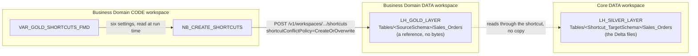

# Create OneLake shortcuts in Gold

A Business Domain's Gold lakehouse gets its data from Silver through **OneLake shortcuts**: references, not copies. The bytes stay in the Silver lakehouse in the core Data workspace, and the Gold lakehouse sees them as if they were its own tables.

There is no `PL_FMD_LOAD_GOLD` and no Gold ingestion of any kind. That is what a shortcut buys you: no copy, so no storage multiplied by the number of domains, and no per-domain opportunity to drift.

**Be precise about what is live.** The **shortcut** is: a Silver merge is visible through it immediately, because Gold is reading Silver's Delta files directly. The **materialized lake views** you build on top of it are not. An MLV is persisted and must be refreshed, and because Silver is SCD-2 rather than append-only, that refresh is generally a full recompute. That is where Gold's latency comes from, and it does not schedule itself. See [create materialized lake views](./07-create-materialized-lake-views.md). The reason the Gold layer exists at all, and what a Business Domain is, is explained in [Business Domains and the Gold layer](../04-explanation/05-business-domains.md).

This page creates those shortcuts. You run `NB_CREATE_SHORTCUTS`, in the domain's **Code** workspace, once per domain and again whenever the domain needs another table.

---

## Before you start

**The Business Domain must exist.** `NB_SETUP_BUSINESS_DOMAINS.ipynb` must have run and provisioned the domain's Data workspace, its Gold lakehouse, its Code workspace and the `VAR_GOLD_*` variable libraries. See [Deploy FMD from nothing](./01-deploy.md).

**Both lakehouses must be schema-enabled.** The notebook creates one **table shortcut per table, inside a schema folder**: it posts `path="Tables/" + SourceSchema` with `name=ShortcutName`, pointing at `Tables/<Shortcut_TargetSchema>/<ShortcutName>` in Silver. Only a schema-enabled lakehouse has schema folders under `Tables`, so both lakehouses must be schema-enabled. That is decided at deployment by `lakehouse_schema_enabled` and cannot be changed afterwards without re-creating the lakehouses, so check it before you start. See [Deploy FMD from nothing](./01-deploy.md). Source: [OneLake shortcuts, limitations and considerations](https://learn.microsoft.com/fabric/onelake/onelake-shortcuts#limitations-and-considerations).

**The Silver tables must exist.** Load Silver first: the tables you shortcut are the Delta tables `NB_FMD_LOAD_BRONZE_SILVER` writes, described in [how data moves through FMD](../04-explanation/04-load-flow.md). The notebook prints a success line for a 200 or a 201, so a shortcut created at the wrong location still reports success.

You need six GUIDs and schema names, which you can read off the Fabric URLs of the two workspaces and two lakehouses involved.

Three Fabric limits are worth knowing before you write the table list: a single OneLake path supports at most **10 shortcuts**, each Fabric item supports up to **100,000**, and shortcut names cannot contain `%` or `+`, or non-Latin characters.

---

## Step 1: fill in `VAR_GOLD_SHORTCUTS_FMD`

The notebook holds no connection settings of its own. It reads all six at run time from the `VAR_GOLD_SHORTCUTS_FMD` variable library in the domain's Code workspace, which is what lets the same notebook code deploy unchanged into every domain and every environment. Variable libraries and their value sets are covered in [the variable libraries reference](../03-reference/06-variable-libraries.md).

| Variable | Set it to |
|---|---|
| `SourceWorkspaceId` | GUID of the **Gold** workspace, where the shortcut is created |
| `SourceLakehouseId` | GUID of the **Gold** lakehouse, where the shortcut is created |
| `SourceSchema` | schema inside the Gold lakehouse the shortcut appears in, for example `dbo` |
| `Shortcut_TargetWorkspaceId` | GUID of the **Silver** workspace, what the shortcut points at |
| `Shortcut_TargetLakehouseId` | GUID of the **Silver** lakehouse, what the shortcut points at |
| `Shortcut_TargetSchema` | schema inside the Silver lakehouse holding the tables |

**Read the naming twice before you save.** `Source*` is the *destination* of the shortcut (Gold), and `Shortcut_Target*` is what it *points to* (Silver). It reads backwards, and the setup notebook's own comments confirm the direction: `SourceLakehouseId # Your Gold lakehouse`, `Shortcut_TargetLakehouseId # Your Silver Lakehouse` (`NB_SETUP_BUSINESS_DOMAINS.ipynb`, cell 6). Swapping them creates shortcuts in your Silver lakehouse pointing at tables that do not exist in Gold, and the notebook will not warn you: `create_shortcut` prints "Failed:" only when the status is neither 200 nor 201, so a shortcut created at the wrong location reports success like any other.

**Fill these six values into `NB_SETUP_BUSINESS_DOMAINS.ipynb` as well, or a later deployment will wipe them.** Cell 6 of that notebook holds the same six names, cell 32 pushes them into `variable_parameters`, and cell 42 deploys `VAR_GOLD_SHORTCUTS_FMD` from them. They ship empty, because on the first run the workspaces do not exist yet, so filling them in the portal afterwards is the normal path. But `overwrite_variable_library = True` is the shipped default (cell 3), and on that setting the deployment re-imports the variable library with `import ... -f` whether or not it already exists. Re-running `NB_SETUP_BUSINESS_DOMAINS` to add a second domain therefore resets all six variables to `''`, and the next `NB_CREATE_SHORTCUTS` run posts to a URL with empty GUIDs and prints `Failed:` for every table. `deploy.md` documents the same trap for `VAR_CONFIG_FMD` and `VAR_FMD`.

---

## Step 2: list the tables

Open `NB_CREATE_SHORTCUTS` in the domain's Code workspace and edit the one thing in the notebook that is not metadata, the table list:

```python
ShortcutNames = ['Sales_BuyingGroups', 'Sales_CustomerCategories', 'Sales_InvoiceLines',
                 'Sales_Invoices', 'Sales_Orders', 'Sales_OrderLines', 'Sales_vCustomers',
                 'Warehouse_PackageTypes', 'Warehouse_StockItems']
```

Each name is used **twice**: as the source path inside the Silver lakehouse and as the shortcut name inside the Gold lakehouse. They cannot differ. So the name in this list must be the exact Silver table name, which is `integration.SilverLayerEntity.Name` for the entity, and it becomes the Gold table name whether you like it or not. Rename in the Materialized Lake View layer, not here.

The list shipped in the notebook is the demo dataset. Replace it with the tables your domain needs.

---

## Step 3: run the notebook

1. Open `NB_CREATE_SHORTCUTS` in the Business Domain **Code** workspace.
2. Attach any lakehouse if Fabric prompts you. The notebook does not read or write a lakehouse: it talks to the Fabric REST API. It only needs a Spark session to start.
3. Select **Run all**.

Each shortcut prints either a confirmation with its location, or an HTTP status code and the response body.

What it does per table: it builds a `oneLake` target pointing at `Tables/<Shortcut_TargetSchema>/<TableName>` in the Silver lakehouse, and `POST`s it to

```
https://api.fabric.microsoft.com/v1/workspaces/{SourceWorkspaceId}/items/{SourceLakehouseId}/shortcuts
```

with `shortcutConflictPolicy=CreateOrOverwrite`. Authentication is a Fabric bearer token fetched at run time with `notebookutils.credentials.getToken("pbi")`, so nothing is stored anywhere and the shortcut is created **as you**. Your identity needs write permission on the Gold lakehouse and read permission on the Silver one.



---

## Step 4: verify

Open the Gold lakehouse in Fabric. The shortcut tables appear under `Tables/<SourceSchema>/` with a link icon on them, and they are queryable immediately:

```sql
SELECT TOP 10 * FROM LH_GOLD_LAYER.dbo.Sales_Orders WHERE IsCurrent = 1
```

If the shortcut resolves but the table is empty, the shortcut is pointing at a Silver path that does not exist. Check `Shortcut_TargetSchema` and the spelling of the table name against the Silver lakehouse.

---

## Re-running it

`CreateOrOverwrite` makes the notebook idempotent. A shortcut with the same name at the same path is replaced rather than causing a failure, so running the notebook again after adding a table to `ShortcutNames` is safe and is the intended way to extend a domain.

If you would rather an existing shortcut were never silently replaced, pass a different conflict policy in the loop:

```python
create_shortcut(..., conflict_policy="Abort")
```

`Abort` is in fact the default of the `create_shortcut` function; the call site overrides it with `CreateOrOverwrite`.

Removing a table from `ShortcutNames` does **not** delete its shortcut. The notebook only creates. Drop unwanted shortcuts in the Gold lakehouse by hand, or with a `DELETE` against the same REST endpoint. Deleting a shortcut never touches the Silver data behind it.

---

## What Gold sees through a shortcut

The shortcut exposes the Silver table exactly as it is, which means the SCD Type 2 machinery comes with it: `IsCurrent`, `IsDeleted`, `RecordStartDate`, `RecordEndDate`, `RecordModifiedDate`, `HashedPKColumn` and `HashedNonKeyColumns` are all visible as columns of the Gold table.

Filtering them out is the job of the Gold layer, not of the shortcut. Every current-state query must read

```sql
WHERE IsCurrent = 1 AND IsDeleted = 0
```

and never `IsCurrent = 1` alone: a row deleted at the source spends one run marked `IsDeleted = 1` while still `IsCurrent = 1`, so `IsCurrent` alone will show you deleted rows. The mechanism is explained under [SCD Type 2 in Silver](../04-explanation/04-load-flow.md).

That filtering, and the shaping of these raw historised tables into facts and dimensions, is the next step: [create Materialized Lake Views](./07-create-materialized-lake-views.md).

---

Source: `src/business_domain/NB_CREATE_SHORTCUTS.Notebook/notebook-content.py` @ b5fb08e
Source: `src/business_domain/VAR_GOLD_SHORTCUTS_FMD.VariableLibrary/variables.json` @ b5fb08e
Source: `src/NB_FMD_LOAD_BRONZE_SILVER.Notebook/notebook-content.py` @ b5fb08e
Compared against: wiki `Create-OneLake-Shortcuts-in-Gold.md` @ 69305fd

Platform claims, Microsoft Learn:

- [OneLake shortcuts](https://learn.microsoft.com/fabric/onelake/onelake-shortcuts#limitations-and-considerations): schema shortcuts require schema-enabled lakehouses; the shortcut limits; deleting a shortcut never touches its target.
- [OneLake shortcut security](https://learn.microsoft.com/fabric/onelake/onelake-shortcut-security): write on the item where the shortcut is created, read on what it points to.
