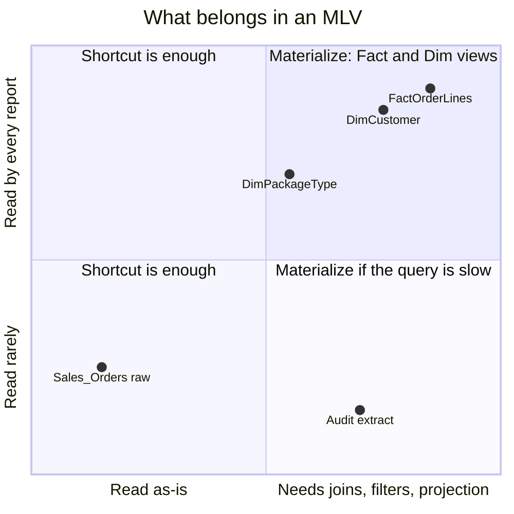
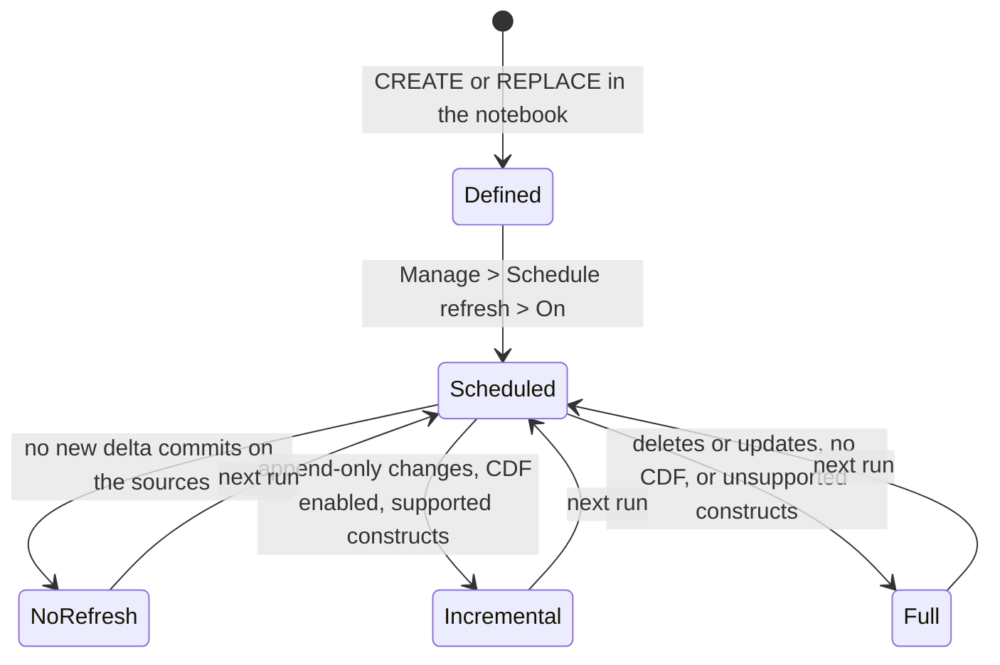

# Create Materialized Lake Views

A **Materialized Lake View (MLV)** is the persisted result of a SparkSQL `SELECT`, stored as a table in the lakehouse and refreshed by Fabric rather than by a query at read time. In FMD it is how a Business Domain turns raw historised Silver tables into the facts and dimensions its reports actually consume.

The Gold layer is built in two steps, and this is the second. First [create OneLake shortcuts in Gold](./06-create-onelake-shortcuts-in-gold.md), which gives the Gold lakehouse a copy-free view of the Silver tables. Then define MLVs on top of those shortcuts, which is where the SCD Type 2 columns get filtered away and the business model appears. Why the model lives in the domain rather than in the core is explained in [Business Domains and the Gold layer](../04-explanation/05-business-domains.md).

## MLV or shortcut: which one

A shortcut and an MLV solve different problems, and using the wrong one is the common mistake.

| | OneLake shortcut | Materialized Lake View |
|---|---|---|
| What it is | a reference to a Silver Delta table | a persisted result of a `SELECT` |
| Storage cost | none, no bytes are written | the full result is written to Gold |
| Freshness | always exactly what Silver holds | as of the last MLV refresh |
| Can it join, filter, rename, aggregate? | no, the table comes as it is | yes, that is its entire purpose |
| Carries `IsCurrent`, `IsDeleted`, `RecordStartDate`, ... | yes | only if you select them |

The rule that follows: **shortcut everything the domain needs, then materialise only what the reports read.** A shortcut is free, so there is no reason to be sparing with them. An MLV costs storage and refresh time, so create one where a report would otherwise re-execute a join, apply the `IsCurrent = 1 AND IsDeleted = 0` filter, or project a wide historised table down to the handful of columns a dimension needs. If a report can read a shortcut directly and get a fast, correct answer, it does not need an MLV.



---

## Before you start

**The shortcuts must exist.** MLVs in the demo select from `LH_GOLD_LAYER.dbo.<Table>`, which are the shortcut tables. Run `NB_CREATE_SHORTCUTS` first.

**The Gold lakehouse must be schema-enabled, on Fabric Runtime 1.3.** Microsoft states both as prerequisites for materialized lake views. Schema enablement is decided at deployment by `lakehouse_schema_enabled` and cannot be changed afterwards without re-creating the lakehouse. The feature is also unavailable in the South Central US region. Source: [Get started with materialized lake views](https://learn.microsoft.com/fabric/data-engineering/materialized-lake-views/get-started-with-materialized-lake-views) and [What are materialized lake views](https://learn.microsoft.com/fabric/data-engineering/materialized-lake-views/overview-materialized-lake-view).

**The Gold lakehouse must be the notebook's default lakehouse.** This is the single most common failure. Unqualified names like `gold.FactOrderLines` resolve against the default lakehouse, and without one attached the notebook fails with `No default lakehouse`.

To attach it: open the notebook in the Business Domain **Code** workspace, use the lakehouse panel to **Add lakehouse**, pick the Gold lakehouse from the Business Domain **Data** workspace, and set it as the **default**. `NB_MLV_DEMO_GOLD` ships with `LH_GOLD_LAYER` already pinned in its notebook metadata; a copy you make for your own domain will not be.

---

## Step 1: start from the right notebook

Two notebooks ship in every domain's Code workspace:

- **`NB_MLV_EXAMPLE`** is the template. Its SparkSQL cell contains nothing but a comment: `-- CREATE MATERIALIZED LAKE VIEW <mlv_name> AS select_statement`. Copy it per domain and fill it in.
- **`NB_MLV_DEMO_GOLD`** is a working implementation against the demo dataset. It defines five views and it is the one to read, because it is the only place the conventions are actually demonstrated.

---

## Step 2: create the schema

The demo puts its views in a lower-case `gold` schema, created in the first cell:

```sql
CREATE SCHEMA IF NOT EXISTS gold
```

`IF NOT EXISTS` keeps the notebook re-runnable.

---

## Step 3: write the view definitions, one per cell

Here is the real `gold.FactOrderLines` from `NB_MLV_DEMO_GOLD`, unedited:

```sql
CREATE or REPLACE MATERIALIZED LAKE VIEW gold.FactOrderLines
AS
SELECT      SOL.OrderLineID,
            SOL.OrderID,
            SO.CustomerID,
            SOL.StockItemID,
            SOL.Description,
            SOL.PackageTypeID,
            SOL.Quantity,
            SOL.UnitPrice,
            SOL.TaxRate,
            SO.OrderDate,
            SO.ExpectedDeliveryDate,
            SOL.PickedQuantity,
            SOL.PickingCompletedWhen
FROM LH_GOLD_LAYER.dbo.Sales_OrderLines SOL inner join LH_GOLD_LAYER.dbo.Sales_Orders SO
on SOL.OrderID=SO.OrderID
where SOL.IsCurrent=1 and SO.IsCurrent=1
```

And a dimension, `gold.DimCustomer`, which joins two shortcut tables:

```sql
CREATE or REPLACE MATERIALIZED LAKE VIEW gold.DimCustomer
AS
SELECT CustomerID
      ,CustomerName
      ,BG.BuyingGroupName
      ,CreditLimit
      ,AccountOpenedDate
      ,StandardDiscountPercentage
      ,IsStatementSent
      ,IsOnCreditHold
      ,PaymentDays
      ,PhoneNumber
      ,FaxNumber
      ,DeliveryRun
      ,RunPosition
      ,WebsiteURL
  FROM LH_GOLD_LAYER.dbo.Sales_vCustomers C inner join LH_GOLD_LAYER.dbo.Sales_BuyingGroups BG  on C.BuyingGroupID=BG.BuyingGroupID
where C.IsCurrent=1 and BG.IsCurrent=1
```

Read four rules out of those two statements.

**Source tables are qualified with the lakehouse name.** `LH_GOLD_LAYER.dbo.Sales_OrderLines` is the *shortcut* in the Gold lakehouse, not the Silver table, and `dbo` is the `SourceSchema` that `NB_CREATE_SHORTCUTS` created the shortcut under. If your `VAR_GOLD_SHORTCUTS_FMD.SourceSchema` is something other than `dbo`, adjust these references.

**Every source table is filtered on `IsCurrent = 1`, including both sides of a join.** The shortcut exposes the Silver SCD-2 history in full, so an unfiltered join to a table with three versions of a customer multiplies the fact rows by three. Filter on every table you touch, not only the driving one.

**`CREATE or REPLACE` is what makes the notebook re-runnable.** The plain `CREATE MATERIALIZED LAKE VIEW` in the `NB_MLV_EXAMPLE` template fails on the second run. Use `CREATE or REPLACE` in anything you intend to schedule.

**One statement per cell.** Every `CREATE` in the demo notebook sits in its own SparkSQL cell. A failure then points at the view that broke rather than at a cell containing five of them.

> **The demo filters on `IsCurrent = 1` alone, and you should not.** A row deleted at the source is marked `IsDeleted = 1` while remaining `IsCurrent = 1` until the following Silver run closes it, so `IsCurrent = 1` on its own will show deleted rows for one cycle. Write `where IsCurrent = 1 and IsDeleted = 0` in your own views. The two-run close-out is explained under [SCD Type 2 in Silver](../04-explanation/04-load-flow.md).

---

## Step 4: run, and see the graph

1. **Run all**. Each cell executes its `CREATE` against the attached Gold lakehouse.
2. Open the Gold lakehouse in Fabric.
3. Open the **Materialized lake views** section and click the refresh icon to see the new views in the lineage graph.

The views now hold data as of the moment they were created. They will not move again until you schedule a refresh, which is the next step.

---

## Step 5: schedule the refresh

**A materialized lake view is not refreshed by re-running the notebook, and Fabric does not refresh it on its own until you say so.** Skip this step and Silver keeps loading nightly while the Gold facts and dimensions stay frozen at creation time, with nothing failing and nobody noticing.

In the Gold lakehouse, open **Materialized lake views → Manage**, and turn **Schedule refresh** on. Pick a frequency (by the minute, hourly, daily, weekly or monthly) and save. Schedule it to run **after** the FMD Silver load, not before.

Fabric derives the dependency order between views from their definitions, refreshes them in that order so a downstream view always reads fresh upstream data, and retries transient failures. Microsoft is explicit that this, not a notebook, is how refresh should be orchestrated: "After you create your materialized lake views, don't orchestrate their refresh from a notebook."

Each scheduled run picks its own strategy, which is what makes the schedule cheap: no refresh when nothing changed, incremental when it can, full otherwise.



Incremental refresh needs Delta change data feed on every source table (`delta.enableChangeDataFeed = true`). Without it, Fabric can only choose between no refresh and a full one. Source: [Optimal refresh for materialized lake views](https://learn.microsoft.com/fabric/data-engineering/materialized-lake-views/refresh-materialized-lake-view).

---

## Naming conventions

The demo notebook is the standard, and it is worth following exactly:

| Pattern | Example |
|---|---|
| Fact views | `gold.Fact<Subject>` |
| Dimension views | `gold.Dim<Subject>` |
| Schema | `gold`, lower case |

The five views `NB_MLV_DEMO_GOLD` defines are `gold.FactOrderLines`, `gold.DimOrders`, `gold.DimCustomer`, `gold.DimPackageType` and `gold.DimStockItems`.

Fabric stores materialized lake view names lower-cased, so `gold.FactOrderLines` materialises as `gold.factorderlines`. The CamelCase in the demo is a convention for the *definition*; matching is case-insensitive, so a downstream query can still write either. Expect the lower-case name in the lakehouse explorer. Source: [Spark SQL reference for materialized lake views](https://learn.microsoft.com/fabric/data-engineering/materialized-lake-views/create-materialized-lake-view). (An all-uppercase schema name, `GOLD`, is not supported at all; the demo's lower-case `gold` is on the right side of that.)

Note what the demo does *not* do: there are no surrogate keys, and the facts join to the dimensions on the source's own business keys (`OrderID`, `CustomerID`, `StockItemID`, `PackageTypeID`). The MLV layer is dimensional modelling with natural keys. If your model needs surrogate keys, or an incrementally assembled fact table, an MLV cannot express it: put that logic in `NB_LOAD_GOLD`, the empty PySpark notebook deployed into every domain Code workspace for exactly this purpose.

---

## Troubleshooting

| Symptom | Cause | Fix |
|---|---|---|
| `No default lakehouse` | the Gold lakehouse is not attached as default | attach it, see "Before you start" |
| `Table or view not found` | the shortcut does not exist, or `SourceSchema` is not `dbo` | run `NB_CREATE_SHORTCUTS`, and check the schema in the qualified name |
| The view already exists | the cell says `CREATE` rather than `CREATE or REPLACE` | change it |
| Fact rows multiplied | a joined table was not filtered on `IsCurrent` | filter every table in the join |
| Deleted rows still appear | filtered on `IsCurrent` alone | add `and IsDeleted = 0` |
| `INSERT`, `UPDATE` or `DELETE` against an MLV is rejected | no DML is allowed against a materialized lake view; only the `SELECT` in the definition populates it | change the definition and re-run |
| A `CREATE` with a user-defined function, a temporary view as a source, Delta time-travel syntax, or an all-uppercase schema name fails | these are the documented limitations of the `CREATE MATERIALIZED LAKE VIEW` statement | rewrite without them, or move the logic into `NB_LOAD_GOLD` |
| The view is defined but not in the graph | the lakehouse view is stale | click the refresh icon in the Materialized lake views section |
| The data never changes after the first run | no refresh schedule exists | see [Step 5](#step-5-schedule-the-refresh) |

**A window function is not an error.** Neither is a `DISTINCT`, a non-deterministic function, or a scalar subquery. They do not stop the view being created; they make Fabric fall back to a **full refresh** instead of an incremental one. That is a cost, not a failure, and rewriting a correct query to avoid it buys you refresh efficiency, nothing else. Microsoft's own `CREATE MATERIALIZED LAKE VIEW` example contains a window function. Sources: [Spark SQL reference](https://learn.microsoft.com/fabric/data-engineering/materialized-lake-views/create-materialized-lake-view) and [Optimal refresh](https://learn.microsoft.com/fabric/data-engineering/materialized-lake-views/refresh-materialized-lake-view#sql-constructs-supported-by-incremental-refresh).

---

Source: `src/business_domain/NB_MLV_DEMO_GOLD.Notebook/notebook-content.sql` @ b5fb08e
Source: `src/business_domain/NB_MLV_EXAMPLE.Notebook/notebook-content.sql` @ b5fb08e
Source: `src/business_domain/NB_LOAD_GOLD.Notebook/notebook-content.py` @ b5fb08e
Source: `src/NB_FMD_LOAD_BRONZE_SILVER.Notebook/notebook-content.py` @ b5fb08e
Compared against: wiki `Create-Materialized-Lake-Views-(Template).md` @ 69305fd

Platform claims, Microsoft Learn:

- [Spark SQL reference for materialized lake views](https://learn.microsoft.com/fabric/data-engineering/materialized-lake-views/create-materialized-lake-view): the `CREATE` syntax, name lower-casing, the current limitations, and refresh orchestration.
- [Get started with materialized lake views](https://learn.microsoft.com/fabric/data-engineering/materialized-lake-views/get-started-with-materialized-lake-views): the schema-enabled lakehouse and Runtime 1.3 prerequisites, and the refresh schedule.
- [Optimal refresh for materialized lake views](https://learn.microsoft.com/fabric/data-engineering/materialized-lake-views/refresh-materialized-lake-view): which constructs fall back to a full refresh, and change data feed.
- [What are materialized lake views](https://learn.microsoft.com/fabric/data-engineering/materialized-lake-views/overview-materialized-lake-view): the South Central US region limitation.
