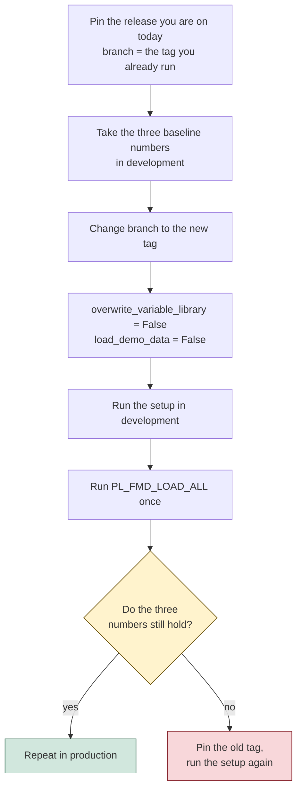

# Upgrade the framework

Re-running the setup notebook **is** the upgrade mechanism. There is no separate upgrade path, and there does not need to be one: the setup upserts every artefact, so running it again against an existing deployment replaces the framework's items and leaves your data and your metadata alone.

The thing to understand before you do it is **what it replaces**, because the answer is "everything the framework owns, including your edits to it".

---

## 1. Pin a version, or you are not upgrading, you are drifting

The setup downloads `src/` and `config/` from GitHub **at the moment you run it**:

```python
branch = "main"                     # "main" is default
...
url = f"https://api.github.com/repos/{repo_owner}/{repo_name}/zipball/{branch}"
```

With `"main"`, two deployments a month apart deploy different code, and **re-running the setup to fix something also upgrades you to whatever `HEAD` says today**. That is not an upgrade, it is a surprise.

The framework ships tagged releases, and `zipball/{branch}` resolves a tag as happily as a branch. So pin one:

```python
branch = "2026.07"
```

| Release | Published |
|---|---|
| `2026.07` | 2026-07-08 |
| `2026.05` | 2026-05-28 |
| `2026.04` | 2026-04-21 |
| `2026.03` | 2026-04-01 |

**An upgrade is then an explicit act**: change one string, run the setup, and you know exactly what you got. Do it in development first.

> **The deployment records no version stamp.** If you inherited a deployment that ran with `branch = "main"`, nothing in the workspace tells you which commit it deployed, and the rollback below needs to know. Before your first upgrade, pin the tag you *intend* to be on, run the setup once, and write it down where the next operator will find it. From then on the pin is your version record. Writing the resolved tag into `VAR_CONFIG_FMD` at deploy time would close this properly, and it is a small enough change to be worth raising upstream.

---

## 2. What a re-run replaces, and what survives

`config/item_deployment.json` is the manifest, and it is the whole answer. Eight notebooks are in it, and they are **overwritten on every run**:

```
NB_FMD_LOAD_LANDING_BRONZE          NB_FMD_PROCESSING_PARALLEL_MAIN
NB_FMD_LOAD_BRONZE_SILVER           NB_FMD_PROCESSING_LANDINGZONE_MAIN
NB_FMD_UTILITY_FUNCTIONS            NB_FMD_DQ_CLEANSING
NB_FMD_CUSTOM_NOTEBOOK_TEMPLATE     NB_FMD_FABRIC_PURVIEW_LINEAGE_...
```

The 25 pipelines, the Spark environment and the variable libraries are overwritten too. The workspace description says so in as many words: *"Each time the setup notebook is executed, all changes will be overwritten."*

Because the pipeline items are replaced, **turn off any schedule on `PL_FMD_LOAD_ALL` before you run the setup** ([schedule the load](./03-schedule-the-load.md)), and check afterwards that it is still attached and still enabled.

**One notebook is deliberately not in the manifest:**

```
NB_FMD_CUSTOM_DQ_CLEANSING          not deployed, and therefore not overwritten
```

That is the slot the framework gives you for your own cleansing functions, and it is the only place in the framework where your code is safe from an upgrade. It is a design decision, not an oversight: put your custom cleansing there and it survives every upgrade you will ever do.

> **`NB_FMD_CUSTOM_NOTEBOOK_TEMPLATE` is a template, not a slot.** It *is* in the manifest, so it is overwritten. Copy it under your own name and edit the copy; the copy is not in the manifest either, so it survives.

---

## 3. The two flags that decide whether an upgrade hurts

**`overwrite_variable_library`.** It defaults to `True`, and that wipes the values in `VAR_FMD` and `VAR_CONFIG_FMD` and rewrites them from the setup's own configuration. If you have tuned anything there, or pointed a value set at a different database:

```python
overwrite_variable_library = False   # keep my values
```

The notebook's own comment tells you this. It is easy to miss on the twentieth cell of a re-run you are doing for a different reason.

**`load_demo_data`.** Leave it `False` on an upgrade of a real deployment. It registers the `customer` demo entity into `integration.LandingzoneEntity`, and you do not want a demo entity appearing in production's work list.

---

## 4. What an upgrade cannot touch, and why that is the good news

The setup upserts **items**. It does not touch:

- **your data.** Bronze and Silver are Delta tables in the lakehouses; nothing in the deployment path writes to them.
- **your metadata.** `integration.*` holds your entity registrations. The SQL manifest the setup executes contains `sp_Upsert*` calls for the framework's own rows (connections, workspaces, lakehouses, pipelines), not for yours.
- **your watermarks and queues.** `execution.LandingzoneEntityLastLoadValue` and the two queue tables are untouched.

So the blast radius of a bad upgrade is the framework's code, not your history. That is worth knowing before you hesitate: **you can roll an upgrade back by pinning the previous tag and running the setup again.**

Two limits on that reassurance, and both are load-bearing.

> **A development upgrade is not fully contained in development.** The configuration database is [shared by both environments](./01-deploy.md), so the setup's `sp_Upsert*` calls for the framework's own rows land in the store production reads. Your data and your entity registrations are still safe. But run the development upgrade in a window when production is not loading, and treat the configuration database as production even while the workspace label says `(D)`.

> **A rollback undoes the code, not the data the new code already wrote.** If the upgrade re-keyed Silver (section 5), the new SCD-2 versions stay after the tag goes back. That is why the baseline numbers are taken *before* the upgrade, and why the first run after it happens in development.

---

## 5. Nothing upstream regression-tests your entities, so make the upgrade falsifiable

No framework can. Your entity set is yours, and nobody upstream has it. So take the measurement that only you can take, before and after:

```sql
-- before the upgrade, in the environment you are upgrading
SELECT 'silver_rows'   AS metric, COUNT(*) AS v FROM <your Silver table>
UNION ALL SELECT 'current_rows',  COUNT(*) FROM <your Silver table> WHERE IsCurrent = 1
UNION ALL SELECT 'distinct_keys', COUNT(DISTINCT HashedPKColumn) FROM <your Silver table>;
```

Upgrade, run one load, and take the three numbers again. **`distinct_keys` is the one that matters**: if it moved, the hash contract changed under you, and every SCD-2 record was closed and re-inserted. That is the failure mode a framework upgrade can actually produce, and it is silent. (See [the production checklist](./04-run-fmd-in-production.md#33-a-composite-primary-key-can-be-re-keyed-by-a-source-column-reorder), which explains how a hash can move without anyone touching it.)

Do all of this in **development**, whose Silver you can afford to be wrong. That is what the `(D)` and `(P)` workspaces are for, and the configuration database is shared between them, so an upgrade in development tells you the truth about production's metadata.

---

## 6. The order



**Do not delete the SQL database as part of an upgrade.** Fabric does not allow a deleted SQL database's name to be reused in a workspace, so a "clean reinstall" burns the name permanently. There is no upgrade that requires it. ([Learn](https://learn.microsoft.com/fabric/database/sql/limitations#database-level-limitations))

---

Source: `setup/NB_SETUP_FMD.ipynb` @ `1ba7974` (the `branch` variable, `zipball/{branch}`, `overwrite_variable_library`, `load_demo_data`)
Source: `config/item_deployment.json` @ `1ba7974` (the eight deployed notebooks; `NB_FMD_CUSTOM_DQ_CLEANSING` is absent)
Source: `github.com/edkreuk/FMD_FRAMEWORK/releases` (four tagged releases as of 2026-07-14)
Source: [Limitations in SQL database in Microsoft Fabric](https://learn.microsoft.com/fabric/database/sql/limitations#database-level-limitations)
