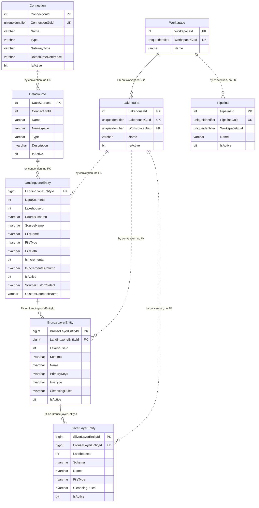
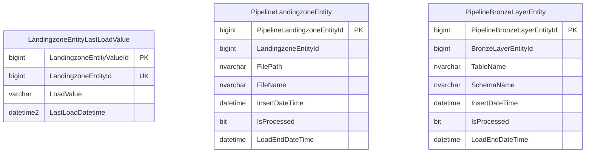
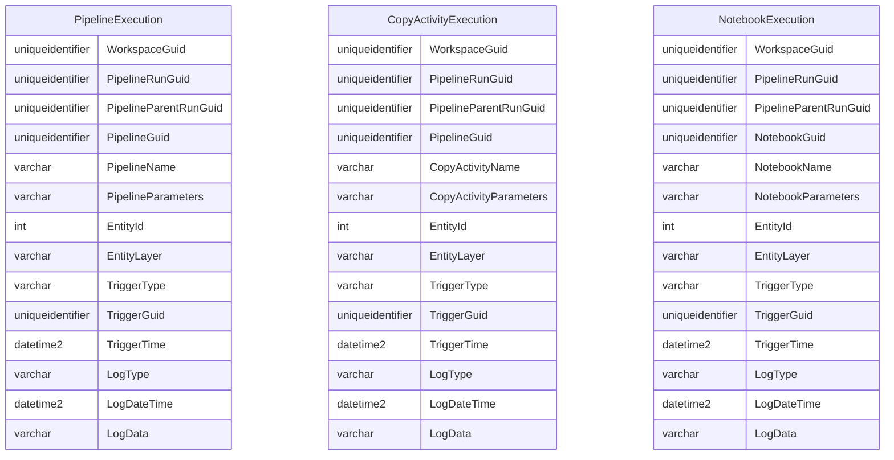

# Data model reference

This database is the framework. Everything else in FMD is generic: the same 25 pipelines and 11 notebooks run whether you load 2 tables or 200. What changes is the rows in here. Onboarding a source, choosing full or incremental, attaching a cleansing rule, tracing a failed run: all of it is reading and writing these 14 tables.

So this is the page you will keep open. It is a single Fabric SQL Database with three schemas, and the split tells you where to look:

> **What it is called in your tenant.** The docs and the repo call it `SQL_FMD_FRAMEWORK`, which is the name of the SQL project and of the committed `.dacpac`. The database the setup notebook actually creates is named `'SQL_' + domain_name + '_FRAMEWORK'` (cell 18), so with the default `domain_name` of `INTEGRATION` you will be looking for **`SQL_INTEGRATION_FRAMEWORK`**. Same database, different name in the portal.

- **`integration`** is what you declare. The sources you registered and the entities you want loaded. You write here, through the `sp_Upsert*` procedures. 8 tables, and the only three foreign keys in the database.
- **`execution`** is what happens next. The work list each pipeline reads, the `IsProcessed` flags that drive it, and the `LastLoadValue` watermark that makes an incremental load incremental. The framework writes here; you mostly read it. 3 tables and 3 views.
- **`logging`** is what happened. Every pipeline, notebook and copy activity writes a start, end and failure record. This is your audit trail and your first stop when a load fails. 3 tables. Note before you write a query: pipelines and copy activities correlate on `PipelineRunGuid`, and since [#251](https://github.com/edkreuk/FMD_FRAMEWORK/pull/251) **a notebook joins its layer pipeline on `PipelineRunGuid` too** (`TriggerGuid` correlates it as well). Up to and including `2026.07` a notebook's `PipelineRunGuid` was a synthetic `uuid4()`, so `TriggerGuid` was then the only usable notebook join. See [logging and auditing](./02-logging-and-auditing.md).

Below: every column of every table, with its type, nullability and keys, then the 27 stored procedures and the 3 views.

## The three schemas

**`integration` is the metadata you register.** It is the declarative catalogue: which connections exist, which data sources sit behind them, which workspaces and lakehouses the framework writes into, and which entities to load through the landing zone, bronze, and silver layers. Nothing here changes as a side effect of a pipeline run. You write it once, through the `sp_Upsert*` procedures, and the pipelines read it. It holds 8 of the 14 tables and all 3 of the database's foreign keys.

**`execution` is runtime state.** Three tables that pipelines write during a run: the incremental-load watermark per landing-zone entity, and two queue tables recording which files and which bronze tables have been produced but not yet consumed downstream. The `IsProcessed` flag on the two queue tables is the handover signal between layers. This schema also holds the three views that assemble the parameter payloads the pipelines and notebooks actually execute.

**`logging` is what happened.** Three append-only tables, one per activity kind (pipeline, copy activity, notebook). Each row is a single event, tagged `Start`, `End`, or `Fail` in `LogType`. Nothing reads these tables back; they exist for observability.

> **Upstream discrepancy:** the wiki's `Data-Observability.md` tells readers the log tables are `audit.PipelineExecution`, `audit.CopyActivityExecution`, and `audit.NotebookExecution`. There is no `audit` schema in the database. The schema is `logging`. The three table names are otherwise correct.

**All 14 tables are mirrored into OneLake, whether you want it or not.** `SQL_FMD_FRAMEWORK` is a Fabric SQL Database, and mirroring for a Fabric SQL Database is automatic on creation, always on, and cannot be turned off; every supported table is mirrored with no option to skip. So the entire configuration database, the `logging` heaps included, is continuously replicated into OneLake as Delta and is readable from Spark, from the SQL analytics endpoint and from a Direct Lake semantic model with no work on your part. Two consequences worth carrying into any design: the **three `execution` views are not mirrored**, because views never are, so anything built on the OneLake copy must re-implement their joins; and one column, `execution.LandingzoneEntityLastLoadValue.LastLoadDatetime`, is a `DATETIME2(7)` and loses its seventh digit in the replica. See [logging and auditing](./02-logging-and-auditing.md) for what this buys you when you build monitoring.

## Referential integrity: three foreign keys, all in `integration`

The database declares exactly three foreign keys, and all three are inside `integration`:

| Child | Column | Parent | Column |
|---|---|---|---|
| `integration.BronzeLayerEntity` | `LandingzoneEntityId` | `integration.LandingzoneEntity` | `LandingzoneEntityId` |
| `integration.SilverLayerEntity` | `BronzeLayerEntityId` | `integration.BronzeLayerEntity` | `BronzeLayerEntityId` |
| `integration.Lakehouse` | `WorkspaceGuid` | `integration.Workspace` | `WorkspaceGuid` |

Everything else that looks like a relationship is a relationship by convention only, enforced by application code rather than by the database:

- `integration.DataSource.ConnectionId`, `integration.LandingzoneEntity.DataSourceId`, `integration.LandingzoneEntity.LakehouseId`, `integration.BronzeLayerEntity.LakehouseId`, `integration.SilverLayerEntity.LakehouseId`, and `integration.Pipeline.WorkspaceGuid` carry no foreign key. The views join on them regardless.
- **`execution` and `logging` declare no foreign keys at all.** Their `LandingzoneEntityId`, `BronzeLayerEntityId`, and `EntityId` columns point into `integration` by naming convention. Nothing stops an orphaned row, and deleting an `integration` entity will not cascade.

This is a real property of the design, not an omission in this document. It means the database will not catch a bad `EntityId`; only the joins in the views will, by silently returning no rows.

> **Upstream discrepancy:** the wiki describes columns such as `DataSource.ConnectionId` and `LandingzoneEntity.LakehouseId` as "Reference to the associated connection" / "Reference to the lakehouse", which reads as though referential integrity is enforced. It is not, for any column other than the three foreign keys above.

Note also the type mismatch across the convention boundary: `integration.BronzeLayerEntity.BronzeLayerEntityId` and `integration.LandingzoneEntity.LandingzoneEntityId` are `BIGINT`, but `logging.*.EntityId` is `INT`. Entity ids beyond the `INT` range would not round-trip into the log tables.

---

## `integration`

Eight tables. The medallion chain (`LandingzoneEntity` to `BronzeLayerEntity` to `SilverLayerEntity`) is the only place foreign keys enforce the shape.



### `integration.Workspace`

The Fabric workspaces the framework knows about. It is the only parent of a declared foreign key, and the only table in `integration` with no `IsActive` column. (Seven of the 14 tables have no `IsActive`: `Workspace`, and all three `execution` and all three `logging` tables.)

| Column | Type | Null | Key |
|---|---|---|---|
| `WorkspaceId` | `INT` IDENTITY(1,1) | NOT NULL | PK `PK_integration_Workspace` |
| `WorkspaceGuid` | `UNIQUEIDENTIFIER` | NOT NULL | UNIQUE `UC_integration_Workspace_WorkspaceGuid`; target of `FK_Lakehouse_Workspace` |
| `Name` | `VARCHAR(100)` | NOT NULL | |

### `integration.Lakehouse`

The lakehouses inside those workspaces. FMD addresses lakehouses by GUID at runtime; `sp_UpsertLandingzoneBronzeSilver` resolves them by the fixed names `LH_DATA_LANDINGZONE`, `LH_BRONZE_LAYER`, and `LH_SILVER_LAYER`.

| Column | Type | Null | Key |
|---|---|---|---|
| `LakehouseId` | `INT` IDENTITY(1,1) | NOT NULL | PK `PK_integration_Lakehouse` |
| `LakehouseGuid` | `UNIQUEIDENTIFIER` | NOT NULL | UNIQUE `UC_integration_Lakehouse` |
| `WorkspaceGuid` | `UNIQUEIDENTIFIER` | NOT NULL | FK to `integration.Workspace(WorkspaceGuid)` |
| `Name` | `VARCHAR(100)` | NOT NULL | |
| `IsActive` | `BIT` DEFAULT `1` | NOT NULL | |

### `integration.Pipeline`

The Fabric pipelines, registered at setup so that runtime logging can name them. `WorkspaceGuid` carries no foreign key, unlike the identically named column on `Lakehouse`.

| Column | Type | Null | Key |
|---|---|---|---|
| `PipelineId` | `INT` IDENTITY(1,1) | NOT NULL | PK `PK_integration_PipelineId` |
| `PipelineGuid` | `UNIQUEIDENTIFIER` | NOT NULL | UNIQUE `UC_integration_Pipeline` |
| `WorkspaceGuid` | `UNIQUEIDENTIFIER` | NOT NULL | |
| `Name` | `VARCHAR(200)` | NOT NULL | |
| `IsActive` | `BIT` DEFAULT `1` | NOT NULL | |

### `integration.Connection`

One row per Fabric connection. `Type` is what the framework branches on when it decides how to read a source: `vw_LoadSourceToLandingzone` tests `Type IN ('SQL')`.

| Column | Type | Null | Key |
|---|---|---|---|
| `ConnectionId` | `INT` IDENTITY(1,1) | NOT NULL | PK `PK_integration_ConnectionId` |
| `ConnectionGuid` | `UNIQUEIDENTIFIER` | NOT NULL | UNIQUE `UC_integration_Connection` |
| `Name` | `VARCHAR(200)` | NOT NULL | |
| `Type` | `VARCHAR(50)` | NOT NULL | |
| `GatewayType` | `VARCHAR(50)` | NULL | |
| `DatasourceReference` | `VARCHAR(MAX)` | NULL | |
| `IsActive` | `BIT` DEFAULT `1` | NOT NULL | |

`GatewayType` and `DatasourceReference` describe how a connection reaches a source that is not directly addressable from Fabric: `GatewayType` records which kind of gateway fronts it (the on-premises data gateway, as used for Oracle), and `DatasourceReference` holds the gateway-side datasource identifier. Both are inert in the current release. `sp_UpsertConnection` accepts only `@ConnectionGuid`, `@Name`, `@Type`, and `@IsActive`, so neither column can be populated through the framework's own registration API, and no view, procedure, or notebook reads them. Fabric's connection object carries the gateway binding itself, so nothing breaks; treat these two columns as reserved and leave them `NULL`.

### `integration.DataSource`

A logical source behind a connection: typically one database or one file share. `Namespace` is a prefix that ends up in the landing-zone path (`vw_LoadSourceToLandingzone` concatenates it into `TargetFilePath`) and is passed to the notebooks as `DataSourceNamespace`.

| Column | Type | Null | Key |
|---|---|---|---|
| `DataSourceId` | `INT` IDENTITY(1,1) | NOT NULL | PK `PK_integration_DataSource` |
| `ConnectionId` | `INT` | NOT NULL | part of `UC_integration_DataSource`; no FK |
| `Name` | `VARCHAR(100)` | NOT NULL | UNIQUE `UC_integration_DataSource` (`ConnectionId`, `Name`, `Type`) |
| `Namespace` | `VARCHAR(100)` | NOT NULL | |
| `Type` | `VARCHAR(30)` | NULL | part of `UC_integration_DataSource` |
| `Description` | `NVARCHAR(200)` | NULL | |
| `IsActive` | `BIT` DEFAULT `1` | NOT NULL | |

> **Note:** `sp_UpsertDataSource` declares `@Namespace VARCHAR(10)` while the column is `VARCHAR(100)`. A namespace longer than 10 characters is silently truncated by the procedure before it reaches the column.

### `integration.LandingzoneEntity`

One row per thing to extract from a source into the landing zone. This is the entry point of the medallion chain and the table that carries the incremental-load configuration.

| Column | Type | Null | Key |
|---|---|---|---|
| `LandingzoneEntityId` | `BIGINT` IDENTITY(1,1) | NOT NULL | PK `PK_integration_LandingzoneEntity` |
| `DataSourceId` | `INT` | NOT NULL | part of `UC_integration_LandingzoneEntity`; no FK |
| `LakehouseId` | `INT` | NOT NULL | part of `UC_integration_LandingzoneEntity`; no FK |
| `SourceSchema` | `NVARCHAR(100)` | NULL | part of `UC_integration_LandingzoneEntity` |
| `SourceName` | `NVARCHAR(200)` | NOT NULL | part of `UC_integration_LandingzoneEntity` |
| `FileName` | `NVARCHAR(200)` | NOT NULL | |
| `FileType` | `NVARCHAR(20)` | NOT NULL | |
| `FilePath` | `NVARCHAR(500)` | NOT NULL | |
| `IsIncremental` | `BIT` DEFAULT `0` | NOT NULL | |
| `IsIncrementalColumn` | `NVARCHAR(50)` | NULL | |
| `IsActive` | `BIT` DEFAULT `1` | NOT NULL | |
| `SourceCustomSelect` | `NVARCHAR(4000)` | NULL | |
| `CustomNotebookName` | `VARCHAR(200)` | NULL | |

The unique constraint is on (`SourceSchema`, `SourceName`, `DataSourceId`, `LakehouseId`): the same source table may be registered once per target lakehouse.

> **Note:** both `sp_UpsertLandingzoneEntity` and `sp_UpsertLandingzoneBronzeSilver` declare `@FilePath NVARCHAR(100)` while the column is `NVARCHAR(500)`. Paths longer than 100 characters are truncated by the procedure.

`SourceCustomSelect` is intended to override the generated extract query, letting you register a projection or a join instead of taking the whole table. It is wired in only halfway. The registration path writes it (`sp_UpsertLandingzoneEntity` and `sp_UpsertLandingzoneBronzeSilver` both accept `@SourceCustomSelect`, and the `PL_TOOLING_POST_ASQL_TO_FMD` pipeline passes it through), but nothing on the read side consumes it: `vw_LoadSourceToLandingzone` builds `SourceDataRetrieval` as `SELECT * FROM <schema>.<table>` unconditionally, and no notebook references the column. **Setting `SourceCustomSelect` today therefore has no effect on what is extracted.** To restrict what a landing-zone entity pulls, narrow the source object itself (a view on the source system) rather than relying on this column.

`CustomNotebookName`, by contrast, is fully wired: `vw_LoadSourceToLandingzone` selects it, and `NB_FMD_PROCESSING_LANDINGZONE_MAIN` dispatches to the named notebook, which is how `PL_FMD_LDZ_COPY_FROM_CUSTOM_NB` handles sources the standard copy activity cannot read. Leave it `NULL` for the standard path.

### `integration.BronzeLayerEntity`

The bronze target for a landing-zone entity. `PrimaryKeys` is a comma-separated column list, passed through to the bronze notebook as a string and used there for the merge.

| Column | Type | Null | Key |
|---|---|---|---|
| `BronzeLayerEntityId` | `BIGINT` IDENTITY(1,1) | NOT NULL | PK `PK_integration_BronzeLayerEntity` |
| `LandingzoneEntityId` | `BIGINT` | NOT NULL | FK to `integration.LandingzoneEntity(LandingzoneEntityId)` |
| `LakehouseId` | `INT` | NOT NULL | part of `UC_integration_BronzeLayerEntity`; no FK |
| `Schema` | `NVARCHAR(100)` | NOT NULL | part of `UC_integration_BronzeLayerEntity` |
| `Name` | `NVARCHAR(200)` | NOT NULL | part of `UC_integration_BronzeLayerEntity` |
| `PrimaryKeys` | `NVARCHAR(200)` | NOT NULL | |
| `FileType` | `NVARCHAR(20)` DEFAULT `'Delta'` | NOT NULL | |
| `CleansingRules` | `NVARCHAR(MAX)` | NULL | |
| `IsActive` | `BIT` DEFAULT `1` | NOT NULL | |

> **Note:** `CleansingRules` is stored here and written by `sp_UpsertBronzeCleansingRule`, but `vw_LoadToBronzeLayer` does not select it, so it does not reach the bronze notebook through the view. Only the silver view (`vw_LoadToSilverLayer`) propagates cleansing rules. `execution.sp_GetBronzeCleansingRule` exists to read it directly.

### `integration.SilverLayerEntity`

The silver target for a bronze entity. Unlike bronze, `Schema` and `Name` are nullable here, and there is no `PrimaryKeys` column.

| Column | Type | Null | Key |
|---|---|---|---|
| `SilverLayerEntityId` | `BIGINT` IDENTITY(1,1) | NOT NULL | PK `PK_integration_SilverLayerEntity` |
| `BronzeLayerEntityId` | `BIGINT` | NOT NULL | FK to `integration.BronzeLayerEntity(BronzeLayerEntityId)` |
| `LakehouseId` | `INT` | NOT NULL | part of `UC_integration_BSilverLayerEntity`; no FK |
| `Schema` | `NVARCHAR(100)` | NULL | part of `UC_integration_BSilverLayerEntity` |
| `Name` | `NVARCHAR(200)` | NULL | part of `UC_integration_BSilverLayerEntity` |
| `FileType` | `NVARCHAR(20)` DEFAULT `'Delta'` | NOT NULL | |
| `CleansingRules` | `NVARCHAR(MAX)` | NULL | |
| `IsActive` | `BIT` DEFAULT `1` | NOT NULL | |

The unique constraint is named `UC_integration_BSilverLayerEntity` in the SQL. The stray `B` is upstream's, not a transcription error here.

---

## `execution`

Three tables. **No foreign keys are declared in this schema.** `LandingzoneEntityId` and `BronzeLayerEntityId` reference `integration` by naming convention only, so the tables are shown standalone below.



### `execution.LandingzoneEntityLastLoadValue`

The incremental-load watermark: one row per landing-zone entity, holding the highest value seen in that entity's `IsIncrementalColumn` on the last successful load. Written by `sp_UpsertLandingZoneEntityLastLoadValue`.

| Column | Type | Null | Key |
|---|---|---|---|
| `LandingzoneEntityValueId` | `BIGINT` IDENTITY(1,1) | NOT NULL | PK `PK_execution_Source_LastLoadValue` |
| `LandingzoneEntityId` | `BIGINT` | NULL | UNIQUE `UC_execution_LandingzoneEntityLastLoadValue_Guid`; no FK |
| `LoadValue` | `VARCHAR(50)` | NULL | |
| `LastLoadDatetime` | `DATETIME2(7)` | NULL | |

`LastLoadDatetime` is the only `DATETIME2(7)` column in the database, and it is the one column that loses data on the way to OneLake. Delta supports six digits of fractional-second precision, so a mirrored `datetime2(7)` has its seventh digit trimmed. Every `DATETIME2` column in `logging` is `(6)` and is unaffected. The table still mirrors, because its primary key is `LandingzoneEntityValueId BIGINT`; only the column's last digit is lost. This matters only if you compare the OneLake replica against the SQL table digit for digit. The watermark logic itself reads `LoadValue`, a `VARCHAR(50)`, not this column.

The watermark is stored as `VARCHAR(50)`, not as a typed value. The view casts it back with `TRY_CONVERT` when it builds the `WHERE` clause. The unique constraint enforces at most one watermark row per entity.

### `execution.PipelineLandingzoneEntity`

The landing-zone-to-bronze queue: one row per file written into the landing zone. `IsProcessed = 0` means bronze has not yet consumed it. `vw_LoadToBronzeLayer` filters on exactly that.

| Column | Type | Null | Key |
|---|---|---|---|
| `PipelineLandingzoneEntityId` | `BIGINT` IDENTITY(1,1) | NOT NULL | PK `PK_execution_PipelineLandingzoneEntity` |
| `LandingzoneEntityId` | `BIGINT` | NOT NULL | no FK |
| `FilePath` | `NVARCHAR(300)` | NOT NULL | |
| `FileName` | `NVARCHAR(MAX)` | NOT NULL | |
| `InsertDateTime` | `DATETIME` | NULL | |
| `IsProcessed` | `BIT` | NOT NULL | |
| `LoadEndDateTime` | `DATETIME` | NULL | |

Note the asymmetry with the source table: here `FilePath` is `NVARCHAR(300)` and `FileName` is `NVARCHAR(MAX)`, whereas on `integration.LandingzoneEntity` they are `NVARCHAR(500)` and `NVARCHAR(200)`. `sp_UpsertPipelineLandingzoneEntity` declares both parameters as `NVARCHAR(300)`.

### `execution.PipelineBronzeLayerEntity`

The bronze-to-silver queue: one row per bronze table written. `IsProcessed = 0` means silver has not yet consumed it; `vw_LoadToSilverLayer` filters on that.

| Column | Type | Null | Key |
|---|---|---|---|
| `PipelineBronzeLayerEntityId` | `BIGINT` IDENTITY(1,1) | NOT NULL | PK `PK_execution_PipelineBronzeLayerEntity` |
| `BronzeLayerEntityId` | `BIGINT` | NOT NULL | no FK |
| `TableName` | `NVARCHAR(300)` | NOT NULL | |
| `SchemaName` | `NVARCHAR(MAX)` | NOT NULL | |
| `InsertDateTime` | `DATETIME` | NULL | |
| `IsProcessed` | `BIT` | NOT NULL | |
| `LoadEndDateTime` | `DATETIME` | NULL | |

`SchemaName` is `NVARCHAR(MAX)` while `TableName` is `NVARCHAR(300)`, which is the reverse of what the names suggest. `sp_UpsertPipelineBronzeLayerEntity` declares both as `NVARCHAR(300)`.

---

## `logging`

Three tables, one per activity kind. **No foreign keys, no primary keys, and no NOT NULL columns anywhere in this schema.** All three are heaps of nullable columns, written once and never updated. They share an identical 11-column tail and differ only in the three columns naming the activity.



Every column in all three tables is nullable, and nothing in the schema enforces that any of them is populated.

**Correlate a notebook row to its layer pipeline on `PipelineRunGuid`, not on `PipelineParentRunGuid`.** Since [#251](https://github.com/edkreuk/FMD_FRAMEWORK/pull/251) both `PL_FMD_LOAD_BRONZE` and `PL_FMD_LOAD_SILVER` pass `PipelineRunGuid = @pipeline().RunId` to the notebook, so on `main` a `NotebookExecution.PipelineRunGuid` is the layer pipeline's `RunId` and joins cleanly to its `PipelineExecution` row. `TriggerGuid` ties a notebook to its layer pipeline as well. **Never join on `PipelineParentRunGuid`:** since [#270](https://github.com/edkreuk/FMD_FRAMEWORK/pull/270) (merged) both layers pass it via the same `@if(empty(string(pipeline()?.TriggeredByPipelineRunId)), pipeline().RunId, ...)`, so on either layer it is a real GUID equal to the row's own `PipelineRunGuid` and captures nothing extra (it does not reach the invoking `PL_FMD_LOAD_ALL`, because `TriggeredByPipelineRunId` is `NULL` under `InvokePipeline`). It is redundant with `PipelineRunGuid`, which is the join to use.

> **Up to and including `2026.07`, a notebook's `PipelineRunGuid` was a synthetic `uuid4()` the orchestrator minted, matching no pipeline row, and its `PipelineParentRunGuid` was all-zeros on every row.** On a deployment pinned to `2026.07` or earlier, `TriggerGuid` is then the only usable notebook-to-pipeline join.

[Logging and auditing](./02-logging-and-auditing.md) sets out the evidence.

`LogType` is the event marker. The comment in all three `sp_Audit*` procedures reads: "Choice between Start/End/Fail, based on this Type the correct execution will be done." No check constraint enforces the domain.

### `logging.PipelineExecution`

One row per pipeline start, end, or failure.

| Column | Type | Null | Key |
|---|---|---|---|
| `WorkspaceGuid` | `UNIQUEIDENTIFIER` | NULL | |
| `PipelineRunGuid` | `UNIQUEIDENTIFIER` | NULL | |
| `PipelineParentRunGuid` | `UNIQUEIDENTIFIER` | NULL | |
| `PipelineGuid` | `UNIQUEIDENTIFIER` | NULL | |
| `PipelineName` | `VARCHAR(100)` | NULL | |
| `PipelineParameters` | `VARCHAR(8000)` | NULL | |
| `EntityId` | `INT` | NULL | |
| `EntityLayer` | `VARCHAR(50)` | NULL | |
| `TriggerType` | `VARCHAR(50)` | NULL | |
| `TriggerGuid` | `UNIQUEIDENTIFIER` | NULL | |
| `TriggerTime` | `DATETIME2(6)` | NULL | |
| `LogType` | `VARCHAR(50)` | NULL | |
| `LogDateTime` | `DATETIME2(6)` | NULL | |
| `LogData` | `VARCHAR(8000)` | NULL | |

### `logging.CopyActivityExecution`

One row per copy-activity start, end, or failure. Identical to `PipelineExecution` except that `PipelineName` / `PipelineParameters` are replaced by `CopyActivityName` / `CopyActivityParameters`. It keeps `PipelineGuid`, since a copy activity always runs inside a pipeline.

| Column | Type | Null | Key |
|---|---|---|---|
| `WorkspaceGuid` | `UNIQUEIDENTIFIER` | NULL | |
| `PipelineRunGuid` | `UNIQUEIDENTIFIER` | NULL | |
| `PipelineParentRunGuid` | `UNIQUEIDENTIFIER` | NULL | |
| `PipelineGuid` | `UNIQUEIDENTIFIER` | NULL | |
| `CopyActivityName` | `VARCHAR(100)` | NULL | |
| `CopyActivityParameters` | `VARCHAR(8000)` | NULL | |
| `EntityId` | `INT` | NULL | |
| `EntityLayer` | `VARCHAR(50)` | NULL | |
| `TriggerType` | `VARCHAR(50)` | NULL | |
| `TriggerGuid` | `UNIQUEIDENTIFIER` | NULL | |
| `TriggerTime` | `DATETIME2(6)` | NULL | |
| `LogType` | `VARCHAR(50)` | NULL | |
| `LogDateTime` | `DATETIME2(6)` | NULL | |
| `LogData` | `VARCHAR(8000)` | NULL | |

### `logging.NotebookExecution`

One row per notebook start or end. Note that it carries `NotebookGuid` where the other two carry `PipelineGuid`: a notebook row records which notebook ran and which pipeline *run* it belonged to, but not which pipeline *definition*.

| Column | Type | Null | Key |
|---|---|---|---|
| `WorkspaceGuid` | `UNIQUEIDENTIFIER` | NULL | |
| `PipelineRunGuid` | `UNIQUEIDENTIFIER` | NULL | |
| `PipelineParentRunGuid` | `UNIQUEIDENTIFIER` | NULL | |
| `NotebookGuid` | `UNIQUEIDENTIFIER` | NULL | |
| `NotebookName` | `VARCHAR(100)` | NULL | |
| `NotebookParameters` | `VARCHAR(8000)` | NULL | |
| `EntityId` | `INT` | NULL | |
| `EntityLayer` | `VARCHAR(50)` | NULL | |
| `TriggerType` | `VARCHAR(50)` | NULL | |
| `TriggerGuid` | `UNIQUEIDENTIFIER` | NULL | |
| `TriggerTime` | `DATETIME2(6)` | NULL | |
| `LogType` | `VARCHAR(50)` | NULL | |
| `LogDateTime` | `DATETIME2(6)` | NULL | |
| `LogData` | `VARCHAR(8000)` | NULL | |

---

## Views

All three views live in `execution`. Each one assembles the parameter payload for one hop of the medallion chain, and each filters on `IsActive = 1` on the **entity** tables of its own hop: `vw_LoadSourceToLandingzone` tests `LandingzoneEntity` only; `vw_LoadToBronzeLayer` tests `LandingzoneEntity` and `BronzeLayerEntity`; `vw_LoadToSilverLayer` tests all three.

**`IsActive` on `Connection`, `DataSource` and `Lakehouse` is never tested.** Those three tables are joined by the views but their `IsActive` column is read by no view, no procedure and no notebook in the framework. So setting `integration.Connection.IsActive = 0` or `integration.DataSource.IsActive = 0` to stop a source from loading **does not stop it loading**. The only kill switch that works is `IsActive` on the entity tables themselves: `LandingzoneEntity`, `BronzeLayerEntity`, `SilverLayerEntity`. To take a whole source offline, deactivate its entities, not its connection.

### `execution.vw_LoadSourceToLandingzone`

Drives the source-to-landing-zone hop. It joins `LandingzoneEntity` to `Lakehouse`, `Workspace`, `DataSource`, and `Connection` (all inner joins), and left-joins the watermark table, so an entity that has never loaded still appears.

It computes:

- `TargetFilePath` as `FilePath + '/' + Namespace + '/' + FileName + FORMAT(GETUTCDATE(), '/yyyy/MM/dd')`, so the landing zone is date-partitioned on the UTC day of the run.
- `TargetFileName` as `FileName + '_' + FORMAT(GETUTCDATE(), 'yyyyMMddHHmm') + '.' + FileType`, timestamped to the minute.
- `LastLoadValue` and `SourceDataRetrieval`, both **as concatenated strings**, not as result sets.

Two things about this view matter to anyone reading or extending it.

**It builds SQL as a string.** `SourceDataRetrieval` is a `VARCHAR` expression containing the text `SELECT * FROM [schema].[table]`, and when `IsIncremental = 1` and a usable watermark exists, it appends a `WHERE` clause built by string concatenation:

```
' WHERE ' + LZE.[IsIncrementalColumn] + ' > ''' + TRY_CONVERT(VARCHAR, ISNULL([LoadValue], '1900-01-01')) + ''''
```

The schema and table names are wrapped in `QUOTENAME`, but `IsIncrementalColumn` and `LoadValue` are interpolated raw. The resulting string is handed to the pipeline, which executes it against the source. `LastLoadValue` is likewise a generated `SELECT ... MAX(...)` statement rather than a value. Registering metadata in this framework is therefore, in effect, authoring SQL that will run against the source system, and `integration.LandingzoneEntity` should be treated as trusted input.

**The `LastLoadValue` `CASE` has exactly one branch.** It reads:

```sql
[LastLoadValue] = CASE
    WHEN C.[Type] IN ('SQL') THEN
        -- generate a 'SELECT MAX(...)' statement against the source
    ELSE
        LZELV.[LoadValue]
END
```

For a connection whose `Type` is `SQL`, the column is a *SQL statement to run against the source* in order to discover the new watermark. For every other connection type (`ADLS`, `SFTP`, `FTP`, `ORACLE`, `NOTEBOOK`, and anything else) it falls through to the `ELSE` and yields the *stored watermark value* from the previous run. Two different kinds of thing arrive in one column, and which one you get depends on the connection type. A reader who assumes `LastLoadValue` always holds a value, or always holds a statement, will be wrong half the time. Oracle in particular is not in the `IN` list, despite being a documented connection type upstream.

The `SourceDataRetrieval` `CASE` also has a dead third branch: its `WHEN IsIncremental = 1` and `WHEN ISNULL(IsIncremental, 0) = 0` arms cover every possible value of a `NOT NULL BIT` column, so the trailing `ELSE ''` is unreachable.

### `execution.vw_LoadToBronzeLayer`

Drives the landing-zone-to-bronze hop. It resolves both source and target lakehouse and workspace GUIDs in one row (joining `Lakehouse` and `Workspace` twice each), and filters `PipelineLandingzoneEntity.IsProcessed = 0` so that only unconsumed landing-zone files appear.

It selects `BronzeLayerEntityId AS EntityId`, the source file path, name and type, target schema and name, `PrimaryKeys`, `IsIncremental`, and `DataSourceNamespace`. It does **not** select `CleansingRules`, even though `BronzeLayerEntity` has that column.

Its inner join to `LandingzoneEntityLastLoadValue` means a landing-zone entity with no watermark row is excluded from bronze processing entirely, even if a file is queued for it.

### `execution.vw_LoadToSilverLayer`

Drives the bronze-to-silver hop. It filters `PipelineBronzeLayerEntity.IsProcessed = 0` and requires `IsActive = 1` on all three of `LandingzoneEntity`, `BronzeLayerEntity`, and `SilverLayerEntity`.

It is the only view that propagates `CleansingRules`, and it strips carriage returns, line feeds, and tabs from them with nested `REPLACE` calls before returning them, because the value is subsequently embedded into a JSON string by `execution.sp_GetSilverlayerEntity`. Unescaped newlines in the stored rules would break that JSON.

---

## Stored procedures

27 procedures. The `sp_Get*` procedures in `integration` are lookups that return a single id; the `sp_Upsert*` procedures are the registration API; the two `sp_Get*LayerEntity` procedures in `execution` build the notebook parameter payloads; the `logging` procedures are pure inserts.

Call these with parameterised `pyodbc`, never with interpolated SQL.

### `integration` (17)

| Procedure | Purpose |
|---|---|
| `sp_GetConnection` | Returns `ConnectionId` for a `@ConnectionGuid`, or 0 if absent. |
| `sp_GetDataSource` | Returns `DataSourceId` for a `@Name`, or 0 if absent. |
| `sp_GetLakehouse` | Returns `LakehouseId` for a (`@WorkspaceGuid`, `@Name`) pair, via an `OUTPUT` parameter rather than a result set. |
| `sp_GetLandingzoneEntity` | Returns `LandingzoneEntityId` for a (`@LakehouseId`, `@SourceSchema`, `@SourceName`) triple, or 0. |
| `sp_GetBronzeLayerEntity` | Returns `BronzeLayerEntityId` for a `@LandingzoneEntityId`, or 0. |
| `sp_GetSilverLayerEntity` | Returns `SilverLayerEntityId` for a `@BronzeLayerEntityId`, or 0. |
| `sp_UpsertWorkspace` | Registers or renames a workspace, keyed on `@WorkspaceId` (the GUID). |
| `sp_UpsertLakehouse` | Registers or updates a lakehouse, keyed on `@LakehouseId` (the GUID). |
| `sp_UpsertPipeline` | Registers or updates a pipeline, keyed on `@PipelineId` (the GUID). |
| `sp_UpsertConnection` | Registers or updates a connection, keyed on `@ConnectionGuid`. |
| `sp_UpsertDataSource` | Registers or updates a data source, keyed on the surrogate `@DataSourceId`. |
| `sp_UpsertLandingzoneEntity` | Registers or updates one landing-zone entity, keyed on the surrogate `@LandingzoneEntityId`. |
| `sp_UpsertBronzeLayerEntity` | Registers or updates one bronze entity, keyed on the surrogate `@BronzeLayerEntityId`. |
| `sp_UpsertSilverLayerEntity` | Registers or updates one silver entity, keyed on the surrogate `@SilverLayerEntityId`. |
| `sp_UpsertLandingzoneBronzeSilver` | Registers all three layers for one source table in a single transaction. The recommended entry point. |
| `sp_UpsertBronzeCleansingRule` | Sets `CleansingRules` on an existing bronze entity. Throws 50000 if the entity does not exist. |
| `sp_UpsertSilverCleansingRule` | Sets `CleansingRules` on an existing silver entity. Throws 50000 if the entity does not exist. |

Note the naming inconsistency in the GUID-keyed procedures: `sp_UpsertLakehouse` takes `@LakehouseId UNIQUEIDENTIFIER` (which is written to the `LakehouseGuid` column), while `sp_UpsertBronzeLayerEntity` takes `@BronzeLayerEntityId INT` (a surrogate key). The same suffix means different things depending on the procedure.

The three surrogate-keyed entity upserts all follow the same shape: if no row exists with the given id, insert; otherwise update. Because they default the id to `0` and no identity value is ever `0`, omitting the id parameter always inserts.

#### `sp_UpsertLandingzoneBronzeSilver`

The primary registration procedure. It opens a transaction, resolves the three lakehouses by their fixed names (`LH_DATA_LANDINGZONE`, `LH_BRONZE_LAYER`, `LH_SILVER_LAYER`) via `sp_GetLakehouse`, then `MERGE`s one row into each of the three entity tables, threading each generated id into the next. It rolls back and re-raises on any error.

| Parameter | Type | Default | Notes |
|---|---|---|---|
| `@DataSourceId` | `INT` | required | |
| `@WorkspaceGuid` | `UNIQUEIDENTIFIER` | required | Used to resolve all three lakehouses. |
| `@SourceSchema` | `NVARCHAR(100)` | required | |
| `@SourceName` | `NVARCHAR(200)` | required | |
| `@TargetSchema` | `NVARCHAR(100)` | required | Used for **both** the bronze and the silver entity. |
| `@TargetName` | `NVARCHAR(200)` | required | Used for **both** the bronze and the silver entity. |
| `@SourceCustomSelect` | `NVARCHAR(4000)` | required | |
| `@FileName` | `NVARCHAR(200)` | required | |
| `@FilePath` | `NVARCHAR(100)` | required | Column is `NVARCHAR(500)`; see the truncation note above. |
| `@FileType` | `NVARCHAR(20)` | required | Landing zone only. Bronze and silver `FileType` are hardcoded to `'Delta'` inside the procedure. |
| `@IsIncremental` | `BIT` | required | |
| `@IsIncrementalColumn` | `NVARCHAR(50)` | `NULL` | |
| `@CustomNotebookName` | `VARCHAR(200)` | required | Has no default, so it must be passed explicitly even when unused. |
| `@PrimaryKeys` | `NVARCHAR(200)` | required | Bronze only. |

It returns one row: `LandingzoneEntityId`, `BronzeLayerEntityId`, `SilverLayerEntityId`.

Three behaviours are worth knowing. `IsActive` is hardcoded to `1` for all three layers and cannot be set through this procedure. Bronze and silver share `@TargetSchema` and `@TargetName`, so this procedure cannot give the silver table a different name from the bronze one. And the silver `MERGE` matches on `BronzeLayerEntityId` alone, so it enforces at most one silver entity per bronze entity even though the schema permits more.

#### `sp_UpsertLandingzoneEntity`

| Parameter | Type | Default |
|---|---|---|
| `@LandingzoneEntityId` | `INT` | `0` |
| `@DataSourceId` | `INT` | required |
| `@LakehouseId` | `INT` | required |
| `@SourceSchema` | `NVARCHAR(100)` | required |
| `@SourceName` | `NVARCHAR(200)` | required |
| `@SourceCustomSelect` | `NVARCHAR(4000)` | required |
| `@FileName` | `NVARCHAR(200)` | required |
| `@FilePath` | `NVARCHAR(100)` | required |
| `@FileType` | `NVARCHAR(20)` | required |
| `@IsIncremental` | `BIT` | required |
| `@IsIncrementalColumn` | `NVARCHAR(50)` | `NULL` |
| `@CustomNotebookName` | `VARCHAR(200)` | required |
| `@IsActive` | `BIT` | `1` |

Returns `LandingzoneEntityId`.

#### `sp_UpsertBronzeLayerEntity`

| Parameter | Type | Default |
|---|---|---|
| `@BronzeLayerEntityId` | `INT` | `0` |
| `@LandingzoneEntityId` | `INT` | required |
| `@Schema` | `NVARCHAR(100)` | required |
| `@Name` | `NVARCHAR(200)` | required |
| `@FileType` | `NVARCHAR(20)` | `'Delta'` |
| `@LakehouseId` | `INT` | required |
| `@PrimaryKeys` | `NVARCHAR(200)` | required |
| `@IsActive` | `BIT` | `1` |

Returns `BronzeLayerEntityId`.

#### `sp_UpsertSilverLayerEntity`

| Parameter | Type | Default |
|---|---|---|
| `@SilverLayerEntityId` | `INT` | `0` |
| `@BronzeLayerEntityId` | `INT` | required |
| `@LakehouseId` | `INT` | required |
| `@Name` | `NVARCHAR(200)` | required |
| `@Schema` | `NVARCHAR(100)` | required |
| `@FileType` | `NVARCHAR(20)` | `'Delta'` |
| `@IsActive` | `BIT` | `1` |

Returns `SilverLayerEntityId`.

#### `sp_UpsertDataSource`

| Parameter | Type | Default |
|---|---|---|
| `@ConnectionId` | `INT` | required |
| `@DataSourceId` | `INT` | `0` |
| `@Name` | `NVARCHAR(100)` | required |
| `@Namespace` | `VARCHAR(10)` | required |
| `@Type` | `VARCHAR(30)` | required |
| `@Description` | `NVARCHAR(200)` | required |
| `@IsActive` | `BIT` | `1` |

Returns `DataSourceId`. The `@Namespace` width is narrower than the column; see the note under `integration.DataSource`.

#### `sp_UpsertConnection`

| Parameter | Type | Default |
|---|---|---|
| `@ConnectionGuid` | `UNIQUEIDENTIFIER` | required |
| `@Name` | `NVARCHAR(200)` | required |
| `@Type` | `NVARCHAR(50)` | required |
| `@IsActive` | `BIT` | required |

Returns nothing. Cannot set `GatewayType` or `DatasourceReference`.

### `execution` (7)

| Procedure | Purpose |
|---|---|
| `sp_UpsertLandingZoneEntityLastLoadValue` | Sets the watermark for one landing-zone entity: `@LandingzoneEntityId BIGINT`, `@LastLoadValue VARCHAR(50)`. Updates if a row exists, else inserts, and stamps `LastLoadDatetime` with `GETDATE()`. Returns the id and value back for the pipeline. |
| `sp_UpsertPipelineLandingzoneEntity` | Enqueues or completes a landing-zone file: `@LandingzoneEntityId BIGINT`, `@Filename NVARCHAR(300)`, `@FilePath NVARCHAR(300)`, `@IsProcessed BIT`. Inserts if no matching row exists, else sets `IsProcessed` and `LoadEndDateTime` when `@IsProcessed = 1`. |
| `sp_UpsertPipelineBronzeLayerEntity` | Enqueues or completes a bronze table: `@BronzeLayerEntityId BIGINT`, `@SchemaName NVARCHAR(300)`, `@TableName NVARCHAR(300)`, `@IsProcessed BIT`. Same insert-or-complete shape. |
| `sp_GetBronzelayerEntity` | Takes `@WorkspaceId` and returns a **single JSON string** (`NotebookParams`), aggregating every unprocessed row of `vw_LoadToBronzeLayer` into an array of `NB_FMD_LOAD_LANDING_BRONZE` notebook invocations, ordered by `EntityId`. |
| `sp_GetSilverlayerEntity` | The silver equivalent: aggregates `vw_LoadToSilverLayer` into an array of `NB_FMD_LOAD_BRONZE_SILVER` invocations, including the cleansing rules. |
| `sp_GetBronzeCleansingRule` | Returns `CleansingRules` for a `@BronzeLayerEntityId`. Throws 50000 if the entity does not exist. |
| `sp_GetSilverCleansingRule` | Returns `CleansingRules` for a `@SilverLayerEntityId`. Throws 50000 if the entity does not exist. |

Two cautions on this group.

`sp_GetBronzeCleansingRule` and `sp_GetSilverCleansingRule` each declare a table variable `@OutputTable`, never populate it, `SELECT` the real value from the entity table, and then `SELECT` from the empty `@OutputTable`. Both therefore return **two result sets**: the first holds the cleansing rules, the second is always empty. A caller that reads only the last result set gets nothing.

`sp_GetBronzelayerEntity` builds its JSON by string concatenation, and its escaping is broken: it calls `REPLACE(REPLACE(x, '\', '\'), '"', '"')`, replacing each character with itself. The silver equivalent, `sp_GetSilverlayerEntity`, does it correctly with `REPLACE(REPLACE(x, '\', '\\'), '"', '\"')`. A backslash or a double quote in a bronze file path, table name, or primary-key list will therefore produce malformed JSON.

### `logging` (3)

All three take the same 13 parameters, all defaulting to `NULL` except `@LogType`, and insert exactly one row. None of them read anything.

| Procedure | Writes to |
|---|---|
| `sp_AuditPipeline` | `logging.PipelineExecution` |
| `sp_AuditCopyActivity` | `logging.CopyActivityExecution` |
| `sp_AuditNotebook` | `logging.NotebookExecution` |

Shared parameters: `@PipelineRunGuid`, `@PipelineParentRunGuid`, `@TriggerType`, `@TriggerGuid`, `@TriggerTime`, `@LogData`, `@LogType`, `@WorkspaceGuid`, `@EntityId`, `@EntityLayer`. `sp_AuditPipeline` and `sp_AuditCopyActivity` additionally take `@PipelineGuid`; `sp_AuditNotebook` takes `@NotebookGuid` instead. Each takes its own name and parameters column (`@PipelineName` / `@CopyActivityName` / `@NotebookName`, and the matching `*Parameters`).

`LogDateTime` is not a parameter. All three procedures stamp it server-side with `GETDATE()`. `@TriggerTime` is declared `DATETIME` in every procedure while the column is `DATETIME2(6)`, so sub-second precision from the trigger is lost on the way in.

---

## Where the upstream wiki disagrees with the SQL

Recorded here so a reader who has seen the wiki knows which to trust. In every case, the SQL is authoritative.

| Wiki claim | What the SQL says |
|---|---|
| `Data-Observability.md`: log tables are `audit.PipelineExecution`, `audit.CopyActivityExecution`, `audit.NotebookExecution`. | There is no `audit` schema. The schema is `logging`. The table names are correct. |
| `Data-Model.md` describes `DataSource.ConnectionId`, `LandingzoneEntity.DataSourceId`, `LandingzoneEntity.LakehouseId`, `BronzeLayerEntity.LakehouseId`, `SilverLayerEntity.LakehouseId`, and `Pipeline.WorkspaceGuid` as references to their parents. | None of these carries a foreign key. Only three foreign keys exist in the database, all in `integration`. |
| `Data-Model.md` documents the `integration` schema only, under the headings "Integration schema" and "Entity tables". | The database has three schemas and 14 tables. The 3 `execution` tables, the 3 `logging` tables, all 3 views, and all 27 procedures are absent from the wiki's data model page. |
| `Data-Model.md` lists Oracle (`ORACLE`) as a connection type. | `vw_LoadSourceToLandingzone` tests `WHEN C.[Type] IN ('SQL')` and has no other branch. An Oracle connection takes the `ELSE` path for `LastLoadValue`. |
| `Data-Model.md` does not mention the unique constraints beyond the GUID columns. | Nine unique constraints exist, including composite ones on `DataSource`, `LandingzoneEntity`, `BronzeLayerEntity`, and `SilverLayerEntity` that govern what "the same entity" means for the upsert procedures. |

The wiki's column names, types, nullability, and defaults for the 8 `integration` tables it does document were checked column by column against the SQL and agree.

---

Source: `src/Config_Database/integration/{Tables,StoredProcedures}/*.sql` @ `1ba7974`
Source: `src/Config_Database/execution/{Tables,Views,StoredProcedures}/*.sql` @ `1ba7974`
Source: `src/Config_Database/logging/{Tables,StoredProcedures}/*.sql` @ `1ba7974`
Source: `src/SQL_FMD_FRAMEWORK.SQLDatabase/SQL_FMD_FRAMEWORK.dacpac` (`model.xml`) @ `1ba7974`
Compared against: wiki `Data-Model.md`, `Data-Observability.md` @ `69305fd`

Platform: [Mirroring Fabric SQL database](https://learn.microsoft.com/fabric/database/sql/mirroring-overview) (automatic on creation, always on, all supported tables) and [its limitations](https://learn.microsoft.com/fabric/database/sql/mirroring-limitations) (views and stored procedures are not mirrored; `datetime2(7)` loses its seventh fractional digit in Delta)
