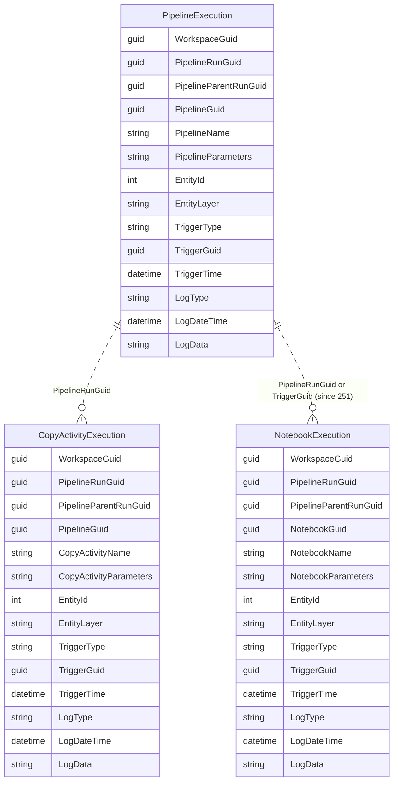
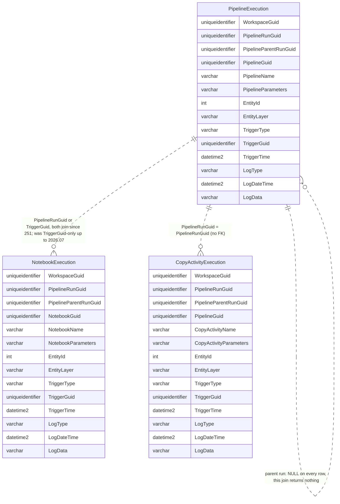
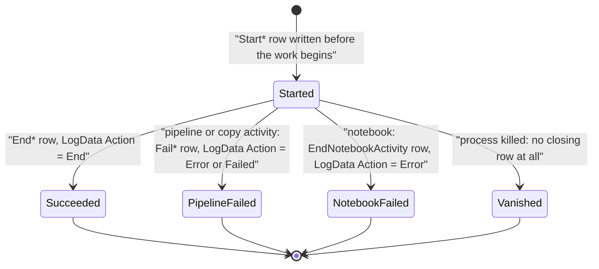
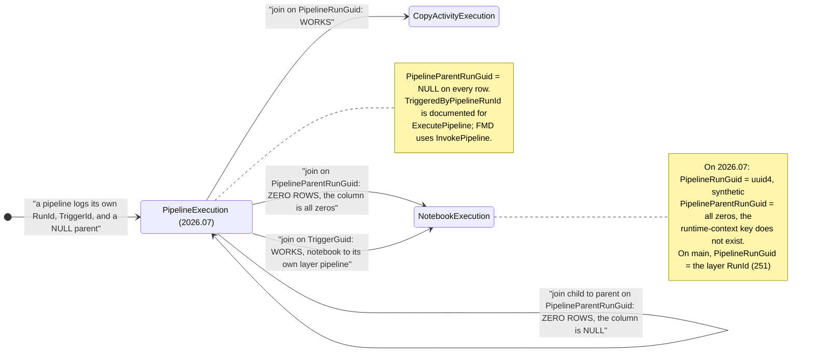

# Logging and auditing reference

Every pipeline, every copy activity and every notebook in FMD opens and closes an audit record in the configuration database. That trail is the framework's entire observability story: there is no semantic model, no alerting, no retention job, and nothing in FMD reads its own audit trail back.

What you get is a queryable, append-only history of every run, correlated by run GUID, that outlives the Fabric monitoring pane's retention and can be joined to the metadata that drove the run. Your compliance team can query it; they cannot query a monitoring pane. What you must supply is the querying, the indexing and the cleanup.

This page is what you need to do that: what each column actually holds at run time, the five spellings of "it failed", and a worked diagnosis of a failed Silver load.

The records live in the **`logging`** schema of `SQL_FMD_FRAMEWORK`, in three append-only tables:

| Table | One row per | Written by |
|---|---|---|
| `logging.PipelineExecution` | pipeline start, end or failure | `logging.sp_AuditPipeline` |
| `logging.CopyActivityExecution` | copy-activity start, end or failure | `logging.sp_AuditCopyActivity` |
| `logging.NotebookExecution` | notebook start or end | `logging.sp_AuditNotebook` |

> The upstream wiki's `Data-Observability.md` names these tables `audit.PipelineExecution`, `audit.NotebookExecution` and `audit.CopyActivityExecution`. There is no `audit` schema in the database; the schema is `logging` and the three table names are otherwise correct.

Three tables, fourteen columns each, and almost the same fourteen. The differences
are the point: a pipeline row names a pipeline, a notebook row names a notebook, a
copy row names a copy activity. Everything else is the correlation apparatus.



The two join lines are drawn differently on purpose. A copy activity really does
carry the `PipelineRunGuid` of the pipeline that ran it. A notebook is different,
and [#251](https://github.com/edkreuk/FMD_FRAMEWORK/pull/251) changed it: both layer
pipelines now pass their own `@pipeline().RunId` to the notebook as the
`PipelineRunGuid` parameter, so a notebook row carries **the `RunId` of the layer
pipeline that ran it** instead of a synthetic `uuid4()`. That is the join to use,
and it works for both Bronze and Silver. `TriggerGuid` also still ties a notebook
to its layer pipeline. Neither ties the notebook to the *whole* run: every pipeline
in a run carries a different `RunId` and `TriggerGuid`, because a pipeline still
cannot record the id of the pipeline that invoked it (see [where the chain is
broken](#how-a-run-holds-together-and-where-the-chain-is-broken)).

> Up to and including `2026.07`, the notebook's `PipelineRunGuid` was a fresh
> `uuid4()` and its `PipelineParentRunGuid` was the all-zeros GUID, so `TriggerGuid`
> was the only join that worked.

## What the schema does and does not give you

Three properties of these tables govern every query you will write against them.

**They are heaps.** No primary keys, no foreign keys, no `NOT NULL` columns, no check constraints. Every column in all three tables is nullable. Nothing prevents an orphaned row, and nothing enforces that `LogType` holds one of the values the framework actually writes.

**Events are paired, not merged.** A start row and an end row are two rows, not one row updated twice. Duration is the difference between two `LogDateTime` values that you correlate yourself. There is no `Status` column and no `RowsCopied` column: outcome and row counts live inside the free-text `LogData` JSON.

**`LogDateTime` is server time, and it is UTC.** All three procedures stamp it with `GETDATE()` on the configuration database and do not accept it as a parameter, so the ordering of events is consistent across pipelines and notebooks even though they run on different compute. In Fabric SQL database that clock is UTC, and there is no time-zone choice, so it lines up with the `GETUTCDATE()`-derived date folders that `vw_LoadSourceToLandingzone` builds for the landing zone. One caveat on precision: `GETDATE()` returns a `datetime`, whose resolution is roughly 3.33 ms, so despite the column being declared `DATETIME2(6)` the six digits are never populated and two events in the same tick can tie. Order by `LogDateTime`, but keep a stable tiebreaker.

**The whole database is mirrored to OneLake, and you cannot turn it off.** Mirroring for a Fabric SQL database is automatic on creation, always on, and mirrors every supported table with no option to skip. The three `logging` tables replicate along with the rest: the Fabric SQL database mirroring limitations impose no primary-key requirement, so having no key does not exclude them. The practical consequence is the one the closing section used to understate: **the audit trail is already in OneLake as Delta**, readable from Spark, from the SQL analytics endpoint and from a Direct Lake semantic model, at no extra effort and with no pipeline to build. The three `execution` views are *not* mirrored, because views never are, so anything you build on OneLake re-implements their joins.



The relationships drawn above are **conventions, not constraints**. No foreign key is declared anywhere in `logging`, and every correlation column is nullable like the rest.

Note the join keys in the diagram, and take them seriously. `PipelineExecution` and `CopyActivityExecution` correlate on `PipelineRunGuid`, because both are written from inside a pipeline. `NotebookExecution` correlates to its layer pipeline through `PipelineRunGuid` (the layer pipeline's `RunId`, since [#251](https://github.com/edkreuk/FMD_FRAMEWORK/pull/251)) and through `TriggerGuid`. What no column does is tie one pipeline to the pipeline that invoked it. This is the single most important thing on the page and it is explained in full [further down](#how-a-run-holds-together-and-where-the-chain-is-broken).

## The tables

The three tables share an identical 11-column tail and differ only in the three columns naming the activity. The full column-by-column transcription is in [the data model reference](./01-data-model.md); what follows is what each column *means* at run time.

### `logging.PipelineExecution`

| Column | Type | Null | What the framework puts in it |
|---|---|---|---|
| `WorkspaceGuid` | `UNIQUEIDENTIFIER` | NULL | `@pipeline().DataFactory`, the workspace the pipeline ran in |
| `PipelineRunGuid` | `UNIQUEIDENTIFIER` | NULL | `@pipeline().RunId`, this pipeline's own run |
| `PipelineParentRunGuid` | `UNIQUEIDENTIFIER` | NULL | `@pipeline()?.TriggeredByPipelineRunId`. Intended as the run of the pipeline that invoked it. **Measured: `NULL` on every row.** See [how a run holds together](#how-a-run-holds-together-and-where-the-chain-is-broken) |
| `PipelineGuid` | `UNIQUEIDENTIFIER` | NULL | `@pipeline().Pipeline`, the pipeline definition |
| `PipelineName` | `VARCHAR(100)` | NULL | `@pipeline().PipelineName` |
| `PipelineParameters` | `VARCHAR(8000)` | NULL | `NULL` on 73 of the 74 `sp_AuditPipeline` call sites. The exception is `SP_END_AUDIT_PIPELINE_NOFILE` in `PL_FMD_LDZ_COPY_FROM_FTP_01`, which passes `@item().SourceName` |
| `EntityId` | `INT` | NULL | `NULL` on almost every pipeline row, because a pipeline runs a whole layer rather than a single entity. The exception is `PL_FMD_LDZ_COPY_FROM_FTP_01`, whose three audit activities (`SP_END_AUDIT_PIPELINE_NOFILE`, `SP_END_AUDIT_PIPELINE_CP`, `SP_FAIL_AUDIT_PIPELINE_CP`) sit inside the `ForEach` and pass `@item().EntityId`, so FTP pipeline rows carry a `LandingzoneEntityId` |
| `EntityLayer` | `VARCHAR(50)` | NULL | `Control`, `Landingzone`, `Bronze` or `Silver` |
| `TriggerType` | `VARCHAR(50)` | NULL | `@pipeline().TriggerType`: `Manual`, `ScheduleTrigger`, and so on |
| `TriggerGuid` | `UNIQUEIDENTIFIER` | NULL | `@pipeline().TriggerId` |
| `TriggerTime` | `DATETIME2(6)` | NULL | `@pipeline().TriggerTime` |
| `LogType` | `VARCHAR(50)` | NULL | `StartPipeline`, `EndPipeline`, or a failure marker (see below) |
| `LogDateTime` | `DATETIME2(6)` | NULL | `GETDATE()` on the configuration database |
| `LogData` | `VARCHAR(8000)` | NULL | JSON: `{"Action":"Start"}`, `{"Action":"End"}`, or `{"Action":"Error","Message":...}` |

### `logging.CopyActivityExecution`

Same tail, with `CopyActivityName` and `CopyActivityParameters` in place of `PipelineName` / `PipelineParameters`. It keeps `PipelineGuid`, because a copy activity always runs inside a pipeline.

Two of its columns hold something other than what their names suggest, and you need to know this before you write a query:

- **`CopyActivityName` holds the *pipeline* name.** Every `PL_FMD_LDZ_COPY_FROM_*` pipeline passes `@pipeline().PipelineName`, not the name of the copy activity. So this column tells you `PL_FMD_LDZ_COPY_FROM_ASQL_01`, not `CP_source_datalandingzone`.
- **`CopyActivityParameters` holds the source object name.** It is `@item().SourceName` from the `ForEach` over `execution.vw_LoadSourceToLandingzone`, so it is the table or file being extracted.

`EntityId` here is `@item().EntityId`, which for the landing-zone hop is the `LandingzoneEntityId`, and `EntityLayer` is always `Landingzone`.

### `logging.NotebookExecution`

Same tail, with `NotebookGuid`, `NotebookName` and `NotebookParameters`. **This is the table where the column names mislead most, and getting it wrong costs you the whole query.** A notebook runs in a Spark session, not in a pipeline, so it cannot read `@pipeline().RunId`. The orchestrator fills the correlation columns itself, and two of the three are useless:

| Column | What it actually holds | Usable? |
|---|---|---|
| `PipelineRunGuid` | the layer pipeline's `RunId`, passed in as a parameter since [#251](https://github.com/edkreuk/FMD_FRAMEWORK/pull/251) | **Yes.** Both layer pipelines pass `@pipeline().RunId`, so this joins `NotebookExecution` to the `PipelineExecution` row of its layer. Was a synthetic `uuid4()` up to `2026.07`. |
| `PipelineParentRunGuid` | a real GUID equal to the row's own `PipelineRunGuid`, on both layers | **Adds nothing over `PipelineRunGuid`, so do not join on it.** Since [#270](https://github.com/edkreuk/FMD_FRAMEWORK/pull/270) (merged) both `PL_FMD_LOAD_BRONZE` and `PL_FMD_LOAD_SILVER` pass the same `@if(empty(string(pipeline()?.TriggeredByPipelineRunId)), pipeline().RunId, ...)`, so a notebook row on either layer carries a real GUID that equals its own `PipelineRunGuid`. It does not capture the invoking `PL_FMD_LOAD_ALL`, because `TriggeredByPipelineRunId` is `NULL` under `InvokePipeline`. **Use `PipelineRunGuid`, which is correct for both layers.** Was all-zeros everywhere up to `2026.07`; between [#251](https://github.com/edkreuk/FMD_FRAMEWORK/pull/251) and #270 it was real for Bronze but all-zeros for Silver, a transient state no release shipped. |
| `TriggerGuid` | `@pipeline().TriggerId`, passed in as a notebook parameter | **Yes.** Also ties a notebook row to its layer pipeline. |

The other three:

- **`NotebookGuid` is not the notebook's item ID.** It is `NotebookExecutionId`, a `uuid4()` minted once per run of `NB_FMD_PROCESSING_PARALLEL_MAIN` and injected into every child notebook in that batch. All notebooks launched by one orchestrator run therefore share one `NotebookGuid`. It identifies the *batch*, not the notebook.
- **`NotebookName`** is `notebookutils.runtime.context['currentNotebookName']`, so it *is* the real notebook: `NB_FMD_LOAD_LANDING_BRONZE` or `NB_FMD_LOAD_BRONZE_SILVER`.
- **`NotebookParameters`** holds `TargetName`, the target table of that entity, nothing more.

And one trap. In `NB_FMD_LOAD_BRONZE_SILVER`, the audit call passes `@EntityId = BronzeLayerEntityId` while `EntityLayer` is `Silver`. The `EntityId` on a Silver notebook row is therefore the **`BronzeLayerEntityId`**, not the `SilverLayerEntityId`. The `SilverLayerEntityId` does appear, but only inside the `LogData` JSON on a successful end row. Join Silver notebook rows to `integration.BronzeLayerEntity`, not to `integration.SilverLayerEntity`.

## `LogType`, and the one failure it still does not mark

`LogType` is the event marker. The comment in all three procedures reads: "Choice between Start/End/Fail, based on this Type the correct execution will be done." No check constraint enforces the domain, and the values actually written by the shipped pipelines and notebooks are these:

| Table | Start | End | Failure |
|---|---|---|---|
| `PipelineExecution` | `StartPipeline` | `EndPipeline` | `FailedPipeline` |
| `CopyActivityExecution` | `StartCopyActivity` | `EndCopyActivity` | `FailedCopyActivity` |
| `NotebookExecution` | `StartNotebookActivity` | `EndNotebookActivity` | none |

> **In releases up to and including `2026.07` a pipeline failure had three spellings, and one of the copy start markers was misspelt.** `PL_FMD_LOAD_BRONZE` wrote `FailPipeline`, `PL_FMD_LOAD_SILVER` wrote `FailPipelineActivity`, and two copy pipelines wrote `StartCopyAcitvity` with the `t` and `v` transposed. An equality filter was blind to a Bronze or Silver failure and to every ADLS and ADF copy. Both were fixed on 2026-07-14 ([#255](https://github.com/edkreuk/FMD_FRAMEWORK/pull/255), [#259](https://github.com/edkreuk/FMD_FRAMEWORK/pull/259)); on a pinned `2026.07`, filter with `LIKE`, never equality.

At `main` a pipeline failure is `FailedPipeline` everywhere and equality is safe, but **keep `LogType LIKE 'Fail%'` and `LIKE 'Start%'` in your queries anyway**: it costs nothing, it still saves a pinned deployment, and it survives the next spelling nobody has introduced yet.

**A failed notebook does not write a failure `LogType` at all, and that has not changed.** Both loader notebooks wrap their merge in `try / except`, and on failure they try to write an ordinary `EndNotebookActivity` row whose `LogData` is `{"Action": "Error", "ErrorMessage": "<first 500 characters>"}` before re-raising. When that row is written, a notebook failure is invisible in `LogType` and visible only in `LogData`. But it may not be written at all: if the notebook fails in the primary-key check that runs before that `try`/`except`, the exception is uncaught and the failure shows up only as an unclosed `Start` row (see [step 4](#step-4-if-there-is-no-error-row-at-all)). Either way, do not look for a `Fail` `LogType` on a notebook: there is none. This is the single most important fact on this page for anyone diagnosing a broken load.



The `Vanished` state is real and you must design for it. The audit write is an activity like any other; if a Spark session is evicted or a pipeline is cancelled, the closing row is simply never written. An open `Start*` row with no matching `End*` or `Fail*` row after a plausible runtime means the run died, and it is as much a failure signal as an explicit error row.

## `LogData`, the payload

`LogData` is `VARCHAR(8000)` holding JSON. It is not validated, and it is the only place where outcome and volume are recorded. Six shapes exist, and the two failure shapes are not the same.

**Start, everywhere:**

```json
{ "Action": "Start" }
```

**End, from a pipeline:**

```json
{ "Action": "End" }
```

**End, from a copy activity.** The whole Copy activity output object is embedded, which is where you find the row and byte counts:

```json
{ "Action": "End",
  "CopyOutput": { "rowsRead": 70510, "rowsCopied": 70510, "dataWritten": 3184512,
                  "copyDuration": 17, "executionDetails": [ ... ] } }
```

**End, from a loader notebook.** The notebook builds its own summary:

```json
{ "Action": "End",
  "CopyOutput": { "Total Runtime": "0:00:41.912",
                  "TargetSchema": "sales", "TargetName": "orders",
                  "SourceFilePath": "...", "SourceFileName": "orders_202607120931.parquet",
                  "LandingzoneEntityId": "12", "EntityId": "34",
                  "StartTime": "...", "EndTime": "..." } }
```

`SourceFileName` is set to the literal string `FILE NOT FOUND` when the notebook cannot find the landed file. That is a clean exit, not an error: the notebook marks the landing-zone row processed and exits, so a missing file leaves an `End` row, not an `Error` row.

**Failed, with no message at all.** This is the shape the `PL_FMD_LDZ_COMMAND_*` pipelines and several of the `PL_FMD_LDZ_COPY_FROM_*` pipelines write on failure, and it is the most common failure payload in the framework (20 of the audit activities use it):

```json
{ "Action": "Failed" }
```

There is no `Message` key. A `Fail*` row carrying this payload tells you *that* the pipeline failed and nothing whatever about *why*: the reason, if it was captured at all, is in a notebook or copy-activity row further down the chain. Do not build a diagnosis on the pipeline's own payload.

**Error, with a message:**

```json
{ "Action": "Error", "Message": "<the Fabric activity error object>" }
```

```json
{ "Action": "Error", "ErrorMessage": "<the Python exception, truncated to 500 characters>" }
```

`PL_FMD_LOAD_ALL`, `PL_FMD_LOAD_BRONZE` and `PL_FMD_LOAD_SILVER` write `Action = Error` with a `Message`. Note the two different key names. Pipelines and copy activities write `Message`; notebooks write `ErrorMessage`. A query looking for failures must accept both, and must not assume the JSON parses: the copy-activity error object is interpolated into the string by a Fabric expression and is not escaped, so a quotation mark in a source error message can produce a `LogData` value that `OPENJSON` will reject. Search it as text.

## The procedures, and who calls them

All three procedures are pure inserts. They read nothing, return nothing, and take the same 13 parameters, all defaulting to `NULL` except `@LogType`.

| Procedure | Called from | How |
|---|---|---|
| `logging.sp_AuditPipeline` | every `PL_FMD_*` pipeline (74 call sites) | `SqlServerStoredProcedure` activities named `SP_START_AUDIT_PIPELINE`, `SP_END_AUDIT_PIPELINE`, `SP_FAIL_AUDIT_PIPELINE` |
| `logging.sp_AuditCopyActivity` | the 10 `PL_FMD_LDZ_COPY_FROM_*` pipelines (36 call sites) | `SP_START_AUDIT_PIPELINE_CP` and friends, inside the `ForEach` over the entities |
| `logging.sp_AuditNotebook` | `NB_FMD_LOAD_LANDING_BRONZE`, `NB_FMD_LOAD_BRONZE_SILVER`, `NB_FMD_CUSTOM_NOTEBOOK_TEMPLATE` | `pyodbc`, via the notebook's `execute_with_outputs` helper |

The pipelines call the procedure through the standard Fabric stored-procedure activity, so the parameters are bound, not interpolated.

**The notebooks bind too, since [#191](https://github.com/edkreuk/FMD_FRAMEWORK/pull/191) (merged).** `NB_FMD_UTILITY_FUNCTIONS.build_exec_statement` emits `@Key=?` placeholders and returns the ordered value list alongside the statement, and `execute_with_outputs` passes that list to `cursor.execute(sql, params)`, so the values are bound. The caller notebooks pass their arguments as keywords (`execute_with_outputs(SP_AUDIT_NOTEBOOK, ..., **audit_params, LogData=..., LogType=...)`) rather than assembling an f-string. Every audit call in the framework, pipeline and notebook alike, now binds its parameters, which is the repository convention: parameterised `pyodbc`, never string interpolation.

> In releases up to and including `2026.07` (and at `1ba7974`), the notebooks did not bind: `build_exec_statement` interpolated every value into the statement text with an f-string, quoting strings by hand (`@Name='value'`), and `execute_with_outputs` handed the finished string to `cursor.execute` as a single argument with no parameter sequence. [#191](https://github.com/edkreuk/FMD_FRAMEWORK/pull/191) replaced that with bound parameters.

A notebook can still fail without leaving an error row, and the mechanism is worth following through because you will meet it while diagnosing. The primary-key and duplicate-key checks `raise ValueError` in a cell that runs *before* the cell holding the `try`/`except` that writes the error audit, so that exception propagates uncaught: the notebook stops after its `Start` row, and no `Error` row is written. The framework's own `raise ValueError(f"PK: {pk_column} doesn't exist in the source.")` is one of these. Inside the `try`/`except`, the error audit is best-effort: a failure to write it is caught, printed, and swallowed, and the original error re-raised. On `main` this in-`try` write succeeds again, restored by [#277](https://github.com/edkreuk/FMD_FRAMEWORK/pull/277): between [#191](https://github.com/edkreuk/FMD_FRAMEWORK/pull/191), which removed the `EndNotebookActivity` variable but left the `except`-block call referencing it and raising `NameError`, and #277, an in-`try` Bronze or Silver write failure left no `Error` row. So the failure that reliably leaves no `Error` row is the primary-key check above, which raises before the `try` on every version; an in-`try` failure writes its row on `main` and up to and including `2026.07`, subject to the apostrophe below:

```python
except Exception as audit_error:
    print(f"Audit logging failed: {audit_error}")  # best-effort audit logging
raise
```

So a deliberate primary-key failure shows up as an unclosed `Start*` row with nothing to explain it. See step 4 of the worked example.

> In releases up to and including `2026.07` (and at `1ba7974`), a second path could also lose the row: the failure payload `json.dumps({"Action": "Error", "ErrorMessage": str(e)[:500]})` was interpolated into `@LogData='...'`, and because `json.dumps` escapes double quotes but not single quotes, an exception message containing an apostrophe closed the T-SQL literal early and the audit `EXEC` failed. [#191](https://github.com/edkreuk/FMD_FRAMEWORK/pull/191) binds `@LogData`, so an apostrophe no longer closes the literal.

Note the asymmetry in coverage. A pipeline logs `Start`, `End` and `Fail`. A copy activity logs `Start`, `End` and `Fail`, and it logs a `FailedCopyActivity` row for a failure of either the copy itself or the subsequent `LK_GET_LASTLOADDATE` watermark lookup. A notebook logs only `Start` and `End`, and when it records a failure at all it encodes it in the payload rather than a `Fail` `LogType`; on `main` a failure often leaves no closing row at all (see above).

## How a run holds together, and where the chain is broken

**No single column stamps every row of one end-to-end run**, and one specific link is still missing: a pipeline cannot be tied to the pipeline that invoked it. But a notebook can now be tied to its layer pipeline by a real key, which it could not before. This section is the one to read before writing a monitoring query.

The measurements below are from a live audit trail on 2026-07-13, against a deployment of `1ba7974`. The `#251` behaviour is verified against the source at `main` (`6ec410d`); the FMDDEMO deployment those numbers came from predates it, so where a value changed with `#251` it is marked as source-verified rather than re-measured.

### What binds, and what does not

Every pipeline and copy-activity audit call is a stored-procedure activity inside a pipeline, so it can read the pipeline's own system variables:

| Column | Expression the pipeline passes | What is actually in the row |
|---|---|---|
| `PipelineRunGuid` | `@pipeline().RunId` | the pipeline's own run. **Correct.** |
| `TriggerGuid` | `@pipeline().TriggerId` | a trigger id, **different for every pipeline in the run** |
| `PipelineParentRunGuid` | `@pipeline()?.TriggeredByPipelineRunId` | **`NULL`, on every pipeline row.** 19 of 19 in the run we measured. |

So:

- **A copy activity joins to its copy pipeline on `PipelineRunGuid`.** This works, and it is how you get from a failed copy to the pipeline that ran it.
- **A pipeline still does not join to the pipeline that invoked it.** `SELECT ... FROM PipelineExecution child JOIN PipelineExecution parent ON child.PipelineParentRunGuid = parent.PipelineRunGuid` returns **zero rows**, because the `PipelineParentRunGuid` on a pipeline row is `NULL`. This did not change on 2026-07-14; only the notebook side did.
- **`TriggerGuid` does not span the run either.** `PL_FMD_LOAD_ALL`, `PL_FMD_LOAD_LANDINGZONE` and `PL_FMD_LOAD_BRONZE` each carry a different one.

**The layers are therefore reconstructed by time, not by key.** Order `logging.PipelineExecution` by `LogDateTime` and read the sequence. That is what the [runbook](../02-how-to/05-diagnose-a-failed-load.md) does.

> **The seam is still here, for pipelines.** The framework passes `@pipeline()?.TriggeredByPipelineRunId`, which Microsoft documents as *"Applicable when the pipeline run is triggered by an **ExecutePipeline** activity. Evaluate to Null when used in other circumstances"* ([Fabric expression language](https://learn.microsoft.com/fabric/data-factory/expression-language)). FMD invokes its children with the **Invoke pipeline** activity (`"type": "InvokePipeline"`, `"operationType": "InvokeFabricPipeline"`), not `ExecutePipeline`, so the variable is `Null` on every pipeline row. A parent that wants to be identifiable to its child would have to pass its `@pipeline().RunId` as an ordinary parameter, which is exactly what the notebook fix below does, and what the pipeline calls still do not.

### The notebooks were broken in a different way, and `#251` mostly fixes it

> **This subsection describes the behaviour up to and including `2026.07`.** On `main`, [#251](https://github.com/edkreuk/FMD_FRAMEWORK/pull/251) makes both layer pipelines pass `PipelineRunGuid = @pipeline().RunId` to the notebook, so the notebook's `PipelineRunGuid` is now the layer pipeline's run id and joins cleanly. Since [#270](https://github.com/edkreuk/FMD_FRAMEWORK/pull/270) (merged) both layers also pass `PipelineParentRunGuid` via the same `@if(empty(string(pipeline()?.TriggeredByPipelineRunId)), pipeline().RunId, ...)`, so a notebook row on either layer carries a real GUID equal to its own `RunId`. That still adds nothing over `PipelineRunGuid` and does not capture the invoking `PL_FMD_LOAD_ALL`, so **use `PipelineRunGuid` as the notebook-to-layer join on `main`.** The description below is what a pinned `2026.07` deployment still does.

A notebook is not a pipeline. It cannot read `@pipeline().RunId`, because that system variable does not exist inside a Spark session. On `2026.07`, `PL_FMD_LOAD_BRONZE` passes exactly four parameters to `NB_FMD_PROCESSING_PARALLEL_MAIN`: `Path`, `TriggerGuid`, `TriggerTime`, `TriggerType`. It does not pass its run ID.

The orchestrator therefore fills the two correlation columns itself, and **neither value is usable**:

```python
PipelineParentRunGuid = notebookutils.runtime.context.get('PipelineParentRunGuid')   # line 158
PipelineRunGuid       = str(uuid.uuid4())                                            # line 159
if not PipelineParentRunGuid:
    PipelineParentRunGuid = '00000000-0000-0000-0000-000000000000'                   # line 163
```

- **`PipelineRunGuid` is a fresh `uuid4()`, up to and including `2026.07`.** It is a synthetic batch ID, shared by every notebook in one orchestrator run, and it matches no pipeline row anywhere. On `main`, [#251](https://github.com/edkreuk/FMD_FRAMEWORK/pull/251) replaces it with the layer pipeline's `RunId`.
- **`PipelineParentRunGuid` is always `00000000-0000-0000-0000-000000000000`.** The key `PipelineParentRunGuid` does not exist in the notebook runtime context. Microsoft's property table for `notebookutils.runtime.context` lists 25 properties, and this is not one of them; the pipeline-related keys are `isForPipeline` and `activityId`, and `parentRunId` exists only for nested reference runs. The `.get()` therefore returns `None` on every run, and the fallback on line 163 fires every time.

So the column that looks like it links a notebook to its pipeline is a constant. **Joining `NotebookExecution` to `PipelineExecution` on `PipelineParentRunGuid` returns zero rows, always**, and the zero result reads exactly like "the Silver load did no work", which sends you looking upstream for a failure that is not there.

### `TriggerGuid` is the join that works

One column survives, because the pipeline passes it explicitly as a notebook parameter, bound to the same expression it writes into its own log rows:

```
pipeline audit call:  TriggerGuid <- @pipeline().TriggerId
notebook parameter:   TriggerGuid <- @pipeline().TriggerId
```

**Up to and including `2026.07`, correlate notebooks to pipelines on `TriggerGuid`.** Not on `PipelineParentRunGuid`, which is zeros, and not on `PipelineRunGuid`, which is a synthetic `uuid4()` then. On `main`, join on `PipelineRunGuid` instead, which is the layer pipeline's `RunId` since [#251](https://github.com/edkreuk/FMD_FRAMEWORK/pull/251) (see the callout above); `TriggerGuid` still works on both.

The diagram below is the **`2026.07` state**: the notebook's `PipelineRunGuid` is a synthetic `uuid4()` and its `PipelineParentRunGuid` is all-zeros, so `TriggerGuid` is the only notebook-to-layer join. On `main`, `PipelineRunGuid` is the layer pipeline's `RunId` and is the join to use (see the callout above).



> **Recorded discrepancy.** This is a defect in the framework, not in this page. `logging.NotebookExecution.PipelineParentRunGuid` is intended to link a notebook run to the pipeline that started it, and it cannot, because the runtime-context key it reads is not one Fabric provides. The fix is for the layer pipelines to pass `@pipeline().RunId` to the orchestrator as a parameter, exactly as they already pass `@pipeline().TriggerId`, and it is [offered upstream as #251](https://github.com/edkreuk/FMD_FRAMEWORK/pull/251). Verified against `src/PL_FMD_LOAD_SILVER.DataPipeline/pipeline-content.json`, `src/NB_FMD_PROCESSING_PARALLEL_MAIN.Notebook/notebook-content.py` lines 158 to 163, and the property table in [NotebookUtils runtime context for Fabric](https://learn.microsoft.com/fabric/data-engineering/notebookutils/notebookutils-runtime#view-session-context).

To walk one run end to end:

1. **Find the run by time, not by key.** Take the most recent `PL_FMD_LOAD_ALL` `StartPipeline` row, and its `EndPipeline` row. Everything between those two timestamps belongs to that run. There is no GUID that does this for you.
2. **The layer and copy pipelines are the `PipelineExecution` rows inside that window**, in `LogDateTime` order. Their `PipelineParentRunGuid` is `NULL`, so the tree is reconstructed from the sequence and from `EntityLayer`, not from a join.
3. **Copy-activity rows join on `CopyActivityExecution.PipelineRunGuid = <the copy pipeline's PipelineRunGuid>`**, because the copy activity runs inside that pipeline and logs its run ID. This join works.
4. **Notebook rows join on `NotebookExecution.TriggerGuid = <the layer pipeline's TriggerGuid>`.** Note the qualifier: each layer pipeline has its own `TriggerGuid`, so this ties a notebook to **the layer pipeline that ran it**, not to the whole run. Use `PL_FMD_LOAD_BRONZE`'s `TriggerGuid` for the Bronze notebooks and `PL_FMD_LOAD_SILVER`'s for Silver.

## Worked example: a Silver load failed, why?

> **This worked example follows the `2026.07` path**, where a notebook's `PipelineRunGuid` is a synthetic `uuid4()` so `TriggerGuid` is the only notebook-to-pipeline join, the Silver pipeline spells its failure `FailPipelineActivity` and the Bronze pipeline `FailPipeline`. On `main`, substitute `PipelineRunGuid` for the `TriggerGuid` join (it is the layer pipeline's `RunId` since [#251](https://github.com/edkreuk/FMD_FRAMEWORK/pull/251); `TriggerGuid` still works too) and filter failures on `LogType = 'FailedPipeline'` everywhere. Keeping `LIKE 'Fail%'` and the `TriggerGuid` join costs nothing and is correct on both.

You know that `sales.orders` did not refresh, or `PL_FMD_LOAD_ALL` reported a failure, and you want the reason. Work down from the pipeline to the notebook.

### Step 1: find the failed run

```sql
SELECT  PipelineRunGuid,
        TriggerGuid,
        PipelineName,
        EntityLayer,
        LogType,
        LogDateTime,
        LogData
FROM    logging.PipelineExecution
WHERE   LogDateTime >= DATEADD(day, -1, GETDATE())
  AND   LogType LIKE 'Fail%'
ORDER   BY LogDateTime DESC;
```

`LogType LIKE 'Fail%'`, not `= 'FailedPipeline'`: the Silver pipeline spells it `FailPipelineActivity` and the Bronze pipeline spells it `FailPipeline`.

A row here with `EntityLayer = 'Silver'` tells you the Silver pipeline failed. Its `LogData` will be `{"Action":"Failed"}` or carry the orchestrator notebook's error object. That is the *pipeline's* view: it knows the notebook activity failed, not which entity broke.

**Keep the `TriggerGuid`, not the `PipelineRunGuid`.** The notebook rows carry the same `TriggerGuid`. They do not carry this pipeline's run ID under any column.

### Step 2: find the notebook that actually failed

Substitute the `TriggerGuid` from step 1:

```sql
DECLARE @TriggerGuid UNIQUEIDENTIFIER = 'the TriggerGuid from step 1';

SELECT  n.NotebookName,
        n.EntityId              AS BronzeLayerEntityId,   -- yes, Bronze: see the note below
        n.NotebookParameters,
        n.LogType,
        n.LogDateTime,
        n.LogData
FROM    logging.NotebookExecution AS n
WHERE   n.TriggerGuid  = @TriggerGuid
  AND   n.EntityLayer  = 'Silver'
  AND   n.LogData LIKE '%"Action": "Error"%'
ORDER   BY n.LogDateTime;
```

Three things about this query are not optional.

**Join on `TriggerGuid`, and add `EntityLayer`.** Not on `PipelineParentRunGuid`: since [#270](https://github.com/edkreuk/FMD_FRAMEWORK/pull/270) it just repeats the layer pipeline's own `RunId` and adds nothing over `PipelineRunGuid`, and up to and including `2026.07` it was `00000000-0000-0000-0000-000000000000` on every Silver notebook row and returned nothing. Up to and including `2026.07`, not on `PipelineRunGuid` either, which is then a `uuid4()` the orchestrator invented and matches no pipeline row; on `main`, `PipelineRunGuid` is the layer pipeline's `RunId` since [#251](https://github.com/edkreuk/FMD_FRAMEWORK/pull/251) and joins cleanly. `TriggerGuid` fills the same value in both tables on both releases, and because every notebook in the whole run shares it, `EntityLayer` is what narrows you to Silver.

**Filter on `LogData`, not on `LogType`.** A failed notebook writes `LogType = 'EndNotebookActivity'`, exactly like a successful one. The `{"Action": "Error"}` marker in the payload is the only distinguishing signal. Note the space after the colon: `NB_FMD_LOAD_BRONZE_SILVER` builds this JSON with `json.dumps`, which emits `{"Action": "Error", "ErrorMessage": ...}`. The `LIKE` above matches that. Use `LIKE '%Error%'` if you would rather not depend on the spacing.

**`EntityId` on a Silver notebook row is the `BronzeLayerEntityId`.** The Silver notebook logs the Bronze entity ID. Resolve it against `integration.BronzeLayerEntity`, or read the `SilverLayerEntityId` out of the `LogData` on a successful row.

### Step 3: read the error, and name the entity

The `ErrorMessage` in `LogData` is the Python exception from the notebook, truncated to 500 characters. It answers the question directly. The failures the loader notebooks raise on purpose are worth recognising on sight:

| `ErrorMessage` contains | What it means | Where to fix it |
|---|---|---|
| `PK: <col> doesn't exist in the source.` | a column named in `integration.BronzeLayerEntity.PrimaryKeys` is not in the landed file | the `PrimaryKeys` metadata, or the source projection |
| `Source file contains duplicated rows for PK: ...` | the declared business key is not unique in the source | the source data, or the key declaration |
| `AnalysisException`, `Delta`, `MERGE` | a schema change or type conflict against the existing Delta table | usually the source schema drifted |
| `Login failed` / `ODBC` | the notebook could not reach the configuration database | connection, not data |

Resolve the entity to a name in the same breath:

```sql
SELECT  b.BronzeLayerEntityId,
        b.[Schema] + '.' + b.[Name] AS BronzeTable,
        s.SilverLayerEntityId,
        s.[Schema] + '.' + s.[Name] AS SilverTable,
        l.SourceSchema + '.' + l.SourceName AS SourceObject
FROM    integration.BronzeLayerEntity   AS b
JOIN    integration.LandingzoneEntity   AS l ON l.LandingzoneEntityId = b.LandingzoneEntityId
LEFT JOIN integration.SilverLayerEntity AS s ON s.BronzeLayerEntityId = b.BronzeLayerEntityId
WHERE   b.BronzeLayerEntityId = <EntityId from step 2>;
```

### Step 4: if there is no error row at all

If step 2 returns nothing, the notebook did not fail; it never finished. Look for an unclosed start:

```sql
SELECT  s.NotebookName,
        s.EntityId,
        s.NotebookParameters AS TargetName,
        s.LogDateTime        AS StartedAt,
        DATEDIFF(minute, s.LogDateTime, GETDATE()) AS MinutesOpen
FROM    logging.NotebookExecution AS s
WHERE   s.LogType     = 'StartNotebookActivity'
  AND   s.TriggerGuid = @TriggerGuid
  AND   s.EntityLayer = 'Silver'
  AND   NOT EXISTS (
            SELECT 1
            FROM   logging.NotebookExecution AS e
            WHERE  e.LogType              = 'EndNotebookActivity'
              AND  e.PipelineRunGuid      = s.PipelineRunGuid
              AND  e.EntityId             = s.EntityId
              AND  e.NotebookName         = s.NotebookName
              AND  e.LogDateTime         >= s.LogDateTime
        )
ORDER   BY s.LogDateTime;
```

An unclosed start has two causes, and they need different responses.

**The entity was killed rather than raised**: a Spark session eviction, a cancelled pipeline, a capacity throttle. The framework wrote nothing about it because it never got the chance. Correlate the `StartedAt` with the Fabric monitoring pane.

**Or the notebook did fail before it could close its row.** The primary-key and duplicate-key checks `raise ValueError` in a cell that runs before the `try`/`except` that writes the error audit, so that failure propagates uncaught and leaves the `Start` row open with no `Error` row. The framework's own duplicate-and-missing-key check raises `PK: <col> doesn't exist in the source.`. So the single most likely deliberate failure in the framework is also one that can leave no error row. If an entity is open with no closing row and the Fabric monitoring pane shows the notebook *failed* rather than vanished, look for a missing or duplicate primary key on that entity before you look for a throttle. (In releases up to and including `2026.07`, an in-`try` exception whose message contained an apostrophe was a second way to lose the row, since the value was interpolated into the audit `EXEC` rather than bound; [#191](https://github.com/edkreuk/FMD_FRAMEWORK/pull/191) binds it.)

And if the Silver load produced no notebook rows at all, it did no work. The Silver pipeline only runs notebooks for rows where `execution.PipelineBronzeLayerEntity.IsProcessed = 0`. An empty Silver run usually means Bronze never queued anything, so the failure is upstream: repeat step 1 for `EntityLayer = 'Bronze'` and `EntityLayer = 'Landingzone'`.

### The whole diagnosis in one query

Once you know the shape, the common case collapses into a single statement: every entity that failed in the last day, in any layer, with its error text.

```sql
SELECT  n.LogDateTime,
        n.EntityLayer,
        n.NotebookName,
        n.EntityId,
        n.NotebookParameters AS TargetName,
        n.TriggerGuid,
        n.LogData
FROM    logging.NotebookExecution AS n
WHERE   n.LogDateTime >= DATEADD(day, -1, GETDATE())
  AND   n.LogData LIKE '%"Action": "Error"%'

UNION ALL

SELECT  c.LogDateTime,
        c.EntityLayer,
        c.CopyActivityName,
        c.EntityId,
        c.CopyActivityParameters,
        c.TriggerGuid,
        c.LogData
FROM    logging.CopyActivityExecution AS c
WHERE   c.LogDateTime >= DATEADD(day, -1, GETDATE())
  AND   c.LogType LIKE 'Fail%'

ORDER   BY 1 DESC;
```

`TriggerGuid` is selected rather than `PipelineParentRunGuid` for the reason given above: since [#270](https://github.com/edkreuk/FMD_FRAMEWORK/pull/270) the latter just repeats the notebook row's own `PipelineRunGuid` (and up to and including `2026.07` it was always zeros), so it adds nothing. `TriggerGuid` is what lets you take any line of this result and pull up the pipeline rows for the same run.

Notebook failures are found in `LogData`, copy-activity failures in `LogType`. That asymmetry is the framework's, not a quirk of this query.

## Operational notes

**Nothing prunes these tables.** They are append-only, they have no indexes and no partitioning, and no retention job ships with the framework. A daily full load of a few hundred entities writes a few thousand rows a day, which is harmless for a long time, but plan the cleanup before it stops being harmless. A `DELETE` on `LogDateTime` is safe: nothing in the framework reads its own audit trail. Note that the rows accumulate twice, in the SQL table and in its OneLake replica, and that a `DELETE` propagates to both.

**Add an index before you query in anger, but not a columnstore one.** The tables are heaps. If you build monitoring on top of them, a nonclustered index on `(LogDateTime)` and one on `(TriggerGuid, EntityLayer, LogType)` turn the queries above from scans into seeks, and they cannot break the framework, because no shipped code has a query plan to regress. Index `TriggerGuid` rather than `PipelineParentRunGuid`: on `NotebookExecution` the latter only repeats each row's own `PipelineRunGuid` since [#270](https://github.com/edkreuk/FMD_FRAMEWORK/pull/270) (and held one distinct value up to and including `2026.07`), so an index on it buys nothing over `PipelineRunGuid`. Nonclustered indexes are safe under mirroring; `ALTER INDEX ALL` is not, though altering an individual index by name is allowed.

The instinct for a large append-only log table is a **clustered columnstore index**, and that is the one thing you must not do here. While mirroring is active a CCI cannot be created on an existing table, and if you stop mirroring, add it and restart, **the table stops being mirrored altogether**. You would trade the OneLake replica for a compression win.

**`TriggerTime` loses sub-second precision.** All three procedures declare `@TriggerTime DATETIME` while the column is `DATETIME2(6)`. Do not use it for ordering; use `LogDateTime`, which is stamped server-side.

**There is no semantic model, but the data is already where one would read it.** The upstream wiki notes that an audit and logging semantic model "is not yet available", and that remains true at the pinned commit. Monitoring on top of `logging` is yours to build, and the queries on this page are the raw material for it. What the framework does hand you for free is the hard part of the plumbing: because a Fabric SQL database mirrors every table to OneLake automatically, the three `logging` tables are already Delta tables in OneLake, queryable from Spark and from the SQL analytics endpoint, and available to a Direct Lake semantic model without a single line of ingestion. Build the model; you do not have to build the pipeline that feeds it.

---

Source: `src/Config_Database/logging/Tables/{PipelineExecution,CopyActivityExecution,NotebookExecution}.sql` @ b5fb08e
Source: `src/Config_Database/logging/StoredProcedures/{sp_AuditPipeline,sp_AuditCopyActivity,sp_AuditNotebook}.sql` @ b5fb08e
Source: `src/PL_FMD_LOAD_ALL.DataPipeline/pipeline-content.json` @ b5fb08e
Source: `src/PL_FMD_LOAD_BRONZE.DataPipeline/pipeline-content.json` @ b5fb08e
Source: `src/PL_FMD_LOAD_SILVER.DataPipeline/pipeline-content.json` @ b5fb08e
Source: `src/PL_FMD_LDZ_COPY_FROM_ASQL_01.DataPipeline/pipeline-content.json` @ b5fb08e
Source: `src/NB_FMD_PROCESSING_PARALLEL_MAIN.Notebook/notebook-content.py` @ b5fb08e
Source: `src/NB_FMD_LOAD_LANDING_BRONZE.Notebook/notebook-content.py` @ b5fb08e (the primary-key and duplicate-key `raise` precede the audit `try`/`except`; the audit call passes keyword arguments)
Source: `src/NB_FMD_LOAD_BRONZE_SILVER.Notebook/notebook-content.py` @ b5fb08e
Source: `src/NB_FMD_UTILITY_FUNCTIONS.Notebook/notebook-content.py` @ b5fb08e (`build_exec_statement` emits `@Key=?` placeholders and returns the value list; `execute_with_outputs` binds via `cursor.execute(sql, params)`, since [#191](https://github.com/edkreuk/FMD_FRAMEWORK/pull/191))
Source: `src/PL_FMD_LDZ_COPY_FROM_FTP_01.DataPipeline/pipeline-content.json` @ b5fb08e (the three audit activities that pass `@item().EntityId`, and the one that passes `PipelineParameters`)
Compared against: wiki `Data-Observability.md` @ 69305fd

Platform: [Mirroring Fabric SQL database](https://learn.microsoft.com/fabric/database/sql/mirroring-overview) and [its limitations](https://learn.microsoft.com/fabric/database/sql/mirroring-limitations) (mirroring is automatic and cannot be disabled; no primary key is required; views and stored procedures are not mirrored; a clustered columnstore index removes a table from mirroring; `datetime2(7)` loses its seventh digit)
Platform: [`GETDATE()`](https://learn.microsoft.com/sql/t-sql/functions/getdate-transact-sql) (returns `datetime`, so millisecond resolution) and [SQL database in Fabric limitations](https://learn.microsoft.com/fabric/database/sql/limitations) (no time-zone choice: UTC)
