# Pipelines

FMD ships 25 Fabric Data Pipelines. None of them names a table, a column, or a
source system in its own definition. Every pipeline reads what to do from the
configuration database at run time, which is why the same 25 artefacts serve any
number of sources. This page describes what each pipeline is, how the dispatch
works, and which pipeline calls which.

## Naming convention

The prefix tells you where a pipeline sits in the call tree.

| Prefix | Family | Role |
| --- | --- | --- |
| `PL_FMD_LOAD_*` | Orchestration | The layer drivers. `LOAD_ALL` chains the three layers; `LOAD_LANDINGZONE`, `LOAD_BRONZE`, `LOAD_SILVER` each drive one layer. |
| `PL_FMD_LDZ_COMMAND_*` | Command | One per **connection type**. Selected by the Switch in `LOAD_LANDINGZONE`. A command pipeline resolves which datasource types exist for its connection type and invokes the copy pipelines. It moves no data itself. |
| `PL_FMD_LDZ_COPY_FROM_*` | Copy | One per **datasource type**. This is the only family that actually moves bytes: a Copy activity, or (for ADF and notebook sources) an invocation that does the moving elsewhere. |
| `PL_FMD_TOOLING_*`, `PL_TOOLING_*` | Tooling | Operated by hand, outside the load. Not reachable from `LOAD_ALL`. |

`LDZ` is short for landing zone. The command and copy families exist only for the
landing zone: Bronze and Silver do their work in notebooks, not pipelines.

The `_01` suffix on most copy pipelines is a datasource-type suffix, not a version.
It is explained under [The `_01` suffix](./07-supported-sources.md#the-_01-suffix) on the
supported-sources page.

## The orchestration tree

`PL_FMD_LOAD_ALL` is the entry point. It runs the three layer pipelines strictly
in sequence, each waiting for the previous one to complete, and wraps the whole
run in audit calls to `[logging].[sp_AuditPipeline]`.

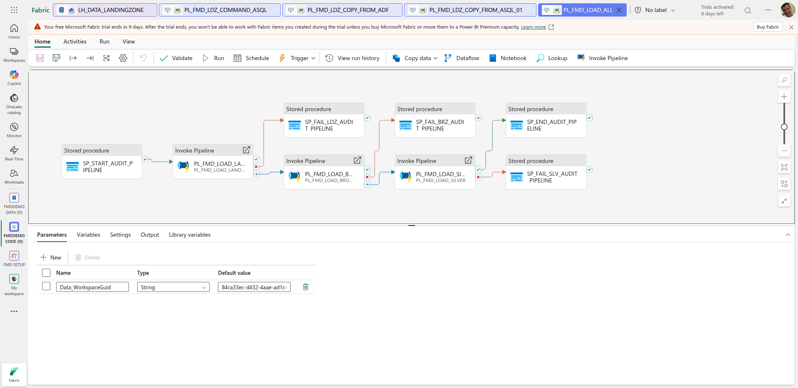

The dependency conditions are worth reading precisely. `LOAD_BRONZE` depends on
`LOAD_LANDINGZONE` with condition **`Completed`**, not `Succeeded`, and
`LOAD_SILVER` depends on `LOAD_BRONZE` the same way. A failed landing zone
therefore does **not** stop Bronze from starting. The failure is recorded by a
separate `Failed`-conditioned audit activity, and the run continues.

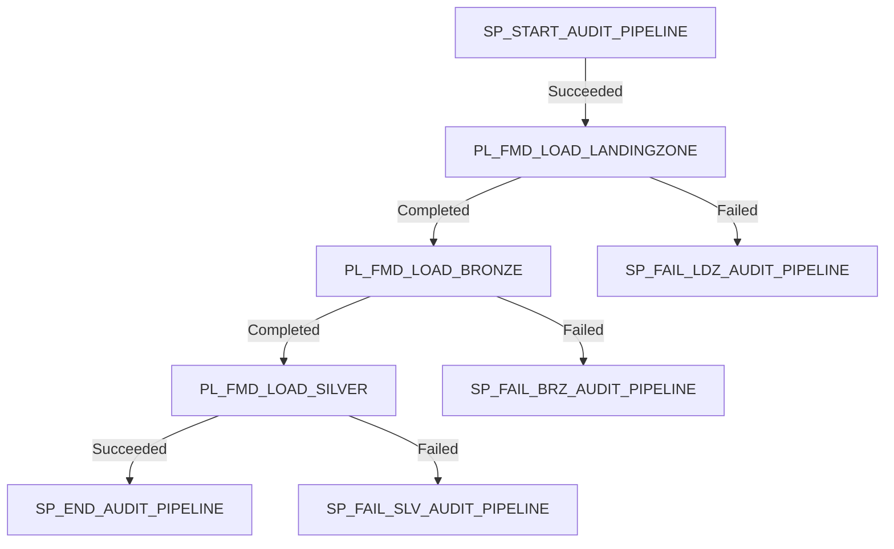

Each of the three children then does something structurally different.

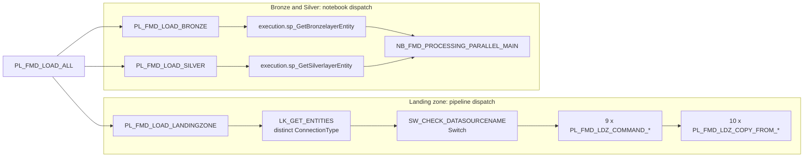

The landing zone fans out across pipelines. Bronze and Silver do not: each hands
a single list of entities to one notebook and lets the notebook parallelise.

### PL_FMD_LOAD_LANDINGZONE

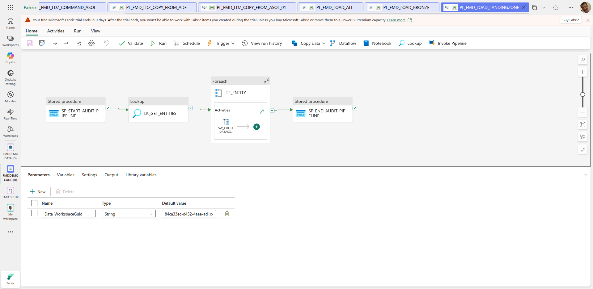

1. `SP_START_AUDIT_PIPELINE` writes the start record.
2. `LK_GET_ENTITIES` runs `SELECT distinct [ConnectionType] FROM [execution].[vw_LoadSourceToLandingzone] WHERE WorkspaceGuid = '<Data_WorkspaceGuid>'`.
3. `FE_ENTITY`, a ForEach over those connection types, runs the Switch **in parallel** (`isSequential` is false).
4. `SP_END_AUDIT_PIPELINE` writes the end record.

Only connection types that are actually configured for the workspace appear in
the lookup, so only the command pipelines you need are invoked.

### PL_FMD_LOAD_BRONZE and PL_FMD_LOAD_SILVER

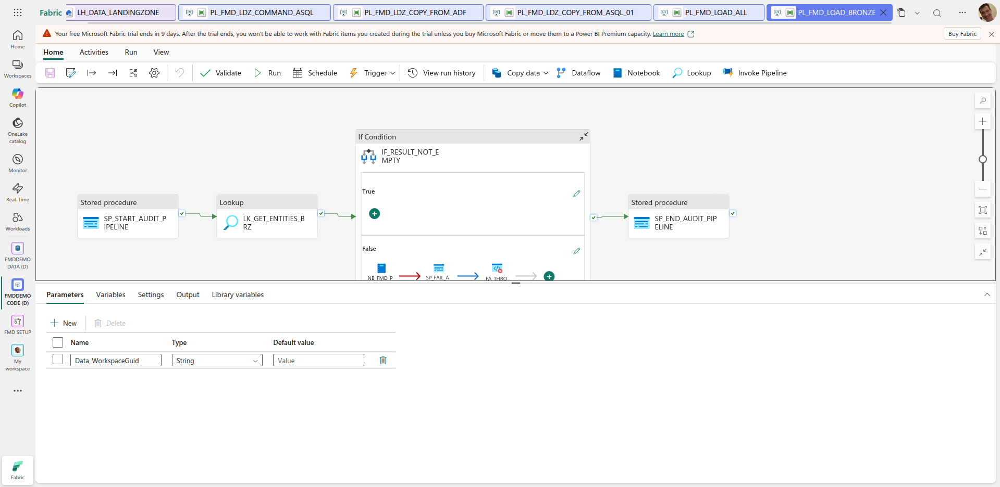

Both pipelines are the same shape and differ only in the stored procedure they
call and the notebook parameters that procedure returns.

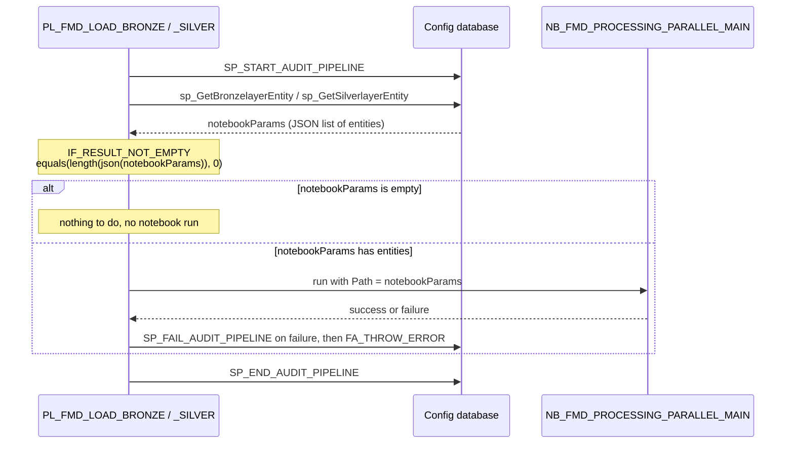

Read the `IF_RESULT_NOT_EMPTY` condition carefully, because its name is the
inverse of what it tests. The expression is
`@equals(length(json(activity('LK_GET_ENTITIES_BRZ').output.value[0].NotebookParams)), 0)`,
so it is **true when the list is empty**, and the notebook sits in the
`ifFalseActivities` branch. The effect is correct (no entities, no notebook run),
but the name reads backwards.

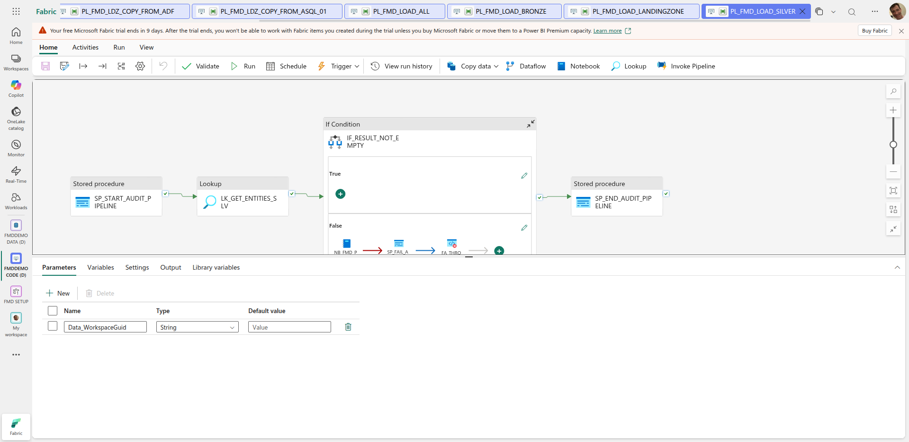

Bronze and Silver invoke the *same* notebook, `NB_FMD_PROCESSING_PARALLEL_MAIN`
(`bf2101e2-a101-b8df-43bf-5f6ba130a279`). The layer is encoded entirely in the
`Path` parameter that the stored procedure produces. The notebook activity in both
pipelines carries `timeout: 0.01:00:00` (one hour) and `retry: 0`.

> The wiki states a default timeout of 7200 seconds with 2 retries for these
> notebook activities. The JSON says one hour and zero retries. The JSON wins.

## The Switch on connection type

`SW_CHECK_DATASOURCENAME` inside `PL_FMD_LOAD_LANDINGZONE` switches on
`@toUpper(item().ConnectionType)`. Because of the `toUpper`, the value stored in
the configuration database is matched case-insensitively, but the case labels
themselves are upper case and must be matched exactly after upper-casing.

| Switch case | Command pipeline invoked |
| --- | --- |
| `SQL` | `PL_FMD_LDZ_COMMAND_ASQL` |
| `ADLS` | `PL_FMD_LDZ_COMMAND_ADLS` |
| `ONELAKE` | `PL_FMD_LDZ_COMMAND_ONELAKE` |
| `ADF` | `PL_FMD_LDZ_COMMAND_ADF` |
| `SFTP` | `PL_FMD_LDZ_COMMAND_SFTP` |
| `FTP` | `PL_FMD_LDZ_COMMAND_FTP` |
| `NOTEBOOK` | `PL_FMD_LDZ_COMMAND_NOTEBOOK` |
| `ORACLE` | `PL_FMD_LDZ_COMMAND_ORACLE` |
| `AZURESQLMI` | `PL_FMD_LDZ_COMMAND_SQLMI` |
| *(default)* | `FA_UNKNOWN_DATASOURCENAME`, a Fail activity |

Two traps live in this table. The connection type for Azure SQL is `SQL`, not
`ASQL`, even though the pipeline is called `ASQL`. The connection type for
Managed Instance is `AZURESQLMI`, not `ASQLMI` as the wiki's overview table
claims. Any other value hits the default branch and fails the run outright.

## The second dispatch: command to copy

Each command pipeline repeats the pattern one level down, but on
**datasource type** rather than connection type:

1. `SP_START_AUDIT_PIPELINE`.
2. `LK_GET_ENTITIES` runs
   `SELECT DatasourceType FROM [execution].[vw_LoadSourceToLandingzone] WHERE ConnectionType = '<its own type>' AND WorkspaceGuid = '<guid>' GROUP BY DatasourceType`.
   The column casing varies across the nine command pipelines: `PL_FMD_LDZ_COMMAND_ADLS` selects `DataSourceType` with a capital S, the other eight select `DatasourceType`. Both resolve, because the view exposes the column and T-SQL matches identifiers case-insensitively under the default collation.
3. `FE_ENTITY` (parallel) invokes the copy pipeline, passing `DataSourceType` and `Data_WorkspaceGuid`, and waits for completion.
4. `SP_END_AUDIT_PIPELINE`, or `SP_FAIL_AUDIT_PIPELINE` if the ForEach failed. The second is rarer than it looks: a copy that fails for a single entity is caught inside the copy pipeline's own loop and never reaches here. See [How a failure travels](#how-a-failure-travels-and-where-it-stops).

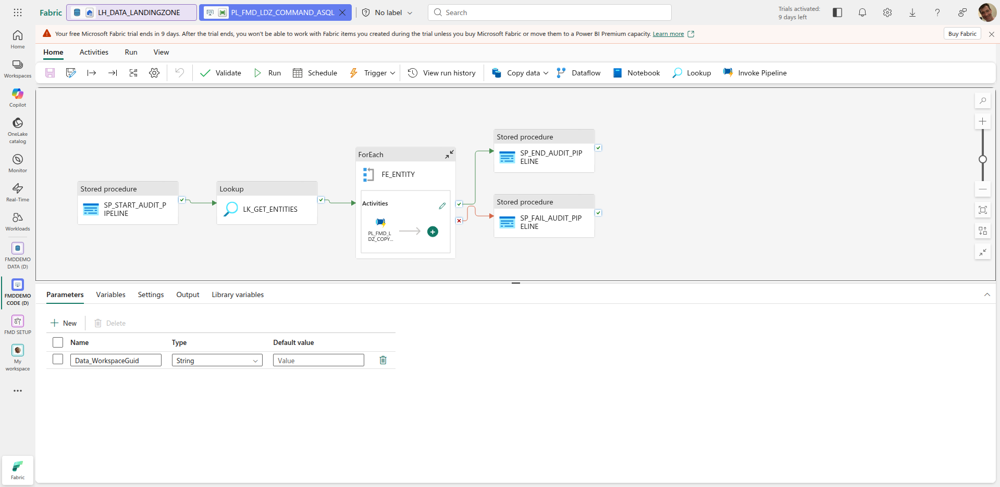

Eight of the nine command pipelines invoke exactly one copy pipeline
unconditionally. `PL_FMD_LDZ_COMMAND_ONELAKE` is the exception: it carries a
second Switch, `ONELAKE_FLOW`, on `@toUpper(item().DatasourceType)`, because
OneLake tables and OneLake files need different Copy activities.

| `ONELAKE_FLOW` case | Copy pipeline invoked |
| --- | --- |
| `ONELAKE_TABLES_01` | `PL_FMD_LDZ_COPY_FROM_ONELAKE_TABLES_01` |
| `ONELAKE_FILES_01` | `PL_FMD_LDZ_COPY_FROM_ONELAKE_FILES_01` |

This Switch has an **empty default branch** (`"defaultActivities": []`). An
unrecognised OneLake datasource type is therefore silently skipped rather than
failing, unlike the connection-type Switch one level up, whose default branch
holds a Fail activity.

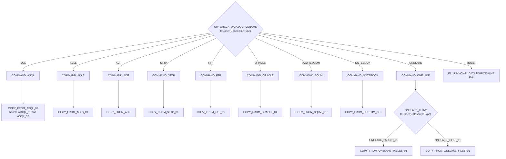

> **Note on activity names.** Several command pipelines carry an
> `InvokePipeline` activity whose *display name* does not match the pipeline it
> actually invokes. `PL_FMD_LDZ_COMMAND_FTP` has an activity named
> `PL_FMD_LDZ_COPY_FROM_ADF` that invokes
> `4972831f-6320-ab73-46e2-336d0bc59199`, which is `PL_FMD_LDZ_COPY_FROM_FTP_01`.
> `PL_FMD_LDZ_COMMAND_NOTEBOOK` has an activity named `PL_FMD_LDZ_COPY_FROM_NB`
> that invokes `PL_FMD_LDZ_COPY_FROM_CUSTOM_NB`. The invocation targets in this
> page are resolved from the pipeline GUIDs in `.platform`, not from the activity
> names, so they are correct even where the names are not.

## Inside a copy pipeline

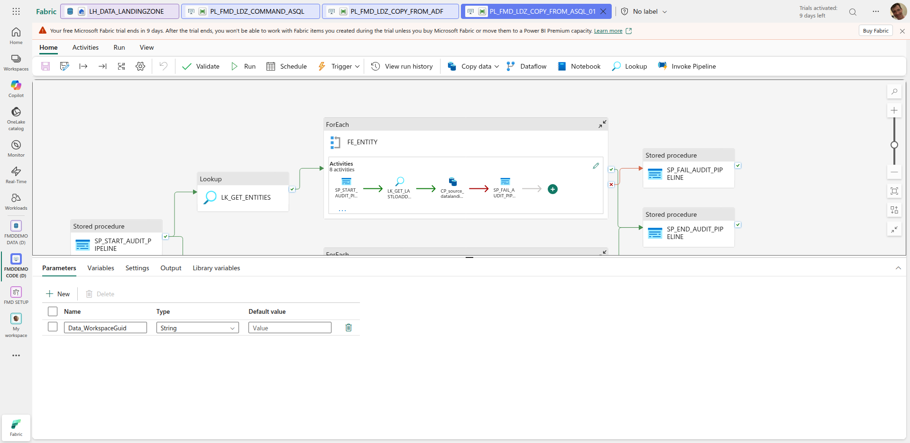

A copy pipeline selects the full entity rows for its own datasource type
(`SELECT * FROM [execution].[vw_LoadSourceToLandingzone] WHERE DataSourceType = '<its type>' AND WorkspaceGuid = '<guid>'`)
and loops over them. For every entity it:

1. writes a copy-activity start record via `[logging].[sp_AuditCopyActivity]`;
2. for the database sources, looks up the last load value (`LK_GET_LASTLOADDATE`, which runs `@item().LastLoadValue` as its own query, so the *watermark query itself* comes from metadata);
3. runs the Copy activity, whose source connection is `@item().ConnectionGuid` and whose sink is the Lakehouse identified by `@item().TargetLakehouseGuid`;
4. on the copy's success, calls `[execution].[sp_UpsertPipelineLandingzoneEntity]` (records the file that landed), and then, on *its* success, `[execution].[sp_UpsertLandingZoneEntityLastLoadValue]` (advances the watermark), the two being serialized on `main`, as described below;
5. on failure, writes a failure record via `[logging].[sp_AuditCopyActivity]`. `PL_FMD_LDZ_COPY_FROM_FTP_01` is the exception: its failure record goes to `[logging].[sp_AuditPipeline]` instead. See [Cross-cutting facts](#cross-cutting-facts).

Step 4 is what makes incremental loads work: the watermark only advances after
the copy succeeded and the file was queued. On `main`, `SP_UPDATE_LASTLOADVALIE`
dependsOn `SP_UPDATE_PROCESS`, so the watermark cannot advance unless the file is
on the Bronze work queue ([#271](https://github.com/edkreuk/FMD_FRAMEWORK/pull/271),
merged, fixes [#258](https://github.com/edkreuk/FMD_FRAMEWORK/issues/258)). Up to and
including `2026.07`, the two hung off the copy in parallel, so under sustained
throttling the watermark could advance while the queue insert failed and a delta was
lost (see [running FMD in production](../02-how-to/04-run-fmd-in-production.md#31-an-incremental-delta-could-be-lost-and-a-re-run-did-not-recover-it-fixed-on-main)).
See [Data model](./01-data-model.md) for the tables and views these procedures touch.

The source and sink types differ per family:

| Copy pipeline | Copy source type | Copy sink type |
| --- | --- | --- |
| `COPY_FROM_ASQL_01` | `AzureSqlSource` | `ParquetSink` |
| `COPY_FROM_SQLMI_01` | `SqlMISource` | `ParquetSink` |
| `COPY_FROM_ORACLE_01` | `OracleSource` | `ParquetSink` |
| `COPY_FROM_ONELAKE_TABLES_01` | `LakehouseTableSource` | `ParquetSink` |
| `COPY_FROM_ONELAKE_FILES_01` | `BinarySource` | `BinarySink` |
| `COPY_FROM_ADLS_01` | `BinarySource` | `BinarySink` |
| `COPY_FROM_SFTP_01` | `BinarySource` | `BinarySink` |
| `COPY_FROM_FTP_01` | `BinarySource` | `BinarySink` |
| `COPY_FROM_ADF` | none, invokes an ADF pipeline | n/a |
| `COPY_FROM_CUSTOM_NB` | none, runs a notebook | n/a |

Relational sources land as Parquet. File sources land as an unchanged binary copy.

Two copy pipelines have a shape of their own:

- **`PL_FMD_LDZ_COPY_FROM_FTP_01` and `PL_FMD_LDZ_COPY_FROM_SFTP_01`** run a `GetMetadata` activity first and copy only `@if(empty(string(...output.Exists)), false, ...output.Exists)`, that is, only when the expected file is actually there. If it is not, `SP_END_AUDIT_PIPELINE_NOFILE` records a clean no-op instead of failing. This is the only place in the framework where a missing source is not an error.
- **`PL_FMD_LDZ_COPY_FROM_ASQL_01`** carries two complete, structurally identical branches, `FE_ENTITY` for `ASQL_01` and `FE_ENTITY_ASQL_02` for `ASQL_02`, which run concurrently. See [The `_01` suffix](./07-supported-sources.md#the-_01-suffix).

`PL_FMD_LDZ_COPY_FROM_ADF` moves nothing itself.

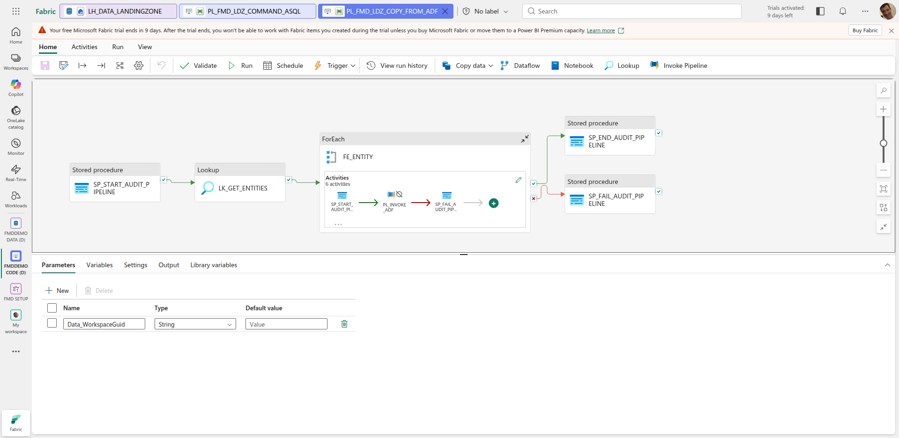

It invokes an external Azure Data Factory pipeline via `PL_INVOKE_ADF`, passing
`key_vault_uri_name`, `TargetFilePath`, `TargetFileName`, `SourceSchema`,
`SourceName`, `TargetWorkspaceId` and `TargetLakehouseId`, then updates the
watermark exactly as the other copy pipelines do. The ADF pipeline you build is
responsible for writing to OneLake at the target path FMD hands it.

## How a failure travels, and where it stops

Every landing-zone pipeline has **two** failure paths. They sit at different
levels and behave differently, and confusing them is the fastest way to
misread the framework's error handling.

| Activity | Where it sits | Fires when | What happens next |
| --- | --- | --- | --- |
| `SP_FAIL_AUDIT_PIPELINE_CP` | **inside** the `ForEach` | the copy fails **for one entity** | writes the failure to `logging`, succeeds, the loop moves to the next entity |
| `SP_FAIL_AUDIT_PIPELINE` | **top level**, on `<loop>: Failed` | the **loop itself** fails | writes the failure to `logging`, succeeds, and nothing follows it |

The inner catch is why one unreachable source does not stop the landing zone for
every other entity. It is also why **a failed copy is invisible from the run
status**: the iteration succeeds, so the `ForEach` succeeds, so the copy pipeline
reports Success, and so does every pipeline above it.

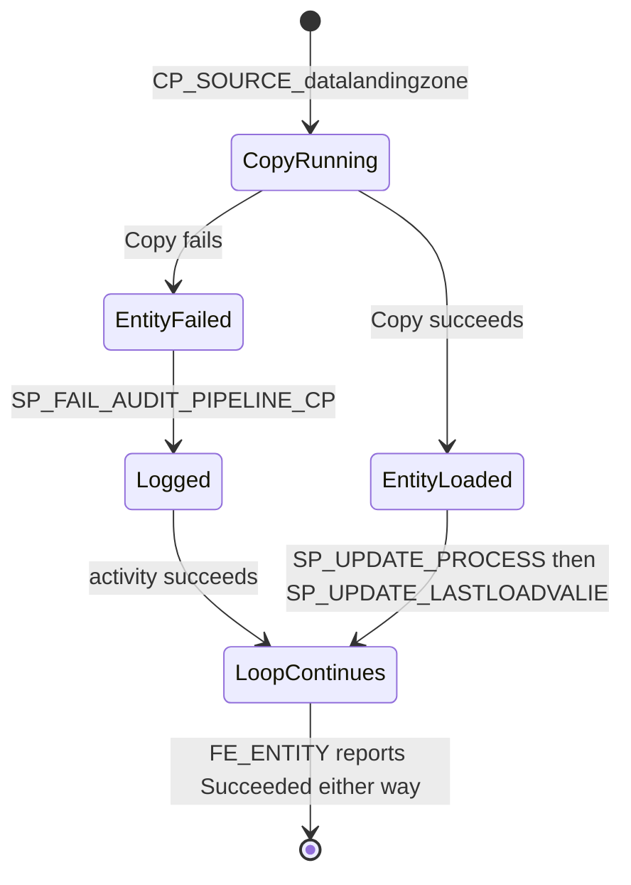

The top-level `SP_FAIL_AUDIT_PIPELINE` only fires when the loop *itself* fails,
which a caught copy failure never causes. In all 19 `PL_FMD_LDZ_*` pipelines that
activity is a leaf, so even then the pipeline reports Success. Microsoft
documents this directly: an approach that defines *only* an *Upon Failure* path
renders the pipeline **Success**. Source:
[Errors and conditional execution](https://learn.microsoft.com/azure/data-factory/tutorial-pipeline-failure-error-handling#error-handling).

`PL_FMD_LOAD_BRONZE` and `PL_FMD_LOAD_SILVER` are the two pipelines that do go
red, because each ends its catch branch in `FA_THROW_ERROR`, a `Fail` activity
reached on `SP_FAIL_AUDIT_PIPELINE: Completed`. `PL_FMD_LOAD_ALL` then swallows
that too, since its own catch branches are leaves.

> **Recorded discrepancy.** The consequence, observed on a live tenant at
> `1ba7974`: a copy failed, `logging` recorded it, no data was loaded, and
> `PL_FMD_LOAD_ALL` reported `Completed`. `logging` is therefore the only
> reliable failure signal in the framework. See
> [enterprise integration](../04-explanation/02-enterprise-integration.md#so-alert-on-the-database-not-on-the-run)
> for what to alert on instead. Fixes offered upstream: [#250](https://github.com/edkreuk/FMD_FRAMEWORK/pull/250), [#253](https://github.com/edkreuk/FMD_FRAMEWORK/pull/253).

## Tooling pipelines

Neither tooling pipeline is reachable from `PL_FMD_LOAD_ALL`. Both are run by
hand.

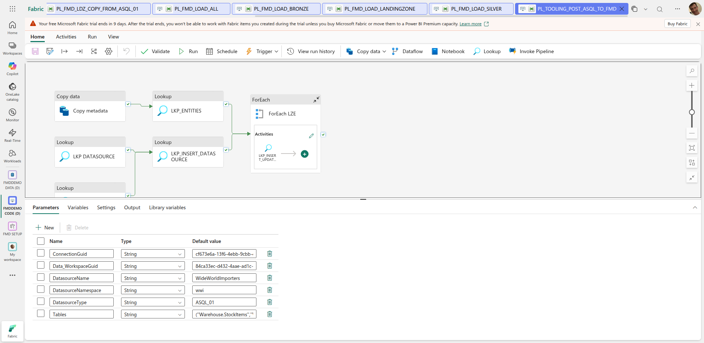

`PL_TOOLING_POST_ASQL_TO_FMD` is a metadata bootstrapper: point it at an Azure SQL
database and a list of tables and it registers the connection, the datasource and
one landing-zone entity per table in the configuration database, so you do not
have to write the `sp_Upsert*` calls by hand. It takes six parameters:
`ConnectionGuid`, `Data_WorkspaceGuid`, `DatasourceName`, `DatasourceNamespace`,
`DatasourceType` and `Tables`. The `Tables` default value in the repository is the
WideWorldImporters sample list, which is a good illustration of the expected
format: a doubled-single-quoted, comma-separated list.

`PL_FMD_TOOLING_LOAD_TO_PURVIEW` is a single-activity pipeline. It runs
`NB_FMD_FABRIC_PURVIEW_LINEAGE_TABLE_COLUMN_EXTRACTOR` with one parameter,
`SourceWorkspaceId`, to push table and column lineage into Microsoft Purview.

## All 25 pipelines

| Pipeline | Family | What it does | What it calls |
| --- | --- | --- | --- |
| `PL_FMD_LOAD_ALL` | Orchestration | Entry point. Runs the three layers in order, on `Completed` rather than `Succeeded`. | `LOAD_LANDINGZONE`, `LOAD_BRONZE`, `LOAD_SILVER` |
| `PL_FMD_LOAD_LANDINGZONE` | Orchestration | Looks up distinct `ConnectionType` for the workspace, switches on it. | The 9 `LDZ_COMMAND_*` pipelines |
| `PL_FMD_LOAD_BRONZE` | Orchestration | Gets Bronze entities via `sp_GetBronzelayerEntity`, hands them to one notebook. | `NB_FMD_PROCESSING_PARALLEL_MAIN` |
| `PL_FMD_LOAD_SILVER` | Orchestration | Gets Silver entities via `sp_GetSilverlayerEntity`, hands them to one notebook. | `NB_FMD_PROCESSING_PARALLEL_MAIN` |
| `PL_FMD_LDZ_COMMAND_ASQL` | Command | `ConnectionType = 'SQL'`. Resolves datasource types, invokes the copy pipeline. | `LDZ_COPY_FROM_ASQL_01` |
| `PL_FMD_LDZ_COMMAND_ADLS` | Command | `ConnectionType = 'ADLS'`. | `LDZ_COPY_FROM_ADLS_01` |
| `PL_FMD_LDZ_COMMAND_SQLMI` | Command | `ConnectionType = 'AZURESQLMI'`. | `LDZ_COPY_FROM_SQLMI_01` |
| `PL_FMD_LDZ_COMMAND_ORACLE` | Command | `ConnectionType = 'ORACLE'`. | `LDZ_COPY_FROM_ORACLE_01` |
| `PL_FMD_LDZ_COMMAND_ONELAKE` | Command | `ConnectionType = 'ONELAKE'`. Carries a second Switch on `DatasourceType`. | `LDZ_COPY_FROM_ONELAKE_TABLES_01`, `LDZ_COPY_FROM_ONELAKE_FILES_01` |
| `PL_FMD_LDZ_COMMAND_SFTP` | Command | `ConnectionType = 'SFTP'`. | `LDZ_COPY_FROM_SFTP_01` |
| `PL_FMD_LDZ_COMMAND_FTP` | Command | `ConnectionType = 'FTP'`. | `LDZ_COPY_FROM_FTP_01` |
| `PL_FMD_LDZ_COMMAND_ADF` | Command | `ConnectionType = 'ADF'`. | `LDZ_COPY_FROM_ADF` |
| `PL_FMD_LDZ_COMMAND_NOTEBOOK` | Command | `ConnectionType = 'NOTEBOOK'`. | `LDZ_COPY_FROM_CUSTOM_NB` |
| `PL_FMD_LDZ_COPY_FROM_ASQL_01` | Copy | `AzureSqlSource` to Parquet. Two parallel branches for `ASQL_01` and `ASQL_02`. Watermarked. | `sp_AuditCopyActivity`, `sp_UpsertPipelineLandingzoneEntity`, `sp_UpsertLandingZoneEntityLastLoadValue` |
| `PL_FMD_LDZ_COPY_FROM_SQLMI_01` | Copy | `SqlMISource` to Parquet. Watermarked. | the same three procedures |
| `PL_FMD_LDZ_COPY_FROM_ORACLE_01` | Copy | `OracleSource` to Parquet. Also runs `LK_GET_COLUMNNAMES` before the copy. Watermarked. | the same three procedures |
| `PL_FMD_LDZ_COPY_FROM_ONELAKE_TABLES_01` | Copy | `LakehouseTableSource` to Parquet. | the same three procedures |
| `PL_FMD_LDZ_COPY_FROM_ONELAKE_FILES_01` | Copy | Binary to binary. | the same three procedures |
| `PL_FMD_LDZ_COPY_FROM_ADLS_01` | Copy | Binary to binary. | the same three procedures |
| `PL_FMD_LDZ_COPY_FROM_SFTP_01` | Copy | `GetMetadata` existence check, then binary to binary. Missing file is a clean no-op. | the same three procedures |
| `PL_FMD_LDZ_COPY_FROM_FTP_01` | Copy | `GetMetadata` existence check, then binary to binary. Missing file is a clean no-op. | the same three procedures |
| `PL_FMD_LDZ_COPY_FROM_ADF` | Copy | Moves nothing. Invokes an external ADF pipeline and updates the watermark on its success. | `PL_INVOKE_ADF` (external), then the upsert procedures |
| `PL_FMD_LDZ_COPY_FROM_CUSTOM_NB` | Copy | Moves nothing. Runs your custom notebook and updates the watermark on its success. | `NB_FMD_PROCESSING_LANDINGZONE_MAIN` |
| `PL_TOOLING_POST_ASQL_TO_FMD` | Tooling | Registers an Azure SQL connection, datasource and its tables as landing-zone entities. Run by hand. | Lookups against the config database |
| `PL_FMD_TOOLING_LOAD_TO_PURVIEW` | Tooling | Pushes table and column lineage to Microsoft Purview. Run by hand. | `NB_FMD_FABRIC_PURVIEW_LINEAGE_TABLE_COLUMN_EXTRACTOR` |

That is 4 orchestration + 9 command + 10 copy + 2 tooling = 25.

## Cross-cutting facts

- **Every** pipeline in the load path takes `Data_WorkspaceGuid` and nothing else. The whole configuration is looked up from it. Several pipelines (`PL_FMD_LOAD_ALL`, `PL_FMD_LOAD_LANDINGZONE`, `PL_TOOLING_POST_ASQL_TO_FMD`) carry a `defaultValue` of `40e27fdc-775a-4ee2-84d5-48893c92d7cc`. **That is a placeholder, not a leak.** `config/item_config.yaml` registers it as `workspaces.workspace_data`, and `replace_ids_and_mark_inactive` rewrites every occurrence to the data workspace of the environment being deployed. We read the definition back out of a live deployment: the default arrived as our own data workspace.

  `PL_FMD_TOOLING_LOAD_TO_PURVIEW` was the exception. It declared the same `Data_WorkspaceGuid` parameter but defaulted it to `3e43b742-3e41-4ec0-a414-03adf83c08e7`, which appeared in no mapping and was therefore **never substituted**; the same GUID was the default `SourceWorkspaceId` in `NB_FMD_FABRIC_PURVIEW_LINEAGE_TABLE_COLUMN_EXTRACTOR`. Pointing it at the placeholder the other three use was merged upstream as [#261](https://github.com/edkreuk/FMD_FRAMEWORK/pull/261).

  **The fix is in `main`, and not yet in a release.** `2026.07` predates it, so a deployment pinned to a tag, which is what [upgrading](../02-how-to/08-upgrade-the-framework.md) tells you to do, still carries the old default. Until the next release, override `Data_WorkspaceGuid` when you run the Purview tooling, or it pushes lineage for a workspace GUID that is yours only by accident.
- **Almost every** pipeline calls `[logging].[sp_AuditPipeline]` at start, at end and on failure, and every copy pipeline calls `[logging].[sp_AuditCopyActivity]` around its Copy activity. **`PL_FMD_LOAD_LANDINGZONE` is the exception that matters: it has a start and an end activity and no failure activity at all**, so a failed landing zone writes neither an end row nor a fail row, and its only signature is the absence of an `EndPipeline`. See [how a failure travels](#how-a-failure-travels-and-where-it-stops) and the [runbook](../02-how-to/05-diagnose-a-failed-load.md). ([Fix offered upstream: #257](https://github.com/edkreuk/FMD_FRAMEWORK/pull/257)) A second exception: in `PL_FMD_LDZ_COPY_FROM_FTP_01`, only the *start* record (`SP_START_AUDIT_PIPELINE_CP`) goes to `sp_AuditCopyActivity`; the end, failure and no-file records (`SP_END_AUDIT_PIPELINE_CP`, `SP_FAIL_AUDIT_PIPELINE_CP`, `SP_END_AUDIT_PIPELINE_NOFILE`) call `sp_AuditPipeline` instead. An FTP copy therefore leaves a start row with no matching end row in the copy-activity log, so anyone querying copy-activity history for row counts or durations will find FTP starts that never finish. `PL_FMD_LDZ_COPY_FROM_SFTP_01`, otherwise structurally identical, does not have this asymmetry: all four of its activities call `sp_AuditCopyActivity`.
- **Every** ForEach in the landing zone runs in parallel (`isSequential` is false), and none sets `batchCount`, so the Fabric default applies: **20 concurrent iterations, with 50 the maximum you can ask for**. That number is the landing zone's real throughput ceiling. `FE_ENTITY` in a copy pipeline iterates over *entities*, which for a real Azure SQL source is easily hundreds of tables, and they will be copied 20 at a time. This is what the `_01` / `_02` volume-split slots exist to work around: a second slot is a second ForEach, and therefore a second 20-wide lane. See [The `_01` suffix](./07-supported-sources.md#the-_01-suffix).
- All connection references are `@item().ConnectionGuid`, resolved from metadata. No pipeline hard-codes a connection.

One divergence is worth knowing about before you copy the pattern.
`PL_FMD_LDZ_COPY_FROM_ASQL_01`'s two branches are structurally identical except
in one respect: the `ASQL_01` sink declares `AzureBlobStorageWriteSettings` while
the `ASQL_02` sink declares `LakehouseWriteSettings`. Both resolve to the same
Lakehouse `Files` root, through the same `workspaceId` / `artifactId` /
`rootFolder` properties, and both work: OneLake supports the same APIs as ADLS
and Azure Blob Storage, so either write-settings type is valid against a
Lakehouse sink.

The divergence is recent. Both sinks carried `LakehouseWriteSettings` from the
earliest commit that touches this pipeline (`85f17ad`, 2025-07-14) through
`f705a74` (2026-02-02). Commit `6cfa549` (2026-04-01) changed the `ASQL_01` sink
to `AzureBlobStorageWriteSettings` and left `ASQL_02` unchanged. The code does not
say why, so neither does this page.

---

Sources:

- `src/PL_FMD_LOAD_ALL.DataPipeline/pipeline-content.json` @ b5fb08e
- `src/PL_FMD_LOAD_LANDINGZONE.DataPipeline/pipeline-content.json` @ b5fb08e
- `src/PL_FMD_LOAD_BRONZE.DataPipeline/pipeline-content.json` @ b5fb08e
- `src/PL_FMD_LOAD_SILVER.DataPipeline/pipeline-content.json` @ b5fb08e
- `src/PL_FMD_LDZ_COMMAND_*.DataPipeline/pipeline-content.json` @ b5fb08e
- `src/PL_FMD_LDZ_COPY_FROM_*.DataPipeline/pipeline-content.json` @ b5fb08e
- `src/PL_FMD_TOOLING_LOAD_TO_PURVIEW.DataPipeline/pipeline-content.json` @ b5fb08e
- `src/PL_TOOLING_POST_ASQL_TO_FMD.DataPipeline/pipeline-content.json` @ b5fb08e
- `src/*/.platform` (pipeline GUID to name mapping) @ b5fb08e
- `FMD_FRAMEWORK.wiki/Data-Pipelines-and-Notebooks.md` @ 69305fd
- Everything above is transcribed from `pipeline-content.json`. Where the wiki prose disagrees with the JSON, the JSON wins and the disagreement is called out on the page.

Platform behaviour (Microsoft Learn):

- ForEach parallelism, default 20 and maximum 50: [Data Factory limitations](https://learn.microsoft.com/fabric/data-factory/data-factory-limitations#pipeline-resource-limits)
- OneLake API parity with ADLS and Azure Blob Storage: [OneLake API parity](https://learn.microsoft.com/fabric/onelake/onelake-api-parity)
