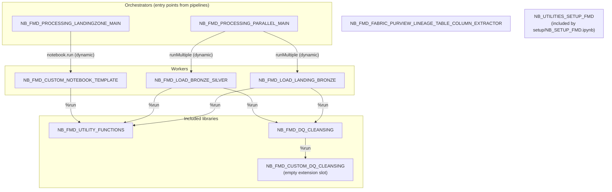
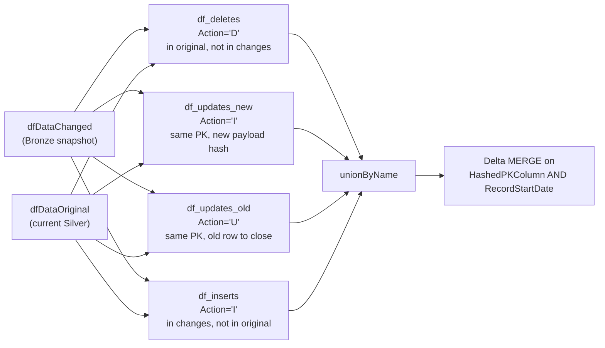
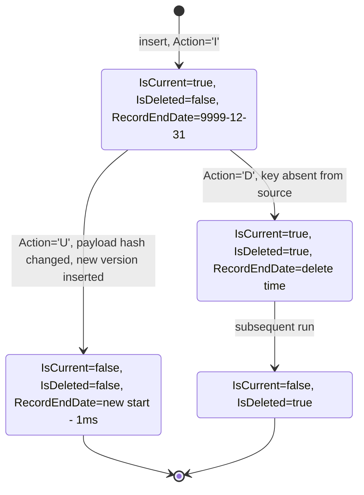

# Notebooks

Everything FMD does to your data happens in a notebook. The pipelines move bytes
into the landing zone and then hand off: Bronze and Silver are built entirely in
Spark, by notebooks that run on your capacity and account for effectively all of
the framework's compute cost. If you want to know where your data is actually
transformed, what a run charges you, or where to put your own logic, this is the
page.

The framework ships ten of them under `src/`. Two orchestrate, two do the
medallion loading, one is a shared function library, one is a cleansing engine,
one is an empty extension slot, one is a template for user code, one supports
deployment, and one pushes lineage to Purview. How they reach each other is not
obvious, because the most important edges in the graph are not in the notebook
source at all.

## The include graph

Fabric notebooks compose through the `%run` magic, which executes the target notebook in the *same* Spark session and leaves its symbols in the caller's namespace. It is an include, not a call: there is no return value and no isolation. These six `%run` edges are the entire static include graph of the framework.



Two kinds of edge are drawn above, and the difference matters:

- **Solid `%run` edges** are static. They are visible in the source and resolved before any data moves.
- **`runMultiple` and `notebook.run` edges** are dynamic. The child notebook name is *data*, read from the configuration database at run time (see [The dynamic edges](#the-dynamic-edges) below). Nothing in the notebook source names the child.

`NB_FMD_FABRIC_PURVIEW_LINEAGE_TABLE_COLUMN_EXTRACTOR` and `NB_UTILITIES_SETUP_FMD` sit outside the loading graph entirely.

### The dynamic edges

The orchestrator never hard-codes which worker it runs. `NB_FMD_PROCESSING_PARALLEL_MAIN` receives a `Path` parameter, a JSON array in which each element carries a `path` (the notebook name) and a `params` bag. That JSON is assembled by two stored procedures in the configuration database:

- `[execution].[sp_GetBronzelayerEntity]` emits `{"path": "NB_FMD_LOAD_LANDING_BRONZE", "params": { ... }}` per entity.
- `[execution].[sp_GetSilverlayerEntity]` emits `{"path": "NB_FMD_LOAD_BRONZE_SILVER", "params": { ... }}` per entity.

So the notebook name that ends up executing is a string literal inside a stored procedure, not inside a notebook. This is the mechanism that makes the framework metadata-driven, and it is also why a reader tracing only the notebook source will never find the edge.

## Which pipeline calls which notebook

Searching the pipeline JSON under `src/PL_*.DataPipeline/` for activities of type `TridentNotebook` yields exactly four notebook invocations across all 25 pipelines. Every other pipeline reaches the notebooks indirectly, by invoking one of these.

| Pipeline | `TridentNotebook` activity target | What it ends up running |
| --- | --- | --- |
| `PL_FMD_LOAD_BRONZE` | `NB_FMD_PROCESSING_PARALLEL_MAIN` | `NB_FMD_LOAD_LANDING_BRONZE`, once per Bronze entity |
| `PL_FMD_LOAD_SILVER` | `NB_FMD_PROCESSING_PARALLEL_MAIN` | `NB_FMD_LOAD_BRONZE_SILVER`, once per Silver entity |
| `PL_FMD_LDZ_COPY_FROM_CUSTOM_NB` | `NB_FMD_PROCESSING_LANDINGZONE_MAIN` | the notebook named in `CustomNotebookName`, default `NB_FMD_CUSTOM_NOTEBOOK_TEMPLATE` |
| `PL_FMD_TOOLING_LOAD_TO_PURVIEW` | `NB_FMD_FABRIC_PURVIEW_LINEAGE_TABLE_COLUMN_EXTRACTOR` | itself |

The remaining pipelines (`PL_FMD_LDZ_COMMAND_*`, `PL_FMD_LDZ_COPY_FROM_*` for ADF, ADLS, ASQL, FTP, SFTP, Oracle, SQLMI, OneLake) are Copy-activity pipelines: they move bytes into the Landing Zone without running a notebook. `PL_FMD_LOAD_ALL` chains `PL_FMD_LOAD_LANDINGZONE`, `PL_FMD_LOAD_BRONZE`, and `PL_FMD_LOAD_SILVER`.

## How the notebooks talk to the configuration database

Every notebook that logs or reads metadata goes through one function, `execute_with_outputs`, defined in `NB_FMD_UTILITY_FUNCTIONS` and pulled in by `%run`. There is no ORM and no connection pool; each call opens and closes its own connection.

Authentication is the interesting part. The notebook never sees a password. It asks the Fabric runtime for an AAD access token, packs it into the binary structure the ODBC driver expects, and hands it to `pyodbc` through the `attrs_before` dictionary using the SQL Server driver's `SQL_COPT_SS_ACCESS_TOKEN` attribute, whose numeric value is `1256`:

```python
import struct, pyodbc

# Get token for Azure SQL authentication
token = notebookutils.credentials.getToken('https://analysis.windows.net/powerbi/api').encode("UTF-16-LE")
token_struct = struct.pack(f'<I{len(token)}s', len(token), token)

# Build connection
conn = pyodbc.connect(
    f"DRIVER={driver};SERVER={connstring};PORT=1433;DATABASE={database};",
    attrs_before={1256: token_struct},
    timeout=12
)
```

The token must be UTF-16-LE encoded and length-prefixed with a 4-byte little-endian integer, which is what the `struct.pack(f'<I{len(token)}s', ...)` line produces. `driver` is `'{ODBC Driver 18 for SQL Server}'` in every caller; `connstring` and `database` come from the `VAR_CONFIG_FMD` variable library (see [Variable libraries](./06-variable-libraries.md)).

Having connected, the function runs the statement, walks every result set with `cursor.nextset()`, and returns a dictionary with `result_sets`, `return_code`, `out_params`, and `messages`.

### How the EXEC statement is built

The statement itself is assembled by `build_exec_statement`. In releases up to and including `2026.07` it appended `@name=value` fragments to an `EXEC` string, quoting values that are Python strings:

```python
def build_exec_statement(proc_name, **params):
    param_strs = []
    for key, value in params.items():
        if value is not None:
            if isinstance(value, str):
                param_strs.append(f"@{key}='{value}'")
            else:
                param_strs.append(f"@{key}={value}")

    if param_strs:
        return f"EXEC {proc_name}, " + ", ".join(param_strs)
    else:
        return f"EXEC {proc_name}"
```

Callers pass the procedure name and its fixed arguments already assembled into `proc_name`, then any dynamic arguments as keyword parameters. On `2026.07`, `NB_FMD_LOAD_BRONZE_SILVER` built the audit call as an f-string and passed only the payload separately:

```python
EndNotebookActivity = (
    f"[logging].[sp_AuditNotebook] "
    f"@NotebookGuid = \"{NotebookExecutionId}\", "
    f"@NotebookName = \"{notebook_name}\", "
    # ... further @Name = "value" fragments ...
    f"@EntityLayer = \"{EntityLayer}\""
)

execute_with_outputs(EndNotebookActivity, driver, connstring, database, LogData=json.dumps(result_data))
```

> **Note on parameterisation.** The code above is the `2026.07` snapshot. Up to and including `2026.07` (and at `1ba7974`), values reached T-SQL by string interpolation rather than by bound parameters, both in `build_exec_statement` (which wrapped strings in single quotes) and in the f-strings the callers constructed (which wrapped them in double quotes, relying on the session's `QUOTED_IDENTIFIER` behaviour), so a value containing a quotation mark, a semicolon or a backslash reached T-SQL unescaped. [#191](https://github.com/edkreuk/FMD_FRAMEWORK/pull/191) (merged) replaced this: `build_exec_statement` now emits `@Key=?` placeholders and returns the value list, `execute_with_outputs` binds it with `cursor.execute(sql, params)`, and the callers pass keyword arguments, so on `main` every call binds. The blast radius before the fix was limited by the values being GUIDs, table names and framework-generated JSON rather than end-user input.

## NB_FMD_UTILITY_FUNCTIONS

A function library, nothing else. It has no parameters cell, no side effects at import, and is pulled into `NB_FMD_LOAD_LANDING_BRONZE`, `NB_FMD_LOAD_BRONZE_SILVER`, and `NB_FMD_CUSTOM_NOTEBOOK_TEMPLATE` via `%run`.

On `main` it declares three functions (two up to and including `2026.07`):

| Function | Purpose |
| --- | --- |
| `build_exec_statement(proc_name, **params)` | Assemble an `EXEC` string from a procedure name and keyword arguments. |
| `execute_with_outputs(exec_statement, driver, connstring, database, **params)` | Acquire an AAD token, connect via `pyodbc`, run the statement, collect all result sets, return `{result_sets, return_code, out_params, messages}`. |
| `convert_small_numeric_columns_to_int(path)` | Cast any `ByteType`/`ShortType` (`TINYINT`/`SMALLINT`) columns in a landed parquet to `Integer`, re-write the file, and return the new path (or `None` if there is nothing to convert). Added on `main` by [#279](https://github.com/edkreuk/FMD_FRAMEWORK/pull/279) so the Native Execution Engine, which rejects those types, can read the file; `spark.native.enabled` is toggled off only for that write. `NB_FMD_LOAD_LANDING_BRONZE` calls it before the Bronze parquet read and reads the converted file when one is produced. |

`execute_with_outputs` issues a `SELECT 1` warm-up query before the real statement and lowers the connection timeout to 10 seconds afterwards. A failing `cursor.commit()` is caught and printed rather than raised, because read-only procedure calls cannot commit.

## NB_FMD_PROCESSING_PARALLEL_MAIN

The fan-out orchestrator. `PL_FMD_LOAD_BRONZE` and `PL_FMD_LOAD_SILVER` both run this notebook; the only difference is the `Path` payload they hand it.

Its job is to turn a flat list of entities into batched DAGs and execute them with `notebookutils.mssparkutils.notebook.runMultiple`. The interesting logic is the ordering:

1. **Group.** Items are grouped by the tuple `(DataSourceNamespace, TargetSchema, TargetName)`, computed by `group_key`. Two files landing for the same target table are in the same group.
2. **Sequence within a group.** Members of a group are sorted by a timestamp *parsed out of the filename*. `extract_ts_from_name` matches the regex `_(\d{12})(?=\.parquet$)`, that is, a `YYYYMMDDHHMM` stamp immediately before a `.parquet` suffix. Files with no name, or with a name that does not match, sort to the end via a `datetime.max` sort key rather than raising.
3. **Chain.** Within a group, each activity gets `"dependencies": [previous_activity_name]`, so the same target table is never written concurrently by two activities. Across groups there is no dependency, so they run in parallel.
4. **Batch.** Activities are cut into batches of 50, the `runMultiple` ceiling. If a single group exceeds 50 members the notebook prints a warning and proceeds.

The source comment above the batching code promises that a group is never split across a batch boundary. The code does not implement that promise: `first_batch_size = min(max_concurrent_notebooks, max(max_concurrent_notebooks, largest_group_size))` evaluates to 50 for every input, and `batched` slices the ordered list at fixed 50-item offsets with no reference to group boundaries. A group straddling positions 48 to 52 is split across two batches, and because `last_activity_name_by_group` is re-initialised inside the per-batch loop, the in-group `dependsOn` chain is broken at the boundary.

It does not matter in practice, and the reason is worth understanding rather than trusting: the batches are executed **sequentially**, one blocking `runMultiple` call per iteration. Batch 1 completes before batch 2 starts, so two writes to the same target table are still serialised. Correctness holds, by batch sequencing rather than by the `dependsOn` chain the comment relies on.

Each batch runs with `"concurrency": len(activities)`, a 7200-second DAG timeout, 600 seconds per cell, and `retry: 2`. A `RunMultipleFailedException` is caught so that partial results are kept and the remaining batches still run; any other exception aborts. After all batches, the notebook collects every activity whose `exception` is not the string `"None"` and raises `ValueError(f"Failed notebooks: {failed_names}")` if the list is non-empty. So a single failed entity fails the pipeline, but only after every other entity has had its chance to run.

**What the requested concurrency actually buys you.** `"concurrency": len(activities)` asks for up to 50-way parallelism, but the number you ask for is not the number you get. Every notebook in a `runMultiple` DAG executes on its own REPL instance, and each REPL consumes CPU and memory on the *driver*, so realised parallelism is bounded by the compute available to the Spark session, not by this field. Microsoft Learn is explicit that raising concurrency "can lead to reduced efficiency due to driver and executor resource contention" and that under high concurrency it "can increase the risk of driver instability or out-of-memory errors". Requesting 50 on a small driver does not give you 50 parallel entity loads; it gives you contention. Size the driver to the fan-out you actually want, and note that Bronze and Silver each run one notebook activity per entity, each paying its own session-start overhead.

> Source: [Microsoft Spark Utilities for Fabric](https://learn.microsoft.com/fabric/data-engineering/microsoft-spark-utilities#notebook-utilities) and [NotebookUtils notebook run and orchestration](https://learn.microsoft.com/fabric/data-engineering/notebookutils/notebookutils-notebook-run). The 50 ceiling itself is confirmed in [Fabric notebook known limitations](https://learn.microsoft.com/fabric/data-engineering/notebook-limitation#other-specific-limitations).

The notebook also injects the audit identifiers (`PipelineRunGuid`, `PipelineParentRunGuid`, `TriggerGuid`, `TriggerType`, `TriggerTime`, `WorkspaceGuid`, `NotebookExecutionId`, `driver`) into every child's `params` bag. `NotebookExecutionId` is a fresh `uuid4` generated once per orchestrator run and shared by all children of that run.

One side effect is worth knowing about: before doing anything else, this notebook checks whether `NB_FMD_CUSTOM_DQ_CLEANSING` exists in the workspace, and if it does not, it **creates it** by POSTing a one-cell `ipynb` payload to `https://api.fabric.microsoft.com/v1/workspaces/{workspace_id}/notebooks`. The cell it writes contains only the commented-out template shown in the [custom cleansing slot](#nb_fmd_custom_dq_cleansing) below. This is what guarantees the `%run NB_FMD_CUSTOM_DQ_CLEANSING` inside `NB_FMD_DQ_CLEANSING` can never fail on a fresh deployment.

## NB_FMD_PROCESSING_LANDINGZONE_MAIN

A thin wrapper that runs exactly one custom notebook, used by `PL_FMD_LDZ_COPY_FROM_CUSTOM_NB`. It exists so that a user-written extraction notebook (an API call, say) can participate in the framework's auditing and parameter conventions without knowing about them.

It normalises `TriggerGuid` (adding hyphens to a 32-character GUID, falling back to the all-zero GUID if invalid), builds a `notebook_params` dictionary, and calls:

```python
result = notebookutils.notebook.run(CustomNotebookName, 900, notebook_params)
```

`CustomNotebookName` defaults to `NB_FMD_CUSTOM_NOTEBOOK_TEMPLATE`; the timeout is 900 seconds. A `Py4JJavaError` whose message contains `NotebookExecutionException` is captured into `fail` and re-raised afterwards as a `ValueError` naming the notebook. Any other exception propagates immediately.

Note that this notebook writes no audit rows itself. It passes the audit identifiers down and lets the child notebook do the logging.

## NB_FMD_LOAD_LANDING_BRONZE

Loads one file from the Landing Zone into one Bronze Delta table. Run once per entity by `NB_FMD_PROCESSING_PARALLEL_MAIN`.

**Spark configuration.** Bronze is tuned for write throughput: `spark.fabric.resourceProfile` is set to `writeHeavy`, the four Parquet rebase modes are set to `CORRECTED`, and auto-compaction plus fast optimize are enabled. V-Order is not requested. Setting `writeHeavy` explicitly is also a no-op on a fresh workspace, because per Microsoft Learn all newly created Fabric workspaces already default to that profile, and V-Order is disabled in it.

**Reading the source.** The path is `abfss://{SourceWorkspace}@onelake.dfs.fabric.microsoft.com/{SourceLakehouse}/Files/{SourceFilePath}/{SourceFileName}`. If `notebookutils.fs.exists` says the file is not there, the notebook logs `SourceFileName: 'FILE NOT FOUND'`, marks the Landing Zone entity processed anyway, and exits cleanly rather than failing. Four source types are handled: `csv` (header on, schema inferred from a 10 % sample), `xlsx` (pandas plus openpyxl), `xls` (pandas plus xlrd), and anything else, which is passed straight to `spark.read.format(SourceFileType)` and in practice means Parquet.

**Column names.** Spaces are stripped from column names, not replaced. `new_columns = [col.replace(' ', '') for col in dfDataChanged.columns]` turns `Customer Name` into `CustomerName`. (The comment above the line says "Replace spaces with underscores", which the code does not do.)

**Data quality checks.** Two, and only two:

1. Every column named in `PrimaryKeys` (split on `,`, `;`, `:`, or a space) must exist in the source, or the notebook raises `ValueError(f"PK: {pk_column} doesn't exist in the source.")`.
2. After hashing the primary key, duplicates are rejected: `ValueError('Source file contains duplicated rows for PK: ...')`.

**Hashing.** `HashedPKColumn` is `sha2(concat_ws("||", *key_columns), 256)`. `HashedNonKeyColumns` is `md5(concat_ws("||", *non_key_columns))`. `RecordLoadDate` is `current_timestamp()`.

In Bronze, `HashedNonKeyColumns` excludes the primary key, as its name says. The exclusion list is `[column for column in dfDataChanged.columns if column not in key_columns and column != 'HashedPKColumn']`, so each column name is tested against the *members* of `key_columns`.

> Up to and including `2026.07`, the exclusion list read `if column not in (key_columns, 'HashedPKColumn')` with `key_columns` a *list*, so every column name was compared against the list object rather than its members and no primary-key column was ever excluded. The Bronze hash was therefore a full-row hash minus `HashedPKColumn`. The outcome was unaffected, because rows match on `HashedPKColumn` and adding the key to the payload hash changes no comparison, but the column held more than its name said. Fixed by [#245](https://github.com/edkreuk/FMD_FRAMEWORK/pull/245), merged 2026-07-14.

Silver recomputes the same column with a tuple of strings (`('HashedPKColumn', 'HashedNonKeyColumns')`) and excludes what it names.

**The merge.** If the target Delta table does not exist, the DataFrame is written with `mode("overwrite")` and the notebook exits. Otherwise it merges on `HashedPKColumn`, and the `IsIncremental` flag decides whether deletes are honoured:

```python
if IsIncremental in [False, 'false', 'False']:
    # full load: rows absent from the source are removed
    merge = deltaTable.alias('original') \
        .merge(dfDataChanged.alias('updates'), 'original.HashedPKColumn == updates.HashedPKColumn') \
        .whenNotMatchedInsertAll() \
        .whenMatchedUpdateAll('original.HashedNonKeyColumns != updates.HashedNonKeyColumns') \
        .whenNotMatchedBySourceDelete() \
        .execute()
else:
    # incremental: no deletes
    ...same, without whenNotMatchedBySourceDelete()
```

Bronze is therefore a *current-state* mirror of the source, with hard deletes on a full load. History begins in Silver, not here.

**Cleansing.** **After** hashing and the duplicate check, not before, the notebook fetches its rules with `[execution].[sp_GetBronzeCleansingRule]`, `%run`s `NB_FMD_DQ_CLEANSING`, and calls `handle_cleansing_functions`. The order matters: `HashedPKColumn` is computed at line 421 and cleansing at line 483, so **a cleansing rule on a key column never affects the key**. A `normalize_text` rule that upper-cases an identifier will not merge `abc` and `ABC`; they hash differently and stay two dimension members, with no error. See [Data cleansing](./05-data-cleansing.md).

**Dead code: the DQ-rule hook.** The notebook builds a `GetDQRule` statement targeting `[execution].[sp_GetBronzeDQRule]` and declares a `dq_rules = []` parameter. Both are inert. `GetDQRule` is never passed to `execute_with_outputs`, `dq_rules` is never read, and no stored procedure of that name exists in the configuration database. This is a forward declaration for a data-quality-rules feature that has not landed: the procedures (`sp_GetBronzeDQRule`, `sp_GetSilverDQRule`, and their `Upsert` counterparts) and an accompanying `NB_FMD_DQ_GX` notebook exist upstream only on an unmerged branch. Ignore both symbols; they do nothing today. Validation in Bronze is limited to the primary-key and duplicate checks above, and quality transformation is done by the cleansing rules, which are a separate and fully working mechanism.

## NB_FMD_LOAD_BRONZE_SILVER

Loads one Bronze Delta table into one Silver Delta table, applying SCD Type 2. Run once per entity by `NB_FMD_PROCESSING_PARALLEL_MAIN`.

**Spark configuration.** The mirror image of Bronze: `spark.fabric.resourceProfile` is `readHeavyForSpark`, and `spark.microsoft.delta.properties.defaults.enableChangeDataFeed` is set to `True`, so Silver tables carry a Change Data Feed for downstream consumers.

`readHeavyForSpark` enables optimized write with a 128 MB bin size. It does **not** enable V-Order. Per Microsoft Learn, only `readHeavyForPBI` sets `spark.sql.parquet.vorder.default=true`; `readHeavyForSpark` sets no `vorder` key at all and therefore inherits the workspace default, and in new Fabric workspaces that default is V-Order *disabled*. Silver tables written by `NB_FMD_LOAD_BRONZE_SILVER` are consequently not V-Ordered on a default workspace. This matters if Silver is consumed by Power BI over Direct Lake, where V-Order is what makes the read fast: it has to be turned on deliberately. Resource profiles are still in Preview.

> Source: [Configure resource profile configurations in Microsoft Fabric](https://learn.microsoft.com/fabric/data-engineering/configure-resource-profile-configurations)

### The SCD Type 2 technical columns

Five tracking columns plus two hash columns, named exactly as the code names them:

| Column | Type | Set to | Meaning |
| --- | --- | --- | --- |
| `HashedPKColumn` | string | inherited from Bronze (`sha2(..., 256)`) | the business key of the row, hashed. The merge key. |
| `HashedNonKeyColumns` | string | recomputed here: `md5(concat_ws("||", *non_key_columns))` | fingerprint of the payload. Two rows with the same `HashedPKColumn` and different `HashedNonKeyColumns` are a change. |
| `IsCurrent` | boolean | `True` on insert, `False` when superseded or deleted | marks the live version of a key. |
| `RecordStartDate` | timestamp | `current_timestamp()` on insert | when this version became valid. Part of the merge condition. |
| `RecordEndDate` | timestamp | `'9999-12-31'` on insert; the supersession time on close | when this version stopped being valid. |
| `RecordModifiedDate` | timestamp | `current_timestamp()` on insert | when the row was last written. |
| `IsDeleted` | boolean | `False` on insert, `True` on a detected delete | soft-delete flag. The row is never physically removed. |

`Action` is an eighth column, but a transient one: it exists only on the in-flight change set to tell the merge what to do (`'I'`, `'U'`, `'D'`), and is excluded from the columns written to the target.

Note that `HashedNonKeyColumns` is recomputed in Silver rather than reused from Bronze, and the exclusion list here is `('HashedPKColumn', 'HashedNonKeyColumns')`. Because Bronze added `RecordLoadDate` to the row, that column is part of the Silver payload hash.

### How changes are detected

The notebook does not let Delta's merge work out what changed. It computes four DataFrames by joining the incoming Bronze snapshot (`changes`) against the current Silver table (`original`), unions them, and feeds the union to a merge that only has to obey the `Action` column.



- `df_deletes`: a left join keeping rows where `changes.HashedPKColumn is null` and `original.IsCurrent == true`. Sets `Action='D'`, `RecordEndDate=current_timestamp()`, `IsCurrent=False`, `IsDeleted=True`.
- `df_updates_new`: an inner join on the key where `changes.HashedNonKeyColumns <> original.HashedNonKeyColumns`, taking the *incoming* row. Sets `Action='I'`, `RecordEndDate='9999-12-31'`, `IsCurrent=True`, `IsDeleted=False`. This is the new version.
- `df_updates_old`: the same join, taking the *original* row. Sets `Action='U'`, `IsCurrent=False`, and closes it with `RecordEndDate = expr("changes.RecordStartDate - interval 0.001 seconds")`, one millisecond before the new version opens, so validity intervals do not overlap.
- `df_inserts`: a left anti-join in effect, keeping incoming rows with no current, undeleted match. Sets `Action='I'`, `IsCurrent=True`, `IsDeleted=False`.

### The merge

The merge condition is on **both** the key and the start date, `original.HashedPKColumn = updates.HashedPKColumn and original.RecordStartDate = updates.RecordStartDate`. That is what lets a single merge close an old version and open a new one for the same key in one pass: the new version carries a fresh `RecordStartDate` and therefore does not match any existing row, so it falls to the insert clause, while the old version matches on its own start date and is updated in place.

Three clauses, in order:

1. `whenMatchedUpdate` where `original.IsCurrent == True AND original.IsDeleted == False AND updates.Action = 'D'`, sets `IsDeleted=True` and `RecordEndDate`. A soft delete.
2. `whenMatchedUpdate` where `updates.HashedNonKeyColumns == original.HashedNonKeyColumns and original.IsCurrent = 1`, sets `IsCurrent=0` and `RecordEndDate`. Closes the superseded version.
3. `whenNotMatchedInsert`, writes the business columns from `updates` plus `IsCurrent=1`, `RecordStartDate=current_timestamp()`, `RecordModifiedDate=current_timestamp()`, `RecordEndDate='9999-12-31'`, `IsDeleted=0`.

If the Silver table does not yet exist, the first snapshot is written with `mode("overwrite")` and the notebook exits before any of this runs, so a table's first load has no history.

Any exception around the merge is caught, written to the audit log as `{"Action": "Error", "ErrorMessage": ...}` truncated to 500 characters, and re-raised.

### The lifecycle of a Silver row



The two-step delete is deliberate and is documented in the merge's own comments: on the run that first misses a key, the row is marked `IsDeleted=True` while `IsCurrent` stays true; a later run flips `IsCurrent` to false.

### Audit and status

`[logging].[sp_AuditNotebook]` is called at the start (`LogType="StartNotebookActivity"`) and at the end (`LogType="EndNotebookActivity"`, with a `LogData` payload carrying runtime, target, and entity id). `[execution].[sp_UpsertPipelineBronzeLayerEntity]` is called with `@IsProcessed = "True"` to mark the Bronze entity consumed. Cleansing rules come from `[execution].[sp_GetSilverCleansingRule]`.

## NB_FMD_DQ_CLEANSING

The cleansing engine: a registry, a dispatcher, a rule normaliser, and three built-in functions. It is `%run` by both loader notebooks and itself `%run`s `NB_FMD_CUSTOM_DQ_CLEANSING`. Fully documented in [Data cleansing](./05-data-cleansing.md).

## NB_FMD_CUSTOM_DQ_CLEANSING

An empty extension slot, and genuinely empty: the entire notebook is 26 lines, of which the only code cell contains nothing but commented-out template text. It declares no functions and registers nothing.

Its purpose is to be a `%run` target that always exists, so that users can add cleansing functions without editing a framework notebook that redeployment would overwrite. If it is missing from the workspace, `NB_FMD_PROCESSING_PARALLEL_MAIN` creates it via the Fabric REST API before any loading starts.

## NB_FMD_CUSTOM_NOTEBOOK_TEMPLATE

A template for a user-written extraction notebook, run by `NB_FMD_PROCESSING_LANDINGZONE_MAIN`. Its own markdown carries the warning that matters:

> Make a copy of this notebook, every time you re deploy the framework this notebook will be overwritten

The contract it defines for a custom extractor is narrow:

1. Read the parameters cell (`EntityId`, `TargetFilePath`, `TargetFileName`, `TargetLakehouseGuid`, `WorkspaceGuid`, `LastLoadValue`, and the audit GUIDs injected by the parent).
2. Log the start with `[logging].[sp_AuditNotebook]`.
3. Put your extraction between the `Start Custom code here` and `End Custom code here` markers, and leave the result in a Spark DataFrame named exactly **`output_dataframe`**. The template ships a three-row pandas sample as a placeholder.
4. The framework then checks `isinstance(output_dataframe, DataFrame)`, raising `Exception("No output_dataframe defined, or output_dataframe not a spark dataframe.")` if not, and writes it with `output_dataframe.write.mode('overwrite').parquet(path)` to `abfss://{WorkspaceGuid}@onelake.dfs.fabric.microsoft.com/{TargetLakehouseGuid}/Files/{TargetFilePath}/{TargetFileName}`.
5. For incremental sources, set `LoadValue`; it is returned in the exit payload as `"LoadValue"` so the framework can persist it as the next run's `LastLoadValue`.

## NB_UTILITIES_SETUP_FMD

Not part of the data path. This is the function library for the two deployment notebooks in `setup/`, `NB_SETUP_FMD.ipynb` and `NB_SETUP_BUSINESS_DOMAINS.ipynb`, both of which pull it in with `%run NB_UTILITIES_SETUP_FMD`.

It is the only notebook running the plain `jupyter` kernel rather than `synapse_pyspark` (`python3.12` on `main`, `python3.11` up to and including `2026.07`, bumped by [#278](https://github.com/edkreuk/FMD_FRAMEWORK/pull/278)), because it does no Spark work: it shells out to the Fabric CLI (`fab -c <command>` via `subprocess.run`) and calls the Fabric REST API. Its roughly 40 functions cover domain creation and assignment, workspace creation and role assignment, workspace identity creation, folder management, item deployment with GUID rewriting between environments, connection creation, variable-library population (`update_variable_library`), and workspace icon rendering.

The variable libraries are written from here, from a `variable_parameters` dictionary keyed on `key_vault_uri_name`, `lakehouse_schema_enabled`, and `purview_account_name`.

## NB_FMD_FABRIC_PURVIEW_LINEAGE_TABLE_COLUMN_EXTRACTOR

Also not part of the data path. Run by `PL_FMD_TOOLING_LOAD_TO_PURVIEW`, it reads the framework's own metadata and registers table-level and column-level lineage in Microsoft Purview using the `pyapacheatlas` library.

It is the only notebook that uses a service principal, and it uses **both** identities. It authenticates *to Purview* with the service principal, reading `tenant_id`, `client_id`, and a client secret from Azure Key Vault under the secret names `tenantid`, `sp-fabric-purview-deployment-appid`, and `sp-fabric-purview-deployment-secret` by default. It still reaches the configuration database with the caller's token via `notebookutils.credentials.getToken` and `pyodbc`, exactly like every other notebook. The Key Vault URI comes from `VAR_FMD.key_vault_uri_name` and the Purview account from `VAR_FMD.purview_account_name`, the only consumer of that variable in the framework.

**A platform trap in the install.** `pyapacheatlas` is pulled in by a bare `pip install pyapacheatlas` cell at the top, which IPython's automagic promotes to `%pip install`. Microsoft Learn states that inline installation commands are **disabled by default in pipeline runs**, and are enabled only by passing `_inlineInstallationEnabled` as a Boolean `true` parameter when the notebook is triggered. `PL_FMD_TOOLING_LOAD_TO_PURVIEW` triggers this notebook from a pipeline and passes only `SourceWorkspaceId`. The platform-blessed route, and the one that sidesteps the restriction entirely, is to install `pyapacheatlas` into the `ENV_FMD` Environment rather than inline; Learn recommends exactly this for pipeline scenarios, because `%pip install` can resolve a different dependency tree from run to run.

> Source: [Fabric notebook known limitations](https://learn.microsoft.com/fabric/data-engineering/notebook-limitation#other-specific-limitations) and [Manage Apache Spark libraries in Microsoft Fabric](https://learn.microsoft.com/fabric/data-engineering/library-management#inline-installation)

It defines the Atlas entity types `fabric_lakehouse_path` and `fabric_lakehouse_table` and a process type named `FMD Fabric to Purview Lineage Extractor Process`, then creates lineage processes across the `DataLandingzone`, `Bronze`, and `Silver` layer names.

Its own documented limitations: only one source and one target per process (a strict one-to-one relation), only Lakehouses are supported, and columns for which no mapping is found are marked in Purview with a `*`. It requires the service principal to be a Viewer on every data workspace and to hold the Data Curator or Data Source Admin role in Purview.

---

Source: `src/NB_FMD_UTILITY_FUNCTIONS.Notebook/notebook-content.py` @ `1ba7974`
Source: `src/NB_FMD_PROCESSING_PARALLEL_MAIN.Notebook/notebook-content.py` @ `1ba7974`
Source: `src/NB_FMD_PROCESSING_LANDINGZONE_MAIN.Notebook/notebook-content.py` @ `1ba7974`
Source: `src/NB_FMD_LOAD_LANDING_BRONZE.Notebook/notebook-content.py` @ `1ba7974`
Source: `src/NB_FMD_LOAD_BRONZE_SILVER.Notebook/notebook-content.py` @ `1ba7974`
Source: `src/NB_FMD_DQ_CLEANSING.Notebook/notebook-content.py` @ `1ba7974`
Source: `src/NB_FMD_CUSTOM_DQ_CLEANSING.Notebook/notebook-content.py` @ `1ba7974`
Source: `src/NB_FMD_CUSTOM_NOTEBOOK_TEMPLATE.Notebook/notebook-content.py` @ `1ba7974`
Source: `src/NB_UTILITIES_SETUP_FMD.Notebook/notebook-content.py` @ `1ba7974`
Source: `src/NB_FMD_FABRIC_PURVIEW_LINEAGE_TABLE_COLUMN_EXTRACTOR.Notebook/notebook-content.py` @ `1ba7974`
Source: `src/Config_Database/execution/StoredProcedures/sp_GetBronzelayerEntity.sql` @ `1ba7974`
Source: `src/Config_Database/execution/StoredProcedures/sp_GetSilverlayerEntity.sql` @ `1ba7974`
Source: `src/PL_FMD_LOAD_BRONZE.DataPipeline/pipeline-content.json` @ `1ba7974`
Source: `src/PL_FMD_LOAD_SILVER.DataPipeline/pipeline-content.json` @ `1ba7974`
Source: `src/PL_FMD_LDZ_COPY_FROM_CUSTOM_NB.DataPipeline/pipeline-content.json` @ `1ba7974`
Source: `src/PL_FMD_TOOLING_LOAD_TO_PURVIEW.DataPipeline/pipeline-content.json` @ `1ba7974`

Everything above is transcribed from the notebook source (`notebook-content.py`), not from prose. Where the code and the upstream wiki disagree, the code is what is documented and the disagreement is called out on the page.

Platform behaviour (Microsoft Learn):

- [Configure resource profile configurations](https://learn.microsoft.com/fabric/data-engineering/configure-resource-profile-configurations)
- [Microsoft Spark Utilities for Fabric](https://learn.microsoft.com/fabric/data-engineering/microsoft-spark-utilities#notebook-utilities)
- [Fabric notebook known limitations](https://learn.microsoft.com/fabric/data-engineering/notebook-limitation#other-specific-limitations)
- [Manage Apache Spark libraries in Microsoft Fabric](https://learn.microsoft.com/fabric/data-engineering/library-management#inline-installation)
