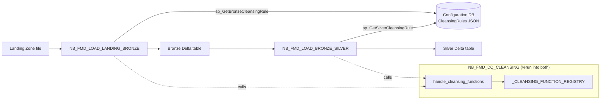

# Data cleansing

Cleansing in FMD is a metadata-driven transformation step applied to a DataFrame in flight, between reading the source and writing the target. A rule is a JSON object stored in the configuration database against an entity; a function is a Python callable registered by name in a Spark-session-wide registry. The rule names the function, and the framework looks it up.

The engine is `NB_FMD_DQ_CLEANSING`. It is included with `%run` by both loader notebooks, so its symbols live in the same Spark session as the caller.

## Where cleansing runs



Both layers cleanse, from separate rule sets fetched by separate stored procedures. The ordering inside each notebook is what determines what the rules can see:

- In **Bronze** (`NB_FMD_LOAD_LANDING_BRONZE`), cleansing runs *after* the primary-key and duplicate checks and the computation of `HashedPKColumn`, but *before* `HashedNonKeyColumns` and `RecordLoadDate` are added. So a Bronze rule cannot change the primary-key hash, but it does influence the payload hash, and therefore change detection.
- In **Silver** (`NB_FMD_LOAD_BRONZE_SILVER`), cleansing runs first thing after reading the Bronze snapshot, before `HashedNonKeyColumns` is recomputed and before any SCD-2 column is added. A Silver rule therefore also influences change detection, and a rule that produces a non-deterministic value will make every row look changed on every run.

## The rule format

`CleansingRules` is a JSON array. Each element is an object with up to three keys:

| Key | Required | Type | Meaning |
| --- | --- | --- | --- |
| `function` | yes | string | the registered name of the function to call |
| `columns` | yes in practice | string | semicolon-separated list of column names |
| `parameters` | **yes in practice** | object | passed to the function as its `args` argument |

```json
[
  {
    "function": "normalize_text",
    "columns": "TransactionTypeName",
    "parameters": {}
  },
  {
    "function": "parse_datetime",
    "columns": "OrderDate",
    "parameters": { "target_type": "date", "formats": ["yyyy-MM-dd", "dd/MM/yyyy"] }
  }
]
```

Rules are applied in array order, each receiving the DataFrame the previous one returned.

### Always include `parameters`, even when empty

The JSON schema makes `parameters` look optional, and it is not. Omitting it fails the rule at run time.

`handle_cleansing_functions` reads it with `rule.get("parameters")`, which yields `None` when the key is absent, and then passes that `None` positionally into the function. Every built-in has the signature `f(df, columns, args)`, with `args` positional and without a default, and every built-in starts by calling `args.get(...)`. On `None` that raises `AttributeError`, which `dynamic_call_cleansing_function` catches and re-raises as:

```
ValueError: Function 'normalize_text' failed with Error: 'NoneType' object has no attribute 'get'
```

The same holds for `columns`: a rule without it produces an empty list, so the function loops zero times and the rule silently does nothing. That failure is quieter and therefore worse.

Write `"parameters": {}` when a function needs no arguments. All three built-ins treat every key inside `args` as optional, so an empty object is the correct way to say "defaults please".

`normalize_cleansing_rules` is tolerant about the wrapper: `None` and an empty string become `[]`, a JSON string is parsed, a single object is wrapped in a list. It is not tolerant about the contents: a value that is neither a list nor a dict raises `TypeError`, and so does any list element that is not a dict.

`handle_cleansing_functions` splits `columns` on `;`, strips whitespace, and drops empty entries. A rule with no `function` key prints `'function' missing in: {rule}` and is skipped without failing. A rule with no `columns` key yields an empty column list, which every built-in function will silently loop zero times over.

## The registry

The registry is a plain module-level dictionary and a guarded setter:

```python
_CLEANSING_FUNCTION_REGISTRY = {}

def register_cleansing_function(name, func, overwrite=False):
    """Register a cleansing function by name so it can be invoked from metadata rules."""
    ...
    if not overwrite and normalized_name in _CLEANSING_FUNCTION_REGISTRY:
        raise ValueError(
            f"Cleansing function '{normalized_name}' is already registered. "
            "Pass overwrite=True to replace the existing registration."
        )

    _CLEANSING_FUNCTION_REGISTRY[normalized_name] = func
```

It rejects a non-string name (`TypeError`), an empty or whitespace-only name (`ValueError`), a non-callable (`TypeError`), and, unless `overwrite=True`, a name that is already taken (`ValueError`).

Dispatch is by dictionary lookup in `dynamic_call_cleansing_function`. An unregistered name raises a `ValueError` that lists what *is* registered, which makes a typo in a rule cheap to diagnose:

```
Function 'to_upper' is not a registered cleansing function. Available functions: fill_nulls, normalize_text, parse_datetime
```

Any exception thrown inside the function itself is caught and re-raised as `ValueError(f"Function '{func_name}' failed with Error: {e}")` with the original chained.

Every cleansing function has the same signature, `f(df, columns, args)`, and must return a DataFrame.

## The registered built-in functions

The framework registers exactly **three** functions, in the last cell of `NB_FMD_DQ_CLEANSING`:

```python
# Register built-in cleansing functions
register_cleansing_function("normalize_text", normalize_text)
register_cleansing_function("fill_nulls", fill_nulls)
register_cleansing_function("parse_datetime", parse_datetime)
```

A search of the whole framework for `register_cleansing_function(` returns these three calls and nothing else. Any other name used in a rule will fail at run time unless a user has registered it from `NB_FMD_CUSTOM_DQ_CLEANSING`.

### `normalize_text`

Trims, optionally collapses internal whitespace, optionally changes case, and optionally converts the empty string to null.

| `parameters` key | Type | Default | Effect |
| --- | --- | --- | --- |
| `case` | `'lower'`, `'upper'`, `'title'`, or absent | `None` | applies `lower()`, `upper()`, or `initcap()`. Any other value is ignored, leaving the case untouched. |
| `collapse_spaces` | boolean | `True` | replaces runs of two or more whitespace characters with a single space, via `regexp_replace(expr, r"\s{2,}", " ")` |
| `empty_as_null` | boolean | `True` | a zero-length result becomes `NULL` |

`trim(col(c))` is always applied first, regardless of parameters. The column is overwritten in place.

```json
{ "function": "normalize_text",
  "columns": "CustomerName;City",
  "parameters": { "case": "title", "collapse_spaces": true } }
```

### `fill_nulls`

Coalesces nulls to a default. Two mechanisms, and the per-column one wins.

| `parameters` key | Type | Default | Effect |
| --- | --- | --- | --- |
| `defaults` | object, column name to value | `{}` | an explicit default for a named column, applied without any type check |
| `default_string` | any | `None` | applied to a column whose Spark type `simpleString()` starts with `string` |
| `default_numeric` | any | `None` | applied to a column whose type is exactly one of `int`, `bigint`, `double`, `float`, `decimal` |
| `default_date` | string, `yyyy-MM-dd` | `None` | applied to a column whose type is exactly `date` |

For each column: if it appears in `defaults`, that value is used. Otherwise the column's type is inspected and the matching type-wide default applied. A column that is not present in the DataFrame is skipped silently, because the type lookup yields `None` and the loop `continue`s.

Two consequences of the exact-match type lists are worth knowing. A `decimal(18,2)` column has `simpleString()` of `decimal(18,2)`, not `decimal`, so `default_numeric` will not match it. A `timestamp` column is matched by neither `default_date` nor anything else. Use the `defaults` map for those.

```json
{ "function": "fill_nulls",
  "columns": "Country;Rating",
  "parameters": { "defaults": { "Rating": 5 }, "default_string": "Unknown" } }
```

### `parse_datetime`

Parses a string column into a `date` or a `timestamp`, trying several formats in order.

| `parameters` key | Type | Default | Effect |
| --- | --- | --- | --- |
| `target_type` | `'date'` or `'timestamp'` | `'date'` | selects `to_date` or `to_timestamp` |
| `formats` | list of Spark datetime patterns | `['yyyy-MM-dd']` | tried in order |
| `into` | string | `None` | write the result to this column instead. Honoured **only when exactly one column** is listed in `columns`. |
| `keep_original` | boolean | `True` | if `False`, and `into` produced a different column, the source column is dropped |

The formats are combined with `coalesce`, so the first format that yields a non-null parse for a given row wins, per row. A value that matches no format becomes `NULL`, silently: this function does not quarantine or report unparseable input.

```json
{ "function": "parse_datetime",
  "columns": "InvoiceDate",
  "parameters": { "target_type": "timestamp",
                  "formats": ["yyyy-MM-dd HH:mm:ss", "dd/MM/yyyy"],
                  "into": "InvoiceDateTime",
                  "keep_original": false } }
```

## What the wiki documents that the code does not register

The upstream wiki page *Data Cleansing* presents four pages under the heading "Built-in Helpers". Checked against `_CLEANSING_FUNCTION_REGISTRY`:

| Wiki page | Function in the code | Registered? |
| --- | --- | --- |
| Normalize Text Utility | `normalize_text` | yes |
| Null-Filling Utility | `fill_nulls` | yes |
| Datetime Parsing Utility | `parse_datetime` | yes |
| Column Split Utility | `split` | **no** |

Three of the four match. The fourth does not.

**`split` is not a built-in.** The wiki's *Data Cleansing: Column Split Utility* page gives a complete, working implementation of a `split(df, columns, args)` function, documenting `delimiter`, `max_splits`, `into`, `regex`, `keep_original`, and `trim_parts` arguments. That source code exists nowhere in the framework: `grep -rn "def split" src/` returns nothing, and `split` is never passed to `register_cleansing_function`. A rule naming `split` will raise `ValueError: Function 'split' is not a registered cleansing function.`

It was never a built-in. No commit in the framework's history has ever added a `def split` or registered that name, so this is not a function that was removed: it is example code that was written up as though it had shipped. Read the page for what it is, a **worked example for the custom slot**. It is a self-contained function body with the correct `(df, columns, args)` signature, which is exactly what you would paste into `NB_FMD_CUSTOM_DQ_CLEANSING`. To use it, copy the body from the wiki page into the custom notebook and register it yourself, exactly as in [Adding your own rule](#adding-your-own-rule) below.

The wiki's own framing is consistent with this: it introduces the list as "a non-exhaustive list of common functions that can be configured in metadata", which describes an aspiration rather than a registry. Filing the example under "Built-in Helpers" alongside three functions that genuinely are built in is what makes it misleading.

Note also that the example in `NB_FMD_DQ_CLEANSING`'s own header markdown uses `to_upper` as its illustration, which is likewise not a registered function. Use `normalize_text` with `{"case": "upper"}` instead.

## The custom extension slot

`NB_FMD_CUSTOM_DQ_CLEANSING` is a deliberately empty notebook. Its single code cell contains only commented-out template text; it defines nothing and registers nothing. It exists to be a stable `%run` target.

Two mechanisms keep it working:

1. `NB_FMD_DQ_CLEANSING` unconditionally executes `%run NB_FMD_CUSTOM_DQ_CLEANSING`. Because `%run` is an include into the same session, anything the custom notebook defines and registers is visible to the dispatcher afterwards.
2. `NB_FMD_PROCESSING_PARALLEL_MAIN` checks whether the notebook exists in the workspace before any loading starts, and if not, creates it through the Fabric REST API. So the `%run` cannot fail on a fresh deployment, even before a user has touched it.

This is the framework's answer to the redeployment problem: `NB_FMD_DQ_CLEANSING` is overwritten by every redeployment, and `NB_FMD_CUSTOM_DQ_CLEANSING` is not part of the deployed item set, so user code placed there survives.

### Adding your own rule

**1. Write and register the function** in `NB_FMD_CUSTOM_DQ_CLEANSING`. The signature is fixed: three positional arguments, and a DataFrame must come back.

```python
def strip_non_numeric(df, columns, args):
    from pyspark.sql.functions import col, regexp_replace
    pattern = args.get('pattern', r'[^0-9]')
    for column in columns:
        df = df.withColumn(column, regexp_replace(col(column), pattern, ''))
    return df

register_cleansing_function("strip_non_numeric", strip_non_numeric)
```

`columns` arrives as a Python list of strings, already split and stripped. `args` arrives as whatever the rule's `parameters` object contained, so use `args.get(...)` with a default rather than indexing, unless you intend a missing parameter to be an error.

**2. Register the rule against the entity** in the configuration database, as `CleansingRules` JSON on the Bronze or Silver entity:

```json
[
  { "function": "strip_non_numeric",
    "columns": "PhoneNumber;PostalCode",
    "parameters": { "pattern": "[^0-9]" } }
]
```

**3. Run.** The next execution of the loader notebook for that entity will fetch the rule, find the function in the registry, and apply it.

### Two ordering facts that bite

The `%run NB_FMD_CUSTOM_DQ_CLEANSING` cell sits *before* the cells that define and register the three built-in functions. Two consequences follow from that ordering, and neither is documented upstream.

- **You cannot shadow a built-in by name.** If your custom notebook registers `normalize_text`, your registration lands first, and the framework's own `register_cleansing_function("normalize_text", normalize_text)` then hits the already-registered guard and raises `ValueError: Cleansing function 'normalize_text' is already registered.` That aborts the loader notebook, not just the rule. To replace a built-in you must pass `overwrite=True`, and even then the framework's later registration will overwrite *yours*, since it runs afterwards. In practice: give your functions distinct names.
- **You cannot call a built-in from your custom function at registration time**, because `normalize_text`, `fill_nulls`, and `parse_datetime` are not yet defined when your cell executes. You can call them from *inside* your function body, since by the time a rule is dispatched the whole notebook has run.

---

Source: `src/NB_FMD_DQ_CLEANSING.Notebook/notebook-content.py` @ `1ba7974`
Source: `src/NB_FMD_CUSTOM_DQ_CLEANSING.Notebook/notebook-content.py` @ `1ba7974`
Source: `src/NB_FMD_LOAD_LANDING_BRONZE.Notebook/notebook-content.py` @ `1ba7974`
Source: `src/NB_FMD_LOAD_BRONZE_SILVER.Notebook/notebook-content.py` @ `1ba7974`
Source: `src/NB_FMD_PROCESSING_PARALLEL_MAIN.Notebook/notebook-content.py` @ `1ba7974`
Source: `src/Config_Database/execution/StoredProcedures/sp_GetBronzeCleansingRule.sql` @ `1ba7974`
Source: `src/Config_Database/execution/StoredProcedures/sp_GetSilverCleansingRule.sql` @ `1ba7974`
