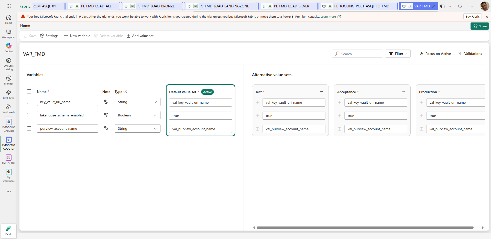
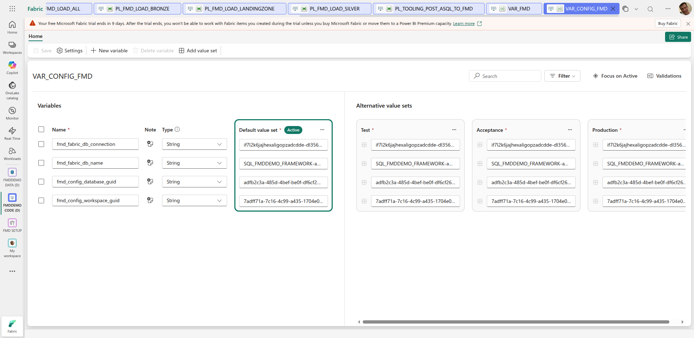

# Variable libraries

FMD keeps its environment-specific configuration in two Fabric Variable Libraries, `VAR_FMD` and `VAR_CONFIG_FMD`. Between them they hold seven variables. Nothing else in the framework is environment-dependent: workspace GUIDs, database names, and connection strings all resolve through these two libraries, which is what lets the same item definitions be deployed to Test, Acceptance, and Production unchanged.

## The two libraries and who reads them

The split is by *lifecycle*, not by subject. `VAR_CONFIG_FMD` holds the four values that point at the configuration database, and it is the library both the pipelines and the notebooks need in order to reach that database at all. `VAR_FMD` holds behavioural defaults that are set once at deployment.

```mermaid
flowchart TD
    subgraph VF["VAR_FMD"]
        KV["key_vault_uri_name<br/>String"]
        LSE["lakehouse_schema_enabled<br/>Boolean"]
        PAN["purview_account_name<br/>String"]
    end

    subgraph VC["VAR_CONFIG_FMD"]
        DBC["fmd_fabric_db_connection<br/>String"]
        DBN["fmd_fabric_db_name<br/>String"]
        CWG["fmd_config_workspace_guid<br/>String"]
        CDG["fmd_config_database_guid<br/>String"]
    end

    NB["Notebooks<br/>notebookutils.variableLibrary.getLibrary"]
    PL["Pipelines<br/>@pipeline&#40;&#41;.libraryVariables.*"]

    KV --> NB
    LSE --> NB
    PAN --> NB
    DBC --> NB
    DBN --> NB
    KV --> PL
    CWG --> PL
    CDG --> PL

    NB --> DB[("SQL_FMD_FRAMEWORK<br/>configuration database")]
    PL --> DB
```



Notice the asymmetry. Notebooks connect to the configuration database *by name*, using `fmd_fabric_db_connection` and `fmd_fabric_db_name` in an ODBC connection string. Pipelines connect to it *by GUID*, using `fmd_config_workspace_guid` and `fmd_config_database_guid` in a `FabricSqlDatabase` connection setting. Two ways of naming the same database, because the two runtimes need different handles on it. Neither pair is read by the other side: no notebook reads the GUID variables, and no pipeline reads the connection-string variables.

## VAR_FMD

Default behaviour, set at deployment time by `NB_SETUP_FMD.ipynb`.

| Variable | Type | Default in `variables.json` | Purpose |
| --- | --- | --- | --- |
| `key_vault_uri_name` | `String` | `""` | The Azure Key Vault URI or name from which secrets are read. Consumed by the Purview notebook to fetch its service-principal credentials. Read into a `key_vault` variable by the loader notebooks and the custom template, but not otherwise used by them. |
| `lakehouse_schema_enabled` | `Boolean` | `""` | Whether the target Lakehouses have the schema feature enabled. Decides the physical Delta table path layout. |
| `purview_account_name` | `String` | `""` | The Microsoft Purview account into which lineage is registered. Read only by the Purview lineage notebook. |

All three defaults are empty in the committed `variables.json`, and all three `valueSets` (`Test.json`, `Acceptance.json`, `Production.json`) ship with an empty `variableOverrides` array. The library is a *shape*, not a set of values: the values are written into it at deployment. There is therefore no such thing as a meaningful "default" for these variables in the repository, and a fresh clone will not run until the deployment notebook has populated them.

### What `lakehouse_schema_enabled` actually switches

This is the one variable with a visible effect on data layout, and it is read as a string, then lowercased and compared, in both loader notebooks:

```python
if str(schema_enabled).lower() == "true":
    target_data_path = f"abfss://{TargetWorkspace}@onelake.dfs.fabric.microsoft.com/{TargetLakehouse}/Tables/{DataSourceNamespace}/{TargetSchema}_{TargetName}"
else:
    target_data_path = f"abfss://{TargetWorkspace}@onelake.dfs.fabric.microsoft.com/{TargetLakehouse}/Tables/{DataSourceNamespace}_{TargetSchema}_{TargetName}"
```

With schemas enabled, `DataSourceNamespace` becomes a **path segment**, that is, a real Lakehouse schema, and the table is `{TargetSchema}_{TargetName}` inside it. With schemas disabled, everything is flattened into a single table name, `{DataSourceNamespace}_{TargetSchema}_{TargetName}`, in the Lakehouse's flat `Tables/` namespace.

Because it is compared as a lowercased string rather than as a boolean, the values `True`, `"true"`, and `"True"` all work, and anything else, including an unset value, falls to the flat layout. Changing this variable after tables exist does not migrate them: the notebooks would simply start writing to different paths.



## VAR_CONFIG_FMD

The location of the configuration database. Set during deployment, and the wiki notes these must be changed manually if you want to point at a different configuration database.

| Variable | Type | Default in `variables.json` | Purpose |
| --- | --- | --- | --- |
| `fmd_fabric_db_connection` | `String` | `""` | The SQL endpoint of the configuration database. Used as `SERVER=` in the notebooks' ODBC connection string. |
| `fmd_fabric_db_name` | `String` | `""` | The database name. Used as `DATABASE=` in the same connection string. |
| `fmd_config_workspace_guid` | `String` | `""` | The GUID of the workspace holding the configuration database. Used by pipelines as `workspaceId`. |
| `fmd_config_database_guid` | `String` | `""` | The GUID of the configuration database item. Used by pipelines as `artifactId`. |



## Who consumes what

### Notebooks

Every consuming notebook opens with the same two lines, which bind the whole library to a Python object whose attributes are the variable names:

```python
config_settings = notebookutils.variableLibrary.getLibrary("VAR_CONFIG_FMD")
default_settings = notebookutils.variableLibrary.getLibrary("VAR_FMD")
```

and then reads attributes off it:

```python
key_vault     = default_settings.key_vault_uri_name
connstring    = config_settings.fmd_fabric_db_connection
database      = config_settings.fmd_fabric_db_name
schema_enabled = default_settings.lakehouse_schema_enabled
```

| Notebook | `key_vault_uri_name` | `lakehouse_schema_enabled` | `purview_account_name` | `fmd_fabric_db_connection` | `fmd_fabric_db_name` |
| --- | --- | --- | --- | --- | --- |
| `NB_FMD_LOAD_LANDING_BRONZE` | reads | **uses** | – | **uses** | **uses** |
| `NB_FMD_LOAD_BRONZE_SILVER` | reads | **uses** | – | **uses** | **uses** |
| `NB_FMD_CUSTOM_NOTEBOOK_TEMPLATE` | reads | reads | – | **uses** | **uses** |
| `NB_FMD_FABRIC_PURVIEW_LINEAGE_TABLE_COLUMN_EXTRACTOR` | **uses** | – | **uses** | **uses** | **uses** |
| `NB_UTILITIES_SETUP_FMD` | **writes** | **writes** | **writes** | **writes** | **writes** |

"reads" means the value is assigned to a local variable but has no further effect in that notebook; "uses" means it changes behaviour. `key_vault_uri_name` is assigned in the loader notebooks and the template, but nothing in those notebooks fetches a secret. Only the Purview notebook actually resolves it, to read `tenantid`, `sp-fabric-purview-deployment-appid`, and `sp-fabric-purview-deployment-secret`.

The four remaining notebooks, `NB_FMD_PROCESSING_PARALLEL_MAIN`, `NB_FMD_PROCESSING_LANDINGZONE_MAIN`, `NB_FMD_DQ_CLEANSING`, and `NB_FMD_CUSTOM_DQ_CLEANSING`, read no variable library at all. The orchestrators receive everything they need as parameters from the pipeline, and the cleansing notebooks operate purely on a DataFrame.

`NB_UTILITIES_SETUP_FMD` is the writer rather than a reader: it populates the libraries during deployment from a `variable_parameters` dictionary whose keys are exactly `key_vault_uri_name`, `lakehouse_schema_enabled`, and `purview_account_name`.

### Pipelines

Pipelines reference library variables with the `@pipeline().libraryVariables.<LIBRARY>_<variable>` expression syntax, flattening the library name into the identifier:

```json
"connectionSettings": {
  "name": "SQL_FMD_FRAMEWORK",
  "properties": {
    "type": "FabricSqlDatabase",
    "typeProperties": {
      "artifactId": "@pipeline().libraryVariables.VAR_CONFIG_FMD_fmd_config_database_guid",
      "workspaceId": "@pipeline().libraryVariables.VAR_CONFIG_FMD_fmd_config_workspace_guid"
    }
  }
}
```

Both GUID variables are used by 24 of the 25 pipelines, everywhere a Lookup or a stored-procedure activity has to reach the configuration database. The only pipeline that references neither is `PL_FMD_TOOLING_LOAD_TO_PURVIEW`, which does nothing but launch the Purview notebook and lets that notebook connect on its own.

`key_vault_uri_name` is the only `VAR_FMD` variable a pipeline reads, and exactly one pipeline reads it: `PL_FMD_LDZ_COPY_FROM_ADF`.

| Variable | Pipelines that **use** it in an activity |
| --- | --- |
| `fmd_config_database_guid` | all except `PL_FMD_TOOLING_LOAD_TO_PURVIEW` |
| `fmd_config_workspace_guid` | all except `PL_FMD_TOOLING_LOAD_TO_PURVIEW` |
| `key_vault_uri_name` | `PL_FMD_LDZ_COPY_FROM_ADF` only |
| `lakehouse_schema_enabled` | none |
| `purview_account_name` | none |
| `fmd_fabric_db_connection` | none |
| `fmd_fabric_db_name` | none |

**Declared is not the same as used, and a grep will mislead you.** Every pipeline
carries a `libraryVariables` manifest *declaring* the variables it may bind,
whether or not any activity reads them. The two are far apart:

| Variable | Declared in `libraryVariables` | Used in `properties.activities` |
| --- | --- | --- |
| `VAR_CONFIG_FMD_fmd_config_database_guid` | 25 | 24 |
| `VAR_CONFIG_FMD_fmd_config_workspace_guid` | 25 | 24 |
| `VAR_FMD_key_vault_uri_name` | 24 | 1 |
| `VAR_FMD_lakehouse_schema_enabled` | 23 | 0 |

The table above this one counts *actual use inside the activities*, which is the
thing that affects a run. The starkest gap is `lakehouse_schema_enabled`: declared
by 23 of the 25 pipelines and read by none of them.

## Value sets

Each library ships three value sets, `Test`, `Acceptance`, and `Production`, corresponding to the three environments the deployment notebook targets. In the repository all six are empty:

```json
{
  "$schema": "https://developer.microsoft.com/json-schemas/fabric/item/variableLibrary/definition/valueSet/1.0.0/schema.json",
  "name": "Production",
  "variableOverrides": []
}
```

An environment override is added by populating `variableOverrides` in the relevant value set; the active value set is selected per workspace in Fabric. Since the deployment notebook writes concrete values into each deployed workspace's library, a single-environment deployment never needs to touch the value sets at all.

## Where this page disagrees with the upstream wiki

The upstream *Variable Library* wiki page lists a different set of variables from the one in `variables.json` at the pinned commit. Three claims do not hold:

| Wiki claims `VAR_FMD` supports | In `VAR_FMD/variables.json`? |
| --- | --- |
| `key_vault_uri_name` | yes |
| `key_vault_tenant_id` | **no** |
| `key_vault_client_id` | **no** |
| `key_vault_client_secret` | **no** |
| `lakehouse_schema_enabled` | yes |
| *(not mentioned)* `purview_account_name` | **yes, present in the code** |

So the wiki over-reports by three and under-reports by one, and in both directions it is simply stale.

The three `key_vault_*` variables did once exist and were **deliberately removed**, in the upstream commit titled *"consider using managed identity or key vault for client secret instead of variable library"*, which deleted them from `variables.json` in the same change that removed the corresponding deployment config. The reasoning is sound and worth understanding rather than working around: a Fabric Variable Library is a plain-text, source-controlled item, so a `key_vault_client_secret` variable would put a client secret into git. The framework now keeps only the *address* of the vault in a variable (`key_vault_uri_name`) and resolves the secrets themselves at run time. The Purview notebook reads them from Key Vault under the fixed secret names `tenantid`, `sp-fabric-purview-deployment-appid`, and `sp-fabric-purview-deployment-secret`.

**Do not re-add them.** If you need another credential, follow the same pattern: put the secret in Key Vault, and reference it by a secret name in the consuming notebook.

`purview_account_name` moves in the other direction: it was added to the library by the recent commit that introduced the Purview lineage notebook, and the wiki page was never updated to match.

The wiki's `VAR_CONFIG_FMD` list is accurate: all four variables exist with the names given.

---

Source: `src/VAR_FMD.VariableLibrary/variables.json` @ `1ba7974`
Source: `src/VAR_CONFIG_FMD.VariableLibrary/variables.json` @ `1ba7974`
Source: `src/VAR_FMD.VariableLibrary/valueSets/{Test,Acceptance,Production}.json` @ `1ba7974`
Source: `src/VAR_CONFIG_FMD.VariableLibrary/valueSets/{Test,Acceptance,Production}.json` @ `1ba7974`
Source: `src/NB_FMD_LOAD_LANDING_BRONZE.Notebook/notebook-content.py` @ `1ba7974`
Source: `src/NB_FMD_LOAD_BRONZE_SILVER.Notebook/notebook-content.py` @ `1ba7974`
Source: `src/NB_FMD_CUSTOM_NOTEBOOK_TEMPLATE.Notebook/notebook-content.py` @ `1ba7974`
Source: `src/NB_FMD_FABRIC_PURVIEW_LINEAGE_TABLE_COLUMN_EXTRACTOR.Notebook/notebook-content.py` @ `1ba7974`
Source: `src/NB_UTILITIES_SETUP_FMD.Notebook/notebook-content.py` @ `1ba7974`
Source: `src/PL_FMD_LOAD_BRONZE.DataPipeline/pipeline-content.json` @ `1ba7974`
Source: `src/PL_FMD_LDZ_COPY_FROM_ADF.DataPipeline/pipeline-content.json` @ `1ba7974`

Everything above is transcribed from `variables.json` in each library, not from the upstream wiki. Where the two disagree, the disagreement is called out on the page.

Platform behaviour (Microsoft Learn):

- [Value sets in a Variable library](https://learn.microsoft.com/fabric/cicd/variable-library/value-sets)
- [Variable library CI/CD and git integration](https://learn.microsoft.com/fabric/cicd/variable-library/variable-library-cicd#variable-libraries-and-git-integration)
