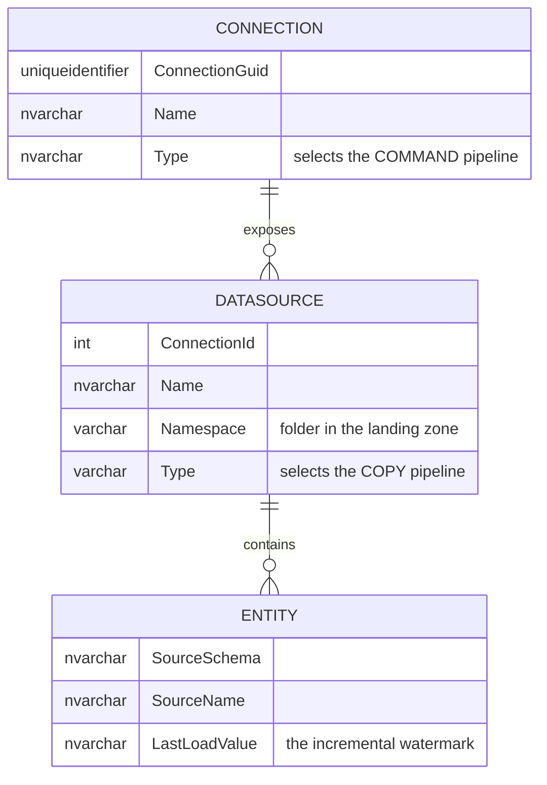
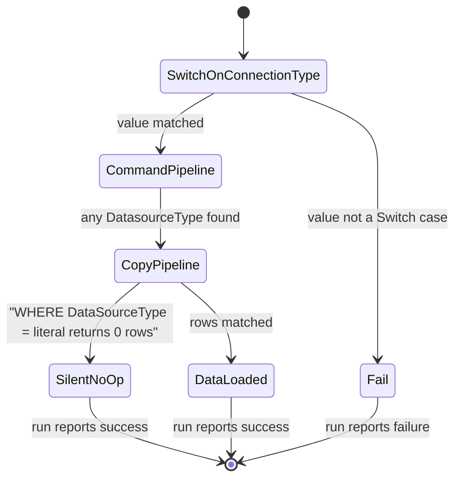
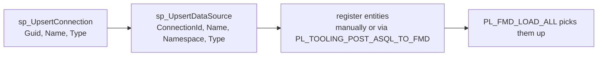

# Supported sources

FMD loads from nine source families. The set is not open-ended: it is exactly the
set of cases in the connection-type Switch inside `PL_FMD_LOAD_LANDINGZONE`. A
value that is not in that Switch hits the `FA_UNKNOWN_DATASOURCENAME` Fail
activity and the run stops. Adding a source system means adding a Switch case, a
command pipeline and a copy pipeline, not just a metadata row.

## The two type columns

Every source is identified by **two** metadata values, and confusing them is the
most common configuration error in FMD.

| Value | Lives on | Registered with | Selects |
| --- | --- | --- | --- |
| `Connection.Type` (`ConnectionType`) | The connection: *how* FMD reaches the system, plus its credentials | `[integration].[sp_UpsertConnection]` | which `PL_FMD_LDZ_COMMAND_*` pipeline runs |
| `Datasource.Type` (`DatasourceType`) | The datasource: *what* logical database, container or feed is exposed through that connection | `[integration].[sp_UpsertDataSource]` | which `PL_FMD_LDZ_COPY_FROM_*` pipeline runs |

Both are surfaced to the pipelines through the view
`[execution].[vw_LoadSourceToLandingzone]`, which is the only thing the landing
zone ever queries. Neither is free text in practice: both are matched against
hard-coded string literals in the pipelines.

See [Data model](./01-data-model.md) for the full column lists of these tables.

## The nine sources

The `ConnectionType` column here is authoritative: it is the exact, upper-cased
literal the Switch matches. The `DatasourceType` column is the exact literal the
copy pipeline's `WHERE DataSourceType = '...'` clause matches.

| Source system | `ConnectionType` | `DatasourceType` | Command pipeline | Copy pipeline | Copy source type |
| --- | --- | --- | --- | --- | --- |
| Azure SQL / SQL Server | `SQL` | `ASQL_01`, `ASQL_02` | `LDZ_COMMAND_ASQL` | `LDZ_COPY_FROM_ASQL_01` | `AzureSqlSource` |
| Azure SQL Managed Instance | `AZURESQLMI` | `SQLMI_01` | `LDZ_COMMAND_SQLMI` | `LDZ_COPY_FROM_SQLMI_01` | `SqlMISource` |
| Oracle (via on-prem gateway) | `ORACLE` | `ORACLE_01` | `LDZ_COMMAND_ORACLE` | `LDZ_COPY_FROM_ORACLE_01` | `OracleSource` |
| Azure Data Lake Storage Gen2 | `ADLS` | `ADLS_01` | `LDZ_COMMAND_ADLS` | `LDZ_COPY_FROM_ADLS_01` | `BinarySource` |
| OneLake, tables | `ONELAKE` | `ONELAKE_TABLES_01` | `LDZ_COMMAND_ONELAKE` | `LDZ_COPY_FROM_ONELAKE_TABLES_01` | `LakehouseTableSource` |
| OneLake, files | `ONELAKE` | `ONELAKE_FILES_01` | `LDZ_COMMAND_ONELAKE` | `LDZ_COPY_FROM_ONELAKE_FILES_01` | `BinarySource` |
| SFTP | `SFTP` | `SFTP_01` | `LDZ_COMMAND_SFTP` | `LDZ_COPY_FROM_SFTP_01` | `BinarySource` |
| FTP | `FTP` | `FTP_01` | `LDZ_COMMAND_FTP` | `LDZ_COPY_FROM_FTP_01` | `BinarySource` |
| Azure Data Factory | `ADF` | `ADF` | `LDZ_COMMAND_ADF` | `LDZ_COPY_FROM_ADF` | none, invokes ADF |
| Custom notebook | `NOTEBOOK` | `NOTEBOOK` | `LDZ_COMMAND_NOTEBOOK` | `LDZ_COPY_FROM_CUSTOM_NB` | none, runs a notebook |

### Where the wiki is wrong

The overview table at the end of the wiki's `Supported-data-sources.md` states
values that no pipeline matches. If you follow it, the run fails or the entity is
silently never picked up.

| The wiki says | The code matches | Consequence of following the wiki |
| --- | --- | --- |
| Connection type `ASQLMI` | `AZURESQLMI` | The Switch takes its default branch. `FA_UNKNOWN_DATASOURCENAME` fails the run. |
| Datasource type `ASQLMI_01` | `SQLMI_01` | `LDZ_COPY_FROM_SQLMI_01` selects zero rows. The entity is never loaded, and nothing fails. |
| Datasource type `ADF_01` | `ADF` | `LDZ_COPY_FROM_ADF` selects zero rows. The entity is never loaded, and nothing fails. |

The wiki also omits the `NOTEBOOK` and `FTP` sources from its overview table
entirely, though both are fully implemented.

The silent-failure cases are the dangerous ones. A wrong `ConnectionType` fails
loudly at the Switch. A wrong `DatasourceType` does not: the command pipeline's
`GROUP BY DatasourceType` lookup happily returns the bad value, invokes the copy
pipeline, and the copy pipeline's `WHERE DataSourceType = '<hard-coded>'` returns
nothing. Every audit record says success. Nothing was loaded.

## The `_01` suffix

`_01` is not a version number and not a pipeline revision. It is a **volume-split
slot**: a way to spread the entities of one source system across independent,
concurrently running ForEach loops.

The upstream wiki states this directly:

> Verify the appropriate `connectionType` and `datasourceType` for your specific
> connection. For example, the connection type may be `Sql`, with datasource types
> such as `ASQL_01` and `ASQL_02`. This configuration supports efficient handling
> of high data volumes by splitting them based on the datasource.
>
> `FMD_FRAMEWORK.wiki/Data-Pipelines-and-Notebooks.md`

The code bears this out. `PL_FMD_LDZ_COPY_FROM_ASQL_01` is the only copy pipeline
that implements more than one slot, and it does so by carrying two complete,
structurally identical branches side by side:

- `LK_GET_ENTITIES` → `FE_ENTITY`, selecting `WHERE DataSourceType = 'ASQL_01'`
- `LK_GET_ENTITIES_ASQL_02` → `FE_ENTITY_ASQL_02`, selecting `WHERE DataSourceType = 'ASQL_02'`

Both branches hang off `SP_START_AUDIT_PIPELINE` with no dependency on each other,
so Fabric runs them in parallel. Both take their source connection from
`@item().ConnectionGuid`, so a slot is not tied to a particular connection: you
can put half of one database's tables in `ASQL_01` and half in `ASQL_02` and they
will be copied by two concurrent loops.

The number that makes this worth doing is the ForEach parallelism limit. Neither
branch sets `batchCount`, so each runs at the Fabric default of **20 concurrent
iterations** (50 is the maximum you can request). One slot over 400 tables means
those tables are copied 20 at a time. A second slot is a second ForEach, and
therefore a second 20-wide lane. That is the throughput problem the `_01` / `_02`
split exists to solve, and it is why the split is per *datasource type* rather
than per connection.

> Source: [Data Factory limitations](https://learn.microsoft.com/fabric/data-factory/data-factory-limitations#pipeline-resource-limits)

The practical consequences:

- For every source except Azure SQL, `_01` is the **only** slot that exists. Registering a datasource as `ORACLE_02` or `SFTP_02` matches no pipeline and loads nothing.
- Adding a slot is a pipeline change, not a metadata change. You would copy the `FE_ENTITY_ASQL_02` branch and change the literal.
- `ADF` and `NOTEBOOK` carry no suffix at all, because neither has a Copy activity to parallelise.

## What to configure per source

All sources need the same two registrations, in this order. The full parameter
lists are in [Data model](./01-data-model.md).

The `Namespace` on the datasource is the folder name the files land under in the
landing-zone Lakehouse, so keep it short and stable: it appears in every path
downstream.

Beyond that, each family has its own requirements.

**Azure SQL (`SQL` / `ASQL_01`, `ASQL_02`)**
A Fabric connection to the SQL server, referenced by `ConnectionGuid`. The copy is
watermarked: `LK_GET_LASTLOADDATE` executes `@item().LastLoadValue` as a query and
the Copy activity's source query is `@item().SourceDataRetrieval`, so **both the
extraction query and the watermark query come from the entity metadata**. Data
lands as Parquet.

**Azure SQL Managed Instance (`AZURESQLMI` / `SQLMI_01`)**
Same shape as Azure SQL, with `SqlMISource`. One slot only.

**Oracle (`ORACLE` / `ORACLE_01`)**
Requires an on-premises data gateway on the Fabric connection. The copy pipeline
runs an extra `LK_GET_COLUMNNAMES` lookup before the Copy activity, which the
other database sources do not, then copies via `OracleSource` to Parquet.

**ADLS Gen2 (`ADLS` / `ADLS_01`)**
A connection to the external storage account. This is for storage *outside*
OneLake; for OneLake itself use the `ONELAKE` type. Files are copied byte for byte
(`BinarySource` to `BinarySink`), not parsed.

**OneLake (`ONELAKE` / `ONELAKE_TABLES_01` or `ONELAKE_FILES_01`)**
The only connection type whose command pipeline carries a second Switch. Pick
`ONELAKE_TABLES_01` to read Lakehouse or Warehouse tables (copied to Parquet) and
`ONELAKE_FILES_01` to read raw files (copied binary). That inner Switch has an
**empty default branch** (`"defaultActivities": []`), so a third value is silently
ignored rather than failing.

**SFTP and FTP (`SFTP` / `SFTP_01`, `FTP` / `FTP_01`)**
Credentials live on the Fabric connection, not in FMD. Both pipelines run a
`GetMetadata` existence check before copying and treat an absent file as a clean
no-op recorded by `SP_END_AUDIT_PIPELINE_NOFILE`, rather than a failure. This is
the only source family where a missing source does not fail the run, and it is the
right default for partner drops that may simply not have arrived yet.

**Azure Data Factory (`ADF` / `ADF`)**
FMD owns the metadata; ADF does the moving. `PL_FMD_LDZ_COPY_FROM_ADF` invokes
your ADF pipeline through `PL_INVOKE_ADF`, passing `key_vault_uri_name`,
`TargetFilePath`, `TargetFileName`, `SourceSchema`, `SourceName`,
`TargetWorkspaceId` and `TargetLakehouseId`. **Your ADF pipeline is responsible for
writing to OneLake at the target path FMD gives it.** If it does not, FMD will
still advance the watermark on success, and the entity will look loaded when it is
not.

**Custom notebook (`NOTEBOOK` / `NOTEBOOK`)**
The escape hatch for anything the other eight cannot reach: an API, a proprietary
driver, a bespoke extraction. `PL_FMD_LDZ_COPY_FROM_CUSTOM_NB` runs
`NB_FMD_PROCESSING_LANDINGZONE_MAIN`, which dispatches to the notebook named in
the entity's `CustomNotebookName` field, passing `EntityId`, `DataSourceName`,
`TargetFilePath`, `TargetFileName`, `TargetLakehouseGuid`, `WorkspaceGuid` and
`LastLoadValue`. `NB_FMD_CUSTOM_NOTEBOOK_TEMPLATE` in the repository is the
starting point. As with ADF, the watermark advances when the notebook succeeds, so
a notebook that succeeds without writing anything produces a silent gap.

## Adding a source system

There is no plug-in point. Adding a tenth source family requires, at minimum:

1. a new case in the `SW_CHECK_DATASOURCENAME` Switch in `PL_FMD_LOAD_LANDINGZONE`;
2. a new `PL_FMD_LDZ_COMMAND_*` pipeline, whose lookup filters on the new `ConnectionType`;
3. a new `PL_FMD_LDZ_COPY_FROM_*` pipeline, whose lookup filters on the new `DatasourceType` and whose Copy activity uses the right source type;
4. the audit and upsert calls wired in, or the entity's watermark never advances.

If the source can be reached from Python, the `NOTEBOOK` type does all four for
free. Reach for a custom notebook before reaching for a new pipeline family.

---

Sources:

- `src/PL_FMD_LOAD_LANDINGZONE.DataPipeline/pipeline-content.json` (the connection-type Switch) @ b5fb08e
- `src/PL_FMD_LDZ_COMMAND_*.DataPipeline/pipeline-content.json` (the `ConnectionType` literals) @ b5fb08e
- `src/PL_FMD_LDZ_COPY_FROM_*.DataPipeline/pipeline-content.json` (the `DataSourceType` literals and Copy source types) @ b5fb08e
- `FMD_FRAMEWORK.wiki/Supported-data-sources.md` @ 69305fd
- `FMD_FRAMEWORK.wiki/Data-Pipelines-and-Notebooks.md` (the `_01` volume-split note) @ 69305fd

This page is derived from the pipeline JSON and cross-checked against the wiki. Where they disagree, the JSON wins and the disagreement is stated on the page.
