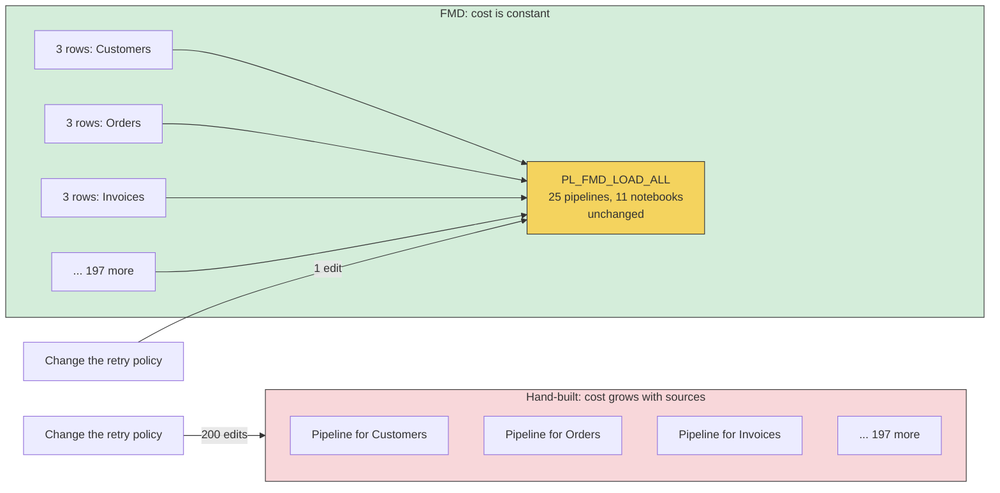
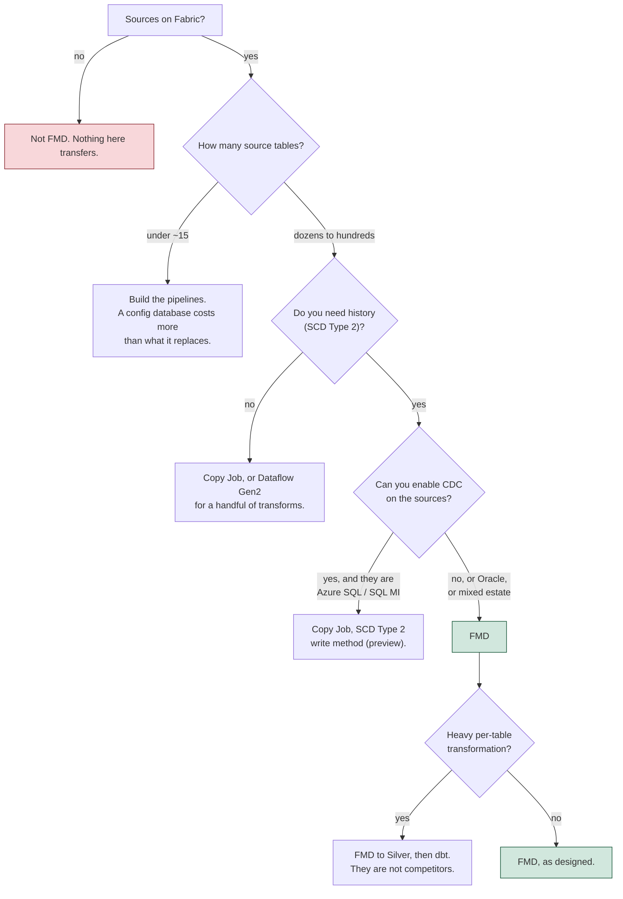

# Why FMD, and when not to use it

A data platform that hand-builds one pipeline per source table is buying a linear cost curve. FMD is a metadata-driven ingestion framework for Microsoft Fabric that flattens it: you describe a table as rows in a configuration database, and a fixed set of pipelines and notebooks lands it, historises it and audits it.

This page is about when that trade is worth making. What it buys you, what it costs you, where it stops, and what to reach for instead when it does not fit.

## The problem: pipeline sprawl

Each hand-built pipeline is a Fabric artefact with its own copy activity, its own connection reference, its own watermark logic, its own error handling and its own retry policy. Ninety percent of that is identical across every table. The ten percent that differs is a table name, a schema name and a key column.

The cost is not the first pipeline. It is the two hundredth. A schema change to the audit convention, a new retry policy, a fix to a watermark comparison: each of these is now a change that has to be applied two hundred times, by hand, in a UI. In practice it is not applied two hundred times. It is applied to the pipelines someone remembered, and the platform drifts.

The number that matters is **artefacts per source table**. If that number is one or more, your maintenance cost grows with your ingestion surface even though your ingestion *logic* does not.

## How FMD answers it

FMD drives that number to zero. It ships a fixed set of pipelines and notebooks, and moves the per-table variation into rows of a configuration database:

- `integration.LandingzoneEntity`: which source schema and table, which file to write, `IsIncremental` and `IsIncrementalColumn`.
- `integration.BronzeLayerEntity`: which target table, the `PrimaryKeys`, the `CleansingRules`.
- `integration.SilverLayerEntity`: which target table, and its cleansing rules.

Three views in the `execution` schema turn those rows into instructions. `vw_LoadSourceToLandingzone` computes the `SourceDataRetrieval` query, the target path and the target filename. `vw_LoadToBronzeLayer` and `vw_LoadToSilverLayer` return the work queue by joining on `IsProcessed = 0`. The pipelines never construct SQL and never know a table name. They read a row and execute what the view produced. See [architecture](./03-architecture.md) and [load flow](./04-load-flow.md).

**The economics.** Onboarding table 2 costs three `INSERT` statements. Onboarding table 200 costs three `INSERT` statements. The pipeline count stays at 25, the notebook count stays at 10, and a change to the audit convention is a change to one stored procedure. That is the entire value proposition, and it is real.

## What you gain, what you give up

| You gain | You give up |
|---|---|
| **A constant artefact count.** 25 pipelines and 11 notebooks whether you load 5 tables or 500. | **A layer of indirection.** A failing load is diagnosed by reading `execution.vw_LoadSourceToLandingzone` and the `logging` tables, not by opening a pipeline and looking at it. Onboarding an engineer costs more. |
| **SCD Type 2 history for free.** `NB_FMD_LOAD_BRONZE_SILVER` gives every Silver table `IsCurrent`, `IsDeleted`, `RecordStartDate`, `RecordModifiedDate` and `RecordEndDate` with no per-table code. | **A prescribed data model.** Every Silver table carries the same **eight** technical columns (`HashedPKColumn`, `HashedNonKeyColumns`, `RecordLoadDate`, `IsCurrent`, `RecordStartDate`, `RecordModifiedDate`, `RecordEndDate`, `IsDeleted`) and the same `HashedPKColumn` contract. You do not get to model history a different way for one table. |
| **One audit trail.** `logging.PipelineExecution`, `logging.CopyActivityExecution` and `logging.NotebookExecution` record every start, end and failure, and a failed Silver merge traces back to the source query that produced its file. Correlate them on `TriggerGuid`, not on `PipelineRunGuid`, for the reason given in [logging and auditing](../03-reference/02-logging-and-auditing.md). | **No referential integrity in the runtime state.** The `execution` and `logging` schemas declare **no foreign keys at all**. All three FKs in the database live in `integration`. A stale row in `execution.PipelineLandingzoneEntity` pointing at a deleted entity is not prevented by the database. |
| **Parallel execution out of the box.** `NB_FMD_PROCESSING_PARALLEL_MAIN` fans out with `runMultiple`, up to 50 notebooks per batch (the API ceiling; real concurrency is bounded by driver cores), grouping by target table so files for one table replay in landing order, up to that same 50-file ceiling. | **A single point of coupling.** Every pipeline and every notebook reads `SQL_FMD_FRAMEWORK`. If the configuration database is unavailable, ingestion stops, everywhere, at once. |
| **A real extension slot.** `CleansingRules` on the Bronze and Silver entities, and `ConnectionType = NOTEBOOK` with `CustomNotebookName` on `integration.LandingzoneEntity`, are supported hooks, not workarounds. | **Metadata that is code.** `vw_LoadSourceToLandingzone` builds the source query by **string concatenation**. `SourceSchema` and `SourceName` go through `QUOTENAME`; `IsIncrementalColumn` does not, and the watermark is pasted in as a quoted literal. Write access to `integration.LandingzoneEntity` is equivalent to query access on every registered source. |
| **Purview lineage tooling.** `NB_FMD_FABRIC_PURVIEW_LINEAGE_TABLE_COLUMN_EXTRACTOR` and `PL_FMD_TOOLING_LOAD_TO_PURVIEW` register table and column lineage. | **Fabric, and only Fabric.** OneLake, Fabric SQL Database, Fabric pipelines, `notebookutils`, variable libraries. See below. |
| **Incremental loading from relational sources.** `IsIncremental = 1` with `IsIncrementalColumn` gives you a watermarked delta with no code, for SQL Server and for Oracle. | **The watermark means something different per source type.** For file sources it is `@utcNow()`, the clock, not a value read from the data. And `AZURESQLMI` does not line up with the view that builds the watermark query. |

### The four limitations that will shape your plan

**1. The watermark is not one mechanism, it is five.** The `WHERE` clause that makes a load incremental is built for **any** connection type with `IsIncremental = 1`. What differs is how each copy pipeline reads the **new** high-water mark afterwards, and the differences matter:

| `ConnectionType` | New watermark comes from | What you get |
|---|---|---|
| `SQL` | The `LastLoadValue` query built by `execution.vw_LoadSourceToLandingzone`, run by `LK_GET_LASTLOADDATE`. | A real `MAX(IsIncrementalColumn)` from the source. |
| `ORACLE` | `PL_FMD_LDZ_COPY_FROM_ORACLE_01`'s **own** native lookup: `TO_CHAR(MAX(col), 'YYYY-MM-DD HH24:MI:SS')`. It does not use the view. | A real `MAX(IsIncrementalColumn)` from the source. |
| `AZURESQLMI` | `PL_FMD_LDZ_COPY_FROM_SQLMI_01` executes `@item().LastLoadValue` as a query, but the view's `CASE` tests `IN ('SQL')` and the Switch dispatches SQL MI as `AZURESQLMI`, so that expression is the stored **value**, not a query. | The two do not meet. Verify on your instance before you rely on it. |
| `ADLS`, `ONELAKE`, `SFTP`, `FTP`, `ADF` | `@utcNow()`, written by the copy pipeline. | A clock, not a value. A file that lands late with older content is filtered out on the next run. Prefer folder or file-name partitioning for these. |
| `NOTEBOOK` | Passed straight through to your custom notebook. | Whatever you define. |

The headline: **incremental loading works, and it works for Oracle as well as for SQL Server.** But do not assume `IsIncremental = 1` means the same thing on a file source as on a database source, and check SQL MI before you commit to it.

Note in particular that the view's `LastLoadValue` string is T-SQL, and that this does **not** stop Oracle, because Oracle's copy pipeline never uses it. Reading the `IN ('SQL')` branch as "only SQL is incremental" is the mistake to avoid; it describes one of five mechanisms, not the gate.

**2. The source query is a concatenated string.** Both `SourceDataRetrieval` and `LastLoadValue` are assembled with `+` inside the view. Two consequences. For debugging: to see what actually ran against the source, you `SELECT` from the view, you do not read the pipeline. That is a real ergonomic gain once you know it, and a source of confusion until you do. For security: metadata is code. Whoever can `INSERT` into `integration.LandingzoneEntity` can shape SQL that executes on every registered source system under the framework's connection identity. Entity registration is a privileged operation and must never be exposed to an untrusted caller or driven from user input.

**3. The runtime state has no referential integrity.** `git grep REFERENCES` across `src/Config_Database/` returns three hits, all in `integration`. `execution` and `logging` declare none. The queue tables (`PipelineLandingzoneEntity`, `PipelineBronzeLayerEntity`, `LandingzoneEntityLastLoadValue`) hold `LandingzoneEntityId` and `BronzeLayerEntityId` values that the database will not check. Delete an entity from `integration` and its queue rows and watermark survive as orphans. Nothing crashes, but your work queue is now lying to you. Cleanup is your job, not the database's.

**4. There is no automated test suite.** Searching the framework repository for tests returns nothing but `Test.json` value sets in the variable libraries, which are environment value sets, not tests. The one `.github/workflows` file, `dacpac-guard.yml` ([#263](https://github.com/edkreuk/FMD_FRAMEWORK/pull/263), merged), fails CI when the deployed dacpac is older than the `.sql` sources that build it; it is a staleness guard, not a test suite. There is no unit test project and no integration harness. Correctness is established by running the framework and reading the `logging` schema. Your acceptance testing is therefore your own, and an upstream update is not proven safe by anything except your own regression run.

### The Fabric lock-in, stated plainly

FMD is not portable, and it does not claim to be. It binds to Microsoft Fabric at every layer:

| Bound to Fabric | What it would take to move |
|---|---|
| OneLake lakehouses (`LH_DATA_LANDINGZONE`, `LH_BRONZE_LAYER`, `LH_SILVER_LAYER`), OneLake shortcuts into Gold | The Delta tables themselves are open format and portable. The shortcut mechanism is not. |
| Fabric SQL Database (`SQL_FMD_FRAMEWORK`) | The three schemas are plain T-SQL. They would run on Azure SQL with little change. This is the most portable part. |
| Fabric Data Pipelines (25 of them, `pipeline-content.json`) | Not portable. Would be rewritten against ADF, Airflow or equivalent. ADF is the closest target. |
| Fabric Spark notebooks and `notebookutils` (`runMultiple`, `credentials.getToken`, `variableLibrary.getLibrary`) | The PySpark transformation logic is portable. The `notebookutils` calls for orchestration, auth and configuration are not, and they are load-bearing. |
| Variable libraries (`VAR_FMD`, `VAR_CONFIG_FMD`) | A Fabric-specific item type. Would become environment variables or a config file. |

What ports: the *idea*, the SQL schema, and the Spark transformation logic. What does not: the orchestration, the auth, and the configuration mechanism, which is most of the framework's actual value. Treat FMD as a Fabric commitment.

## When FMD is the right choice

- You are on **Microsoft Fabric** already, and that is not in question.
- You have **many source tables with identical ingestion logic**: dozens to hundreds, and rising. The metadata layer pays for itself somewhere in the low tens.
- Your sources are **predominantly SQL** if you need incremental loads.
- You need **history**, and either you cannot enable CDC at the source or your estate is wider than the connectors Copy Job historises. This is now the deciding question, and it is the next section.
- Your transformation logic lives **downstream of Silver**, in the Gold layer, per business domain. FMD is an ingestion and historisation framework. It has no opinion about your business model, and it gives you no place to put one before Silver.
- You want **one audit trail** and can accept that reading it is a SQL exercise.

## When to reach for something else

- **Heavy per-table transformation logic.** FMD's per-table extension points are `CleansingRules` and a custom notebook. If every table needs bespoke joins, derivations or business rules before it lands, you are fighting the framework, and the metadata is not saving you anything. Use dbt, or write the notebook.
- **Real-time or streaming.** FMD is batch, file-landed, orchestrated by a pipeline run. There is no streaming path, no change data capture consumption, no event trigger. If you need sub-minute latency, this is the wrong shape entirely. Look at Fabric Eventstream, Eventhouse, or Spark Structured Streaming.
- **Sources whose incremental strategy the framework does not support.** If your volume demands incremental loads from Oracle, SQL MI, SFTP or an API, you are writing that yourself, and the metadata layer is buying you less than it appears to.
- **You are not on Fabric.** Nothing here transfers. Do not adopt Fabric in order to adopt FMD.
- **A handful of tables.** Under roughly ten to fifteen tables, a metadata framework is pure overhead: a configuration database to operate, a work queue to reason about, and an indirection layer between you and a bug. Build the pipelines.
- **Azure SQL sources with CDC available, and history is all you wanted.** Fabric Copy Job does that now, in the box, with a state machine that does not lose a delta on a failed run. Deploying a framework to get what the platform hands you is a cost with no return. The next section draws the line precisely.
- **You need referential guarantees on your runtime state**, or an automated regression suite you did not write, out of the box.

## First, the alternative that ships in the box

FMD was designed against a Fabric that could not do this. Fabric has since grown **Copy Job**, and Copy Job has moved into the territory the framework was built to cover. Any honest case for FMD in 2026 has to start there, because it is the option your Fabric licence already includes and the one your architect will ask about.

Read the overlap without flinching:

| What FMD does | Copy Job, per Microsoft Learn |
|---|---|
| `IsIncremental` + `IsIncrementalColumn` | Watermark-based incremental copy, on `ROWVERSION`, datetime, date, integer, and string-read-as-datetime columns |
| `execution.LandingzoneEntityLastLoadValue`, maintained by `SP_UPDATE_LASTLOADVALIE` | *"Copy job automatically tracks and manages the state of the last successful run"* |
| SCD Type 2 in `NB_FMD_LOAD_BRONZE_SILVER`: `IsCurrent`, `IsDeleted`, `RecordStartDate`, `RecordEndDate` | **SCD Type 2 as a write method**, adding `Valid_From`, `Valid_To`, `Is_Current`, with soft deletes. *"no custom code or additional logic is required"* |
| No delete detection at the source | CDC-based copy replicates inserts, updates **and deletes** |
| `sp_UpsertLandingzoneBronzeSilver` registering a target | Automatic table creation on the destination |
| A schedule you build yourself ([schedule the load](../02-how-to/03-schedule-the-load.md)) | Schedules and event triggers, in the item |

That is not a small overlap. It is most of the framework's feature list, delivered as a first-party item with no configuration database, no notebooks and no setup to run.

**There was one place where FMD gave a weaker guarantee than Copy Job, and it is now closed on `main`.** Up to and including `2026.07`, FMD's watermark could advance without the data being queued: `SP_UPDATE_PROCESS` and `SP_UPDATE_LASTLOADVALIE` were independent siblings with no shared transaction, so a delta could be lost and a re-run did not recover it. On `main` the two are serialized, `SP_UPDATE_LASTLOADVALIE` dependsOn `SP_UPDATE_PROCESS`, so the watermark advances only after the file is queued and the loss direction is removed ([#271](https://github.com/edkreuk/FMD_FRAMEWORK/pull/271), merged, fixes [#258](https://github.com/edkreuk/FMD_FRAMEWORK/issues/258); the `ASQL_02` volume-split branch in `PL_FMD_LDZ_COPY_FROM_ASQL_01` was serialized the same way by [#276](https://github.com/edkreuk/FMD_FRAMEWORK/pull/276)). Copy Job states the same guarantee outright: *"Copy job always resumes from the end of the last successful run. A failure doesn't change the state managed by Copy job."*

### Where FMD still wins, and it is a real list

Copy Job's SCD Type 2 has a specific shape, and the shape is where the framework survives.

- **SCD Type 2 in Copy Job is a CDC feature, and it is in preview.** It arrives with CDC-based replication, so it needs **CDC enabled on the source database**. FMD's SCD-2 needs nothing at the source but a column that goes up and a `SELECT`. If you cannot turn on CDC on a vendor's OLTP database, and plenty of shops cannot, Copy Job's history is not available to you and FMD's is.
- **Oracle.** Microsoft's own note says *"When you do CDC replication from Oracle sources, SCD Type 2 isn't supported yet."* (The connector table on the same page marks Oracle as supported for SCD-2, so Microsoft's table and its own note disagree; the note is the explicit statement.) FMD historises Oracle today, through `PL_FMD_LDZ_COPY_FROM_ORACLE_01`.
- **A registry, rather than a job.** Copy Job's unit is a job. FMD's unit is a **row**: one entity in `integration.LandingzoneEntity`, one control surface for two hundred of them, one place to set `IsActive = 0`, one `logging` schema that every layer of every entity writes to. That is the thing the framework is actually for, and Copy Job has no equivalent.
- **The layers.** Copy Job copies source to destination. FMD builds a landing zone, a deduplicated Bronze and a historised Silver, and gives you `CleansingRules` between them. If you want a medallion, Copy Job hands you one layer of it.
- **Sources Copy Job does not reach.** FMD's nine connection types include SFTP, FTP, an ADF pipeline and a notebook of your own.

**The honest summary, and the one to give an architect:** if your sources are Azure SQL with CDC available and you want current state or straightforward history, use Copy Job and do not deploy a framework. If you have a large, uniform estate, need history without CDC, need Oracle, or need one registry and one audit trail across all of it, FMD is doing something the platform still does not.

That boundary will move. Copy Job is where Fabric is investing, and the preview label on SCD Type 2 will come off. Adopt FMD knowing which side of the line you are on.

## Where FMD sits against the alternatives

| Approach | What it does better | What it does worse | Reach for it when |
|---|---|---|---|
| **FMD** | Constant artefact count, SCD-2 history without CDC, one registry and one audit trail across every entity, a medallion out of the box, no licence cost. | Fabric-only. No tests. No referential integrity in the runtime state. Thin per-table transformation. The watermark means a different thing per source type, and it can advance without the data. | Many similar sources on Fabric, history required, CDC unavailable or the estate is mixed. |
| **Fabric Copy Job** | First-party, no deployment, tracks its own incremental state and never advances it on a failure, SCD-2 and delete detection via CDC, automatic table creation, schedules built in. | SCD-2 is preview and needs CDC at the source; not for Oracle per Microsoft's note. One job, not one registry: no per-entity control surface, no cleansing rules, no unified audit trail. Copies to a destination; it does not build a medallion. | Azure SQL or SQL MI sources with CDC available, and you want history or a synchronised replica without operating a framework. |
| **Fabric Dataflow Gen2** | Power Query, so a transformation surface a analyst can use. Good for a handful of tables that each need shaping. | Cost and maintenance scale per dataflow. No metadata layer, no history, no audit trail. The opposite of constant cost at scale. | A few tables that each need genuinely different, light transformation. |
| **Fabric Mirroring** | Near-real-time replica of a whole database into OneLake, low cost, turnkey. It is the same mechanism that already replicates FMD's own configuration database ([data model](../03-reference/01-data-model.md)), pointed at a source instead. | It is a **replica**: current state only, no history, no SCD-2, no landing zone, no cleansing. Not an alternative if history is why you are here. | You want the current state of a supported database in OneLake and history is somebody else's problem. |
| **Hand-built Fabric or ADF pipelines** | Total per-table control. Nothing to learn. Debugging is direct: open the pipeline and look. | Cost grows linearly with tables. Drift is inevitable past a few dozen. Audit logging is whatever you built. | Under about fifteen tables, or when every table genuinely differs. |
| **dbt** | Best-in-class transformation, testing (`dbt test`), documentation and lineage. A real test suite is table stakes there. | Does not ingest. dbt starts where your data already landed. It is the complement to FMD, not the competitor. | You need transformation and testing discipline. Run it on Gold, downstream of Silver. |
| **Databricks Auto Loader** | Incremental file ingestion that actually handles files: schema evolution, exactly-once, streaming or batch, cheap. | Databricks, not Fabric. No metadata catalogue of entities. No SCD-2 without writing it. | Your landing pattern is files arriving continuously, and you are on Databricks. |
| **Commercial ELT (Fivetran, Airbyte, Matillion)** | Connectors are maintained for you, including the hard incremental strategies (log-based CDC, API pagination) that FMD does not attempt. | Per-row or per-connector licence cost that scales with volume. Vendor lock-in traded for platform lock-in. Less control over the landed shape. | Broad, awkward source estate (SaaS APIs, CDC) and a budget. Nothing stops you feeding its output into Bronze. |

The comparison that matters most is the last one on the FMD row against the last one on the dbt row: **they are not alternatives.** FMD ingests and historises up to Silver. dbt transforms. A shop can run FMD into Silver and dbt over Gold, and many should.

## What to take away

- FMD's value is **constant cost at scale**, and it is real. Onboarding table 200 costs what table 2 cost.
- Its value is **bounded by uniformity**. It pays when your tables are alike and you have many of them, and it charges you when they are not.
- **The platform has moved under it.** Copy Job now does watermarking, incremental state and SCD Type 2 as a first-party feature. What FMD still has that the platform does not is the **registry**: one row per entity, one audit trail across all of them, history without CDC, and a medallion. Adopt it for those, not for historisation as such.
- Its **hard edges are the per-source-type watermark semantics, the concatenated source query, the absence of foreign keys in `execution` and `logging`, and the absence of any automated test suite.** None of them is a reason not to adopt it. All of them are reasons to know what you are adopting.
- It is a **Fabric commitment**. Make it deliberately.

Next: [how FMD lands in an enterprise](./02-enterprise-integration.md), for capacity, cost, governance, security and who operates it.

---

Source: `src/Config_Database/execution/Views/vw_LoadSourceToLandingzone.sql` @ b5fb08e (the `LastLoadValue` `CASE`, branch `WHEN C.[Type] IN ('SQL')`; the string-concatenated `SourceDataRetrieval`, which is not type-restricted)
Source: `src/PL_FMD_LDZ_COPY_FROM_ORACLE_01.DataPipeline/pipeline-content.json` @ b5fb08e (`LK_GET_LASTLOADDATE`, a native Oracle `TO_CHAR(MAX(...))` lookup that does not use the view)
Source: `src/PL_FMD_LDZ_COPY_FROM_{ADLS_01,SFTP_01,FTP_01,ONELAKE_FILES_01,ONELAKE_TABLES_01,ADF}.DataPipeline` @ b5fb08e (watermark written as `@utcNow()`)
Source: `src/PL_FMD_LOAD_LANDINGZONE.DataPipeline/pipeline-content.json` @ b5fb08e (the `Switch` on `@toUpper(item().ConnectionType)`, whose SQL MI case value is `AZURESQLMI`)
Source: `src/Config_Database/integration/Tables/{BronzeLayerEntity,Lakehouse,SilverLayerEntity}.sql` @ b5fb08e (the only three `FOREIGN KEY` constraints in the database)
Source: `src/Config_Database/execution/Tables/`, `src/Config_Database/logging/Tables/` @ b5fb08e (no `FOREIGN KEY` declared in either schema)
Source: `src/NB_FMD_PROCESSING_PARALLEL_MAIN.Notebook/notebook-content.py` @ b5fb08e (`runMultiple`, 50 per batch)
Source: `src/NB_FMD_LOAD_BRONZE_SILVER.Notebook/notebook-content.py` @ b5fb08e (SCD Type 2)
Source: framework repository root @ b5fb08e (no test suite; `.github/workflows/dacpac-guard.yml` guards the dacpac against staleness since [#263](https://github.com/edkreuk/FMD_FRAMEWORK/pull/263); `.github/` also holds `copilot-instructions.md` and issue templates)
Source: [What is Copy job in Data Factory for Microsoft Fabric?](https://learn.microsoft.com/fabric/data-factory/what-is-copy-job) (update methods including SCD Type 2; automatic table creation; *"Copy job automatically tracks and manages the state of the last successful run"* and *"always resumes from the end of the last successful run"*)
Source: [Change data capture (CDC) in Copy Job](https://learn.microsoft.com/fabric/data-factory/cdc-copy-job) (SCD Type 2 as a write method, `Valid_From` / `Valid_To` / `Is_Current`, soft deletes; the preview label; the connector table and the note that SCD Type 2 *"isn't supported yet"* from Oracle sources, which the table on the same page contradicts)
Source: [Incremental copy in Copy job](https://learn.microsoft.com/fabric/data-factory/incremental-copy-job) (watermark column types; CDC detects deletes and watermarking does not)
Source: [What is Mirroring in Fabric?](https://learn.microsoft.com/fabric/mirroring/overview) (a replica of current state; no historisation)
