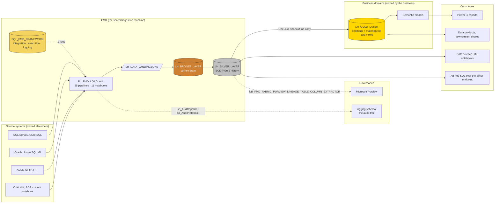
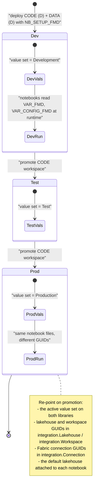
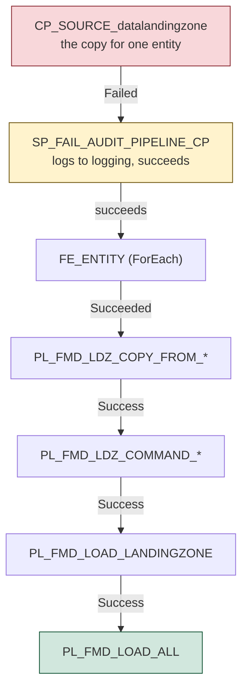

# FMD in an enterprise data landscape

FMD is one component in a platform, not a platform. This page places it: what feeds it, what consumes it, what it costs to run, what a governance review will ask of it, how it is secured, how it is promoted from development to production, and who has to get out of bed when it fails.

If you are still deciding whether to adopt it at all, read [why FMD, and when not to use it](./01-why-fmd.md) first.

## Where it sits

FMD owns exactly one span of the landscape: from the source system to Silver. Everything to the left of that is somebody else's system. Everything to the right of Silver is your business model, and FMD deliberately has no opinion about it.



Two boundaries in that picture are worth stating out loud, because teams get them wrong.

**Silver is a platform asset, Gold is a domain asset.** Silver is shaped by the source systems and owned by the central data team. Gold is shaped by how a business wants to answer questions, and two domains may model the same Silver table differently without either being wrong. That is why Gold lives in separate workspaces, reached through OneLake shortcuts rather than copies. See [business domains](./05-business-domains.md).

**Consumers should not read Silver directly at scale.** They can (the SQL endpoint is there, and data science legitimately wants raw history), but Silver carries the SCD-2 machinery: `IsCurrent`, `IsDeleted`, `RecordStartDate`, `RecordEndDate`, `HashedPKColumn`, `HashedNonKeyColumns`. Every consumer reading Silver directly is a consumer who must remember to filter `IsCurrent = true AND IsDeleted = false`. One of them will forget, and the report will double-count. Gold's materialized lake views exist to make that filtering somebody's job once.

## Capacity and cost

FMD runs on Fabric capacity units. There is no licence fee, and that is genuinely the cheapest thing about it. The compute is not free, and it lands in three places.

| What consumes capacity | Driven by | What you can tune |
|---|---|---|
| **Spark notebook sessions** | Every Bronze and Silver load. This is the dominant cost by a wide margin. | The `ENV_FMD` Spark environment, and the batch size in `NB_FMD_PROCESSING_PARALLEL_MAIN`. |
| **Data pipeline runs and copy activities** | One copy activity per active landing-zone entity per run, plus lookups against `execution.vw_LoadSourceToLandingzone` and the source watermark query. | `IsActive` on the entity, the schedule on `PL_FMD_LOAD_ALL`, and `IsIncremental` (a delta moves less data than a full reload). |
| **The Fabric SQL Database** | Every pipeline lookup, every `sp_Audit*` call, every `sp_Upsert*` call. Small rows, high frequency. | Little. It is a fixed background cost, but it grows with entity count and run frequency because the audit writes are per-activity. |

### The Spark environment is where the money is

`ENV_FMD` ships with this profile:

```yaml
enable_native_execution_engine: true
driver_cores: 8
driver_memory: 56g
executor_cores: 8
executor_memory: 56g
dynamic_executor_allocation:
  enabled: true
  min_executors: 1
  max_executors: 2
runtime_version: 2.0
```

> Up to and including `2026.07`, `ENV_FMD` shipped `runtime_version: 1.3`. On `main` it is `2.0` (Fabric Runtime 2.0, Spark 4.1), bumped by [#275](https://github.com/edkreuk/FMD_FRAMEWORK/pull/275). One thing to know if you use the Gold layer: [materialized lake views](../02-how-to/07-create-materialized-lake-views.md) require Fabric Runtime `1.3` on the Gold lakehouse ([Microsoft Learn](https://learn.microsoft.com/fabric/data-engineering/materialized-lake-views/get-started-with-materialized-lake-views)). That is a separate runtime on a separate lakehouse from `ENV_FMD`, which serves the Bronze and Silver loaders, so the two do not clash, but they are two different runtime versions to keep straight.

Read it as arithmetic, not as an extravagance. `8 cores / 56g` is Fabric's **Medium** node size, the second-smallest of five (Small 4/32, Medium 8/64, Large 16/128, X-Large 32/256, XX-Large 64/512), it is the size every Fabric starter pool uses on every SKU from F2 to F8192, and it is the size Microsoft's own capacity-planning guidance tells you to start with. `ENV_FMD` is the platform's standard starting configuration, not a large one.

What it costs you is computable. One capacity unit is two Spark vCores, so a driver plus the two executors that `max_executors: 2` allows is 24 Spark vCores, or **12 CU while the session is live**. That is the ceiling, and dynamic allocation means you do not always pay it.

The real cost point is not the size of the node, it is that **the profile is fixed for every entity**. One `ENV_FMD` serves every load in its workspace, so a 200-row reference table gets the same Medium driver as your largest fact table. If your entity list is dominated by small dimension tables, the levers are `Small` (4 vCore / 32 GB, the only size below it) or `max_executors: 1`. Either is a change to one Fabric item that affects every load at once, which is exactly the sort of change a metadata-driven framework is meant to make cheap.

`enable_native_execution_engine: true` is a real saving and Microsoft is willing to put a number on it: up to six times faster than open-source Spark on the TPC-DS benchmark, which it translates into roughly **83% lower compute cost** on a fixed-size cluster, at no extra compute charge. It accelerates Parquet, Delta and CSV. It does not accelerate JSON or XML, and it does not support ANSI SQL mode; in both cases execution silently falls back to the JVM engine rather than failing.

**A floor worth knowing before you start.** Node size and count are capped by capacity: an F2's starter pool gets a single Medium node. A reader who tries to run FMD's parallel orchestrator on a small SKU will meet `HTTP 430 Too many requests for capacity` rather than a helpful message. Size the capacity against the batch you intend to run, not against the entity count.

### Parallelism is a throughput lever, not a cost lever

`NB_FMD_PROCESSING_PARALLEL_MAIN` executes the per-entity notebooks with `notebookutils.mssparkutils.notebook.runMultiple`, batched at **up to 50 notebooks per batch (the `runMultiple` API ceiling)**, with `"concurrency": len(activities)`, a `timeoutInSeconds` of 7200 per batch and a `timeoutPerCellInSeconds` of 600. It groups work by `(DataSourceNamespace, TargetSchema, TargetName)` and orders within a group by the file's timestamp suffix, because two files for the same table must merge in arrival order. The source comment promises that a group is never split across a batch, and the code does not deliver that; what makes it safe is that batches run **sequentially**. See [notebooks](../03-reference/04-notebooks.md).

**The 50 is an API ceiling, not the concurrency you will get.** `NB_FMD_PROCESSING_PARALLEL_MAIN` requests `"concurrency": len(activities)`, so it asks for up to 50-way parallelism. What it gets is another matter: every notebook in a `runMultiple` DAG runs on its own REPL instance, and each REPL consumes CPU and memory on the **driver**, so realised parallelism is bounded by the compute available to the Spark session rather than by the number requested. Microsoft is explicit that raising concurrency "can lead to reduced efficiency due to driver and executor resource contention" and can risk driver out-of-memory.

**Microsoft publishes no formula for what you actually get**, and we have not measured it, so this page will not invent a number. The lever is the driver size in `ENV_FMD`, not the batch size. Measure your own fan-out before you plan a load window around it. Source: [NotebookUtils notebook run and orchestration](https://learn.microsoft.com/fabric/data-engineering/notebookutils/notebookutils-notebook-run).

Understand what parallelism buys and does not buy. Running notebooks concurrently instead of sequentially makes the *load window* shorter. It does not make the total compute smaller: the same work runs, in parallel, on the same session. Parallelism is how you fit an overnight load into a window. It is not how you cut the bill. What cuts the bill is loading less: `IsIncremental` where the source supports it, `IsActive = 0` on entities nobody reads, and a schedule that matches how often the source actually changes.

Note the session model: `runMultiple` runs the child notebooks inside the orchestrator's Spark session, on isolated REPL instances that share the session's compute, so you are paying for one session rather than N session start-ups. Cold-start cost is amortised across the whole batch. That is a real efficiency, and it is why the framework batches rather than invoking notebooks one by one from the pipeline.

### The levers that actually move the number

Three are inside the framework:

1. **`IsIncremental = 1` on your relational sources.** A delta is smaller than a reload, in copy volume, in file size, and in Bronze merge work. This is the largest single saving available inside FMD, and it works for both SQL Server and Oracle, each of which reads a real `MAX(IsIncrementalColumn)` from the source. For file sources the watermark is `@utcNow()` rather than a value from the data, so an incremental file load saves copy volume but silently skips late-arriving rows. See [why FMD](./01-why-fmd.md) for the mechanism per connection type, including the SQL MI case, which you should verify before relying on it.
2. **`IsActive = 0`.** An entity nobody queries is an entity you should stop loading. The three views filter on it, so flipping the flag on the entity stops the copy, the Bronze merge and the Silver merge in one statement. Note that `IsActive` on `Connection`, `DataSource` and `Lakehouse` is *not* read by anything: deactivating a connection does not stop its entities loading. See [the data model](../03-reference/01-data-model.md).
3. **The `ENV_FMD` node profile.** See above.

**And the two largest are outside it, which is itself the point.** The cheapest lever is not in the framework, and no amount of metadata tuning substitutes for these:

4. **Autoscale Billing for Spark.** With it enabled, Spark jobs stop consuming capacity units from your Fabric capacity altogether and run on serverless pay-as-you-go resources, billed only for active job runtime with no idle compute cost. For a batch framework whose Spark load is bursty and overnight, this is arguably the biggest single saving available anywhere on this page, and it is a capacity-admin toggle rather than a code change. It also removes the throttling risk that makes a large batch fail on a small SKU.
5. **High concurrency mode.** When notebooks share a Spark session, **only the notebook or pipeline activity that starts the session is billed**; the ones that join it are not billed separately. FMD is already built for this: the notebook activities in `PL_FMD_LOAD_BRONZE` and `PL_FMD_LOAD_SILVER` carry `"sessionTag": "fmd_framework"`, and a session tag only takes effect once "High concurrency mode for pipelines running multiple notebooks" is turned on in workspace settings. The framework has done its half; if you have not turned the setting on, you are leaving that saving on the table.

## Governance and lineage

### The `logging` schema is your audit trail

Three tables, all written by stored procedures the framework calls itself. `CopyActivityExecution` joins to the pipeline that ran it on `PipelineRunGuid`. `PipelineParentRunGuid` is **`NULL` on every pipeline row**, so a pipeline does not join to the pipeline that invoked it, and a run is reconstructed by time rather than by key. A `NotebookExecution` row joins its layer pipeline on `PipelineRunGuid` since [#251](https://github.com/edkreuk/FMD_FRAMEWORK/pull/251), when both layer pipelines began passing `@pipeline().RunId` to the notebook; `TriggerGuid` correlates it as well. Up to and including `2026.07` that `PipelineRunGuid` was a synthetic `uuid4()`, so `TriggerGuid` was then the only usable notebook join. Never join a notebook on `PipelineParentRunGuid`: since [#270](https://github.com/edkreuk/FMD_FRAMEWORK/pull/270) it just repeats the row's own `PipelineRunGuid` on both layers and adds nothing (it was all-zeros for Silver up to `2026.07`). See [logging and auditing](../03-reference/02-logging-and-auditing.md):

- `logging.PipelineExecution` via `sp_AuditPipeline`
- `logging.CopyActivityExecution` via `sp_AuditCopyActivity`
- `logging.NotebookExecution` via `sp_AuditNotebook`

One failed Silver merge is traceable back through the notebook that raised it, the Bronze table it read, the file that produced it and the source query that fetched it. **Not by a GUID chain**, which does not exist: correlate the notebook to its layer pipeline on `TriggerGuid`, the copy activity to its pipeline on `PipelineRunGuid`, and the pipelines to each other by **time**. The loader notebooks wrap their merge in `try / except` and write an `EndNotebookActivity` record with `{"Action": "Error", "ErrorMessage": ...}` before re-raising. On `main` that error write works again ([#277](https://github.com/edkreuk/FMD_FRAMEWORK/pull/277) restored it after [#191](https://github.com/edkreuk/FMD_FRAMEWORK/pull/191) had briefly left it referencing an undefined name), so a crash lands as an `Error` row, and even a failure before the `try` that leaves only an unclosed `Start` row is still in the database, not only in the Fabric monitoring pane, which matters because the monitoring pane is not queryable by your compliance team and the database is. The full query patterns are in [logging and auditing](../03-reference/02-logging-and-auditing.md).

What it is **not**: it is not a data-quality record and it is not a lineage graph. It tells you that a load ran, when, and whether it failed. It does not tell you what the data meant.

And it has no foreign keys. The `logging` schema declares none, and neither does `execution`. Every foreign key in the database (all three of them) lives in `integration`. If your governance policy requires a tamper-evident, referentially-guaranteed audit store, this is not one: it is an append-only set of tables that the framework is trusted to write correctly. That is a fair design for a run log. It is worth knowing before you present it as a control.

### Purview lineage: what it gives you and what it does not

`NB_FMD_FABRIC_PURVIEW_LINEAGE_TABLE_COLUMN_EXTRACTOR`, scheduled by `PL_FMD_TOOLING_LOAD_TO_PURVIEW`, extracts table and column-level lineage from the Fabric lakehouses and registers it in Microsoft Purview as lineage processes with column mapping.

**Understand why this notebook exists at all, because it is the most valuable thing in FMD's governance story and it is easy to mistake for a chore.** Purview's own Fabric scan cannot do this. Microsoft is explicit: for every Fabric item other than Power BI, only *item-level* metadata and lineage can be scanned, and for lakehouse tables and files, sub-item metadata scanning is in preview while **sub-item lineage is still not supported**. In other words, a native Purview scan of your lakehouses will show you that `LH_SILVER_LAYER` exists. It will not show you that `Silver.Orders.CustomerId` came from `Bronze.Orders.CustomerId` came from the source.

So the extractor does not scan. It **pushes**: it builds custom lineage through the Atlas API (`pyapacheatlas`, `AtlasProcess`, and a custom `EntityTypeDef` it registers itself), filling a gap the platform documents and does not fill. That is a deliberate engineering answer to a real platform limitation, and it is the reason a column-level lineage graph is available to you here and not from a stock Purview scan.

It gives you: a Purview asset graph showing which Silver column came from which Bronze column came from which source, which is exactly the artefact a data-governance review asks for, exactly the artefact nobody wants to draw by hand, and exactly the artefact the platform will not generate for you.

It does not give you: automatic operation. It is **tooling, not part of the load**. `PL_FMD_TOOLING_LOAD_TO_PURVIEW` is a separate pipeline. `PL_FMD_LOAD_ALL` does not call it. If you do not schedule it, your lineage silently goes stale, and stale lineage is worse than none, because it is believed.

It also carries its own prerequisites, and they are not small:

- a dedicated **service principal** (App Registration), with `tenant_id`, `client_id` and `client_secret` stored in **Azure Key Vault**, the vault named by `key_vault_uri_name` in `VAR_FMD`;
- that service principal added as **Viewer** to every data workspace holding a source or target lakehouse, and to the configuration workspace;
- that service principal assigned **Data Curator** or **Data Source Admin** in the Purview collection;
- `purview_account_name` set in `VAR_FMD`.

So the Purview extractor is the one part of FMD that does use a stored secret. The rest does not, which is the next section.

## Security and identity

### How the notebooks authenticate

There are no passwords anywhere in the load path. `NB_FMD_UTILITY_FUNCTIONS` acquires an Entra ID (AAD) access token at runtime and hands it to the ODBC driver directly:

```python
token = notebookutils.credentials.getToken('https://analysis.windows.net/powerbi/api').encode("UTF-16-LE")
# ... packed into a token struct ...
conn = pyodbc.connect(connection_string, attrs_before={1256: token_struct})
```

`1256` is `SQL_COPT_SS_ACCESS_TOKEN`. The token is passed to the driver *before* the connection is opened, so it never appears in a connection string, never appears in a log, and expires on its own.

**But whose token is it?** This is the question to get right before you go to production, because the answer is not "the framework's", and the default will surprise you. `getToken` returns a token for whatever identity the notebook is running as, and in Fabric that depends entirely on how the notebook was triggered:

| Triggered by | Runs as |
|---|---|
| An interactive run | the user who pressed run |
| A **pipeline notebook activity** | **the pipeline's last modified user**, not the pipeline's owner and not the notebook's owner |
| A schedule | the user who created or last updated the schedule |

That second row is the one that runs FMD in production, and it means the load path authenticates as **whoever last edited the pipeline**. If a data engineer touches `PL_FMD_LOAD_ALL` and leaves the team, the nightly load is still running as them until someone else edits it. That is a genuine operational risk and it is invisible until it breaks.

There are two supported ways to fix it, and FMD's pipelines are already set up for the second:

- **Make a service principal the pipeline's last-modified user**, via the Fabric REST API, so the run authenticates as the SPN rather than as a departed employee. One caveat: under a service principal, `getToken` returns a restricted scope, so verify the token still reaches the configuration database in your tenant before you rely on it.
- **Set the Notebook activity's connection.** The Notebook activity carries an authentication method under **Connection**, and Fabric supports a **Workspace Identity** there (it requires the tenant setting "Service principals can call Fabric public APIs" and the workspace identity granted at least Contributor). FMD's notebook activities in `PL_FMD_LOAD_BRONZE` and `PL_FMD_LOAD_SILVER` do carry an `externalReferences.connection` GUID, which is where that choice is recorded, so this is a configuration decision you make in your own tenant rather than something the repository can settle for you.

The pattern itself is the right one, and it is worth defending in a review: there is no credential in `SQL_FMD_FRAMEWORK`, none in the notebooks, none in the variable libraries. What the framework cannot do for you is decide which identity runs it. Decide that deliberately.

The variable libraries hold GUIDs and names, not secrets.

The source connections themselves are Fabric **connection objects**, referenced by GUID from `integration.Connection`. Their credentials live in Fabric's connection store, managed by Fabric, and the framework only ever holds the GUID. That means a connection's secret rotation is a Fabric operation, invisible to FMD, and nothing in `docs/` or in the configuration database needs to change when it happens.

### Workspace Identity versus Service Principal

Both have a place, and they are not interchangeable. The distinction a security review will care about:

| | Workspace Identity | Service Principal |
|---|---|---|
| Where it lives | Created and owned by the Fabric workspace | An App Registration in Entra ID, owned by whoever created it |
| Secret | None to manage | A client secret or certificate, which must be stored (Key Vault) and rotated |
| Blast radius | Scoped to the workspace | Whatever you granted it, anywhere in the tenant |
| Use it for | **Connections**: OneLake shortcuts, pipelines, semantic models and Dataflows Gen2, including the Notebook activity's connection | **Execution identity**, where you want the run itself to be an SPN, and the **Purview extractor**, which explicitly requires an App Registration and a stored secret |

The trap to avoid: a workspace identity is an authentication method **for connections**. Creating one does not by itself make the load path run as it. The execution identity of a pipeline-triggered notebook is the pipeline's last-modified user unless you configure the activity's connection to say otherwise, as described above. The one place a service principal with a stored secret is unavoidable is the Purview tooling.

### What a security review will ask

Prepare for these five, because they are the ones the code invites.

1. **"Who can write to `integration.LandingzoneEntity`?"** This is the question that matters most, and it is not obvious. `execution.vw_LoadSourceToLandingzone` builds the source query by **string concatenation**. `SourceSchema` and `SourceName` pass through `QUOTENAME`; `IsIncrementalColumn` does not, and the watermark value is pasted in as a quoted literal. Anyone who can insert a configuration row can therefore shape SQL that runs against a source system under the framework's connection identity. **Write access to the configuration database is equivalent to query access on every registered source.** Grant it like it is. Never expose entity registration to an untrusted caller, never drive it from user input, and never let a self-service catalogue write into it directly.
2. **"What identity reads the source systems?"** The Fabric connection object's, not the framework's. Each connection is granted separately, so least privilege is achievable: give each source connection a read-only account scoped to the schemas you register.
3. **"Where are the secrets?"** In Fabric's connection store and, for Purview only, in Azure Key Vault. Nowhere in the repository, nowhere in the database, nowhere in a variable library.
4. **"Who can read Silver?"** Everyone with access to the Data workspace, and Silver holds *everything ingested from every source*. Silver access is not a boundary you can hand to a report author. Be precise about what the per-domain Gold layer does and does not fix: a Gold lakehouse bounds **what a domain can see**, because it contains only the tables that domain shortcuts in. It does not by itself **grant** access to them. An internal OneLake shortcut resolves under the **calling user's** identity by default, so a Sales analyst with read on Gold and nothing on Silver gets an authorization error, not Sales data. The boundary becomes real for **report consumers**, who reach Gold through a semantic model: Direct Lake over SQL passes the item owner's identity to the shortcut target, which delegates access on the caller's behalf, and that is precisely what the separate Semantic and Reporting workspaces are for. A data engineer querying Gold directly in Spark still needs Silver. (A shortcut can also be created with a fixed **delegated identity** instead of passthrough, which is the other way to make Gold self-sufficient.) See [business domains](./05-business-domains.md).
5. **"Is the audit trail tamper-evident?"** No. It is a set of tables written by stored procedures, with no foreign keys and no immutability guarantee. Anyone with write access to the configuration database can rewrite the run history. If you need more, put the control outside FMD.

## Environments and promotion

The same notebook file, unchanged, must run in development and in production. What makes that possible is that no GUID is in the code. Every environment-specific value is in one of two variable libraries, read at runtime with `notebookutils.variableLibrary.getLibrary(...)`.

| Library | Holds | Why it is separate |
|---|---|---|
| `VAR_CONFIG_FMD` | `fmd_fabric_db_connection`, `fmd_fabric_db_name`, `fmd_config_workspace_guid`, `fmd_config_database_guid` | Points at the configuration database. Changes only when the configuration workspace changes. |
| `VAR_FMD` | `key_vault_uri_name`, `lakehouse_schema_enabled`, `purview_account_name` | Environment behaviour and tooling. |

Both ship with **value sets**, including a `Test.json`, which is Fabric's mechanism for holding one set of values per environment inside a single library item. Promotion swaps the active value set; it does not edit the library.

**On `main`, `ENV_FMD` is per environment.** `NB_SETUP_FMD.ipynb` deploys every `Environment` item into the shared **CONFIG** workspace (cell 48) and **also** into each environment's own CODE workspace (cell 50), then sets that copy as the workspace's default Spark environment (cell 51). A Fabric item belongs to its workspace, so `CODE (D)` and `CODE (P)` hold separate `ENV_FMD` items that share a display name, and development's node profile can be changed without touching production's ([#278](https://github.com/edkreuk/FMD_FRAMEWORK/pull/278)).

> **Up to and including `2026.07` it was not.** Every `Environment` item went to the single shared CONFIG workspace and the CODE workspaces received none, nor any default-environment assignment, so there was exactly one `ENV_FMD` and the loaders ran on their workspace's own default Spark pool rather than on it. On a deployment pinned to that, treat `ENV_FMD` as one shared item, and note that changing it does not change what your loaders actually run on.



### What must be re-pointed, and what breaks if you forget

- **The active value set on `VAR_FMD` and `VAR_CONFIG_FMD`.** Forget this and production's pipelines write their audit records into development's configuration database, or read development's work queue. The load runs against the wrong metadata and reports success, because from the pipeline's point of view nothing went wrong. Make the active value set part of the promotion checklist, and verify it after every deployment by confirming that a production run wrote a row into the production configuration database.
- **The lakehouse and workspace GUIDs in `integration.Lakehouse` and `integration.Workspace`.** These are *rows in the configuration database*, not variable-library values. If the configuration database is shared between environments, as the deployment guide has it, then an entity's target lakehouse is a property of the entity, not of the environment, and you must register the production lakehouses as separate rows and point the production entities at them. This is the part of promotion that is not automatic and not covered by the variable libraries. Get it wrong and a production load writes into a development lakehouse.
- **The Fabric connection GUIDs in `integration.Connection`.** A development connection usually points at a development source. Production needs its own connection object and its own row.
- **The default lakehouse attached to each notebook.** A Fabric notebook has a default lakehouse binding. Unqualified table names resolve against it.

The rule of thumb: **the variable libraries carry what the code needs. The configuration database carries what the data needs.** Promotion touches both, and only the first of them is automatic.

## Who operates it

FMD is not a service. Somebody runs it. Being honest about the roles is what makes the operational cost visible before you sign up for it.

| Role | Does what | How often |
|---|---|---|
| **Data engineer, onboarding** | Registers entities: three `INSERT`s into `integration.LandingzoneEntity`, `BronzeLayerEntity`, `SilverLayerEntity`, plus a `DataSource` and `Connection` row for a new source system. Verifies the first load. | Per new table. See [add an entity](../02-how-to/02-add-an-entity.md). |
| **Data engineer, on call** | Watches the run. Queries `logging.PipelineExecution` for failures, traces down through `logging.NotebookExecution` to the entity, decides whether to re-run or fix the source. | Per failed run. The queue makes re-running safe: `IsProcessed` means completed work does not come back. |
| **Platform engineer** | Owns `ENV_FMD`, the variable libraries, the capacity, promotion between workspaces, and the framework version. | Per release. |
| **Governance** | Schedules `PL_FMD_TOOLING_LOAD_TO_PURVIEW`, owns the Purview service principal and its Key Vault secret, answers for the audit trail. | Continuous, but low touch, once scheduled. |
| **Domain team** | Owns Gold: the shortcuts, the materialized lake views, the semantic model, the reports. Never touches the core. | Per business change. See [business domains](./05-business-domains.md). |

### A realistic runbook

The morning after a failed run, in order:

1. `SELECT` failures from `logging.PipelineExecution` where `LogType LIKE 'Fail%'`, over the last day. **Keep the `TriggerGuid` from that row, not the `PipelineRunGuid`.**
2. Find the failing notebook: `SELECT ... FROM logging.NotebookExecution WHERE TriggerGuid = @TriggerGuid AND EntityLayer = 'Silver' AND LogData LIKE '%"Action": "Error"%'`. **Join on `PipelineRunGuid` or `TriggerGuid`** (both correlate a notebook to its layer pipeline since [#251](https://github.com/edkreuk/FMD_FRAMEWORK/pull/251)). Never join on `PipelineParentRunGuid`: since [#270](https://github.com/edkreuk/FMD_FRAMEWORK/pull/270) it only repeats the row's own `RunId` on both layers and adds nothing over `PipelineRunGuid` (up to and including `2026.07` it was all-zeros for Silver, so the join dropped every Silver row, an empty result that reads exactly like "the load did no work"). The [logging reference](../03-reference/02-logging-and-auditing.md) has the full queries, including the case where there is no error row at all.
3. Identify the entity. The most common causes are a declared primary key that is absent from the landed file, or a duplicate `HashedPKColumn`, both of which the Bronze notebook fails on deliberately rather than loading bad data.
4. Fix the source or the configuration row.
5. Re-run **the layer pipeline**, not `PL_FMD_LOAD_ALL`. For Bronze and Silver the work queue means only the unprocessed entity is retried. **The landing zone has no such queue**: `vw_LoadSourceToLandingzone` filters on `IsActive = 1` and nothing else, so re-running it re-extracts every active entity from every source, at full volume. The [runbook](../02-how-to/05-diagnose-a-failed-load.md#do-not-re-run-pl_fmd_load_all) is the procedure; this is the shape of it.

Two things make this bearable, and they are worth naming as strengths: the failure is **in a queryable database**, not just in a monitoring pane, and the re-run is **idempotent by construction**, because `IsProcessed` gates the views.

One thing makes it harder, and it is worth naming as a cost: the failure is **one row among many in a shared run**. A single bad entity does not stop the others. The orchestrator catches `RunMultipleFailedException`, keeps the partial results, and lets the rest of the batch finish, which is the right behaviour for throughput.

But it then **re-raises**. `NB_FMD_PROCESSING_PARALLEL_MAIN` collects the failures and ends with `raise ValueError(f"Failed notebooks: {failed_names}")`, which fails the notebook activity. In `PL_FMD_LOAD_BRONZE` that reaches a `Fail` activity, so **that** pipeline does go red.

### A failed layer now goes red. A failed entity still does not.

**`PL_FMD_LOAD_ALL` fails the run when a layer fails**, since 2026-07-14. Each layer's failure branch now ends in a `Fail` activity, so a broken landing zone, Bronze or Silver takes the run down with it:

| Activity | dependsOn |
|---|---|
| `PL_FMD_LOAD_LANDINGZONE` | `SP_START_AUDIT_PIPELINE: Succeeded` |
| `SP_FAIL_LDZ_AUDIT_PIPELINE` | `PL_FMD_LOAD_LANDINGZONE: Failed` |
| `FA_THROW_ERROR_LDZ` (`Fail`) | `SP_FAIL_LDZ_AUDIT_PIPELINE: Completed`, `PL_FMD_LOAD_SILVER: Completed` |
| `PL_FMD_LOAD_BRONZE` | `PL_FMD_LOAD_LANDINGZONE: Completed` |
| `SP_FAIL_BRZ_AUDIT_PIPELINE` | `PL_FMD_LOAD_BRONZE: Failed` |
| `FA_THROW_ERROR_BRZ` (`Fail`) | `SP_FAIL_BRZ_AUDIT_PIPELINE: Completed` |
| `PL_FMD_LOAD_SILVER` | `PL_FMD_LOAD_BRONZE: Completed` |
| `SP_FAIL_SLV_AUDIT_PIPELINE` | `PL_FMD_LOAD_SILVER: Failed` |
| `FA_THROW_ERROR_SLV` (`Fail`) | `SP_FAIL_SLV_AUDIT_PIPELINE: Completed` |
| `SP_END_AUDIT_PIPELINE` | `PL_FMD_LOAD_SILVER: Succeeded` |

The catch branch still runs its audit procedure first, so `logging` gets the failure row, and then the `Fail` activity makes the run red. So the run status is finally an instrument for a layer failure.

> **In every release up to and including `2026.07`, it was not.** `PL_FMD_LOAD_ALL` had no `Fail` activity: every failure path was an *Upon Failure* branch to a procedure that logged and then succeeded. Microsoft documents the consequence with no ambiguity: a pipeline whose failure paths are *only* *Upon Failure* branches renders **Success**, because the result is success when all evaluated leaf nodes succeed ([Errors and conditional execution](https://learn.microsoft.com/azure/data-factory/tutorial-pipeline-failure-error-handling#error-handling)). So Bronze could fail, `SP_FAIL_BRZ_AUDIT_PIPELINE` would succeed, Silver would run on an empty queue and succeed, and the run went green with an empty Bronze layer. On a pinned `2026.07`, that is still true, and you must not alert on the run status. Fixed by [#250](https://github.com/edkreuk/FMD_FRAMEWORK/pull/250) (the orchestrator) and [#253](https://github.com/edkreuk/FMD_FRAMEWORK/pull/253) (the nineteen landing-zone pipelines), merged 2026-07-14.

**But the run going green still does not mean every entity loaded**, and that has not changed.

### And the landing zone usually does not fail in the first place

The paragraph above assumes a layer goes red and `PL_FMD_LOAD_ALL` swallows it. For the landing zone, even that is optimistic: **the failure never reaches `PL_FMD_LOAD_ALL` at all.**

A copy runs inside a `ForEach` over entities, and its failure is caught **inside the loop**, by `SP_FAIL_AUDIT_PIPELINE_CP`, which writes the failure to `logging` and succeeds. The iteration therefore succeeds, so the `ForEach` succeeds, so the copy pipeline succeeds. Nothing above it is ever told.



The swallow is deliberate, and it is defensible: one unreachable source must not stop the landing zone for two hundred other entities. What is missing is the report at the end of the loop. So a source can fail on every run, for weeks, and the only place that knows is `logging`.

That is the difference between "the orchestrator hides a failed layer" and "**a failed source is invisible from the run status altogether**". The second is the one that matters, and it is why the next section is not a nicety.

### So alert on the database, not on the run

**Do not build your alerting on the status of `PL_FMD_LOAD_ALL`.** It will be green while your data is stale. Alert on `logging` instead, which is the signal that actually reflects reality:

```sql
-- anything that failed in the last 24 hours, in any layer.
-- Three tables, because a failure lands in a different one depending on what failed.
SELECT 'pipeline' AS src, PipelineName AS name, EntityLayer, LogDateTime, LogData
FROM   logging.PipelineExecution
WHERE  LogDateTime >= DATEADD(day, -1, GETDATE()) AND LogType LIKE 'Fail%'
UNION ALL
SELECT 'copy', CopyActivityName, EntityLayer, LogDateTime, LogData
FROM   logging.CopyActivityExecution
WHERE  LogDateTime >= DATEADD(day, -1, GETDATE()) AND LogType LIKE 'Fail%'
UNION ALL
SELECT 'notebook', NotebookName, EntityLayer, LogDateTime, LogData
FROM   logging.NotebookExecution
WHERE  LogDateTime >= DATEADD(day, -1, GETDATE()) AND LogData LIKE '%"Action":%"Error"%';
```

**`logging.PipelineExecution` alone is not enough.** A source copy that fails for one entity is caught inside the `ForEach` and lands in `CopyActivityExecution`; it never reaches the pipeline log. And a failed notebook writes `EndNotebookActivity` like a successful one, with the failure inside `LogData`, so `LIKE 'Fail%'` never matches it. The [production checklist](../02-how-to/04-run-fmd-in-production.md#the-alert-has-to-read-all-three-tables) has the full alerting setup.

The `logging` tables are already mirrored into OneLake, so a Data Activator alert or a scheduled query on top of them is most of the way built. See [logging and auditing](../03-reference/02-logging-and-auditing.md) for the full diagnosis path.

## What to take away

- FMD spans **source to Silver**. Gold, semantic models and reports are the domain's, and they read Silver through copy-free shortcuts.
- **Spark is the bill.** `ENV_FMD` is Fabric's **Medium** default, not an extravagance, but it is fixed for every entity, so small tables pay Medium too. Parallelism shortens the window; only loading less shortens the bill. Inside FMD the biggest lever is `IsIncremental` on your relational sources, which works for SQL Server and for Oracle. Outside it, **Autoscale Billing** and **high concurrency mode** are bigger than anything the framework can offer you.
- **The 50 is an API ceiling, not the parallelism you get.** The framework asks for 50; realised parallelism is bounded by the driver's compute, and Microsoft publishes no formula for it. Size the driver, not the batch, and measure.
- **The `logging` schema is a run log, not a control.** It is queryable and genuinely useful, but **no column ties a whole run together**: `PipelineParentRunGuid` is `NULL` on every pipeline row and each pipeline has its own `TriggerGuid`, so a run is reconstructed from timestamps. It has no foreign keys and no tamper-evidence. It is also **already mirrored into OneLake**, which is most of the work of building monitoring on it.
- **`PL_FMD_LOAD_ALL` goes green when the landing zone or Bronze fails, and a failed source never even reaches it.** (A *Silver* failure does surface: `SP_END_AUDIT_PIPELINE` hangs off `PL_FMD_LOAD_SILVER: Succeeded`, which makes that one branch a Do-If-Else rather than a Try-Catch.) The orchestrator is a Try-Catch graph with no `Fail` activity, which Microsoft documents as reporting Success. Below it, a copy that fails for one entity is caught inside the `ForEach` by `SP_FAIL_AUDIT_PIPELINE_CP` and never propagates at all. **Never alert on its run status.** Alert on `logging.PipelineExecution` where `LogType LIKE 'Fail%'`, and diagnose from there.
- **Purview lineage is tooling you must schedule**, and it exists because Purview's own Fabric scan cannot produce sub-item lineage. `PL_FMD_LOAD_ALL` will not run it for you, and unscheduled lineage goes stale while remaining believed.
- **No stored passwords in the load path**, but decide **which identity runs it**. A pipeline-triggered notebook runs as the pipeline's last-modified user unless you configure it otherwise. The one stored secret is the Purview service principal's, in Key Vault.
- **Write access to `integration` is query access to every source.** The source query is concatenated, not parameterised. Treat entity registration as a privileged operation.
- **Promotion has an automatic half and a manual half.** The variable libraries carry the code's environment values. The configuration database carries the data's, and nothing swaps those for you.

---

Source: `src/ENV_FMD.Environment/Setting/Sparkcompute.yml` @ b5fb08e (node sizes, dynamic executor allocation, native execution engine, `runtime_version: 2.0`)
Source: `src/NB_FMD_PROCESSING_PARALLEL_MAIN.Notebook/notebook-content.py` @ b5fb08e (`runMultiple`, 50 per batch, `timeoutInSeconds` 7200, `timeoutPerCellInSeconds` 600, grouping and ordering, partial results on batch error)
Source: `src/NB_FMD_UTILITY_FUNCTIONS.Notebook/notebook-content.py` @ b5fb08e (`notebookutils.credentials.getToken`, `attrs_before={1256: token_struct}`)
Source: `src/NB_FMD_FABRIC_PURVIEW_LINEAGE_TABLE_COLUMN_EXTRACTOR.Notebook/notebook-content.py` @ b5fb08e (service principal, Key Vault, Viewer role, Data Curator role)
Source: `src/PL_FMD_TOOLING_LOAD_TO_PURVIEW.DataPipeline/pipeline-content.json` @ b5fb08e
Source: `src/VAR_FMD.VariableLibrary/variables.json`, `src/VAR_CONFIG_FMD.VariableLibrary/variables.json`, and their `valueSets/` @ b5fb08e
Source: `src/Config_Database/execution/Views/vw_LoadSourceToLandingzone.sql` @ b5fb08e (string-concatenated source query; the `LastLoadValue` `CASE` branch `WHEN C.[Type] IN ('SQL')`)
Source: `src/PL_FMD_LDZ_COPY_FROM_ORACLE_01.DataPipeline` and `src/PL_FMD_LDZ_COPY_FROM_ADLS_01.DataPipeline` @ b5fb08e (the per-type watermark lookups)
Source: `src/Config_Database/logging/`, `src/Config_Database/execution/` @ b5fb08e (no `FOREIGN KEY` constraints in either schema)
Source: `src/PL_FMD_LOAD_BRONZE.DataPipeline/pipeline-content.json`, `src/PL_FMD_LOAD_SILVER.DataPipeline/pipeline-content.json` @ b5fb08e (`sessionTag: fmd_framework`; `externalReferences.connection` on the notebook activity)
Source: `FMD_FRAMEWORK_DEPLOYMENT.md` @ b5fb08e

Platform: [Spark compute node sizes](https://learn.microsoft.com/fabric/data-engineering/spark-compute#node-sizes) and [starter pool settings](https://learn.microsoft.com/fabric/data-engineering/configure-starter-pools#configure-starter-pool-settings) (Medium is 8 vCore / 64 GB and is the starter-pool size on every SKU; 1 CU = 2 Spark vCores)
Platform: [MSSparkUtils notebook utilities](https://learn.microsoft.com/fabric/data-engineering/microsoft-spark-utilities#notebook-utilities) (concurrency is bounded by driver cores: an 8-core Medium driver runs about 8 notebooks) and [notebook limitations](https://learn.microsoft.com/fabric/data-engineering/notebook-limitation#other-specific-limitations) (the `runMultiple` ceiling of 50)
Platform: [Native execution engine](https://learn.microsoft.com/fabric/data-engineering/native-execution-engine-overview) (Parquet, Delta and CSV; not JSON or XML; not ANSI mode) and [Fabric Runtime](https://learn.microsoft.com/fabric/data-engineering/runtime) (up to 6x, roughly 83% compute-cost saving, at no extra compute cost)
Platform: [Autoscale Billing for Spark](https://learn.microsoft.com/fabric/data-engineering/autoscale-billing-for-spark-overview) and [high concurrency billing](https://learn.microsoft.com/fabric/data-engineering/high-concurrency-overview#billing-behavior) (only the initiating notebook is billed); the [Notebook activity](https://learn.microsoft.com/fabric/data-factory/notebook-activity) (session tags require high concurrency mode; the Connection setting and Workspace Identity)
Platform: [Security context of a running notebook](https://learn.microsoft.com/fabric/data-engineering/how-to-use-notebook#security-context-of-running-notebook) (a pipeline-triggered notebook runs as the pipeline's last modified user)
Platform: [OneLake shortcuts](https://learn.microsoft.com/fabric/onelake/onelake-shortcuts#types-of-shortcuts) and [shortcut security](https://learn.microsoft.com/fabric/onelake/onelake-shortcut-security) (passthrough resolves under the calling user's identity; Direct Lake over SQL passes the item owner's)
Platform: [Fabric lineage in Purview](https://learn.microsoft.com/purview/data-map-lineage-fabric) (only item-level lineage is scanned; sub-item lineage is not supported)
