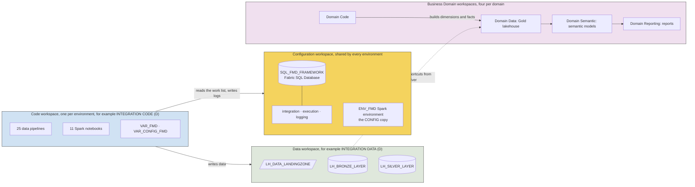
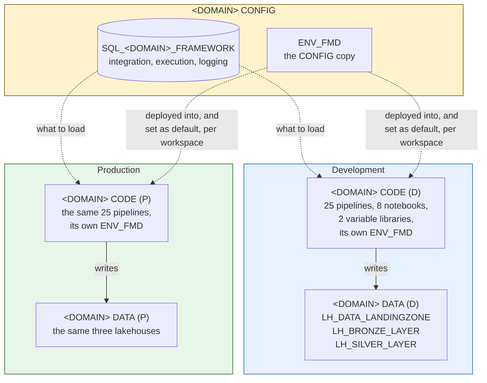
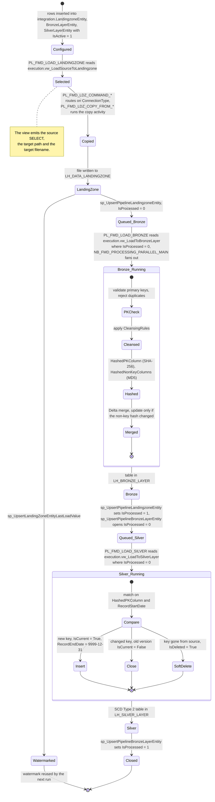

# Architecture

Who can edit a pipeline, who can read a Silver table, and what has to be re-pointed when you promote to production are all decided by one thing in FMD: which workspace an artefact lives in.

So the framework separates three things that most Fabric implementations mix together: the code that moves data, the data itself, and the configuration that decides what gets moved. Each gets its own workspace. That is what lets a report consumer read Silver without being able to touch a notebook, and lets the same notebook file run in development and production unchanged. The configuration is a database rather than a set of pipeline parameters, which is what makes the framework metadata-driven, and it is why onboarding your two-hundredth table costs what your second one did.

Below: the split, the medallion layers it produces, and the mechanism at the centre of the framework, which is how a row in the `integration` schema becomes a running pipeline.

## The workspace split

`NB_SETUP_FMD.ipynb` deploys FMD into a **Code** workspace and a **Data** workspace per environment, and both point at a **Configuration** workspace that you create by hand before running the setup. The deployment guide creates development and production variants of Code and Data (`(D)` and `(P)` suffixes); the Configuration workspace is shared.

**On `main`, each Code workspace gets its own Spark environment.** The setup deploys every `Environment` item into `configuration['workspace']['name']`, which is `domain_name + ' CONFIG'` (cell 48), and **also** into each environment's own Code workspace (cell 50), then sets that copy as the workspace's default Spark environment (cell 51, `assign_workspace_environment`, which runs `fab set {workspace}.workspace -q sparkSettings.environment.name -i ENV_FMD`). A Fabric item is scoped to its workspace, so `CODE (D)` and `CODE (P)` hold **separate** `ENV_FMD` items that share a display name: re-sizing development's does not touch production's ([#278](https://github.com/edkreuk/FMD_FRAMEWORK/pull/278)).

> **Up to and including `2026.07`, there was exactly one `ENV_FMD`, in CONFIG.** The Code workspaces received only notebooks and variable libraries, no Environment and no default-environment assignment, so the loaders ran on their workspace's own default Spark pool rather than on `ENV_FMD`. If you are pinned to that, re-sizing `ENV_FMD` changes the one shared item, and it is not what your loaders run on.

Why the separation is not cosmetic:

- **Code and Data are separated so that permissions can differ.** A data engineer needs Contributor on Code to edit a notebook. A consumer needs read on Data and nothing on Code. If both lived in one workspace, granting access to a Silver table would also grant access to the pipelines. The split lets you give the Data workspace an Admin group and the Code workspace a Member plus service-principal Contributor, which is exactly what the `workspace_roles_data` and `workspace_roles_code` blocks in the setup notebook do.
- **Code is separated per environment so that it can be promoted.** `CODE (D)` and `CODE (P)` hold the same artefacts. The values that differ between them, workspace GUIDs, lakehouse GUIDs, connection GUIDs, are not in the code: they are in the two variable libraries, `VAR_FMD` and `VAR_CONFIG_FMD`. A notebook reads them at runtime with `notebookutils.variableLibrary.getLibrary(...)`, so the same notebook file runs in both environments unchanged. See [variable libraries](../03-reference/06-variable-libraries.md).
- **Configuration is separated because it is state, not code.** The framework's SQL database holds not only what you want loaded (`integration`) but how far each load got (`execution`) and what happened (`logging`). That state must survive a redeployment of the Code workspace, and it must be shared by both environments' pipelines rather than duplicated. Putting it in its own workspace keeps a `git sync` of Code from touching it.

Five workspaces, and the asymmetry is deliberate. Code and Data are separate so
that permissions can differ. Development and Production are separate so that a
change can be tried, and on `main` that separation now extends to Spark: each
Code workspace holds **its own `ENV_FMD`**, set as that workspace's default, so
development's node profile can be changed without touching production's. The
CONFIG copy is still deployed alongside the database.

### What a Business Domain adds

The core framework stops at Silver. A **Business Domain** is a separate set of workspaces, deployed by `NB_SETUP_BUSINESS_DOMAINS.ipynb`, that sits on top of it: one per business area such as Sales, HR, or Finance, each with its own Code, Data, Semantic, and Reporting workspace. The domain's Gold lakehouse does not copy Silver data. `NB_CREATE_SHORTCUTS` creates OneLake shortcuts from the Silver lakehouse into Gold, and the domain builds its dimensions, facts, and Materialized Lake Views on top of those shortcuts.

The reason is ownership. Silver is a platform asset owned by the central data team and shaped by the source systems. Gold is a domain asset owned by the business and shaped by how that business wants to answer questions, so two domains may model the same Silver table differently and neither is wrong. Separating the workspaces makes that difference structural instead of a naming convention. See [business domains](05-business-domains.md).

## The medallion layers

FMD implements the medallion pattern as three lakehouses in the Data workspace, plus Gold in the domain workspaces.

| Layer | Item | Format | What the framework guarantees |
|---|---|---|---|
| Landing Zone | `LH_DATA_LANDINGZONE` | Files (CSV, Parquet) | Raw data exactly as it left the source, written to a date-partitioned path with a timestamped filename. No schema is enforced. Nothing is overwritten, so a load can be replayed from the file. |
| Bronze | `LH_BRONZE_LAYER` | Delta tables | Typed, deduplicated, and cleansed. Primary keys are validated and duplicates rejected. A row is merged on a SHA-256 hash of its key columns, and updated only when an MD5 hash of its non-key columns has actually changed. Bronze holds the current state of the source. |
| Silver | `LH_SILVER_LAYER` | Delta tables | Validated history. The Bronze-to-Silver notebook applies **Slowly Changing Dimension Type 2**: an updated row closes the old version (`IsCurrent = False`) and inserts a new one; a row that disappeared from the source is soft-deleted (`IsDeleted = True`, `IsCurrent = False`) rather than removed. Nothing is ever lost. |
| Gold | Domain lakehouse | Delta tables, Materialized Lake Views | Business-ready dimensions and facts. **Not part of the core framework**: it is produced by the Business Domain notebooks, over shortcuts to Silver. |

The distinction that matters most is Bronze versus Silver. Bronze answers "what does the source say right now". Silver answers "what did the source say on any given date, and what has it stopped saying". That is why Silver carries `RecordStartDate`, `RecordEndDate` (open versions get `9999-12-31`), `RecordModifiedDate`, `IsCurrent`, and `IsDeleted`.

## The metadata-driven principle

This is the heart of the framework, and it is worth being precise about, because "metadata-driven" is often used loosely.

You describe an entity once, as rows in three `integration` tables, one per layer:

- `integration.LandingzoneEntity`: which source schema and table, which file name, type, and path to write, whether the load is incremental and on which column.
- `integration.BronzeLayerEntity`: which target schema and table, the primary keys, and any cleansing rules.
- `integration.SilverLayerEntity`: which target schema and table, and any cleansing rules.

Each links to a `DataSource`, which links to a `Connection`, which carries the Fabric connection GUID. Each also links to a `Lakehouse`, which carries the lakehouse and workspace GUID. So a single entity row transitively knows every GUID a pipeline needs. See the [data model](../03-reference/01-data-model.md).

**The three views in the `execution` schema are the translation layer.** They do not merely select the configuration: they compute the work. `execution.vw_LoadSourceToLandingzone` builds, per active entity, the actual `SELECT * FROM [schema].[table] WHERE watermark_column > 'last value'` statement to run against the source, the target file path with today's date appended, and the timestamped target filename. The pipeline never constructs SQL. It reads a row and executes the string the view produced.

That is the whole trick: **configuration is data, and the view turns data into an instruction.**

The rest of the flow is a queue. When a copy activity finishes, it registers the file it wrote in `execution.PipelineLandingzoneEntity` with `IsProcessed = 0`. `execution.vw_LoadToBronzeLayer` joins exactly that condition, so it returns only the files that have arrived and not yet been processed. The Bronze notebook processes one, calls `sp_UpsertPipelineLandingzoneEntity` with `@IsProcessed = True` to close it, and calls `sp_UpsertPipelineBronzeLayerEntity` with `@IsProcessed = False` to open the next hand-off. `execution.vw_LoadToSilverLayer` joins on that in turn. The layers are coupled only through these queue tables, which is why re-running a layer is safe: work that is already marked processed does not come back.

Incremental loads use one more table. `execution.LandingzoneEntityLastLoadValue` holds one watermark per entity, updated after each successful copy, and read back by `vw_LoadSourceToLandingzone` to build the next `WHERE` clause. See [full load versus incremental](04-load-flow.md).

### One entity's journey

Every transition in that diagram also writes a row to `logging` via `sp_AuditPipeline`, `sp_AuditCopyActivity`, or `sp_AuditNotebook`. Copy-activity rows carry a real `PipelineRunGuid` that joins to their copy pipeline. Since [#251](https://github.com/edkreuk/FMD_FRAMEWORK/pull/251) a **notebook** row also joins its layer pipeline on `PipelineRunGuid`, because both `PL_FMD_LOAD_BRONZE` and `PL_FMD_LOAD_SILVER` now pass `@pipeline().RunId` to the notebook; `TriggerGuid` correlates it as well. Up to and including `2026.07` a notebook's `PipelineRunGuid` was a `uuid4()` the orchestrator invented, so `TriggerGuid` was then the only usable notebook join. Never join a notebook on `PipelineParentRunGuid`: since [#270](https://github.com/edkreuk/FMD_FRAMEWORK/pull/270) it only repeats the row's own `RunId` on both layers and adds nothing over `PipelineRunGuid` (it was all-zeros for Silver up to `2026.07`). Pipeline rows still do not chain to the pipeline that invoked them. See [logging and auditing](../03-reference/02-logging-and-auditing.md), which explains why.

### Parallelism

`PL_FMD_LOAD_BRONZE` and `PL_FMD_LOAD_SILVER` do not loop over entities themselves. Both call `NB_FMD_PROCESSING_PARALLEL_MAIN`, which receives the full work list and executes the per-entity notebooks concurrently with `runMultiple`, up to 50 per batch (the `runMultiple` API ceiling; realised parallelism is bounded by the driver's compute, not by the number requested, and Microsoft publishes no formula for it). It groups files by data source, target schema, and target table, and processes files within a group sequentially in filename-timestamp order, because two files for the same table must be merged in the order they arrived. Files in different groups have no such constraint and run in parallel.

That in-group ordering is expressed as a `dependsOn` chain inside a batch, but **the chain is not what keeps it correct**. The source comment promises that a group is never split across a batch boundary; the code does not implement that promise, and any group can straddle one. What holds is that the batches run **sequentially**, so two writes to the same target table are serialised whether the chain survives or not. A group **larger** than 50 is the visible case: the notebook prints `WARNING: largest group has N items, exceeds runMultiple limit of 50` and proceeds, splitting the group across batches. This is reachable in practice, because it takes one entity with more than 50 unprocessed files, which is what a paused schedule or a backlog produces.

The pipeline's notebook activity has a **3600-second timeout and no retries**; the `Lookup` that precedes it is the activity that retries twice. Inside the notebook, however, the `runMultiple` DAG sets `"retry": 2, "retryIntervalInSeconds": 0` on **every child activity**, so a failing entity notebook is executed three times back to back before the batch reports it. That is three full reads and three failed merges for one entity, and three error rows in `logging.NotebookExecution`. Note that the `runMultiple` DAG *inside* the notebook sets `timeoutInSeconds: 7200`, so the pipeline's own one-hour ceiling binds first: a batch that runs longer than an hour is killed by the pipeline before the DAG's own two-hour budget can ever be reached.

### A dangling reference

Reading `NB_FMD_LOAD_LANDING_BRONZE`, you will find it building a call to `[execution].[sp_GetBronzeDQRule]`, a stored procedure that does not exist in the SQL project. The call is assembled as a string and never passed to `execute_with_outputs`, and the `dq_rules` list it would populate is initialised and never read. The statement is never executed, so it cannot fail.

Data quality today is handled by two mechanisms that *are* wired up: the primary-key and duplicate checks the Bronze notebook performs unconditionally, and the `CleansingRules` column on the Bronze and Silver entities, fetched through `sp_GetBronzeCleansingRule` and `sp_GetSilverCleansingRule`. See [data cleansing](../03-reference/05-data-cleansing.md).

---

Source: `FMD_FRAMEWORK_DEPLOYMENT.md`, `FMD_BUSINESS_DOMAIN_DEPLOYMENT.md`, `config/lakehouse_deployment.json`, `src/Config_Database/{integration,execution,logging}/`, `src/NB_FMD_LOAD_LANDING_BRONZE.Notebook/`, `src/NB_FMD_LOAD_BRONZE_SILVER.Notebook/`, `src/NB_FMD_PROCESSING_PARALLEL_MAIN.Notebook/`, `src/PL_FMD_LOAD_*.DataPipeline/` @ b5fb08e
