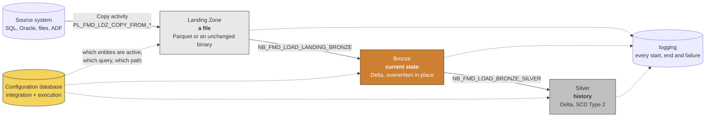
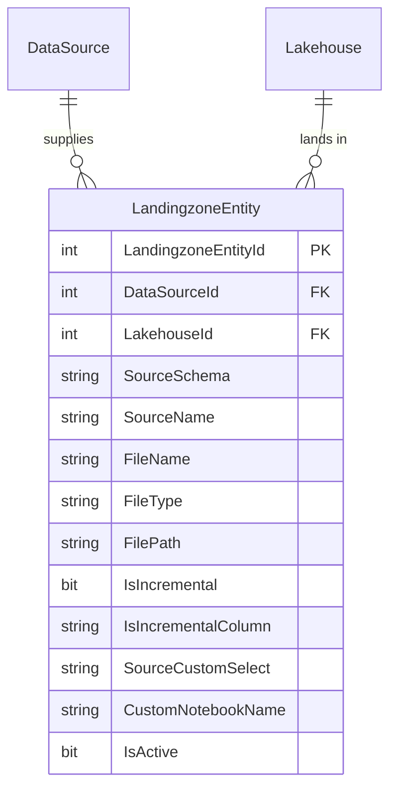
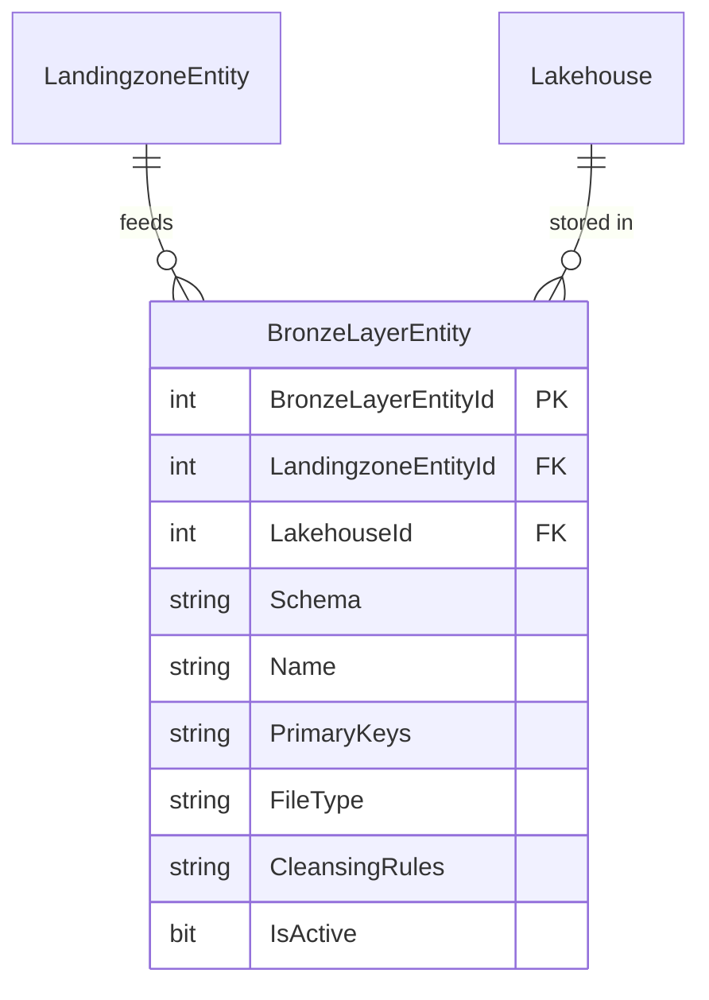
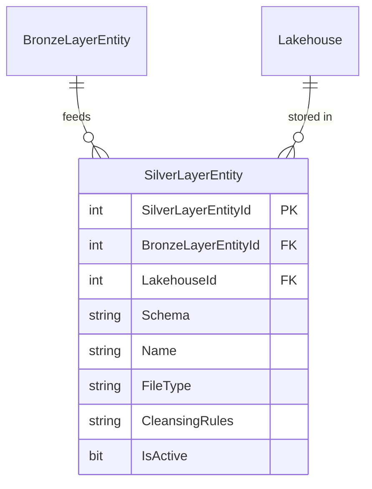
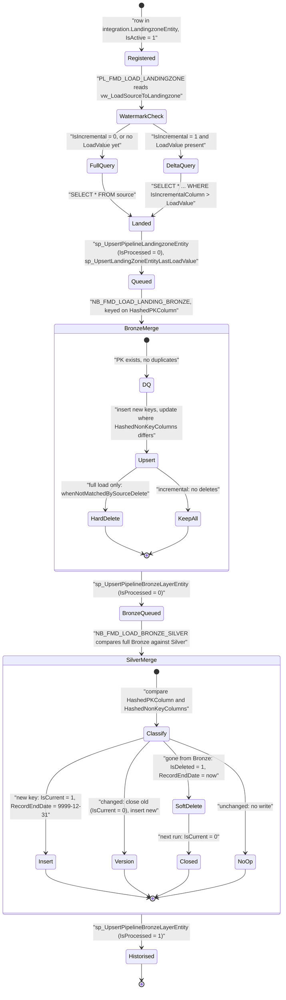
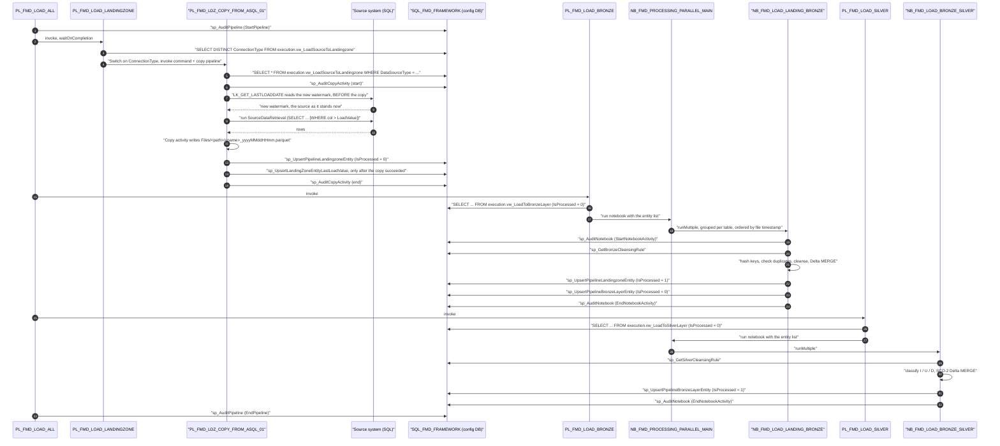

# How data moves through FMD

FMD moves a source table through three physical stops: a **file** in the Landing Zone, a **current-state Delta table** in Bronze, and a **historised Delta table** in Silver. Nothing about that path is hard-coded per table. Every step reads its instructions from a row in the configuration database, and every step writes back to that database what it did.

This page explains what actually happens at each stop, who performs it, how FMD decides between a full and an incremental load, and what SCD Type 2 in Silver does to a row that changes or disappears.



The solid arrows are data. The dotted ones are metadata: instructions coming out
of the configuration database, and records going into `logging`. No pipeline and
no notebook names a table.

## The three stops

| Layer | Physical form | Written by | Driven by the view |
|---|---|---|---|
| Landing Zone | a timestamped file in `Files/` of `LH_DATA_LANDINGZONE` | a Copy activity in a `PL_FMD_LDZ_COPY_FROM_*` pipeline | `execution.vw_LoadSourceToLandingzone` |
| Bronze | a Delta table, one row per current source row | `NB_FMD_LOAD_LANDING_BRONZE` | `execution.vw_LoadToBronzeLayer` |
| Silver | a Delta table, one row per version of a source row | `NB_FMD_LOAD_BRONZE_SILVER` | `execution.vw_LoadToSilverLayer` |

The three views are the seam between metadata and execution. A pipeline never asks "what should I load?" in its own SQL: it does a `Lookup` against one of these views, and each returned row becomes one unit of work. The `integration` tables that feed the views are described in [the data model reference](../03-reference/01-data-model.md).

### Stop 1: Landing Zone

`PL_FMD_LOAD_LANDINGZONE` looks up the distinct `ConnectionType` values in `execution.vw_LoadSourceToLandingzone`, then runs a `ForEach` with a `Switch` on `toUpper(item().ConnectionType)`. Each branch invokes the command pipeline for that connection family: `SQL` goes to `PL_FMD_LDZ_COMMAND_ASQL`, and there are branches for `ADLS`, `ONELAKE`, `ADF`, `SFTP`, `FTP`, `NOTEBOOK`, `ORACLE` and `AZURESQLMI`. Anything else hits an explicit `Fail` activity, so an unknown connection type is a loud failure rather than a silent skip.

The command pipeline then invokes the copy pipeline (`PL_FMD_LDZ_COPY_FROM_ASQL_01`, and so on), which per entity does this, **in this order**:

1. `SP_START_AUDIT_PIPELINE_CP` writes the start row.
2. **`LK_GET_LASTLOADDATE` reads the new watermark from the source, before anything is copied.** Its shape depends on the connection type (see below).
3. `CP_source_datalandingzone`, the **Copy activity**, reads the source with the `SourceDataRetrieval` query from the view and writes a file into the Landing Zone lakehouse. It `dependsOn` the lookup.
4. `SP_UPDATE_PROCESS` (`execution.sp_UpsertPipelineLandingzoneEntity`) puts the new file on the Bronze work queue. It `dependsOn` the copy, so a failed copy queues nothing.
5. `SP_UPDATE_LASTLOADVALIE` (`execution.sp_UpsertLandingZoneEntityLastLoadValue`) stores the watermark. On `main` it `dependsOn` `SP_UPDATE_PROCESS`, so the watermark advances only after the file is on the queue ([#271](https://github.com/edkreuk/FMD_FRAMEWORK/pull/271), merged, fixes [#258](https://github.com/edkreuk/FMD_FRAMEWORK/issues/258)). This is the canonical `FE_ENTITY` group; `PL_FMD_LDZ_COPY_FROM_ASQL_01` has a second volume-split group (`ASQL_02`) serialized the same way by [#276](https://github.com/edkreuk/FMD_FRAMEWORK/pull/276), so no copy group is left exposed on `main`. Up to and including `2026.07`, both `SP_UPDATE_PROCESS` and `SP_UPDATE_LASTLOADVALIE` hung off the copy in parallel, so under sustained throttling the watermark could advance while the queue insert failed and a delta was lost (see [running FMD in production](../02-how-to/04-run-fmd-in-production.md#31-an-incremental-delta-could-be-lost-and-a-re-run-did-not-recover-it-fixed-on-main)).

> **The watermark is read before the copy, not after, and that is the only order that does not lose data.** The value stored is `MAX(IsIncrementalColumn)` as the source stood *before* the extract began. A row inserted into the source *while* the copy is running carries a higher value than the stored watermark, so the next run reads it again. The cost is that a row can land twice; Bronze's `MERGE` on `HashedPKColumn` absorbs that. Reading the watermark *after* the copy would look tidier and would silently mark those rows as already loaded without ever having copied them. They would be lost for good.

The target path and file name are computed **in the view**, not in the pipeline:

```
TargetFilePath = FilePath + '/' + DataSourceNamespace + '/' + FileName + FORMAT(GETUTCDATE(), '/yyyy/MM/dd')
TargetFileName = FileName + '_' + FORMAT(GETUTCDATE(), 'yyyyMMddHHmm') + '.' + FileType
```

That `yyyyMMddHHmm` suffix is not decoration. It is the ordering key that the parallel orchestrator uses later to replay several landed files for the same entity in the right sequence.

What the landing zone knows about an entity, and nothing more. Note that it holds
no schema and no columns: the file is copied, not interpreted.



`IsIncremental` and `IsIncrementalColumn` are the whole watermark mechanism:
one flag, one column name.

`SourceCustomSelect` is the one column here that does **nothing**. It is written
by the registration procedures and read by no view, no notebook and no copy
pipeline: `vw_LoadSourceToLandingzone` builds `SELECT * FROM <schema>.<table>`
unconditionally. To restrict what an entity pulls, narrow the source object
itself with a view on the source system. See
[the data model](../03-reference/01-data-model.md#integrationlandingzoneentity).

### Stop 2: Bronze

`PL_FMD_LOAD_BRONZE` looks up `execution.vw_LoadToBronzeLayer`. That view only returns rows where `execution.PipelineLandingzoneEntity.IsProcessed = 0`, so it returns exactly the files that landed but were never loaded. If the result is empty, the pipeline does nothing. If not, it runs `NB_FMD_PROCESSING_PARALLEL_MAIN`, which groups the work by `(DataSourceNamespace, TargetSchema, TargetName)`, orders each group by the timestamp parsed out of the file name, and executes up to 50 notebooks per batch with `notebookutils.notebook.runMultiple` (50 is the API ceiling; real concurrency is bounded by driver cores). Files for the same table stay in one group and are replayed in landing order, up to the 50-notebook batch ceiling: a group of more than 50 files cannot fit in one batch, and the notebook warns and splits it across batches rather than stopping. Different tables run concurrently.

One detail about that ordering, for anyone landing something other than Parquet: the timestamp parser matches `.parquet` filenames only (`re.search(r'_(\d{12})(?=\.parquet$)', name)`). A `.csv` or `.xlsx` file fails the match and sorts to the end of its group by filename instead. FMD's naming puts the timestamp last, so a lexical sort usually reproduces landing order anyway, but it is a fallback rather than the parse.

Each unit of work is one run of `NB_FMD_LOAD_LANDING_BRONZE`, which:

1. reads the file (`parquet` by default, plus `csv`, `xls`, `xlsx`), and exits cleanly if it is not there (see the note below: "cleanly" is doing real work in that sentence),
2. strips spaces out of column names,
3. splits `PrimaryKeys` on comma, semicolon, colon **or space**, **fails** if a declared key is absent from the file, and adds `HashedPKColumn = sha2(concat_ws("||", <key columns>), 256)`,
4. **fails** if `HashedPKColumn` is not unique, so a source that violates its declared key never reaches Bronze,
5. applies the cleansing rules fetched with `execution.sp_GetBronzeCleansingRule` (see [cleansing rules](../03-reference/05-data-cleansing.md)),
6. adds `HashedNonKeyColumns = md5(concat_ws("||", <the other columns>))` and `RecordLoadDate = current_timestamp()`,
7. if the Bronze Delta table does not exist yet, writes the DataFrame with `mode("overwrite")` and exits,
8. otherwise merges into it (below),
9. marks the landing file processed (`sp_UpsertPipelineLandingzoneEntity`, `IsProcessed = True`) and puts the Bronze table on the Silver work queue (`sp_UpsertPipelineBronzeLayerEntity`, `IsProcessed = False`).

> **A missing file is a silent no-op, and it is the first thing to check when Silver goes stale without anything going red.** Step 1's "exits cleanly" is literal. If the landed file is not there, the notebook calls `sp_UpsertPipelineLandingzoneEntity` to **close the landing-zone queue row**, writes an `EndNotebookActivity` audit row whose `LogData` carries `"SourceFileName": "FILE NOT FOUND"`, and exits. It does **not** call `sp_UpsertPipelineBronzeLayerEntity`, so nothing is queued for Silver. The run **succeeds**. Nothing fails, nothing is retried, and the queue row is gone, so the next run will not pick it up either. The only trace is that `FILE NOT FOUND` marker in `logging.NotebookExecution.LogData`, which is worth putting in a monitoring query. See [logging and auditing](../03-reference/02-logging-and-auditing.md).

The merge is where the load type becomes visible:

```python
if IsIncremental in [False, 'false', 'False']:
    # full load: the file is the whole truth
    deltaTable.alias('original') \
        .merge(dfDataChanged.alias('updates'), 'original.HashedPKColumn == updates.HashedPKColumn') \
        .whenNotMatchedInsertAll() \
        .whenMatchedUpdateAll('original.HashedNonKeyColumns != updates.HashedNonKeyColumns') \
        .whenNotMatchedBySourceDelete() \
        .execute()
else:
    # incremental: the file is only the delta, absence proves nothing
    ... same merge, without whenNotMatchedBySourceDelete()
```

Bronze holds **current state, not history**. A row that changed is overwritten in place, and only if its non-key hash actually differs. A row that vanished from a full-load source is **physically deleted**. Under an incremental load, deletes cannot be detected at all: a row missing from the delta file is simply a row that did not change.

Bronze is the first layer that knows what a row *is*. `PrimaryKeys` appears here
and nowhere upstream, which is why the landing zone can copy a file it cannot
interpret and Bronze cannot.



> **Note on the Bronze non-key hash:** it excludes the primary key, as its name says. Up to and including `2026.07` it did not, through a list-comparison bug that was harmless for change detection; [#245](https://github.com/edkreuk/FMD_FRAMEWORK/pull/245) corrected it. The [notebooks reference](../03-reference/04-notebooks.md) has the detail.

### Stop 3: Silver

`PL_FMD_LOAD_SILVER` works exactly like the Bronze pipeline, one level down: it looks up `execution.vw_LoadToSilverLayer` (rows where `execution.PipelineBronzeLayerEntity.IsProcessed = 0`) and hands the result to the same parallel orchestrator, which runs `NB_FMD_LOAD_BRONZE_SILVER` per entity.

Silver reads the *whole* Bronze Delta table as its input. It does not read the landed file, and it does not read a Bronze change feed. Whatever Bronze currently says is the incoming picture of the source.

Silver's registration is the thinnest of the three, and that is the point: it
inherits the key from Bronze rather than declaring one. There is no `PrimaryKeys`
column here.



## Full load versus incremental

The decision is a single metadata flag, `IsIncremental` on `integration.LandingzoneEntity`, with `IsIncrementalColumn` naming the column to watermark on. `execution.vw_LoadSourceToLandingzone` turns that flag into the source query:

```sql
[SourceDataRetrieval] = CASE
    WHEN LZE.[IsIncremental] = 1 THEN
        'SELECT * FROM ' + QUOTENAME(...) + '.' + QUOTENAME(LZE.[SourceName]) +
        CASE WHEN ISNULL(LZE.[IsIncrementalColumn], '') <> ''
              AND TRY_CONVERT(VARCHAR, [LoadValue]) IS NOT NULL THEN
            ' WHERE ' + LZE.[IsIncrementalColumn] + ' > ''' +
            TRY_CONVERT(VARCHAR, ISNULL([LoadValue], '1900-01-01')) + ''''
        ELSE '' END
    WHEN ISNULL(LZE.[IsIncremental], 0) = 0 THEN
        'SELECT * FROM ' + QUOTENAME(...) + '.' + QUOTENAME(LZE.[SourceName])
    ELSE ''
END
```

Read that carefully, because three consequences follow from it.

**The source query is a concatenated string.** The `SELECT` list, the table name and the `WHERE` clause are assembled by string concatenation inside a view and executed against the source by a Copy activity. `SourceSchema` and `SourceName` go through `QUOTENAME`; `IsIncrementalColumn` does not, and the watermark value is pasted in between single quotes as text. So whoever can write a row into `integration.LandingzoneEntity` can shape the SQL that runs on the source system. Metadata is code here. Treat write access to the configuration database as equivalent to query access on every registered source, and never expose entity registration to an untrusted caller.

**The watermark is stored as text but not compared as text.** `execution.LandingzoneEntityLastLoadValue.LoadValue` is `VARCHAR(50)`, and the view pastes it into the predicate between single quotes: `WHERE ModifiedDate > '2026-07-12 09:31:00'`. That looks like a string comparison, and it is not one. The predicate runs on the **source**, where data type precedence converts the *literal* to the column's type rather than the column to text ([Learn](https://learn.microsoft.com/sql/t-sql/data-types/data-type-conversion-database-engine#implicit-and-explicit-conversion)). Against an `int` column, `id > '9'` is an integer comparison and orders correctly. Against a `datetime`, so is the ISO-120 literal the view produces.

Three real consequences follow, and none of them is lexical ordering:

- **A watermark on a `datetime2` column loses its fractional seconds.** `CONVERT(VARCHAR, MAX(...), 120)` emits `yyyy-mm-dd hh:mi:ss` and drops everything below the second. A row modified at `09:31:00.847` is stored as `09:31:00`, so the next run's `> '09:31:00'` picks it up again. This **fails safe**: you get a re-read, not a gap, and Bronze deduplicates it.
- **A literal the column cannot accept fails loudly.** Point `IsIncrementalColumn` at an `int` while `LoadValue` holds a date and the source raises a conversion error. The copy fails at the source, which is the good outcome: it is visible.
- **A genuinely string-typed incremental column really does compare lexically**, in the source's collation, because then there is nothing to convert. An order number like `ORD-9` sorts after `ORD-10`. If your incremental column is text, this is the one case where the watermark silently skips rows, and no other layer will catch it.

**The watermark is refreshed differently by every connection type, and one of them is broken.** This is the part to get right before you plan a source inventory, because the view is only half the story.

The `WHERE` clause that makes a load incremental, `SourceDataRetrieval`, is built for **any** connection type where `IsIncremental = 1`. It is not type-restricted. What differs is how each copy pipeline obtains the **new** high-water mark to store after the copy.

The view contributes one piece:

```sql
[LastLoadValue] = CASE
    WHEN C.[Type] IN ('SQL') THEN
        'SELECT CASE WHEN ... THEN CONVERT(VARCHAR, MAX(' + IsIncrementalColumn + '), 120)
                     ELSE CONVERT(VARCHAR, GETDATE(), 120) END AS [LastLoadValue]
         FROM ' + QUOTENAME(SourceSchema) + '.' + QUOTENAME(SourceName)
    ELSE
        LZELV.[LoadValue]
END
```

For `Type = 'SQL'` this is a **query**. For anything else it is the previously stored **value**. Whether that matters depends entirely on what the pipeline does with it, and the pipelines do not agree:

| `ConnectionType` | Where the new watermark comes from | Result |
|---|---|---|
| `SQL` | The view's query, executed by `LK_GET_LASTLOADDATE` in `PL_FMD_LDZ_COPY_FROM_ASQL_01`. | A real high-water mark read from the source. |
| `ORACLE` | **Its own** Oracle-dialect lookup in `PL_FMD_LDZ_COPY_FROM_ORACLE_01`: `SELECT ... TO_CHAR(MAX(col), 'YYYY-MM-DD HH24:MI:SS') ... FROM "schema"."table"`. It never touches the view's column. | A real high-water mark read from the source. |
| `AZURESQLMI` | `PL_FMD_LDZ_COPY_FROM_SQLMI_01` runs `@item().LastLoadValue` as its `sqlReaderQuery`. The view's `CASE` matches only `'SQL'`, and the `Switch` in `PL_FMD_LOAD_LANDINGZONE` dispatches SQL MI on the case value `AZURESQLMI`, so on a plain reading the lookup is handed the stored **value** where it expects a query. | **Verify before you rely on it.** We have not run this against a SQL MI instance. The two literals do not appear to meet, but that is a reading of the JSON, not an observation. |
| `ADLS`, `ONELAKE`, `SFTP`, `FTP`, `ADF` | The copy pipeline writes `@utcNow()`. | A wall-clock watermark, not a source value. Rows that arrive later but carry an earlier timestamp are skipped on the next run. |
| `NOTEBOOK` | `@item().LastLoadValue` is passed straight through to your custom notebook. | Yours to define. |

Three practical rules follow.

**Incremental loading works for SQL and for Oracle.** Both read a genuine `MAX(IsIncrementalColumn)` from the source. Oracle does it with a hard-coded native query in its own copy pipeline, which is why the T-SQL string in the view being SQL-dialect-only does not stop it.

**`AZURESQLMI` is the one to check before you rely on it.** The `Switch` in `PL_FMD_LOAD_LANDINGZONE` dispatches SQL MI on the case value `AZURESQLMI`, and the view's `CASE` tests `IN ('SQL')`. On a plain reading the two do not meet, but we have not executed this against a SQL MI instance, so treat it as a question rather than a verdict: verify the behaviour on your own instance before registering a SQL MI source as incremental.

**A file-source watermark is a clock, not a value.** `@utcNow()` records when the load ran, not how far the data got. If a file lands late with older content, the next run's `WHERE` clause will filter it out. For file sources, prefer folder or file-name partitioning over `IsIncremental`.

## What `IsIncremental = 1` costs you, and it is not obvious

**An incremental load cannot see a delete, and FMD says so in its own code.** This is the most consequential thing about the flag and the corpus owes you it plainly.

```python
# NB_FMD_LOAD_LANDING_BRONZE, the Bronze merge
if IsIncremental in [False, 'false', 'False']:
    print(' - Incremental Loading is not enabled, deletes are allowed')
    deltaTable.alias('original').merge(...) \
        .whenNotMatchedInsertAll() \
        .whenMatchedUpdateAll(...) \
        .whenNotMatchedBySourceDelete() \      # <- only on a full load
        .execute()
else:
    print(' - Incremental Loading is enabled, deletes are not allowed')
    deltaTable.alias('original').merge(...) \
        .whenNotMatchedInsertAll() \
        .whenMatchedUpdateAll(...) \
        .execute()                             # <- no delete clause
```

That is the right call, not a defect: a delta contains the rows that *changed*, so a row that vanished from the source is indistinguishable from a row that did not change. You cannot infer a deletion from a set of arrivals.

The consequence runs all the way to Silver. Silver's `df_deletes` marks a row deleted when it is **in Silver but not in Bronze**. On a full load Bronze has already removed it, so the soft delete fires: `IsDeleted = True`, `IsCurrent = False`. On an incremental load Bronze never removes anything, so **`IsDeleted` is always `False` and a deleted source row stays `IsCurrent = True` forever.**

**We ran it.** An Azure SQL source, `IsIncremental = 1` on `LastEditedWhen`. Five rows in Silver, all current. Then, at the source: one row updated, one row inserted, one row **deleted**, and one row updated *without touching the watermark column*.

| At the source | In Silver, after the next run |
|---|---|
| `OrderID 2`: `City` and `Amount` changed, `LastEditedWhen` bumped | **Correctly versioned.** The old row closed (`IsCurrent = False`, `RecordEndDate` set), a new row inserted. SCD Type 2 does exactly what it promises. |
| `OrderID 6`: inserted | **Inserted.** |
| `OrderID 5`: **deleted** | **Still there, `IsCurrent = True`, `IsDeleted = False`.** Silver reports a live order that no longer exists. |
| `OrderID 1`: `Amount` changed from `1200.00` to `1.11`, `LastEditedWhen` untouched | **Still `1200.00`.** The watermark never saw it. |

Seven rows, six current, and two of the six are wrong. No error, no warning, and the run was green.

**So choose the flag with your eyes open.**

- **`IsIncremental = 0`** costs you a full extract on every run and gives you deletes, and it gives you rows whose audit column the source forgot to touch.
- **`IsIncremental = 1`** moves far less data and buys that with a Silver table that is **append-and-update only**. Use it where rows are never deleted (an events or transactions table), or where you can tolerate the drift and reconcile periodically with a full reload.
- The last row of that table is not FMD's fault at all: **a watermark can only see what the source tells it.** If your application updates a row without maintaining its own `LastEditedWhen`, no watermark-based tool anywhere will catch it. Microsoft says the same of Fabric Copy Job's watermark path, and its answer is CDC, which FMD does not offer. See [why FMD](./01-why-fmd.md#first-the-alternative-that-ships-in-the-box).

If you need deletes *and* you cannot afford a full reload, the framework has no answer for you today, and that is worth knowing before you register two hundred entities.

### Where the watermark lives

`execution.LandingzoneEntityLastLoadValue`, one row per landing-zone entity:

| Column | Type | Meaning |
|---|---|---|
| `LandingzoneEntityValueId` | `BIGINT IDENTITY` | surrogate key |
| `LandingzoneEntityId` | `BIGINT` | the entity, **unique** (`UC_execution_LandingzoneEntityLastLoadValue_Guid`) |
| `LoadValue` | `VARCHAR(50)` | the last processed value of the incremental column |
| `LastLoadDatetime` | `DATETIME2(7)` | when it was last written |

It is maintained by `execution.sp_UpsertLandingZoneEntityLastLoadValue`, which updates the row if the entity already has one and inserts it otherwise, and is called by the copy pipeline **after** the Copy activity has succeeded. A failed copy therefore leaves the old watermark in place and the next run re-reads the same window.

The first incremental run has no row, so `[LoadValue]` is `NULL`, the `WHERE` clause is omitted, and the entity is fully loaded. The watermark is written at the end of that run, and every subsequent run is a delta.

To force a full reload, delete the row from `execution.LandingzoneEntityLastLoadValue` or set `LoadValue` back to an earlier value. No change to `integration.LandingzoneEntity` is needed.

> **Caveat:** `execution.vw_LoadToBronzeLayer` `INNER JOIN`s `LandingzoneEntityLastLoadValue`. An entity with no watermark row is invisible to the Bronze pipeline. That is fine in the normal flow, because the landing run creates the row before Bronze ever looks, but if you delete the row to force a reload, run the landing pipeline before the Bronze pipeline.

## SCD Type 2 in Silver

Silver is the layer that remembers. `NB_FMD_LOAD_BRONZE_SILVER` reads all of Bronze, applies the Silver cleansing rules (`execution.sp_GetSilverCleansingRule`), and then adds these columns:

| Column | Type | Set on incoming rows |
|---|---|---|
| `HashedPKColumn` | string | inherited from Bronze, `sha2(concat_ws("||", keys), 256)` |
| `HashedNonKeyColumns` | string | **recomputed in Silver**: `md5(concat_ws("||", all columns except HashedPKColumn and HashedNonKeyColumns))` |

| `IsCurrent` | boolean | `True` |
| `RecordStartDate` | timestamp | `current_timestamp()` |
| `RecordModifiedDate` | timestamp | `current_timestamp()` |
| `RecordEndDate` | timestamp | `9999-12-31` |
| `IsDeleted` | boolean | `False` |
| `RecordLoadDate` | timestamp | **inherited from Bronze**, not set here. Bronze stamps it with `current_timestamp()` on the load that last changed the row. |

**Eight technical columns, not seven.** Silver *sets* seven; the eighth, `RecordLoadDate`, it inherits from Bronze and carries silently. Counted on a live Silver table: twenty columns over a twelve-column source. The distinction is not pedantry, because `RecordLoadDate` is the one that bites: it is a per-load timestamp, so **a Gold model that selects `*` from Silver and builds a Type-1 dimension will fan out to one row per load** unless it drops it.

Downstream Gold models filter on `IsCurrent = true AND IsDeleted = false` for a current-state view, or on `RecordStartDate` / `RecordEndDate` for an as-of view, and should project columns explicitly rather than taking `*`.

The notebook then compares Bronze against the existing Silver table and builds four DataFrames, each tagged with an `Action`:

- **`df_inserts`** (`Action = 'I'`): key present in Bronze, not present as a live row in Silver.
- **`df_updates_new`** (`Action = 'I'`): key present in both, but `HashedNonKeyColumns` differs. This is the *new version* of the row.
- **`df_updates_old`** (`Action = 'U'`): the same rows, taken from the Silver side. This is the *old version*, to be closed.
- **`df_deletes`** (`Action = 'D'`): key present as a live row in Silver, absent from Bronze.

They are unioned and merged with a compound key, so that one primary key can match several historical rows:

```python
deltaTable.alias('original') \
    .merge(dfDataChanged.alias('updates'),
           'original.HashedPKColumn = updates.HashedPKColumn '
           'and original.RecordStartDate = updates.RecordStartDate')
```

If the Silver table does not exist yet, the notebook writes Bronze straight out with `mode("overwrite")` and exits: the first load is one version per row, all of them current.

### What happens to a row that is modified

Two things, in the same merge.

The **old version is closed**: matched on `(HashedPKColumn, RecordStartDate)`, `IsCurrent` is set to `0` and `RecordEndDate` is set to `changes.RecordStartDate - interval 0.001 seconds`, one millisecond before the new version begins. The history is therefore contiguous with no overlap.

The **new version is inserted**: `whenNotMatchedInsert` writes the row with `IsCurrent = 1`, `RecordStartDate = current_timestamp()`, `RecordModifiedDate = current_timestamp()`, `RecordEndDate = 9999-12-31`, `IsDeleted = 0`.

The row's business columns are never mutated in place. Silver only ever appends a version and closes the previous one.

### What happens to a row that disappears from the source

This takes **two runs**, and the code comments say so explicitly.

**Run 1** finds the key in Silver as a live row (`IsCurrent = true`, `IsDeleted = false`) but no longer in Bronze. It emits it with `Action = 'D'` and the merge sets:

```python
condition = "original.IsCurrent == True AND original.IsDeleted == False AND updates.Action = 'D'"
set = {"IsDeleted": lit(True), "RecordEndDate": col('updates.RecordEndDate')}
```

So the row is now `IsDeleted = true`, `RecordEndDate = <now>`, and still `IsCurrent = true`. The delete is recorded but the version is not yet closed.

**Run 2** picks the same row up again (it is still `IsCurrent = true`, and the delete-join condition `original.IsDeleted == False` fails, so the left join yields no match and the row again looks "gone"). This time the first merge branch does not apply, the second does, and it sets `IsCurrent = 0` with a fresh `RecordEndDate`.

Nothing is ever physically deleted from Silver. A resurrection is handled naturally: if the key reappears in Bronze, it no longer matches a *live* row, so it comes back through `df_inserts` as a brand-new current version, with the deleted version left closed behind it.

The two-run close-out has one consequence you must design around: between the run that detects the delete and the next one, a row is `IsDeleted = true` **and** `IsCurrent = true` at the same time. The reason is in the branch itself. Its `set` writes `IsDeleted` and `RecordEndDate` and does not write `IsCurrent`, even though `df_deletes` has already computed `IsCurrent = False` on the change row. A Delta `MERGE` applies at most one `whenMatched` branch per row, so the second branch, the one that closes `IsCurrent`, cannot also run on that pass. It runs on the next.

The rule that follows is simple, and every Gold model in this framework should obey it: **a current-state query filters on `IsCurrent = true AND IsDeleted = false`, never on `IsCurrent` alone.**

`RecordEndDate` needs the same care. The delete branch stamps it on the run that detects the delete, and the closing branch **stamps it again** on the next run, because `df_deletes` recomputes `current_timestamp()` every time it emits the row and the second branch assigns `updates.RecordEndDate` once more. The value therefore settles at the timestamp of the *closing* run, up to one load interval after the deletion was detected. A time-travel query filtering on `RecordStartDate` and `RecordEndDate` is stable only once the row has been closed; an as-of report run in the window between the two loads reads a `RecordEndDate` that the next load will overwrite.

### The entity lifecycle



## One pipeline run, end to end

The orchestrator `PL_FMD_LOAD_ALL` invokes the three layer pipelines in sequence, each waiting on the previous one. Every pipeline and every notebook opens and closes an audit record, so a run is fully reconstructable from the `logging` schema afterwards (see [logging and auditing](../03-reference/02-logging-and-auditing.md)).

**The dependency condition is `Completed`, not `Succeeded`, and that is the interesting half.** Bronze depends on Landing Zone with `Completed`, and Silver depends on Bronze with `Completed`. In Fabric, `Completed` means succeeded *or* failed. So **a failed Bronze run does not stop Silver from running.**

That is deliberate and it is safe, which is the clearest illustration of why the work queue is the real state machine. Silver does not consume Bronze's *outcome*; it consumes Bronze's *queue*. It picks up whatever Bronze actually managed to mark `IsProcessed = 0` and ignores the rest, so a partial Bronze run historises the entities that made it and simply leaves the others for the next run. Each layer has its own `Failed` branch writing an audit row (`SP_FAIL_LDZ_AUDIT_PIPELINE`, `SP_FAIL_BRZ_AUDIT_PIPELINE`, `SP_FAIL_SLV_AUDIT_PIPELINE`), and only `SP_END_AUDIT_PIPELINE` requires `Succeeded`. Plan your failure handling around this: a red Bronze run does not mean Silver was skipped.



Both loader notebooks wrap their merge in `try / except`, and on failure write an `EndNotebookActivity` audit record with `{"Action": "Error", "ErrorMessage": ...}` before re-raising. On `main` this row is written again, restored by [#277](https://github.com/edkreuk/FMD_FRAMEWORK/pull/277); between [#191](https://github.com/edkreuk/FMD_FRAMEWORK/pull/191), which left the `except`-block call referencing an undefined name and raising `NameError`, and #277, a crashed load left only its unclosed `Start` row rather than an `Error` row. Either way the trace is in `logging.NotebookExecution`, not just in the Fabric monitoring pane, but read the timestamps, not only the payload.

## What to take away

- **The work queue is the state machine.** `execution.PipelineLandingzoneEntity` and `execution.PipelineBronzeLayerEntity` carry an `IsProcessed` flag, and the three views only return unprocessed work. Bronze and Silver pipelines are safe to re-run: if there is nothing queued, they do nothing.
- **Full versus incremental is a Landing Zone decision that propagates.** `IsIncremental = 1` means the Copy activity fetches a delta, and Bronze consequently must not delete rows it cannot see. `IsIncremental = 0` means Bronze can trust absence and hard-delete.
- **Silver is where deletes become visible again.** Even under an incremental load, if Bronze never loses the row, Silver never soft-deletes it. Source-system deletes are only detectable end to end with a full load.
- **The watermark is refreshed differently per connection type.** SQL and Oracle read a real `MAX(IsIncrementalColumn)` from the source. File sources store `@utcNow()`, a clock rather than a value. On a plain reading of the JSON, `AZURESQLMI` does not line up with the view that builds the query, though we have not run it. The incremental `WHERE` clause itself is built for every type.

---

Source: `src/Config_Database/execution/Views/vw_LoadSourceToLandingzone.sql` @ b5fb08e
Source: `src/Config_Database/execution/Views/vw_LoadToBronzeLayer.sql` @ b5fb08e
Source: `src/Config_Database/execution/Views/vw_LoadToSilverLayer.sql` @ b5fb08e
Source: `src/Config_Database/execution/Tables/LandingzoneEntityLastLoadValue.sql` @ b5fb08e
Source: `src/Config_Database/execution/StoredProcedures/sp_UpsertLandingZoneEntityLastLoadValue.sql` @ b5fb08e
Source: `src/NB_FMD_LOAD_LANDING_BRONZE.Notebook/notebook-content.py` @ b5fb08e
Source: `src/NB_FMD_LOAD_BRONZE_SILVER.Notebook/notebook-content.py` @ b5fb08e
Source: `src/NB_FMD_PROCESSING_PARALLEL_MAIN.Notebook/notebook-content.py` @ b5fb08e
Source: `src/PL_FMD_LOAD_ALL.DataPipeline/pipeline-content.json` @ b5fb08e
Source: `src/PL_FMD_LOAD_LANDINGZONE.DataPipeline/pipeline-content.json` @ b5fb08e
Source: `src/PL_FMD_LDZ_COPY_FROM_ASQL_01.DataPipeline/pipeline-content.json` @ b5fb08e
Source: `src/PL_FMD_LOAD_BRONZE.DataPipeline/pipeline-content.json` @ b5fb08e
Source: `src/PL_FMD_LOAD_SILVER.DataPipeline/pipeline-content.json` @ b5fb08e
