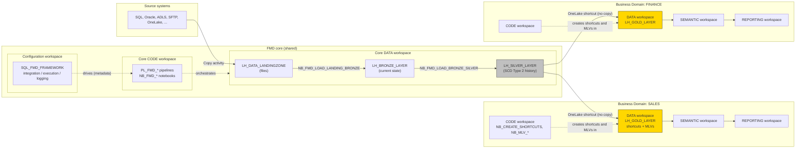

# Business Domains and the Gold layer

The core of FMD is one shared machine: one set of pipelines, one configuration database, one Landing Zone, one Bronze and one Silver lakehouse, described in [how data moves through FMD](./04-load-flow.md). That machine is deliberately business-agnostic. It ingests, hashes, cleanses and historises whatever entities you register, and it has no opinion at all about what "a customer" or "an order" means.

A **Business Domain** is where that opinion goes. It is a per-domain set of Fabric workspaces (Finance, Sales, HR, and so on) that sits on top of the shared core, holds the Gold layer for that domain, and is provisioned by the same deployment machinery so that every domain comes out identical in shape.

One Silver, many Golds, connected by shortcuts rather than copies. The full
picture is [below](#what-a-business-domain-adds-to-the-core); first, why the Gold
layer is pushed out of the core at all.

## Why it exists

Three problems push the Gold layer out of the core and into per-domain workspaces.

**Ownership.** Silver is generic history. Gold is a business model, and different teams disagree about what a fact table should contain. Giving each domain its own workspace gives each domain its own development lifecycle, its own release cadence, and its own set of workspace roles, without any of them being able to break another domain's model.

**Access control.** Silver contains everything ingested from every registered source. Handing a Sales report author access to the Silver lakehouse hands them Finance's data too. A domain Gold lakehouse contains only what that domain shortcuts into it, so it bounds **what a domain can see**.

Be precise about what that boundary is, because a shortcut does not carry its own credentials. An internal OneLake shortcut resolves under the **calling user's** identity by default, and that user needs read permission on the Silver **target**. So Gold restricts what is visible; it does not by itself *grant* access to what it points at. A data engineer given read on Gold and nothing on Silver gets an authorization error, not data.

The boundary becomes real for the consumer the framework is actually built for: the **report reader**, who reaches Gold through a semantic model rather than by querying the lakehouse. A Power BI semantic model in Direct Lake over SQL passes the calling *item owner's* identity to the shortcut target, delegating access on the reader's behalf, which is exactly why the domain gets its own Semantic and Reporting workspaces. (If you want Gold to stand alone even for direct queries, create the shortcut with a **delegated identity** instead of passthrough.) This is also why the wiki recommends a separate reporting workspace once a Gold layer exists.

**Repeatability.** Domains are created by running a deployment notebook, not by clicking through the portal. `NB_SETUP_BUSINESS_DOMAINS.ipynb` takes a list of domain names and provisions the workspaces, the lakehouse, the notebooks and the variable libraries for every one of them the same way. Adding the tenth domain costs what the first one cost.

```python
create_domains = True                             # requires the Fabric Admin role
business_domain_names = ['FINANCE', 'SALES']      # one set of workspaces per entry
```

Note the gate on that first flag: creating a Fabric *domain* (the tenant-level governance object) requires the Fabric Administrator role. Without it, set `create_domains = False`; the workspaces are still created, they are simply not assigned to a Fabric domain.

## What a Business Domain adds to the core

The core deployment gives you three kinds of workspace:

| Core workspace | Holds |
|---|---|
| **Data** | the `LH_DATA_LANDINGZONE`, Bronze and Silver lakehouses |
| **Code** | the `PL_FMD_*` pipelines, the `NB_FMD_*` notebooks, the Spark environment, the variable libraries |
| **Configuration / orchestration** | `SQL_FMD_FRAMEWORK`, the configuration database with the `integration`, `execution` and `logging` schemas |

Each Business Domain adds four workspaces on top, governed by **three** role lists: `workspace_roles_data_business_domain`, `workspace_roles_code_business_domain` and `workspace_roles_reporting_business_domain`. The Semantic workspace has no list of its own; it reuses `workspace_roles_reporting_business_domain`, so Semantic and Reporting are granted to the same people unless you change the notebook.

| Domain workspace | Holds |
|---|---|
| **Data** | the domain's Gold lakehouse, holding shortcuts to Silver and the materialized lake views built on them |
| **Code** | `NB_CREATE_SHORTCUTS`, `NB_MLV_*`, `NB_CREATE_DIMDATE`, `NB_LOAD_GOLD`, and the `VAR_GOLD_*` variable libraries |
| **Semantic** | semantic models built on Gold |
| **Reporting** | the reports, so report consumers never need access to the data workspace |

The domain workspaces are named with the same `framework_post_fix` convention as the core ones and are assigned to the same capacity (`capacity_name_dvlm`, `reassign_capacity`). Workspace icons are assigned automatically when `assign_icons = True`.



Read the diagram along the solid arrows: data is physically copied only up to Silver. From Silver into a domain's Gold lakehouse, nothing is copied at all.

## Gold: shortcuts, then views

The Gold layer is built in two steps, and neither of them duplicates data.

### Step 1: OneLake shortcuts into the Gold lakehouse

`NB_CREATE_SHORTCUTS` (in the domain's Code workspace) registers a OneLake shortcut in the Gold lakehouse for every Silver table the domain needs. A shortcut is a reference, not a copy: the bytes stay in the Silver lakehouse, and Gold sees them as if they were local tables.

The notebook reads all six of its connection settings from the `VAR_GOLD_SHORTCUTS_FMD` variable library, so the same notebook code deploys unchanged into every domain and every environment:

| Variable | Meaning |
|---|---|
| `SourceWorkspaceId` | the **Gold** workspace, where the shortcut is created |
| `SourceLakehouseId` | the **Gold** lakehouse |
| `SourceSchema` | the schema inside Gold that the shortcut appears in |
| `Shortcut_TargetWorkspaceId` | the **Silver** workspace, what the shortcut points at |
| `Shortcut_TargetLakehouseId` | the **Silver** lakehouse |
| `Shortcut_TargetSchema` | the schema inside Silver |

Note the naming: `Source*` is the *destination* of the shortcut (Gold) and `Shortcut_Target*` is what it *points to* (Silver). It reads backwards, and it is worth double-checking when you fill the library in.

The only thing the domain owner edits in the notebook itself is the table list:

```python
ShortcutNames = ['Sales_BuyingGroups', 'Sales_CustomerCategories', 'Sales_InvoiceLines',
                 'Sales_Invoices', 'Sales_Orders', 'Sales_OrderLines', 'Sales_vCustomers',
                 'Warehouse_PackageTypes', 'Warehouse_StockItems']
```

Each name is used both as the source path in Silver and as the shortcut name in Gold. The notebook then calls the Fabric REST endpoint `POST /v1/workspaces/{workspaceId}/items/{lakehouseId}/shortcuts` with a `oneLake` target, authenticating with `notebookutils.credentials.getToken("pbi")`, so no secret is stored anywhere. It passes `shortcutConflictPolicy = "CreateOrOverwrite"`, which makes the notebook idempotent: re-running it replaces existing shortcuts instead of failing. Step-by-step instructions are in [create OneLake shortcuts in Gold](../02-how-to/06-create-onelake-shortcuts-in-gold.md).

The consequence worth internalising: **the Gold layer has no ingestion of its own.** There is no `PL_FMD_LOAD_GOLD`, nothing is copied, and the shortcut sees Silver's Delta files **live**: a Silver merge is visible through the shortcut immediately. This also means the Silver technical columns (`IsCurrent`, `IsDeleted`, `RecordStartDate`, `RecordEndDate`, `HashedPKColumn`, `HashedNonKeyColumns`) are visible through the shortcut, and it is the Gold view's job to filter them.

The shortcut is live. The **materialized lake view built on top of it is not**, and that is where Gold's latency actually comes from. See the next section before you conclude that Gold refreshes itself.

### Step 2: Materialized Lake Views

On top of the shortcuts, the domain defines its model as **Materialized Lake Views**: SparkSQL `CREATE OR REPLACE MATERIALIZED LAKE VIEW` statements whose results are physically persisted in the Gold lakehouse, so that Power BI reads a precomputed table rather than re-executing a join.

Two notebooks ship with the framework:

- `NB_MLV_EXAMPLE` is an empty template. It carries the instructions and an empty SparkSQL cell, and is meant to be copied per domain.
- `NB_MLV_DEMO_GOLD` is a working example against the demo dataset, and defines five views in a `gold` schema: `gold.FactOrderLines`, `gold.DimOrders`, `gold.DimCustomer`, `gold.DimPackageType` and `gold.DimStockItems`. It is the reference for the `Fact*` / `Dim*` naming convention, and it is the one to read when writing your own.

Both must be run with the domain's **Gold lakehouse attached as the default lakehouse**, otherwise unqualified names like `gold.FactOrderLines` do not resolve. See [create materialized lake views](../02-how-to/07-create-materialized-lake-views.md).

The MLV layer is where dimensional modelling happens: a shortcut gives Gold a copy-free view of a Silver table with all its SCD-2 machinery attached, and the MLV turns that into a dimension or fact with only the columns and the rows the business model wants.

#### Refreshing them is a thing you must set up

An MLV is **physically persisted**, so unlike the shortcut beneath it, it does not update itself. **Gold's latency is the MLV refresh interval**, and nothing in FMD sets that interval for you: the `NB_MLV_*` notebooks author the views, and no pipeline in the framework refreshes them. If you never configure a refresh, your reports quietly serve the data as of the day you created the views.

Configure it **from the Gold lakehouse**, not from a notebook or a pipeline: **Materialized lake views → Manage → Schedules**. Microsoft is unusually direct about this ("don't orchestrate their refresh from a notebook"), and the reason is that Fabric derives the dependency order from the view definitions themselves and handles ordering, execution and retries. Hand-rolling that in a pipeline gives up the lineage-driven scheduling and buys nothing. FMD's design already respects this: it authors views and schedules nothing, which is correct.

One cost to plan for. Fabric picks the cheapest refresh strategy it can (skip, incremental, or full), but **incremental refresh only applies when the source is append-only between refreshes**, and it also requires change data feed to be enabled on the source tables. Silver is an SCD-2 layer: it closes old row versions and soft-deletes, which are updates, not appends. So a Gold MLV over Silver will generally **fall back to a full recompute on every refresh**, whatever you enable. That is a real, recurring capacity cost, and it is an argument for refreshing Gold on the cadence the business actually needs rather than the cadence Silver changes.

Two further notebooks are shipped in the same folder:

- `NB_CREATE_DIMDATE` builds a conventional date dimension in PySpark from a `start_date` / `end_date` range, with an optional holiday list. It is the one Gold table with no Silver ancestor at all.
- `NB_LOAD_GOLD` is, at the pinned commit, an **empty placeholder** ("Welcome to your new notebook"). It is deployed into every domain Code workspace as the hook for Gold logic that a materialized lake view cannot express: an SCD-2 dimension that must keep its own surrogate keys, an aggregate that needs a Python UDF, a fact table assembled incrementally rather than recomputed. Write your own PySpark there; nothing in the framework calls it for you, so schedule it from a domain pipeline if you use it.

## The templates, and their limits

The Business Domain framework advertises "standardized Gold-layer table patterns (dimensions and facts)". In the repository at the pinned commit, that standard is carried by the demo notebook and the naming convention (`gold.Fact<Subject>`, `gold.Dim<Subject>`, lower-case `gold` schema), not by a metadata-driven Gold engine. There are no Gold entity tables in the `integration` schema, and no `execution` view that drives a Gold load.

This is the honest boundary of the framework: **FMD is metadata-driven up to Silver, and template-driven in Gold.** The value the Business Domain framework adds in Gold is provisioning, consistency and isolation, not the elimination of hand-written SQL.

## What to take away

- A Business Domain is a **deployment unit**, not a data structure. It exists in the Fabric workspace topology and in the deployment notebook, and leaves no trace in the `integration` schema.
- Each domain adds four workspaces (Data, Code, Semantic, Reporting) on top of the shared core three, governed by three role lists: Semantic and Reporting share one.
- Gold reads Silver through **OneLake shortcuts**, so there is no Gold ingestion and **no copy**, and the shortcut sees Silver live. A shortcut bounds what a domain can see; it does not grant access, because it resolves under the calling user's identity.
- **Gold does have latency, and it is the materialized lake view refresh interval.** An MLV is persisted and must be refreshed, scheduled from the Gold lakehouse rather than from a notebook. Because Silver is SCD-2 and therefore not append-only, expect that refresh to be a full recompute.
- Gold's model is expressed as **Materialized Lake Views** over those shortcuts, and it is written by hand, following the `Fact*` / `Dim*` convention that `NB_MLV_DEMO_GOLD` demonstrates.

---

Source: `FMD_BUSINESS_DOMAIN_DEPLOYMENT.md` @ b5fb08e
Source: `src/business_domain/NB_CREATE_SHORTCUTS.Notebook/notebook-content.py` @ b5fb08e
Source: `src/business_domain/NB_MLV_EXAMPLE.Notebook/notebook-content.sql` @ b5fb08e
Source: `src/business_domain/NB_MLV_DEMO_GOLD.Notebook/notebook-content.sql` @ b5fb08e
Source: `src/business_domain/NB_CREATE_DIMDATE.Notebook/notebook-content.py` @ b5fb08e
Source: `src/business_domain/NB_LOAD_GOLD.Notebook/notebook-content.py` @ b5fb08e
Source: `src/business_domain/VAR_GOLD_SHORTCUTS_FMD.VariableLibrary/variables.json` @ b5fb08e
Source: `setup/NB_SETUP_BUSINESS_DOMAINS.ipynb` @ b5fb08e (four workspaces per domain: CODE, DATA, REPORTING, SEMANTIC; three role lists, SEMANTIC reusing the reporting list)
Source: wiki `Business-Domains.md`, `FMD-Business-Domain-Framework.md`, `Workspace-architecture.md` @ 69305fd

Platform: [Optimal refresh for materialized lake views](https://learn.microsoft.com/fabric/data-engineering/materialized-lake-views/refresh-materialized-lake-view) (an MLV is persisted and refreshed; incremental refresh requires change data feed and append-only sources) and [Schedule a materialized lake view refresh](https://learn.microsoft.com/fabric/data-engineering/materialized-lake-views/schedule-lineage-run) (schedule from the lakehouse lineage, not from a notebook)
Platform: [OneLake shortcuts](https://learn.microsoft.com/fabric/onelake/onelake-shortcuts#types-of-shortcuts) and [shortcut security](https://learn.microsoft.com/fabric/onelake/onelake-shortcut-security) (passthrough resolves under the calling user's identity; Direct Lake over SQL passes the item owner's; delegated identity is the alternative)
