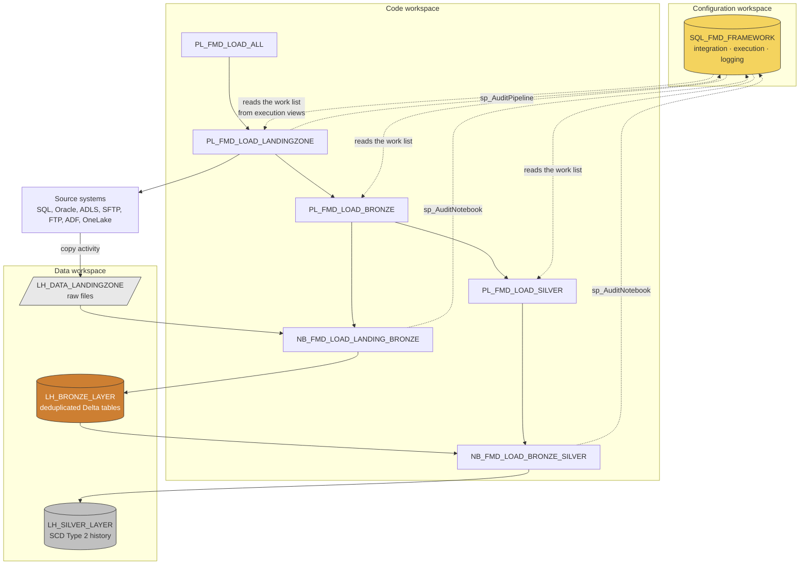

# The Fabric Metadata-Driven Framework (FMD)

FMD is written and maintained by **[Erwin de Kreuk](https://github.com/edkreuk)** and published under the MIT licence at **[github.com/edkreuk/FMD_FRAMEWORK](https://github.com/edkreuk/FMD_FRAMEWORK)**. This documentation is not his: we read his code and wrote down what it does. Where we found a defect we say so on the page, and we say which pull request fixes it. Where we were wrong, he was right.

FMD is a framework for Microsoft Fabric that loads data from source systems into a lakehouse without you writing a pipeline per source. You describe each table you want in a configuration database, and a fixed set of generic pipelines and Spark notebooks reads that description and does the loading, layer by layer, logging every run.

The problem it solves is duplication. A data platform that hand-builds one pipeline per source table ends up with hundreds of near-identical artefacts, each of which must be maintained, tested, and fixed separately. In FMD the number of pipelines stays constant: onboarding a new table means inserting rows, not cloning code.

## What it consists of

FMD ships as a set of Fabric items, deployed by a setup notebook into your own workspaces.

| Part | Count | What it is |
|---|---|---|
| Configuration database | 1 | A Fabric SQL Database with three schemas: `integration` (what to load), `execution` (what to load next, and how far we got), `logging` (what happened). It holds 14 tables, 27 stored procedures, and 3 views. |
| Data pipelines | 25 | `PL_FMD_LOAD_ALL` and its three layer pipelines, plus 9 source-specific command pipelines, 10 copy pipelines, and 2 tooling pipelines. |
| Spark notebooks | 11 | The transformation and orchestration logic: Landing Zone to Bronze, Bronze to Silver, parallel execution, data cleansing, shared utility functions. The eleventh, `NB_FMD_LOAD_DEMO_DATA`, was added on `main` ([#268](https://github.com/edkreuk/FMD_FRAMEWORK/pull/268)); `2026.07` ships 10. |
| Lakehouses | 3 | `LH_DATA_LANDINGZONE`, `LH_BRONZE_LAYER`, `LH_SILVER_LAYER`. |
| Variable libraries | 2 | `VAR_FMD` and `VAR_CONFIG_FMD`, which hold the environment-specific values (workspace GUIDs, connection GUIDs) so that no GUID is hard-coded in a notebook. |
| Setup notebooks | 2 | `NB_SETUP_FMD.ipynb` deploys the framework. `NB_SETUP_BUSINESS_DOMAINS.ipynb` deploys a Business Domain on top of it. |
| Taskflow | 1 | `Taskflow/FMD_FABRIC_TASKFLOW.json`, a Fabric Taskflow describing the framework's items and the flow between them. No setup notebook or config file references it, so it is imported by hand or not at all. |

## How the parts hang together

The configuration database is the only thing that changes when you onboard data. Everything else is fixed. The pipelines query it to find out what to do, the notebooks do the work, and everything writes back to `logging`.

Read that diagram as three statements:

1. **Configuration drives execution.** No pipeline knows about a specific table. It asks the database which entities are active and gets back a list, including the SQL to run against the source and the file path to write to.
2. **Data moves in one direction.** Landing Zone (raw files, as they came) to Bronze (typed and deduplicated Delta tables) to Silver (validated history). Each layer reads only the layer before it.
3. **Everything logs.** Pipelines, copy activities, and notebooks each write a start, end, and failure record to the `logging` schema. Pipelines and copy activities correlate on `PipelineRunGuid`; a notebook joins its layer pipeline on `PipelineRunGuid` too, since [#251](https://github.com/edkreuk/FMD_FRAMEWORK/pull/251), and `TriggerGuid` also correlates it. Up to and including `2026.07` a notebook's `PipelineRunGuid` was a synthetic `uuid4()`, so `TriggerGuid` was then the only usable notebook join. The reason is set out in [logging and auditing](03-reference/02-logging-and-auditing.md).

## Where to go next

**Start here if you have never deployed it**

- [From an empty capacity to a loaded Silver table](01-tutorial/01-getting-started.md): the full deployment, executed against a live Fabric tenant on `1ba7974`. It records seven things the code alone does not show, from the deployment order to a successful-looking run that loads nothing. The maintainer merged a fix for all seven on 2026-07-14, none of which is in a release yet, so the page reads as both a working walkthrough for `2026.07` and a record of what `main` has since put right.

**Do something**

The how-to pages are in the order an operator meets them: deploy it, make it load something of yours, make it load on its own, harden it, fix it when it breaks, publish it, keep it current.

- [Deploy FMD](02-how-to/01-deploy.md): prerequisites, connections, and running the setup notebook.
- [Add an entity](02-how-to/02-add-an-entity.md): onboard one new source table end to end, including registering the source system it comes from.
- [Schedule the load](02-how-to/03-schedule-the-load.md): FMD ships no trigger. The cadence, the identity it runs as, and the end date Fabric makes you pick.
- [Run FMD in production](02-how-to/04-run-fmd-in-production.md): the checklist before it carries a real load. What to configure, what to alert on, and the four places you have to watch because the framework cannot.
- [Diagnose a failed load](02-how-to/05-diagnose-a-failed-load.md): Silver is empty and the run says it succeeded. The runbook, for the morning after.
- [Create OneLake shortcuts in Gold](02-how-to/06-create-onelake-shortcuts-in-gold.md): expose Silver tables to a Business Domain without copying them.
- [Create materialized lake views](02-how-to/07-create-materialized-lake-views.md): when a shortcut is not enough.
- [Upgrade the framework](02-how-to/08-upgrade-the-framework.md): re-running the setup is the upgrade. What it replaces, and the one notebook it does not.
- [Operator cheat sheet](02-how-to/09-operator-cheat-sheet.md): the three queries and the handful of rules you reach for when a load looks wrong, on one page.

**Look something up**

- [Data model](03-reference/01-data-model.md): every table and column in `integration`, `execution`, and `logging`.
- [Logging and auditing](03-reference/02-logging-and-auditing.md): the three log tables, and how to find out why a load failed.
- [Pipelines](03-reference/03-pipelines.md) and [notebooks](03-reference/04-notebooks.md): what each of the 25 pipelines and 11 notebooks does.
- [Data cleansing](03-reference/05-data-cleansing.md): the rules you can attach to a Bronze or Silver entity.
- [Variable libraries](03-reference/06-variable-libraries.md): the environment-specific values.
- [Supported sources](03-reference/07-supported-sources.md): which connection types the framework can load from.
- [Version differences](03-reference/08-version-differences.md): every behaviour that differs between the `2026.07` release and `main`, in one matrix, with the pull request that changed each.

**Decide whether to use it**

- [Why FMD, and when not to use it](04-explanation/01-why-fmd.md): what it buys you, what it costs you, where it stops, and what to reach for instead when it does not fit. Start here if you are evaluating.
- [How FMD lands in an enterprise](04-explanation/02-enterprise-integration.md): capacity and cost, governance and lineage, security, environment promotion, and who operates it.

**Understand it**

- [Architecture](04-explanation/03-architecture.md): the workspace split, the medallion layers, and how a configuration row becomes a pipeline run.
- [Load flow](04-explanation/04-load-flow.md): what happens on a single run, activity by activity, including the watermark and the SCD Type 2 merge.
- [Business domains](04-explanation/05-business-domains.md): what sits on top of Silver, and what Gold means here.

## About this documentation

**Written from the code.** Every claim on these pages is checked against `github.com/edkreuk/FMD_FRAMEWORK` at commit `b5fb08e`, and every page cites the file it came from. Where the framework and Microsoft Learn disagree about what Fabric does, the page says so and Learn wins. Where a page records a defect, it states the mechanism, gives you the workaround, and links the pull request that fixes it upstream.

**Two things to know if you want to contribute to FMD itself.**

The prose you may have seen on the [wiki](https://github.com/edkreuk/FMD_FRAMEWORK/wiki) lives in a **separate git repository** with no pull requests and no review. Anyone who clones the framework never sees it.

And the configuration database deploys from **`src/SQL_FMD_FRAMEWORK.SQLDatabase/SQL_FMD_FRAMEWORK.dacpac`**, which is the only file in that item folder. The `.sql` files under `src/Config_Database/` are the sources of the `.sqlproj` that builds it. **A pull request that changes only a `.sql` file changes nothing in a deployment until the dacpac is rebuilt.** That is worth knowing before you spend an evening on one.

---

Source: `Readme.md`, `src/`, `src/Config_Database/`, `config/lakehouse_deployment.json` @ b5fb08e
Source: `src/SQL_FMD_FRAMEWORK.SQLDatabase/` (contains only the dacpac) and `src/Config_Database/SQL_FMD_FRAMEWORK.sqlproj` @ b5fb08e
